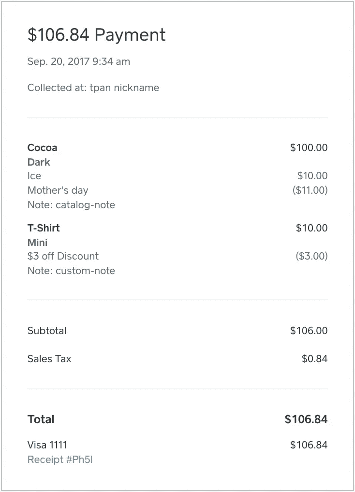

# 使用 Square 的 API 构建全渠道业务从未如此简单

> 原文：<https://medium.com/square-corner-blog/building-for-an-omni-channel-business-with-squares-apis-has-never-been-easier-3b5e0977741a?source=collection_archive---------5----------------------->

## 现在，您可以使用 Square 的 Connect APIs 和报告工具的全部功能来增强您的在线或多渠道业务。

> 注意，我们已经行动了！如果您想继续了解 Square 的最新技术内容，请访问我们的新家[https://developer.squareup.com/blog](https://developer.squareup.com/blog)

从推出我们的[电子商务 API](https://docs.connect.squareup.com/articles/paymentform-overview) 开始，我们致力于为纯在线和多渠道业务创建一个强大的商务平台。在过去的几个月里，我们推出了我们的[目录 API](/square-corner-blog/introducing-the-new-square-catalog-api-3e2ebf254967) ，这是一个帮助企业更有效地管理其产品的工具，以及 [Square Checkout](/square-corner-blog/introducing-square-checkout-2991fc713c5c) ，这是一个为 Square 开发者提供的开箱即用的托管 Checkout。今天，我们将所有这些联系在一起，以确保开发者能够为每一个全渠道电子商务和个人提供所有必要的工具。

有了新的订单 API，开发人员为 Square 卖家构建的工具通过我们的在线支付 API 将他们的目录与他们的在线销售联系起来。这种完整的明细转化为对在线企业更有意义的报告，特别是对那些也进行面对面销售并在渠道间共享目录的企业。

# 履行

为了实现完整的明细，开发人员需要做的就是创建一个订单，并在我们的[收费端点](https://docs.connect.squareup.com/api/connect/v2#endpoint-charge)中引用 order_id，或者直接将订单作为收银台请求的一部分进行传递。

就像早期发布的 [Checkout](/square-corner-blog/introducing-square-checkout-2991fc713c5c) 一样，我们并没有将这一功能仅限于在 Square 上存储目录的商家。即使您只想创建一次性的特殊项目，也可以使用该功能。

# 报告

现在，当创建订单并对其收费时，完整的明细将通过 Square dashboard 提供，其中包含完整的折扣、税收和项目明细。如果您不使用明细，自定义金额仍然可用。我们还允许您通过我们的 API 直接使用这些信息。要查看您的订单信息，您只需:ListTransactions 以获取 order_id，然后是 BatchRetrieveOrders。

在创建定制商品时，Square 的内部系统会仔细汇总你的定制商品销售数据，以便向你展示你的业务全貌。

# 附加阅读

*   订单 API [参考页面](https://docs.connect.squareup.com/api/connect/v2#navsection-orders)
*   订单[概述](https://docs.connect.squareup.com/articles/orders-api-overview)
*   支持的 SDK:[Ruby](https://github.com/square/connect-ruby-sdk/)， [Python](https://github.com/square/connect-python-sdk/) ， [PHP](https://github.com/square/connect-php-sdk/) ， [C#](https://github.com/square/connect-csharp-sdk) ， [Java](https://github.com/square/connect-java-sdk)