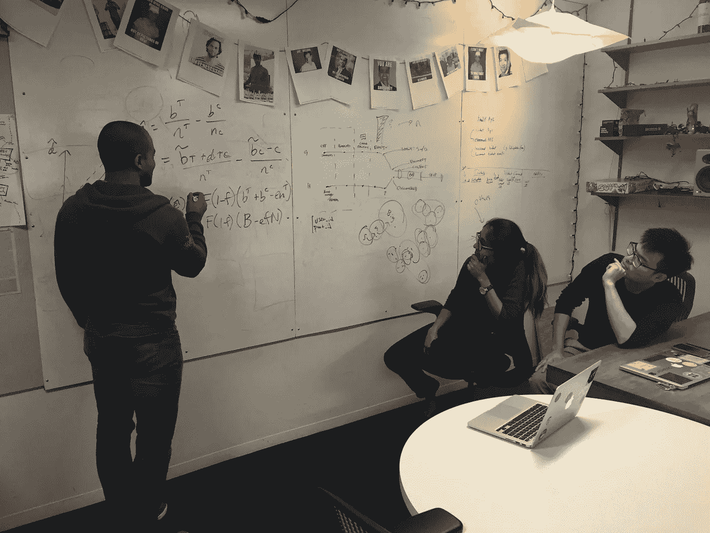
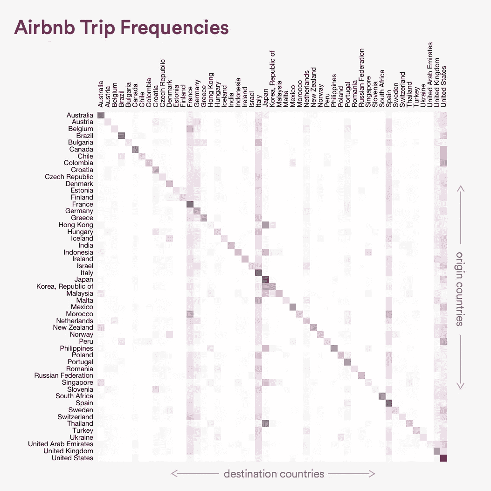

# 建立信任

> 原文：<https://medium.com/airbnb-engineering/building-for-trust-503e9872bbbb?source=collection_archive---------3----------------------->

## 从我们提炼共享经济燃料的努力中获得的见解

赖利·纽曼和[贾德·安廷](https://www.linkedin.com/in/juddantin)

> “我想告诉你，有一次我差点在一辆红色马自达 Miata 的后备箱里被绑架。”

这是 Airbnb 的联合创始人之一 Joe Gebbia 最近在 TED 演讲的开场白。你可以点击这里观看[，了解故事的结局，但是(剧透提醒)主题是信任——我们在 Airbnb 面临的最重要的挑战之一。](https://www.ted.com/talks/joe_gebbia_how_airbnb_designs_for_trust)

为信任而设计在酒店业是一个众所周知的话题，但是我们努力使酒店民主化意味着我们必须以一种更加戏剧化的方式依赖信任。不久前，我们的朋友和家人认为我们疯了，因为我们相信有人会让一个完全陌生的人住在他们的家里。这种感觉源于我们大多数人从小就害怕陌生人。

“陌生人危险”是人类天然的防御机制；克服它需要客人和主人双方信念的飞跃。但是，通过理解什么是信任，信任如何运作，以及如何构建支持信任的产品，我们可以积极支持这一飞跃。

如何最好地支持信任——特别是在可能没有机会每天相互交流的人群之间——是我们的数据科学和经验研究团队的核心研究课题。在准备 Joe 的演讲时，我们思考了我们如何看待信任，并从过去的各种项目中收集了一些见解。这篇文章的目的是分享一些没有被纳入 TED 演讲的想法和见解，并激发更多关于如何培养有助于共享经济运行的燃料:信任的思考。

# 搭建脚手架

当 Airbnb 刚刚起步时，我们敏锐地意识到需要打造鼓励信任的产品。说服某人第一次尝试我们需要一些信心，我们的平台有助于保护他们，所以我们选择承担一系列复杂的问题。

我们开始时的假设是，人本质上是好的，有了合适的工具，我们可以帮助克服陌生人危险偏见。为了做到这一点，我们需要消除匿名，让客人和主人在我们的社区中有一个身份。我们建立了个人资料页面，他们可以上传自己的照片，描述自己是谁，链接社交媒体账户，并突出显示过去旅行的反馈。随着时间的推移，我们越来越强调这些身份页面。例如，个人资料照片现在是强制性的——因为人们非常依赖它们。在近 50%的旅行中，客人至少访问一次主人的个人资料，68%的访问发生在预订前的规划阶段。当人们是 Airbnb 的新手时，这些档案尤其有用:与有经验的客人相比，第一次入住的客人在预订前访问主人档案的可能性要高 20%。

除了培养认同感，我们知道我们还需要有助于建立信心的防御机制。因此，我们选择处理支付，这是一个复杂的技术挑战，但可以让我们更好地了解谁在预订。这也让我们能够设计一些规则，帮助消除支付方面的一些不确定性。例如，我们会等到客人入住 24 小时后，才会向主人发放资金，以便双方有时间在出现问题时通知我们。当出现问题时，需要有一种联系我们的方式，所以我们建立了一个客户支持组织，现在覆盖了每个时区和多种语言，全天候服务。

我们衡量这些努力的效果的一种方法是通过保留率——客人或主人不止一次使用 Airbnb 的可能性。这不是信任的直接衡量标准，但人们越信任 Airbnb，他们就越有可能继续使用我们的服务，所以这两者之间可能存在相关性。从这个角度评估客户支持，可以清楚地看出它的价值:如果客人有不好的经历，比如主人在他们旅行前取消了预订，他们的保留率会下降 26%；客户支持的干预几乎完全抵消了这一损失—保留率从 26%反弹到不到 6%。

我们一开始没有把所有事情都做好，现在仍然没有，但我们已经改进了。在一次糟糕的早期经历后，我们学到的一件事是，我们需要做更多的事情来让主机相信，如果出现任何问题，我们会在那里为他们服务，所以我们为符合条件的主机推出了我们的[100 万美元担保](https://www.airbnb.com/guarantee)。但是，每年都有越来越多的人尝试这种方式，因为我们已经能够建立信心，相信他们的体验可能会很好。这并不等同于信任他们将要相处的人，但这是重要的第一步:如果信任是主人和客人共同建造的建筑，那么信心就是脚手架。就像建筑物上的脚手架一样，我们建立信心的努力使建立信任的工作更容易进行，但它们不会创造信任。只有主人和客人可以这样做。

# 设立信托

研究人员用多种方式定义信任，但一个有趣的定义来自政治学家拉塞尔·哈丁。他认为，信任实际上是关于“隐藏的利益”:如果我信任你，我相信你会照顾我和我的利益，你会把我的利益放在心上，并像我一样做出决定。

愿意信任他人的人不是傻瓜——他们通常需要证据证明当他们选择信任一个陌生人时，胜算对他们有利。因此，评论形成了我们可以收集的原材料，然后在我们的平台上呈现给用户。这是我们最重要的数据产品之一；我们称之为我们的声誉系统。

声誉系统是 Airbnb 社区的一个无价工具，它被大量使用——超过 75%的旅行是自愿审查的。这一点特别有趣，因为评论对离开它们的人没有好处；它们有利于未来的客人和主人，验证 Airbnb 社区的成员，并帮助兼容的客人和主人找到彼此。拥有任何声誉都是一个主持人获得预订能力的重要决定因素——一个没有评论的主持人获得预订的可能性比一个至少有评论的主持人低四倍。

我们的声誉系统有助于引导客人和主人获得积极的体验，也有助于克服无意识地影响我们决策的刻板印象和偏见。我们知道社会中存在偏见，我们生活中最强烈的偏见之一是我们倾向于相信与我们相似的人——社会学家称之为同性恋。尽管同性恋是一种强大的社会力量，但事实证明，声誉信息可以帮助抵消它。在最近与斯坦福大学社会心理学家团队的合作研究中，我们发现了 Airbnb 旅行者中同性恋的证据，但我们也发现，有足够多的正面评论有助于抵消同性恋，这实际上意味着高声誉可以克服高相似性。(即将出版)

鉴于声誉的重要性，我们一直在寻找提高评论数量和质量的方法。几年前，我们团队的一名成员观察到，由于害怕报复，审查可能会有所偏向，糟糕的经历根本不太可能被审查。因此，我们尝试了一个“双盲”程序，只有在双方都提交了评论或等待了 14 天后(以先到者为准)，才会公布嘉宾和主持人的评论。结果是评论率增加了 7%，负面评论增加了 2%。这些听起来可能不是很大的数字，但随着时间的推移，结果正在复合——这是一个简单的调整，已经改善了数百万人的旅行体验。

# 对社区的影响

一旦信任生根，强大的社区效应开始显现，长期存在的障碍可以开始消失。首先，来自不同文化的人们变得更加紧密。例如，在去年的新年前夕，来自地球上几乎每个国家的 100 多万客人与 150 多个国家的主人共度了一夜。他们没有和其他游客呆在一起，而是和当地人呆在一起，这为跨文化交流创造了机会，可以打破障碍，增进理解。

下图直观地展示了这一点，显示了各个国家是如何通过 Airbnb 旅行联系在一起的。纵轴上的国家是人们旅行的起点，横轴上的国家是人们旅行的目的地。关联的链接将带您到一个交互式可视化，在这里您可以看到相对于不同的距离测量的连接趋势。

Try it out: [https://www.airbnb.com/visualizations/trip-adjacency](https://www.airbnb.com/visualizations/trip-adjacency)

Airbnb 的体验是非常积极的，这创造了继续托管的自然激励。主持人的接受率随着他们获得更多的主持经验而上升。我们还看到了他们享受 Airbnb 提供的跨文化机会的证据:来自不同国家的客人比主人的接受率高出 6%。

托管也产生了更多的实际利益。大约一半的房东表示，他们通过 Airbnb 获得的经济支持帮助他们留在家中，支付租金和食品杂货等日常家庭开支；根据市场的不同，5-20%的主机报告说，这一额外的收入来源帮助他们避免了取消抵押品赎回权或驱逐。剩余的收入用于长期储蓄和应急基金，帮助他们度过未来的金融冲击，或用于度假，为其他市场提供类似的经济效益。

随着社区变得更加信任，它们也变得更加持久；在困难时期，他们可以成为力量的源泉。2012 年，在飓风桑迪袭击东海岸后，我们在纽约的一位东道主请求帮助，将她的房源价格改为 0 美元，以便为有需要的邻居提供庇护。我们的工程师夜以继日地构建这一功能和其他功能，使我们的社区能够应对自然灾害，从而增加了 1400 多台主机，为受飓风影响的人提供空间。从那时起，我们将这些工具发展成为一个国际灾难响应计划，让我们的社区能够支持世界各地城市中受灾难影响的人们以及支持响应的救援人员。去年，我们应对了各种灾难和危机，包括尼泊尔地震、叙利亚难民危机、巴黎袭击以及最近的热带风暴“温斯顿”。

# 展望未来

乔、布莱恩和内特从一开始就意识到信任对 Airbnb 有多么重要。这些只是经过多年努力建立对我们平台的信心和促进一对一信任的一些故事。虽然结果相当积极，但我们仍有很长的路要走。

我们面临的一个持续挑战是具体衡量信任。我们会定期向主人和客人询问他们的旅行经历、他们之间的关系以及他们对 Airbnb 社区的整体看法。但是这些都不是信任的完美代理，而且它们的扩展性也不好。研究人员经常用来衡量信任的标准机制很繁琐，我们无法从行为数据中可靠地推断出信任。但是，我们正在努力建立这种测量能力，以便随着时间的推移，我们可以继续仔细设计和优化信任。

我们理解信任的动机并不仅限于构建优秀产品的需求，还包括理解充满信任的社区能做什么。去年一个晚上，120 万客人和 30 万主人住在一起。每一次相遇都是一次机会，打破障碍，建立新的关系，随着时间的推移，进一步加强社区。

## 在 [airbnb.io](http://airbnb.io) 查看我们所有的开源项目，并在 Twitter 上关注我们:[@ Airbnb eng](https://twitter.com/AirbnbEng)+[@ Airbnb data](https://twitter.com/AirbnbData)