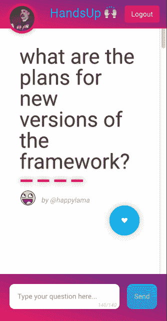
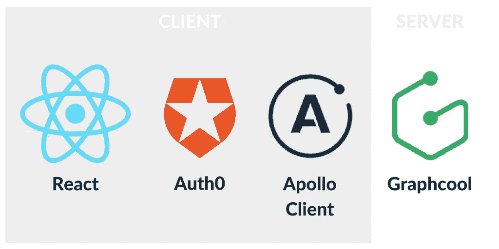
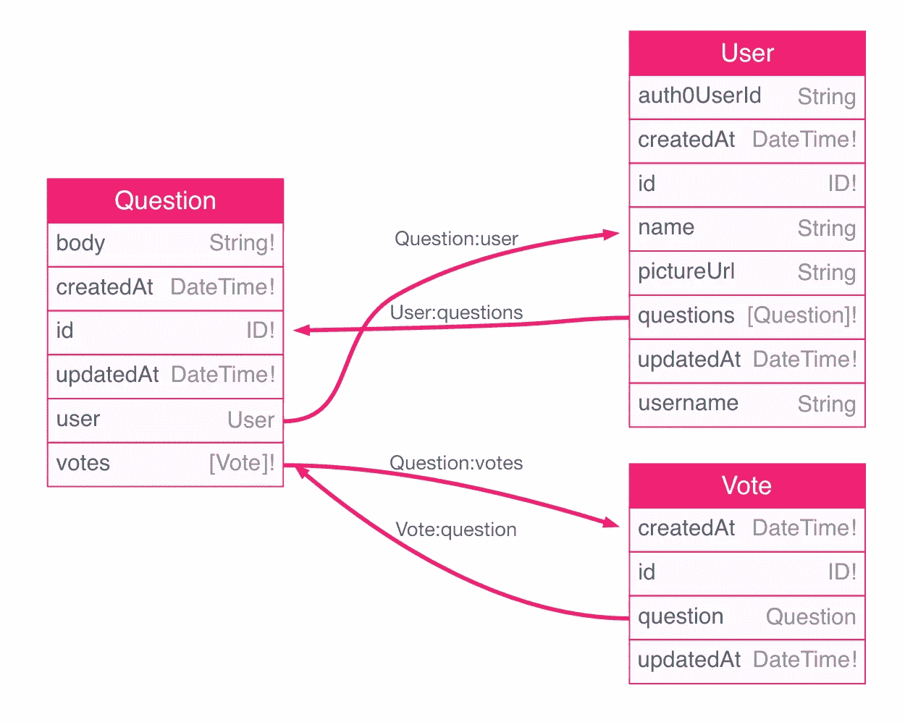
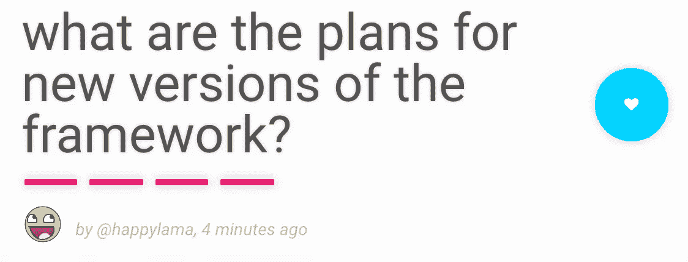

# 构建 HandsUp:一个使用 GraphQL 和 React 的操作系统实时问答应用

> 原文：<https://medium.com/google-developer-experts/building-handsup-an-os-real-time-voting-app-using-graphql-and-react-b2b7dcd0e136?source=collection_archive---------1----------------------->

使用 GraphQL 订阅、阿波罗客户端 1.0 和 Auth0


Original from a [tweet](https://twitter.com/maryshlikhota/status/854086134212722688) by [@maryshlikhota](https://twitter.com/maryshlikhota)

在本文中，我们将看看使用[](https://facebook.github.io/graphql)****和React 构建一个开源实时问答应用程序的所有步骤。****

*   ******解决方案架构** : [HandsUp App](#ddf8)****
*   ******GraphQL 服务器** : [使用 Graphcool CLI](#dae9) 创建它****
*   ******阿波罗客户端** : [引导设置](#af11)和[反应集成](#87f1)****
*   ******查询** : [显示问题](#cbe2)****
*   ******突变** : [投票](#5534)和[跟踪投票使用投票](#0d10)****
*   ******认证用户** : [Auth0 设置](#f00a)，[反应集成](#8c5f)， [Graphcool 用户集成](#0dbc)和[显示登录用户](#e513)****
*   ******订阅** : [添加新问题](#fda8)和[订阅它们](#ae13)****

****这个应用程序将允许活动的参与者提问(如果登录的话)，并为最有趣的问题投票。****

****你可以在下面看到最终的结果****

********

****所有用户都可以对问题进行投票，增加了问题的重要性。为了添加新问题，用户必须登录。随着新问题和投票的记录，用户也会得到更新。活动组织者可以利用所有这些信息在活动期间进行问答或小组讨论。****

****您可以在 [GitHub](https://github.com/gsans/handsup-react) 中访问最终解决方案。****

****在 [@gerardsans](https://twitter.com/intent/user?screen_name=gerardsans) 的我的 feed 中找到最新的 GraphQL 内容。****

# ****解决方案架构:HandsUp 应用程序****

****为了实现这些特性，我们将使用 **GraphQL** 。这也是为了展示我们如何通过使用订阅来使用它的实时特性。****

****关于 **GraphQL** 和 **Apollo 客户端**的介绍，你可以阅读这篇博文。****

****[](/google-developer-experts/graphql-and-the-amazing-apollo-client-fe57e162a70c) [## GraphQL 和神奇的阿波罗客户端

### 探索使用 React 和 Angular 构建的应用程序

medium.com](/google-developer-experts/graphql-and-the-amazing-apollo-client-fe57e162a70c) 

在服务器端，我们将使用 [**Graphcool**](https://www.graph.cool/) 作为我们的 **GraphQL 服务器**。

在客户端，我们将使用 [**Apollo 客户端**](https://github.com/apollostack/apollo-client) 作为我们在 **React** 和 **GraphQL 服务器**之间的桥梁。我们将使用 [**Auth0**](https://auth0.com/) 以便用户可以使用他们的社交账户登录我们的应用程序。

最后我们会添加 **GraphQL** **订阅**实现新问题的实时更新。

请参见下面的架构概述:



Building blocks for our real-time voting Application

# 创建 GraphQL 服务器

让我们开始创建我们的 GraphQL 服务器。这听起来可能令人望而生畏，但是使用 Graphcool CLI ，是非常简单的。在进行下一步之前，继续[并注册](https://console.graph.cool/signup)。

我们将使用 **Graphcool CLI** 来创建我们的**数据模型**(模式)。运行这些命令安装 CLI 并创建新项目。

```
npm install --global graphcool
graphcool init
```

按照屏幕上的指示操作，记住先从[注册](https://console.graph.cool/signup)。这将创建 **GraphQL 服务器**来托管我们的数据。初始模式是自动生成的。更新在 **init** 命令期间创建的`project.graphcool`文件，使用最新的可用模式[这里](https://raw.githubusercontent.com/gsans/handsup-react/master/src/HandsUp.schema)并运行下面的命令。第一个将更新模式。你可以用第二个来打开 **Graphcool 控制台**。

```
graphcool push
graphcool console
```

> 注意:随着更多的特性被添加到项目中，最新的模式可能包括更多的字段和类型

这是我们将在本文中使用的最终数据模型**。**



Graph View in Graphcool Console

一旦您对 GraphQL 更加熟悉，您可能想要创建自己的 **GraphQL 服务器**。那完全没问题。阅读 Jonas Helfer 的这篇博文了解更多信息。

# 阿波罗客户端

**Apollo Client** 是一个框架无关的 GraphQL 客户端，它可以帮助您获取数据，并使您的客户端状态与服务器保持同步。

> 安装 [Apollo 客户端开发工具](https://chrome.google.com/webstore/detail/apollo-client-developer-t/jdkknkkbebbapilgoeccciglkfbmbnfm)以获得更好的开发体验

## 自举设置

为了设置 **Apollo 客户端**，我们需要向我们的项目添加一些依赖项。

```
npm install --save apollo-client react-apollo graphql-tag
```

这将安装运行 GraphQL 查询所需的依赖项。我们将创建一个单独的文件`client.js`来保存我们的 **Apollo 客户端**设置。

```
// src/client.js
import ApolloClient, { createNetworkInterface } from 'apollo-client'const networkInterface = createNetworkInterface({
  uri: '[**https://api.graph.cool/simple/v1/YOUR_KEY_HERE**'](https://api.graph.cool/simple/v1/cj1132nbg4pwk0138d8ummhiq'),
  dataIdFromObject: record => record.id,
})export const client = new **ApolloClient**({
  networkInterface,
})
```

> 为了获得您的**密钥**，您可以使用 **Graphcool CLI** 运行`graphcool endpoints`。

从`react-apollo`我们将使用 **ApolloProvider，**一个自举期间的高阶组件。我们需要使用相同名称的属性来传递我们刚刚设置的**客户端**。

```
// src/app.js
import { **ApolloProvider** } from 'react-apollo'
import { **client** } from './client'render(
  **<ApolloProvider client={client}>**
    <HashRouter>
      **<Route path='/' component={HandsUpApp} />**
    </HashRouter>
  **</ApolloProvider>**,
  document.getElementById('root')
)
```

我们只需要一条指向主要组件的路线。

## 反应积分

每当我们需要使用 GraphQL 时，我们将使用下面的模式来扩展我们的组件

```
import {**graphql**} from 'react-apollo'
import {QUERY_OPERATION} from './graphql/query.operation.gql'class Component extends React.Component {}
const withOperation = **graphql**(QUERY_OPERATION, {options})
export default withOperation(Component)
```

通过这样做，我们可以轻松地扩展我们的组件，添加特定的 **GraphQL 属性** (props)，然后我们可以使用这些属性与我们的 **GraphQL 服务器**进行交互。

> 为了导入`.graphql`或`.gql`扩展，需要对你的 webpack 配置进行一些设置。检查[**graph QL-tag/loader**](http://dev.apollodata.com/react/webpack.html)。主要的好处是避免在客户端处理 **GraphQL AST** (抽象语法树)而不是使用 **gql`query`** 。

# 显示问题

我们将从处理问题所需的数据模型开始。这将是一个新的类型命名为**问题**。你可以在下面看到一个简化的定义。每个问题都有一个 id、一个正文和创建时间。

```
type **Question** {
  id: ID!
  body: String!
  createdAt: DateTime!
}
```

为了处理问题列表，我们创建了**问题列表**和**问题**组件。请参见下面简化的伪 html 版本:

```
// src/components/QuestionList.js
<QuestionList **questions**={questionList}>
  <ul>
    <Question **key={question.id}** question={question}>
      <li>{**question.body**}</li>
    </Question>
    ...
  </ul>
</QuestionList>
```

在下面的代码片段中，我们定义了一个查询来获取所有可用的问题。**问题片段**将允许我们在其他查询和/或变体中引用相同的问题字段。

```
query questions {
  allQuestions { 
    ...**question**
  }
}fragment **question** on Question {
  id 
  body 
  createdAt  
}
```

# 投票

在活动期间从观众那里获得问题是关键，但对于大型活动来说，可能会有一些时间限制，因此获得关于哪些问题最受欢迎的反馈可能是有用的。我们可以通过允许与会者投票来实现这一点。

我们需要用另一种类型的投票来扩展我们的模型。每一票都将与一个问题相关联。

```
type **Vote** {
  id: ID!
  createdAt: DateTime!
  **question: Question**
}
```

让我们看看投票突变是什么样子的:

```
// src/graphql/Vote.mutation.gql
mutation createVote($question: ID!) {
  createVote(questionId: $question) { 
    id 
  }
}
```

这种变异将使用问题 id 创建一个新条目。让我们看看如何将这种变化融入到我们的应用中。我们将扩展**问题**组件，用一个新的突变来呈现一个问题

```
// src/components/Question.js
const withVote = graphql(CREATE_VOTE_MUTATION,
  {
    props: ({ ownProps, mutate }) => ({
      **vote(id) {
        return mutate({
          variables: { question: id },
        })
      },**
    }),
  },
)export default withVote(Question)
```

这将扩展 props 对象以包含一个`vote(id)`函数，该函数调用 mutate 并通过在 variables 属性内传递问题 id 来传递问题 id。

在**问题**组件中，当用户点击该问题的投票按钮时，我们将触发这种变异。注意我们是如何使用**乐观 UI** 的，通过改变状态来立即应用改变。

```
// src/components/Question.js
class **Question** extends React.Component {
  onSubmit() {
    this.setState({ votes: this.state.votes+1 })
    **this.props.vote(this.props.question.id)**
  }
  // <button onClick={e => this.onSubmit()}></button>
}
```

## 跟踪投票信息

到目前为止，我们介绍了如何为一个问题添加新的投票，但我们没有介绍如何为所有问题保持所有这些数据的更新。

为了做到这一点，我们将使用 Graphcool 的一个名为 **Aggregations** 的优秀特性。这个特性允许我们保持每个问题的当前投票数，而不需要做任何额外的编码！对于每种类型，Graphcool 都创建了一个额外的类型，我们可以使用它来访问这些数据，在我们的例子中，这就是`_votesMeta`。

```
query questions {
  allQuestions { 
    ...**question**
  }
}fragment **question** on Question {
  id 
  body 
  createdAt  
  **_votesMeta { count }**
}
```

如果我们看一下问题片段，可以看到一些新的字段`_votesMeta`****`count`。这将允许我们收集关于特定问题有多少投票的信息。****

## ****问题投票****

****我们讲述了如何跟踪新的投票，以及如何检索当前的投票数。但是我们没有介绍如何在我们的 UI 中获得新的更新。****

****为了显示投票信息，我们将设置一个轮询，以便按照固定的时间表获取这些信息。这是一种避免过度提取的折衷方法。实时同步投票会给大型活动带来不必要的流量。****

```
**// src/components/QuestionList.js
const withQuestions = graphql(QUESTIONS_QUERY,
  {
    **options: { pollInterval: POLLING_TIME },**
    props: ({ data }) => {
      return {
        questions: data.allQuestions,
      }
    },
  },
)export default withQuestions(QuestionList)**
```

****通过使用轮询，我们可以确保所有用户每隔几秒钟就可以获得最新的聚合信息。由于这些信息可能不完全准确，我们将投票总数替换为类似体积的显示。条形越多，问题的票数就越多，遵循指数函数。****

********

# ****使用 Auth0 验证用户****

## ****Auth0 设置****

******在 [Auth0 网站](https://auth0.com/)注册**并创建新的 **SPA 客户端**。我们将使用这个 SPA 客户端从 React 应用程序访问 Auth0 服务。****

****你可以关注这个[博客](https://auth0.com/docs/quickstart/spa/react/00-getting-started)了解更多关于如何设置一个 Auth0 账户以及如何获得`CLIENT_ID`和`DOMAIN`的细节。****

****为了处理用户登录和会话管理，我们创建了**授权**服务。****

```
**// src/services/Authorisation.js
export default class Authorisation {
  constructor() {
    this.lock = new Auth0Lock(**CLIENT_ID**, **DOMAIN**, {
      auth: {
        responseType: 'id_token',
        params: { scope: 'openid email' },
        **redirect: false,**
      },
    })
    this.lock.on('authenticated', this.doAuthentication.bind(this))
  } authenticate() {
    this.lock.show()
  }
}**
```

****从上面的代码来看，我们使用`Auth0Lock`来提供一个很好的用户界面，让用户完成登录的所有步骤。这是使用没有重定向的覆盖弹出窗口的设置。在设置了`Auth0Lock`实例之后，我们为`authenticated`事件注册了一个回调。为了显示这个锁定弹出窗口，我们创建了一个单独的`authenticate`方法。****

****让我们看看一旦用户登录并且触发了`authenticated`事件会发生什么。****

```
**// src/services/Authorisation.js
doAuthentication(authResult) {
  if (!this.profile) {
    **this.auth0IdToken = authResult.idToken**
    **this.lock.getProfile**(authResult.idToken, (error, profile) => {
      if (error) {
        this.auth0IdToken = null
        this.profile = null
      } else {
        **this.profile = profile**
      }
    })
  }
}**
```

****我们做的第一件事是将`auth0IdToken`存储在**本地存储**中，为了方便起见，它被包装在一个 getter 和 setter 中****

```
**// src/services/Authorisation.js
**get auth0IdToken()** {
  return localStorage.getItem('auth0IdToken')
}
**set auth0IdToken(value)** {
  if (value) {
    localStorage.setItem('auth0IdToken', value)
  } else {
    localStorage.removeItem('auth0IdToken')
  }
}**
```

****之后，我们将尝试使用此令牌访问用户配置文件。这是一个异步操作，因此我们传递一个回调，并使用相同的方法将其存储在 localStorage 中。如果有任何错误，我们只是清除用户信息。****

## ****与 React 集成****

****为了将其与我们的应用程序集成，我们将使用一个*高阶组件*，它将沿着组件树向下传递`Authorisation`类实例引用。****

```
**// src/app.js
const auth = **new Authorisation()**class HandsUpAppWrapper extends React.Component {
  render() {
    return (
      <HandsUpApp **auth={auth}** {...this.props} />
    )
  }
}**
```

****当与我们的 **GraphQL 服务器**通信时，我们可以使用`auth0IdToken`进行授权。为了整合两者，我们可以使用一个中间件来添加所需的头。****

```
**// src/client.js
networkInterface.use([{ 
  applyMiddleware(req, next) {
    if (localStorage.getItem('auth0IdToken')) {
      if (!req.options.headers) {
        req.options.headers = {}
      }
      req.options.headers.authorization =
        `Bearer **${localStorage.getItem('auth0IdToken')}**`
    }
    next()
  },
}])**
```

****一旦有了这个设置，我们就可以配置特定的查询，只允许授权用户执行它们。****

## ******Graphcool 用户集成******

****为了使用我们模型中的用户信息，我们需要通过使用 Graphcool 提供的`createUser`变异来注册新用户。最重要的字段是 Auth0 提供的 idToken。剩下的字段将允许我们显示用户个人资料图片和用户名。****

```
**// src/graphql/CreateUser.mutation.gql
mutation createUser(
 **$idToken: String!,** 
  $name: String!,
  $username: String!,
  $pictureUrl: String!
){
  createUser(
    authProvider: {
 **auth0: {
        idToken: $idToken
      }**
    }, 
    name: $name,
    username: $username,
    pictureUrl: $pictureUrl
  ) {
    **id**
  }
}**
```

****注意底部的`id`字段。见下图**用户**类型的简化版本。****

```
**type User {
  id: ID!                   # graphcool internal id
  auth0UserId: String       # auth0 idToken
  name: String
  username: String
  pictureUrl: String
  createdAt: DateTime!
  questions: [Question!]!
}**
```

****我们将使用它来更改问题突变，以便包括登录的用户。****

```
**// src/graphql/CreateQuestion.mutation.gql
#import "./Question.fragment.gql"mutation addQuestion($body: String!, **$user: ID!**) {
  createQuestion(body: $body, **userId: $user**) { 
    ...question
  }
}**
```

## ****问题。显示用户数据****

****因为我们在查询和变异中使用相同的问题片段，所以我们可以简单地扩展它来获取新的字段****

```
**// src/graphql/Question.fragment.gql
fragment question on Question {
  **user { id username pictureUrl }** 
}**
```

## ****显示登录的用户****

****一旦我们从 Auth0 获得了用户信息，我们就可以使用**授权**服务向我们的组件提供这些信息。****

****为了显示登录的用户，我们将创建一个 **Profile** 组件，并将其放在我们的 **TopNavigation** 组件中。这将是一个纯粹的依赖于`profile`和`isLogged`道具的组件。****

```
**// src/components/TopNavigation.js
<Profile 
  profile={this.props.auth.profile}
  isLogged={this.props.isLogged}
/>**
```

****该组件导致一个简单的实现。****

```
**// src/components/Profile.js
class Profile extends React.Component { render() {
    if (!this.props.isLogged) {
      return null
    } return (
      <div className='profile'>
        
      </div>
    )
  }
}**
```

# ****添加新问题****

****到目前为止，我们已经介绍了匿名用户的所有特性。任何有权访问我们的应用程序的人都可以按照问题列表进行投票。让我们为与会者添加添加新问题的选项。****

****参见下面的变异查询来创建一个新问题。****

```
**// src/graphql/CreateQuestion.mutation.gql
#import "./Question.fragment.gql"mutation addQuestion($body: String!, $user: ID!) {
  createQuestion(body: $body, userId: $user) { 
    ...**question**
  }
}**
```

****我们可以使用登录用户创建一个问题，并将其链接到系统中的注册用户。****

****让我们看看如何将这个突变查询集成到 **AddQuestion** 组件中****

```
**// src/components/AddQuestion.js
class AddQuestion extends React.Component { **onSubmit**(event) {
    event.preventDefault()
    this.props
      .**addQuestion**(this.input.value, this.props.auth.userId)
  } render() {
    return (
      <form **onSubmit={e => this.onSubmit(e)}**>
        <input ref={node => (this.input = node)} />
        <button **type='submit'**>Send</button>
      </form>
    )
  }
}**const withAddQuestion = graphql(CREATE_QUESTION_MUTATION, {...})**export default **withAddQuestion**(AddQuestion)**
```

****在上面的代码中，我们可以看到如何将`onSubmit`表单事件链接到传递输入值和当前登录用户的`addQuestion`。****

> ****注意我们是如何通过使用 [**ref 属性**](https://facebook.github.io/react/docs/refs-and-the-dom.html) 回调来访问底层输入元素的。****

```
**// src/components/AddQuestion.js
const withAddQuestion = graphql(CREATE_QUESTION_MUTATION,
  {
    props: ({ mutate }) => ({
      **addQuestion(body, id)** {
        return mutate({
          **variables: { body: body, user: id },**
          updateQueries: {
            questions: (state, { mutationResult }) => {
              let newQuestion = **mutationResult.data.createQuestion**
              return update(state, **{
                allQuestions: {
                  $push: [newQuestion],
                 },
              }**)
            },
          },
        })
      },
    }),
  },
)**
```

****在这个实例中，我们将`addQuestion`函数作为一个新属性(prop)添加到我们的组件中。我们将调用`mutate`，将问题主体和用户 id 作为`variables`传递。当突变返回结果时`updateQueries`将执行。然后我们可以通过使用`mutationResult` 来访问结果，并返回新的状态。****

****为了避免增加副作用，我们使用了`immutability-helper`库。你可以在这里了解它的语法[。](https://facebook.github.io/react/docs/update.html)****

# ****设置订阅****

****为了访问实时特性，我们需要为 Apollo 客户端添加订阅支持。请确保运行此命令****

```
**npm install — save subscriptions-transport-ws**
```

## ****Apollo 客户端订阅设置(client.js)****

****我们还需要一个来自 Graphcool 的独立端点来访问服务器上的订阅。****

> ****为了获得您的**订阅** **密钥**，您可以使用 **Graphcool CLI** 运行`*graphcool endpoints*`。****

```
**// src/client.js
import { SubscriptionClient, addGraphQLSubscriptions } from 'subscriptions-transport-ws'const **wsClient** = new SubscriptionClient('**wss://subscriptions.graph.cool/v1/YOUR_KEY_HERE**', {
  reconnect: true,
})const networkInterfaceWithSubscriptions = addGraphQLSubscriptions(
  networkInterface,
  **wsClient**
)export const client = new ApolloClient({
  networkInterface: networkInterfaceWithSubscriptions,
})**
```

****在上面的代码中，我们使用您的端点设置了`SubscriptionClient`。我们激活了`reconnect`标志，因此客户端将从传输故障中正常恢复。最后，我们扩展了当前的网络接口，以包括订阅客户端。****

## ****订阅新问题****

****我们的应用程序的一个关键特性是所有与会者实时共享新问题，因此每个人都可以了解它们并投票。****

****让我们来看看我们的订阅查询:****

```
**// src/graphql/Questions.subscription.gql
#import "./Question.fragment.gql"subscription {
  **Question**(filter: { mutation_in: [**CREATED**] }) {
    node {
      **...question**
    }
  }
}**
```

****订阅的语法需要一个**类型**和一个我们感兴趣的**操作列表**:创建、更新或删除。在上面的代码中，我们订阅了新的**问题**。因此，对于每个新问题，我们将收到一条消息(节点),其中包含问题片段中定义的所有字段。****

****让我们看看如何将这个订阅与显示问题列表的 **QuestionsList** 组件集成在一起。****

```
**// src/components/QuestionList.js
class QuestionList extends React.Component { componentWillMount() {
    **this.props.subscribeToNewQuestions()**
  } render() {...}
}
const withQuestions = graphql(QUESTIONS_QUERY, {...})
**const withSubscription = graphql(QUESTIONS_QUERY, {...})**export default **withSubscription(**withQuestions(QuestionList)**)****
```

****我们使用与之前相同的模式扩展了 **QuestionList** 组件，增加了新的订阅。注意我们是如何使用`componentWillMount`来触发订阅的。参见**下面`subscribeToNewQuestions` 的代码。******

```
// src/components/QuestionList.js
const **withSubscription** = graphql(QUESTIONS_QUERY,
  {
    props: ({ data: { subscribeToMore } }) => ({
      **subscribeToNewQuestions**() {
        return subscribeToMore({
          document: QUESTIONS_SUBSCRIPTION,
          updateQuery: (state, { subscriptionData }) => {
            const newQuestion = **subscriptionData.data.Question.node**
            if (!isDuplicate(newQuestion.id, state.allQuestions)) {
              return update(state, **{
                allQuestions: {
                  $push: [newQuestion],
                },
              }**)
            }
          },
        })
      },
    }),
  },
)
```

**我们在用`subscribeToMore` 来定义我们的`updateQuery`。这将在我们每次从订阅查询`QUESTIONS_SUBSCRIPTION`收到消息时执行。**

**我们可以使用`subscriptionData`属性获得新的问题数据。`updateQuery`的输出应该是包含新问题的新状态。**

**为了避免增加副作用，我们使用了`immutability-helper`库。你可以在这里了解它的语法[。](https://facebook.github.io/react/docs/update.html)**

> **因为我们使用了乐观用户界面，所以我们需要检查重复项，以避免用户添加问题时出现重复条目。**

**你可以在 [GitHub](https://github.com/gsans/handsup-react) 访问最终解决方案。**

**那都是乡亲们！有什么问题吗？感谢阅读！在[@ gerardsans](https://twitter.com/intent/user?screen_name=gerardsans)ping 我**

**[](https://www.meetup.com/GraphQL-London) [## GraphQL 伦敦社区

### 欢迎来到我们的社区。我们的热情是 GraphQL。加入我们吧！🚀](https://www.meetup.com/GraphQL-London) 

# 进一步阅读

*   Graphcool。[在 5 分钟内建立一个 GraphQL 后端](https://www.graph.cool/docs/tutorials/quickstart-1-thaeghi8ro)
*   Auth0。【React 和 Apollo 的 Auth0 用户认证
*   Auth0。 [Auth0 — React 入门](https://auth0.com/docs/quickstart/spa/react/00-getting-started)
*   Auth0。[将您的应用程序连接到谷歌](https://auth0.com/docs/connections/social/google)
*   Auth0。[将你的应用程序连接到 Twitter](https://auth0.com/docs/connections/social/twitter)

[](https://twitter.com/intent/user?screen_name=gerardsans)******