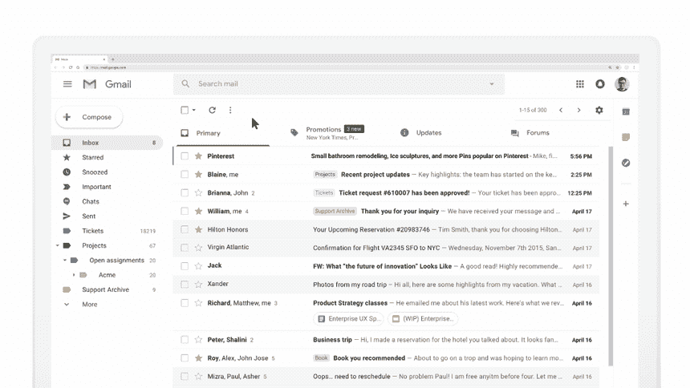

# 使用 AMP 构建交互式电子邮件

> 原文：<https://medium.com/pinterest-engineering/building-interactive-email-with-amp-2a90969c0093?source=collection_archive---------2----------------------->

田方正|软件工程师，成长工程

AMP(加速移动网页)是 Google 为支持快速移动网页而开发的开源技术。多年来，我们一直与谷歌合作，并在我们的移动网页中采用 AMP 技术，以提供更快、更高效的用户体验。

最近，我们采用了 AMP 的最新版本[,将 AMP 的支持扩展到所有 Gmail 客户端，使我们发送给 Pinners 的电子邮件具有交互性。通过这些更新，AMP 电子邮件的工作方式更像网页或移动应用程序，使 Pinners 能够在电子邮件中执行各种操作，包括保存 pin。](https://amp.dev/documentation/guides-and-tutorials/learn/amp-email-format)

# 阅读、保存、开始

我们向 Pinners 提供个性化推荐的渠道之一是电子邮件。我们不断向 Pinners 提出建议，并且我们一直在寻找让这种交流更有吸引力的方法。我们将电子邮件视为我们核心产品的延伸——一种增强理解和展示我们产品价值的方式。

通常，当 Pinner 收到我们的电子邮件时，他们必须点击电子邮件中的 Pin，然后被定向到 Pinterest.com 或移动应用程序，可能会登录，并保存到留言板。这个过程越长，用户就越有可能不采取行动。借助 AMP for Gmail，我们看到了通过电子邮件提高参与度的巨大机会。

现在，电子邮件不再局限于静态内容，读者可以立即使用 Pinterest。非常适合 Pinterest。如果 Pinner 从他们的电子邮件中看到一个想法，他们可以立即保存它。

# 给电子邮件带来交互性

作为一个概述，AMP 技术包括 AMP HTML、AMP JS 和 AMP Cache 作为一个完整的套件，用于支持移动 web 开发的各种需求。但出于启用 Javascript 的安全考虑，目前谷歌在邮件中只支持 AMP HTML。考虑到这一点，在设计电子邮件 UI 时，我们限制了动画的使用，并通过 CSS 或 AMP HTML 标签支持动画。为了更好地适应 Pinners 的习惯，我们保留了典型的引脚网格。

我们与谷歌同时开发了更新，并在整个过程中提供反馈。

在整个开发过程中，我们也始终牢记安全性。由于电子邮件不能拥有会话或用户登录功能，我们需要为 AMP 电子邮件中的两个主要 Pinterest 操作生成自动登录 URL:获取用户的公告板和将 Pin 保存到公告板。尽管这些 URL 是预编码的，但我们采取了额外的措施来防止垃圾邮件。当 Gmail 客户端捕捉到一个 Pinterest 动作时，它会向谷歌发出 GET/POST 请求。然后 Google[为这个请求生成并附加一个安全令牌](https://developers.google.com/gmail/ampemail/authenticating-requests),并将请求转发给 Pinterest。在我们的服务收到请求后，我们在返回任何用户信息之前调用 Google 来验证这个令牌。这个额外的验证步骤确保了 URL 不会被滥用。

通常，Gmail 的 HTML 大小限制是 100k，所以我们对 MIME 也有限制。如果一封邮件超过 100k，Gmail 将显示限制范围内的第一部分，然后显示“显示完整邮件”按钮。但对于 Gmail 的 AMP 的最初推出，如果 AMP HTML 部分超过 100k，将显示完整的正常静态邮件。因此，我们需要最小化我们的 AMP 电子邮件大小，同时最大化内容并优化交互体验。

# AMP 电子邮件的优势

AMP 电子邮件是下一代电子邮件技术，可提供更快、更具互动性的移动网络体验。这项技术也将得到微软 Outlook、雅虎。和 Mail.Ru。在行业领导者的支持和倡导下，我们对这一生态系统的未来增长持乐观态度。

AMP 电子邮件也让 Pinterest 有机会更容易地收集用户反馈。例如，Pinners 可以让我们知道他们是否不喜欢被推荐的 Pin，这是最终使他们的整体 Pinterest 体验更相关的反馈。我们还在探索电子邮件中的 Pin 特写，这样 Pinners 就可以直接从电子邮件中获得 Pin 的更多细节。对于我们的主题推荐邮件，我们可以为用户启用主题选择器。用户现在甚至可以直接在电子邮件中关注他们感兴趣的话题。我们还在探索为 Pinners 添加使用 AMP 直接回复 Pinterest 邮件的功能。

我们目前正在向 Pinners 推出 AMP 电子邮件，同时继续努力使与 Pinners 的沟通尽可能跨平台、无缝和有吸引力。