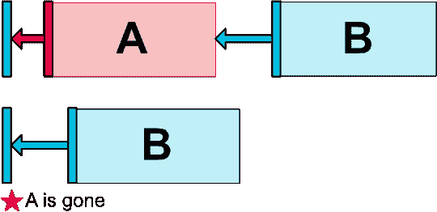

# 使用 ConstraintLayout 构建界面

> 原文：<https://medium.com/androiddevelopers/building-interfaces-with-constraintlayout-3958fa38a9f7?source=collection_archive---------0----------------------->

如果你刚刚开始 ConstraintLayout 的冒险，这是一个支持库中可用的新布局，它与 Android Studio 2.2 中的可视 UI 编辑器紧密集成，我建议你先观看上面的介绍视频或浏览我们的 codelab。

视频和 codelab 都向您介绍了布局编辑器中的句柄、约束和 UI 控件的基本概念，这将帮助您以可视化的方式快速构建界面。

在本文中，我将重点介绍 Android Studio 2.3 (Beta)中 ConstraintLayout 的最新添加内容:链和比率，并给出一些通用的 ConstraintLayout 提示和技巧。

## 链子

创建链是一个新特性，可以让你沿着一个轴(水平或垂直)定位视图，这在概念上有点类似于线性布局。如 ConstraintLayout 所实现的，链是通过双向连接链接的一系列视图。

要在布局编辑器中创建一个链，选择想要链接在一起的视图，右键单击其中一个视图，然后单击“水平居中视图”(或“垂直居中视图”)。

Creating a horizontal chain

这为你创造了必要的联系。此外，当您选择任何链元素时，会出现一个新按钮。它允许您在三种链模式之间切换:扩散、内部扩散和打包链。

Different chain styles: spread, spread inside and packed

处理链时，您还可以使用另外两种技术:

如果您有一个跨页或链内跨页，并且链中的任何视图都将其大小设置为 MATCH_CONSTRAINT(或“0dp”)，则链中的剩余空间将根据 layout _ CONSTRAINT horizontal _ weight 或 layout _ CONSTRAINT vertical _ weight 中定义的权重在它们之间分配。

Setting match_constraint on views that are part of a chain

如果您有一个打包的链，您可以调整水平(或垂直)偏移来左右(或上下)移动链的所有元素。

Adjusting horizontal bias of a packed chain

## 比率

比率让你完成与 [PercentFrameLayout](https://developer.android.com/reference/android/support/percent/PercentFrameLayout.html) 大致相同的事情，即限制一个视图到一个设定的宽高比，没有额外的视图组在你的层次结构中的开销。

Setting a ratio on a view

要为 ConstraintLayout 内的任何视图设置比率，请执行以下操作:

1.  确保至少有一个大小约束是动态的，即不是“固定的”和“环绕内容”。
2.  单击出现在框左上角的“切换纵横比约束”。
3.  以宽度:高度格式输入所需的纵横比，例如:16:9

## 指导方针

指引线是虚拟视图，可帮助您在布局中定位其他视图。它们在运行时不可见，但可用于将约束附加到。要创建垂直或水平基准线，请从下拉列表中选择它。

Working with guidelines

单击新添加的指引线，选择并拖动它到所需的位置。

单击顶部(或左侧)的指示器，在指南定位模式之间切换:dp 中从左/右(或顶部/底部)的固定距离，以及父视图宽度/高度的百分比。

# 处理视图。过去的

Top: A and its margin is visible; bottom: A is set to Gone, B is still positioned correctly

在处理视图时。ConstraintLayout 中视图的可见性消失，与 RelativeLayout 相比，您有更多的控制权。首先，任何设置为 GONE 的视图在两个维度上都缩小到零大小，但仍然参与计算约束。对该视图的约束设置的任何边距也被设置为零。

在许多情况下，通过约束连接的一组视图，比如上面的例子，将视图设置为“消失”时就可以工作。

还有一种方法可以为约束指定不同的边距，以防约束所附着的视图通过 GONE 被删除。使用[*layout _ gone margin*](https://developer.android.com/reference/android/support/constraint/ConstraintLayout.html#GoneMargin)*Start*(…*Top*、… *End* 和… *Bottom* )属性之一来实现。

Leveraging layout_goneMarginTop and layout_goneMarginStart

这使得能够处理更复杂的情况，例如上面演示的情况，而不需要修改代码来处理某些视图的消失状态。

## 不同种类的定心

当我讨论 ConstraintLayout 的链特性时，我已经提到了一种类型的居中。当你选择一组视图并点击“水平居中”(或“垂直居中”)，你就创建了一个链。

当只选择一个视图时，也可以使用相同的选项，使其在可以附加约束的最近视图之间居中:

Center horizontally between other views

要忽略任何其他视图并仅在父视图中居中，请选择“在父视图中水平/垂直居中”选项。请注意，通常您将在单个视图中使用它，因为这不会创建链。

Center in parent

有时，您可能希望根据中心将两个不同大小的视图对齐。当一个视图有两个约束从两个不同的侧面拉它时，视图将保持在这两个约束的中间(只要偏移设置为 50%)。

通过将两个约束连接到同一个控制柄，我们可以使用相同的方法将一个视图的中心与另一个视图的一侧对齐:

Aligning the center of one view with another view’s side

## 使用空格作为负边距

ConstraintLayout 中的视图不能有负边距(不支持)。然而，通过一个简单的技巧，您可以插入一个空间(本质上是一个空视图)并将其大小设置为您想要的边距，从而获得类似的功能。下面是它在实践中的样子:

Using a Space as a negative margin

## 何时使用推理

当您调用工具栏中的“推断约束”命令时，布局编辑器会试图找出 ConstraintLayout 中视图的任何缺失约束，并自动添加它们。它可以在没有任何约束的布局上工作，但是由于正确创建整个布局是一个困难的问题，所以您可能会得到混合的结果。这就是为什么我提出了两种使用约束推理的方法:

第一种方法是手动创建尽可能多的约束，以便您的布局能够正常工作。然后，对于仍缺少约束的少数视图，单击“推断”。这可以节省你一点点的工作。

另一种方法是从在布局编辑器画布上定位视图开始，不创建约束，使用 infer，然后更改预览设备分辨率。查看哪些视图的大小调整和位置更改不正确，修复这些约束，然后使用另一种解决方案重复。

这完全取决于你的偏好，因为每个人在他们的布局中都有不同的创建约束的风格，包括手工创建。

## 不支持匹配父级

如果愿意，请改用 match_constraint (0 dp)并将约束附加到父视图的侧面。这提供了类似的功能，并正确处理了边距。“匹配父项”根本不应在 ConstraintLayout 中使用。

如果您自己有任何 ConstraintLayout 技巧，请不要犹豫，将它们作为本文的回复分享给其他人！