# 构建点唱机:当简单的文本、迷因或 gif 不够时，分享音乐的病毒式方式

> 原文：<https://medium.com/square-corner-blog/building-jukebox-a-viral-way-to-share-music-when-a-simple-text-meme-or-gif-isnt-enough-6a47fb063d03?source=collection_archive---------0----------------------->

## 两名黑客马拉松老手在 SXSW 黑客马拉松上发现了 Square 的 API，以及它们提供的改进现有和新应用的无限可能性。

> 注意，我们已经行动了！如果您想继续了解 Square 的最新技术内容，请访问我们的新家[https://developer.squareup.com/blog](https://developer.squareup.com/blog)

埃里克·金和达莫拉·奥莫托索是两位老朋友，他们在弗吉尼亚理工大学攻读工程学位时相识。毕业后，他们都去攻读工程硕士学位，然后全职从事科技工作。虽然他们在早期职业生涯中有一个良好的开端，但他们渴望改变现状，并为自己的冲动找到一个出口，为他们在日常生活中遇到的问题找到创新的解决方案。为了追随他们对构建软件和创造新产品的热情，Eric 和 Damola 决定创办 [Swyft 工作室](http://swyftstudios.com/)。

Swyft 工作室的使命是创造创新和有趣的产品，这些产品位于技术和文化的交汇处。一个核心重点领域是瞄准服务不足的市场，在这些市场中，他们发现对新服务的需求尚未得到满足。

Square 团队在 2017 年 3 月的 SXSW 黑客马拉松上有机会见到了达莫拉和埃里克。我们喜欢与他们见面，因为他们的能量和激情令人上瘾，令人振奋。

在黑客马拉松期间，他们与 Square 的开发团队分享了他们的积极经验。“很明显，Square 关心开发者和黑客马拉松的参与者。很少看到一家公司派实际的开发人员到现场，而不是营销人员。

在审查了黑客马拉松可用的 API 后，Eric 和 Damola 开始开发[点唱机](http://getjukebox.co/)，这款应用程序允许用户轻松搜索、查找和分享来自音乐和娱乐领域一些最大明星的高质量音频和视频微内容。根据达莫拉的说法，“今天没有分享音乐的病毒方式”，因此他想解决这一未满足的需求。

Jukebox 允许用户购买碧昂斯或布鲁诺·马斯歌曲中他们最喜欢的一句，并将其发送给朋友或重要的人。这种模式还允许内容创作者从他们的歌曲或视频中赚取收入，当他们的粉丝以数字形式分享这些内容时。

这个令人敬畏的概念帮助他们加入了 2017 SXSW 黑客马拉松的[获胜者精选组！](https://sxswhackathon.devpost.com/submissions)

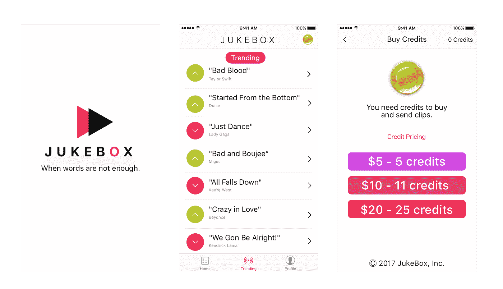

JukeBox User Interface

他们建造了自动点唱机

Jukebox 使用来自 [MediaNet](https://www.mndigital.com/) 的 API 来访问数字音乐数据和权利， [Cloudinary](http://cloudinary.com/) 来分发功能丰富、高性能的图像和视频内容， [Square 的电子商务 API](http://www.squareup.com/developers) 使用户能够在应用程序中直接购买代币和支付音乐费用。查看以下基于云的高级架构:

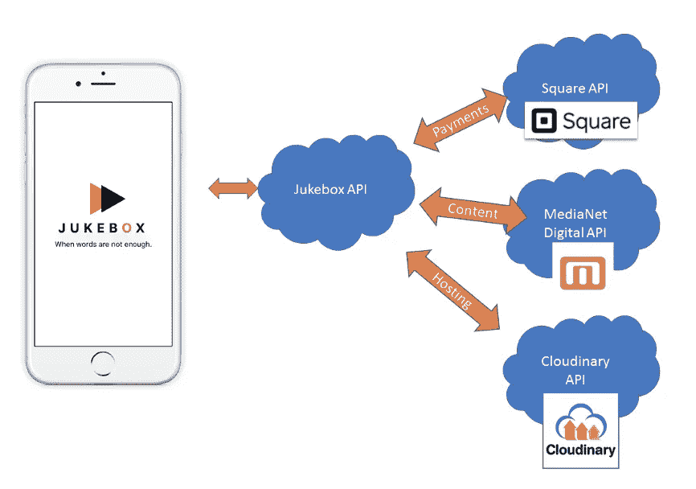

High level cloud architecture

自动点唱机首先利用 MediaNet API 来保护版权和原始内容。MediaNet 提供了一组有用的 API，允许发现和下载高保真音频内容和艺术家信息。

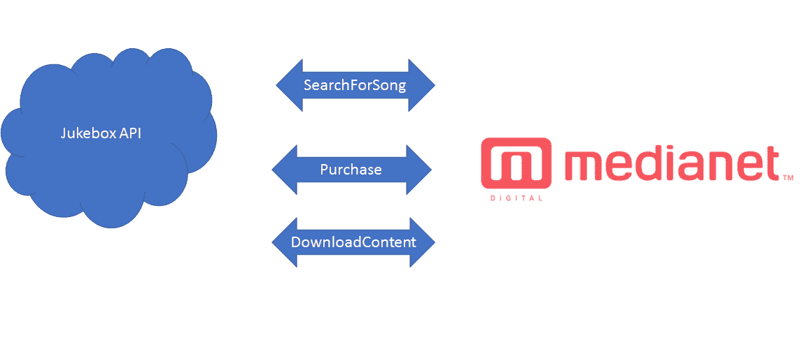

MediaNet API Architecture

从 MediaNet 下载后，歌曲被编入索引，并通过对齐关键部分、吸引人的挂钩和播放片段所需的信息进行“剪辑”。此信息随后存储在光盘机数据库中。

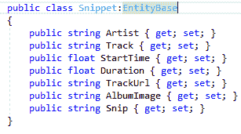

Snippet Data Model

从这里，Cloudinary 的图像和视频管理云 API 用于存储、检索和播放在 Jukebox 应用程序中购买和共享的片段。

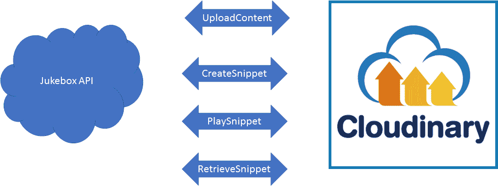

Cloudinary API Architecture

Jukebox API 与众包购买和共享数据的结合实现了病毒式传播的可视化，以及 Jukebox 应用程序中的一些功能，使用户能够看到平台上正在流行的片段。

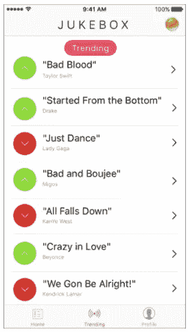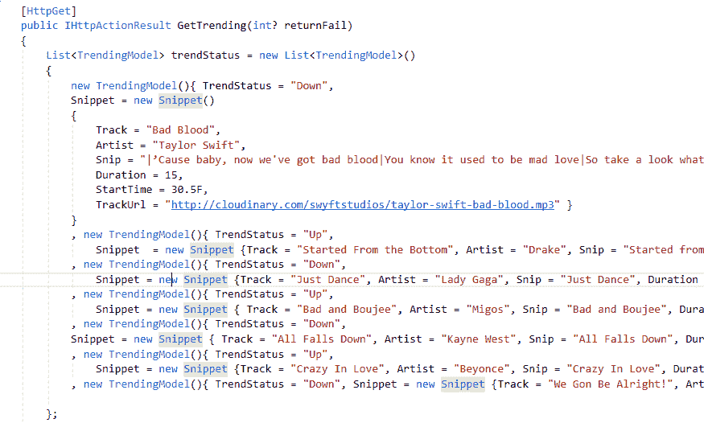

Code Snippet Depicting Trending Songs

使用 Square 的电子商务 API，Damola 和 Eric 能够集成支付功能，允许用户购买电子硬币，用于与朋友分享的内容片段。

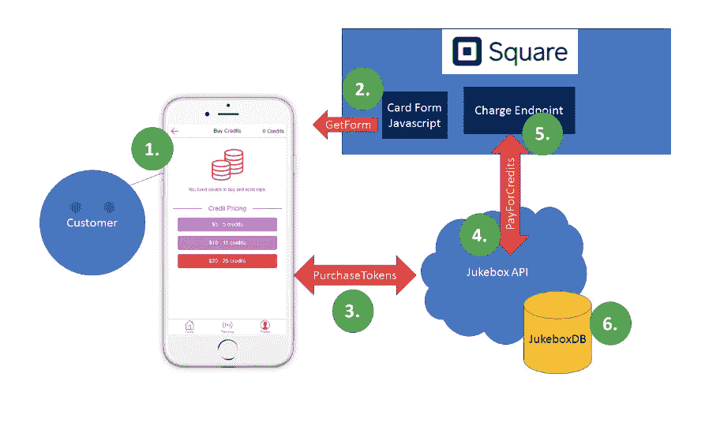

Depiction of Square Payments integration

点唱机电子硬币支付流程:

1.  用户导航到代币购买页面，选择他们想要购买的电子硬币的数量。
2.  Squares Javascript 库被下载，并预先填充了代币的购买金额。这个库在页面加载时嵌入了一个安全的信用卡表单。然后用户输入他们的卡信息来完成购买。
3.  从这里，从 SqPaymentForm 生成一个卡 nonce，该信息被转发到带有用户购买数量和意图的详细信息的 Jukebox API。
4.  点唱机 API 将卡随机数和其他支付细节一起发送到 Squares 电子商务 API 的收费端点。
5.  Square 用支付的结果来响应。
6.  最后，点唱机数据库为用户存储代币信息，并使他们能够利用这些电子硬币来完成片段购买。

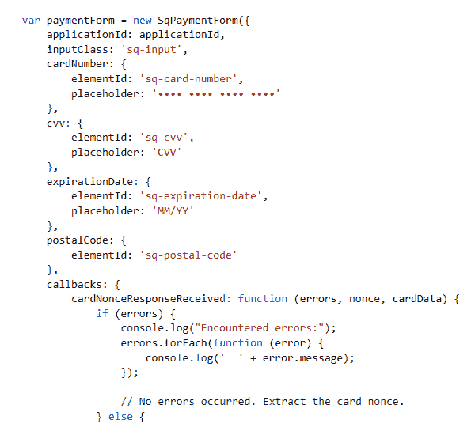

Code Snippet Depicting the SqPaymentForm Javascript in Action.

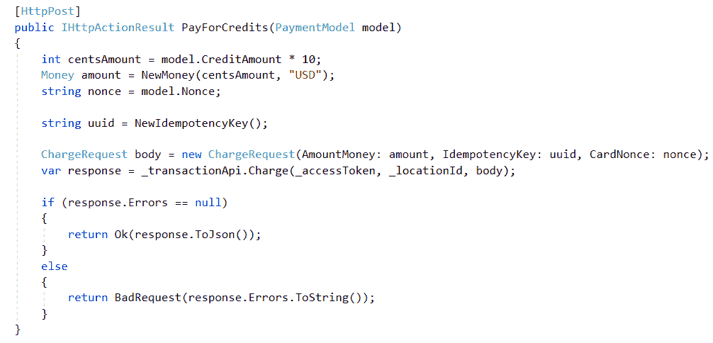

Code Snippet from Jukebox API PaymentController

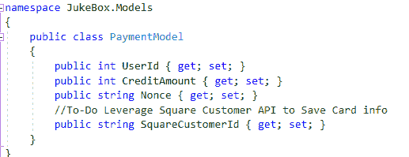

Code Snippet depicting API Payment Model

的。NET 库使得集成变得轻而易举。Squares library 包括一些调用，通过在 Square cloud 中保护用户的支付信息，同时保持 [PCI 合规性](https://squareup.com/guides/pci-compliance)，帮助 Jukebox 改善未来的用户体验。

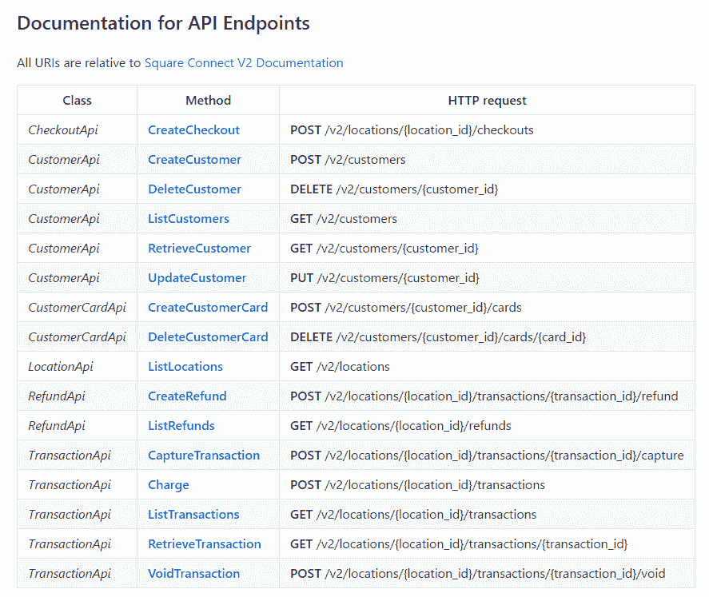

Square .NET Library API and Endpoint Mapping

**展望未来**

Eric 和 Damola 计划在应用程序中添加功能，通过短信或电子邮件本地共享内容，这样用户就可以轻松共享内容，而无需下载 Jukebox 应用程序来收听他们收到的剪辑。展望未来，他们计划在今年夏天将该应用程序发布到 app store，并评估其采用情况。

**与广场的更多冲击**

在讨论了 Jukebox 之后，Eric 和 Damola 还告诉了我们 Swyft 工作室的首批产品之一，名为 [CutUp](http://getcutup.com/) ，这是一个数字平台，旨在为世界各地的有色人种消除寻找头发护理服务的挫折感。这个想法来自他们的个人经历，当他们搬到一个新的地方时，遇到了找一个好理发师的挫折。他们意识到，许多服务于他们社区特定需求的理发师和发型师缺乏被潜在顾客容易找到的技术。

受 SXSW 黑客马拉松期间发现 Square API 的启发，Swyft Studios 现在希望通过为理发师和发型师提供在其移动应用程序中直接支付的能力来增强裁剪。他们喜欢授权小企业主使用他们的应用程序[接受任何形式的支付](https://squareup.com/pos/payments)的想法，Square 的硬件可以帮助他们扩大仅使用现金的交易。

我们喜欢与世界各地像 Eric 和 Damola 这样有创造力和热情的开发人员一起工作，我们迫不及待地想看到他们在未来开发的创造性应用程序。

有关我们的 API 以及它们能让您构建什么的更多信息，请查看我们的开发者门户上的[文档。](https://docs.connect.squareup.com/)