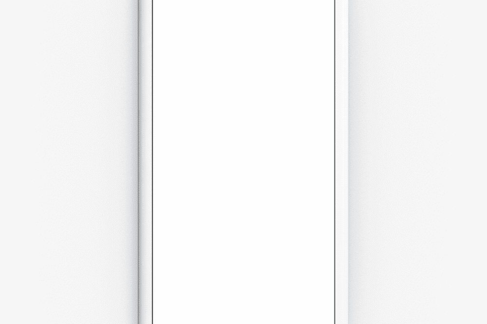
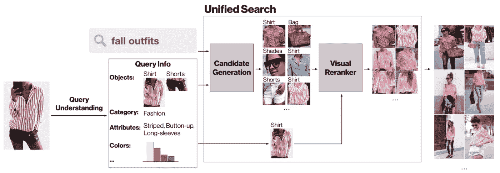
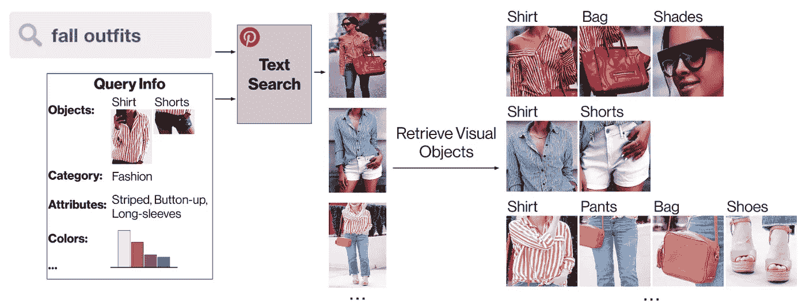
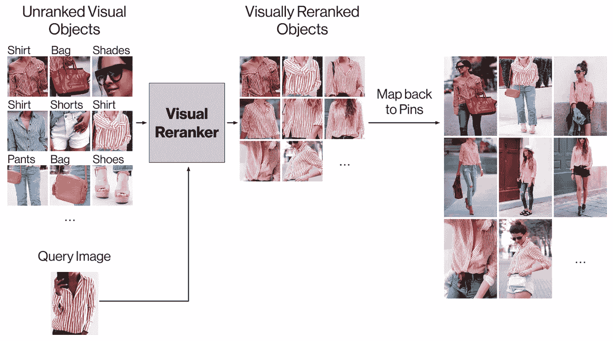
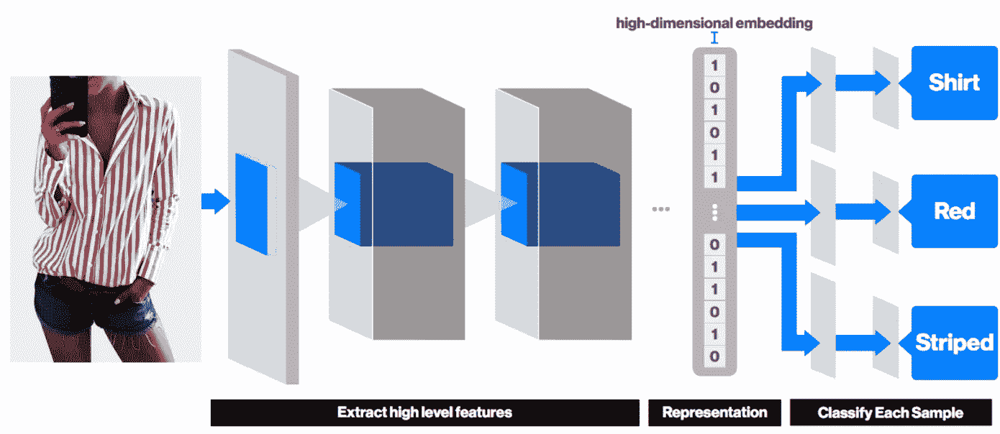
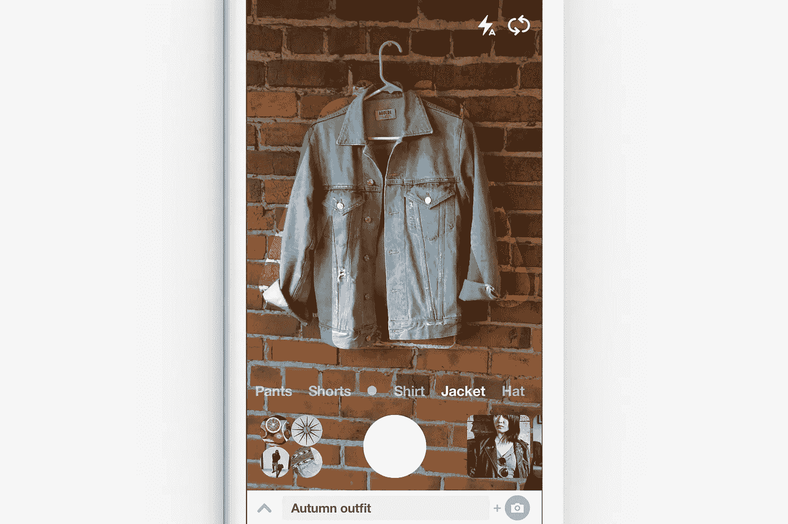

# 构建镜头你的样子:统一文本和相机搜索

> 原文：<https://medium.com/pinterest-engineering/building-lens-your-look-unifying-text-and-camera-search-1b2f3ef4e393?source=collection_archive---------1----------------------->

Eric Kim | Pinterest 视觉搜索工程师

今年 2 月，我们推出了 Lens T1，帮助品酒者使用我们应用程序中的摄像头搜索食谱、风格灵感和产品。从那时起，我们的团队一直在研究将 Lens 集成到 Pinterest 的新方法，以通过视觉搜索改善 Pinners 最喜欢的领域的发现——特别是时尚。我们了解到，有些搜索使用文本会更好，而有些使用图像会更好。但是对于某些类型的搜索，最好两者都有。这就是为什么我们建立了 Lens your Look，作为一个服装发现系统，它无缝地结合了文本和相机搜索，使 Pinterest 成为你的个人造型师。

今天发布的 Lens your Look 可以让你给衣柜里的一件衣服拍照，并将其添加到你的文本搜索中，查看由这件衣服激发的服装创意。这是多模态搜索的应用，我们集成了文本搜索和相机搜索，为 Pinners 提供更个性化的搜索体验。我们使用大规模的、以对象为中心的视觉搜索来为我们提供对每个引脚的视觉内容的更细粒度的理解。请继续阅读，了解我们是如何构建为您的形象提供动力的系统的！

## 架构:多模态搜索

Lens Your Look 是使用 Pinterest 的两个核心系统构建的:文本搜索和视觉搜索。通过将文本搜索和视觉搜索结合到一个统一的架构中，我们可以提供独特的搜索体验，如 Lens your Look。

统一搜索架构包括两个阶段:候选生成和可视化重新排序。

## 候选生成

在 Lens your Look experience 中，当我们检测到用户在时尚类别中进行了文本搜索时，我们会给他们一个选项，让他们也使用 Lens 拍摄一件衣服的照片。配备了文本查询和图像查询，我们利用 Pinterest 搜索来生成一组高质量的候选 pin。

在文本方面，我们利用[最新最棒的搜索基础设施](/@Pinterest_Engineering/manas-a-high-performing-customized-search-system-cf189f6ca40f)来生成一组匹配用户原始文本搜索查询的 pin。例如，如果用户搜索“秋季服装”，Lens your Look 会从我们的秋季服装别针资料库中找到候选结果。

我们还使用镜头照片中的视觉线索来帮助生成候选人。我们的视觉查询理解层输出关于照片的有用信息，例如视觉对象、显著颜色、语义类别、风格属性和其他元数据。通过将这些视觉信号与 Pinterest 的文本搜索基础设施相结合，我们能够为视觉排名器生成一组多样化的候选 pin。

## 视觉重新分级

接下来，我们根据查询图像对候选大头针进行可视化重新排序，例如 Pinner 的衣服。目标是确保返回结果的顶部包含与查询图像非常匹配的服装。Lens Your Look 利用了我们的[视觉对象检测系统](/@Pinterest_Engineering/introducing-automatic-object-detection-to-visual-search-e57c29191c30)，该系统允许我们根据图像中的对象进行视觉重新排序，例如特定的衣服，而不是整个图像。

通过视觉对象进行重新排序，我们可以更细致地了解每个大头针的视觉内容，这是 Lens your Look 取得成功的主要因素。有关视觉重新分级系统[的更多细节，请参见我们最近在 WWW 2017 大会上发表的论文](https://arxiv.org/abs/1702.04680)。

## 多任务训练:向我们的视觉模型教授时尚

现在我们有了基于对象的候选对象，我们为每个候选对象分配一个视觉相似性分数。虽然我们过去已经写过关于[迁移学习方法](https://arxiv.org/abs/1702.04680)的文章，但是我们需要一个更细粒度的表示来让你看起来更好。具体来说，我们的视觉嵌入必须模拟某些风格属性，如颜色、图案、纹理和材料。这允许我们的可视化重新排序系统在更细粒度的级别上返回结果。例如，红色条纹衬衫只会与其他红色条纹衬衫搭配，而不会与蓝色条纹衬衫或红色格子衬衫搭配。

为了实现这一点，我们增强了我们的深度卷积分类网络，以同时训练多个任务，同时保持共享的嵌入层。除了典型的分类或度量学习损失，我们还纳入了特定任务的损失，如预测时尚属性和颜色。这让网络认识到，条纹红色衬衫不应该和纯色海军蓝衬衫一样对待。我们的初步结果表明，合并多个训练损失导致视觉检索性能的整体改善，我们很高兴继续推进这一前沿。

## 结论

自 2015 年推出我们的第一款[视觉搜索产品](/@Pinterest_Engineering/introducing-a-new-way-to-visually-search-on-pinterest-67c8284b3684)以来，视觉搜索团队已经开发了我们的基础设施，以支持各种新功能，从在[三星 Galaxy S8](https://blog.pinterest.com/en/pinterest-visual-discovery-across-samsung-galaxy-s8) 中支持图像搜索，到今天推出的 Lens your Look。拥有一个最大且注释丰富的图像数据集，我们有无穷无尽的令人兴奋的想法来扩展和改进 Pinterest 视觉搜索。如果你想帮助我们建立创新的视觉搜索功能，如镜头你的样子，[加入我们](https://careers.pinterest.com/careers/engineering)！

*鸣谢:Lens Your Look 是 Pinterest 的合作成果。我们要感谢 Jen、Kelei Xu、、Josh Beal、Andrew Zhai、Dmitry Kislyuk、Jeffrey Harris、Steven Ramkumar 和 Laksh Bhasin 在本产品上的合作，感谢 Trevor Darrell 的建议以及视觉搜索团队的其他成员。*