# 构建微服务:反应式框架比较

> 原文：<https://medium.com/capital-one-tech/building-microservices-a-reactive-framework-comparison-fb49d8f3c8f4?source=collection_archive---------1----------------------->

我们大多数人都听说过关于[微服务](/capital-one-tech/delivering-microservices-for-enterprise-with-devops-fd253a6c2f1e)及其好处的传言。在之前的一篇文章中，我讨论了[微服务](/capital-one-tech/microservices-when-to-react-vs-orchestrate-c6b18308a14c)，以及在实现它们时什么时候编排与反应可能是有意义的。如果你选择反击，有很多选择。[反应式编程](/capital-one-developers/being-proactively-reactive-7e112abf1579)现在是一个热门话题，因为最近发布的 [Java 9](https://docs.oracle.com/javase/9/) 和 [Spring Framework 5](http://projects.spring.io/spring-framework/) 都内置了反应式功能。根据您的使用情况，反应式编程有许多附加选项。我倾向于把它们分成四个不同的类别。

*   可用于构建前端反应式应用的 Javascript 库，如 Angular.js、React.js、Ractive.js 或 Node.js。
*   具有自然反应能力的语言。我们提到了 Java 9 和 Spring Framework 5。其他几个(但不限于)包括 Clojure、Scala 和 GoLang。
*   运行在 JDK 之上并实现反应流规范(我们将稍后讨论)的反应式框架，如[项目反应器](https://projectreactor.io/)、 [Akka](https://akka.io/) 、 [Vert.x](http://vertx.io/) 和 [Ratpack](https://ratpack.io/) 。
*   反应式扩展也称为[react vex](http://reactivex.io/)，为许多语言提供了许多反应式功能，其中最流行的是 [RxJava](https://github.com/ReactiveX/RxJava/wiki)

这些类别都围绕着一些关键原则。2013 年，编写了[反应宣言](https://www.reactivemanifesto.org/)，确立了反应系统的四个关键原则: ***反应迅速、富有弹性、消息驱动*** 、 ***和弹性***

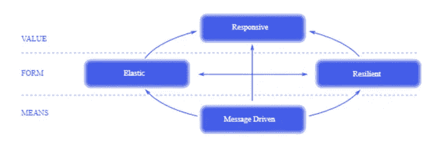

graphic from [*https://www.reactivemanifesto.org/*](https://www.reactivemanifesto.org/)

反应系统应该 ***反应灵敏*** 这意味着它们应该总是及时做出反应。他们应该是 ***有弹性的*** 这意味着当失败发生时他们应该保持响应。它们应该是 ***消息驱动的*** ，并支持异步消息传递，从而在组件之间建立一个边界(这有助于保持组件的解耦和位置透明)。最后，它们应该是 ***弹性的*** 以使组件能够根据工作负载需求动态伸缩，有效地利用资源。

2013 年末，关于[反应流](http://www.reactive-streams.org/)规范的另一项关键工作开始了。该规范的主要好处是它使实现它的反应库具有互操作性。具体来说，它允许跨库边界组合序列、取消和反压力，同时允许最终用户根据需要在实现之间切换。Reactive Streams 于 2015 年 4 月发布，2017 年成为 [JDK9](http://download.java.net/java/jdk9/docs/api/java/util/concurrent/Flow.html) 的一部分。有几个反应式框架运行在 JDK 之上并实现反应流规范，例如[项目反应堆](https://projectreactor.io/)、 [Akka](https://akka.io/) 、 [Vert.x](http://vertx.io/) 和 [Ratpack](https://ratpack.io/) 。

根据 openhub.net 的消息，Akka 在 2009 年首次提交，Vert.x 和 Reactor 在 2013 年，Ratpack 在 2014 年。Akka 和 Vert.x 是两种常用的反应式框架，运行在 JDK 之上。让我们更深入地了解这两者，并从以下几个方面对它们进行比较/对比:

*   微服务层级和内部通信
*   交付机制和恢复能力
*   开源视角和支持的语言
*   附加组件以及监控选项
*   微服务层级和内部通信

前面我提到了 Reactive Manifesto 的消息驱动原则，它支持微服务之间的异步消息传递。Akka 和 Vert.x 都提供了一种内置的消息传递机制，这种机制有相似之处，也有不同之处。首先，我们应该讨论层次结构范式，因为这是两者之间的一个显著差异。

Akka 是基于 [actor 模型](https://en.wikipedia.org/wiki/Actor_model)(由 Carl Hewitt 于 1973 年创建)构建的，它提供了一个处理并发计算的模型。在 Akka 中，执行单元是*演员*，你的微服务是作为演员构建的。actor 是轻量级的，每 GB 堆内存可以有几百万个 actor。actor 是一个封装了状态和行为的对象，它通过交换放入收件人邮箱中的消息来进行专门的通信。下图说明了这一点。

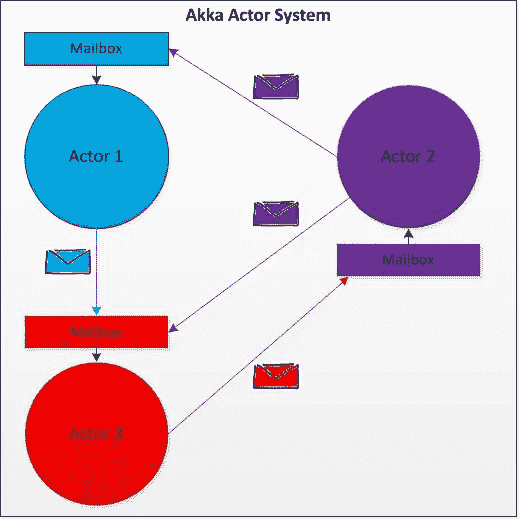

参与者是参与者系统的一部分，可以按层次结构排列。以下是在执行元系统中创建顶级执行元的示例:

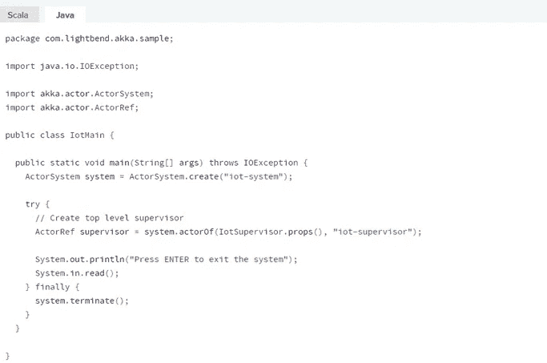

*Example is from* [*http://doc.akka.io/docs/akka/current/java/guide/tutorial_2.html*](http://doc.akka.io/docs/akka/current/java/guide/tutorial_2.html)

这意味着他们可以将任务分解并委派给儿童演员。子参与者受到监督，并将他们的失败委托给他们的父参与者。参与者可以以请求/响应模式(称为“询问”)或“一发即忘”模式(称为“告知”)向其他参与者发送消息。下面是一个提问的例子:

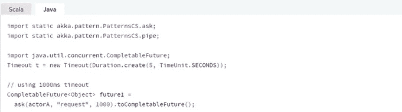

*Example is from* [*http://doc.akka.io/docs/akka/current/java/guide/tutorial_2.html*](http://doc.akka.io/docs/akka/current/java/guide/tutorial_2.html)

下面是一个例子:

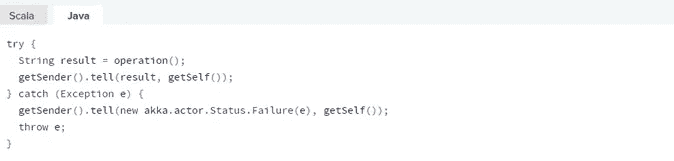

*Example is from* [*http://doc.akka.io/docs/akka/current/java/guide/tutorial_2.html*](http://doc.akka.io/docs/akka/current/java/guide/tutorial_2.html)

Vert.x 基于扁平的层次结构，不实现 actor 模型。相反，它基于事件循环模型。这是从 Akka 发出呼叫的第一个不同之处。

Vert.x 中的执行单位被称为*垂直*。它通过事件循环处理传入的事件，这在异步编程模型中很典型。下图说明了这一点:

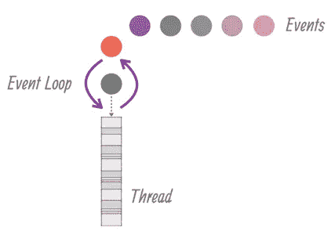

*Diagram is from* [*http://vertx.io/docs/guide-for-java-devs/*](http://vertx.io/docs/guide-for-java-devs/)

现在让我们看看代码:

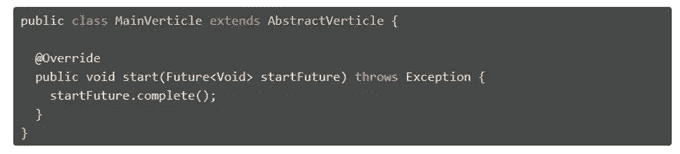

Example is from [http://vertx.io/docs/guide-for-java-devs/](http://vertx.io/docs/guide-for-java-devs/)

一个 verticle 被传递配置信息，并且可以被多次部署，如下所示:

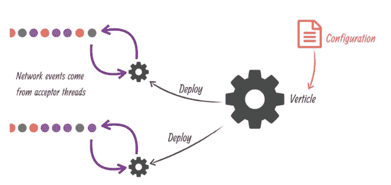

*Diagram is from* [*http://vertx.io/docs/guide-for-java-devs/*](http://vertx.io/docs/guide-for-java-devs/)

与 Akka 一样，Vert.x 通过事件总线提供了一种内部消息传递机制，这是垂直企业通过异步消息传递进行通信的方式:

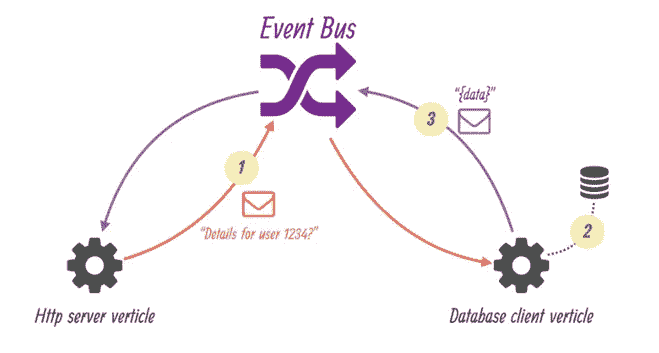

*Diagram is from* [*http://vertx.io/docs/guide-for-java-devs/*](http://vertx.io/docs/guide-for-java-devs/)

垂直对象如何通信是 Akka 和 Vert.x 之间的另一个区别。在 Akka 中，参与者之间的交互可以通过 ask 和 tell 方法进行，这是点对点的，这意味着参与者必须知道它想要向谁发送消息。Akka 也有现成的发布和订阅功能，它使用 EventStream 结构。发布和订阅意味着消息可以发布到事件流，而发布者不知道谁将接收消息。在这种方法中，参与者订阅等同于对象(在 Java 中)的通道，因此参与者指定一个特定的类来接收该类或子类的任何消息。

与 Akka 类似，Vert.x 也支持点对点和发布-订阅模式。区别在于 Vert.x 的消息传递是语言不可知的，使用 JSON 来传递数据，而 Akka 使用 Scala 或 Java 中的特定对象。此外，Akka 中的订户需要知道它想要接收的对象的类别，而在 Vert.x 中这是不必要的。下面是一个 Vert.x 示例:

## 注册事件处理程序:

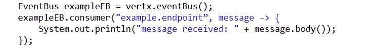

## 发件人:

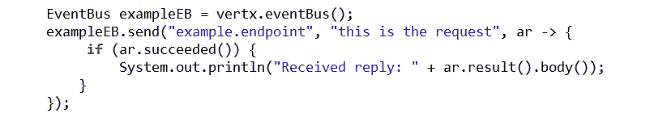

## 接收者:

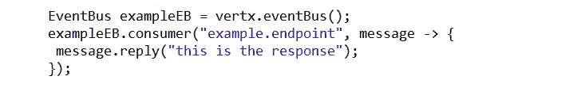

# 交付机制和恢复能力

有弹性是反应宣言中的另一个原则。从故障状态中恢复并在此期间继续响应的能力有多强？

Akka 提供了一个称为 Akka 持久性的附加组件，可用于存储参与者的内部状态。这使得参与者的状态可以在崩溃时恢复。Akka 持久性使用一种[事件源](https://martinfowler.com/eaaDev/EventSourcing.html)模式，将参与者状态的任何变化存储在事件存储中。事件存储中的事件是不可变的。通过重放事件存储中的事件来恢复参与者。

下面是一个来自 [akka.io 网站](http://doc.akka.io/docs/akka/current/java/persistence.html?_ga=2.152741241.1329911211.1506458416-1980958307.1504904637)的 Akka 持久性示例，该网站使用 *AbstractPersistentActor* 类支持事件源。persist 方法由一个 actor 使用，该 actor 扩展此类来持久保存和处理事件。该行为通过实现 *createReceiveRecover* 和 *createReceive 来定义。*

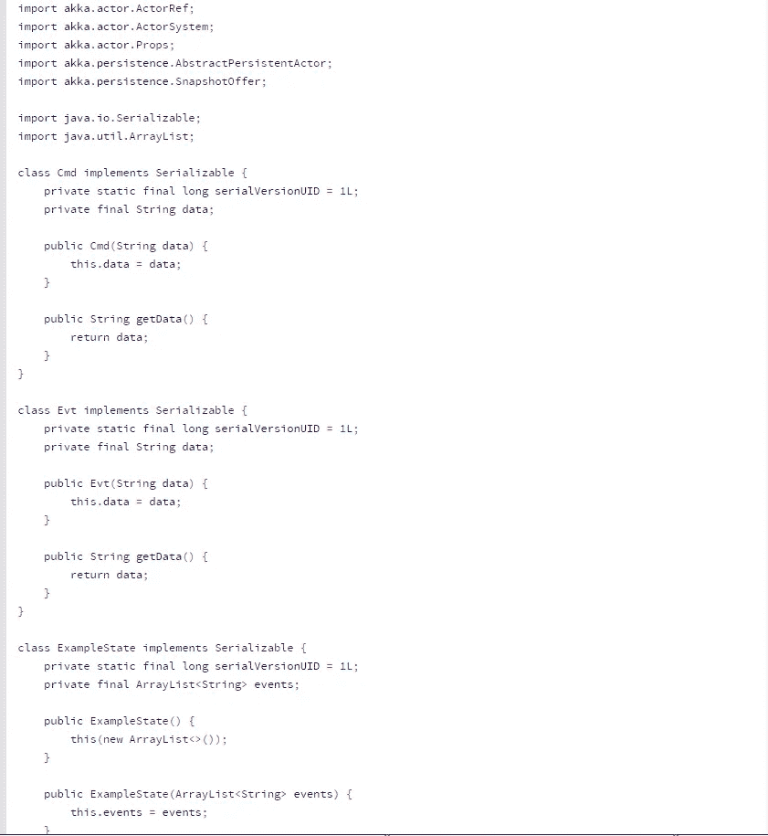

code example from [https://doc.akka.io/docs/akka/current/java/persistence.html](https://doc.akka.io/docs/akka/current/java/persistence.html)

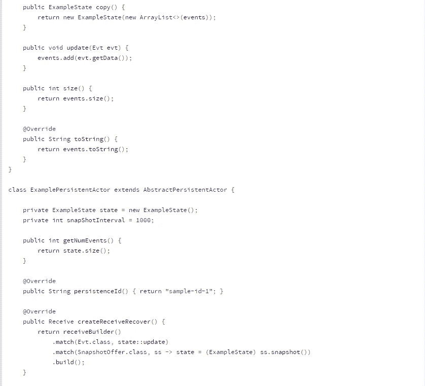

code example from [https://doc.akka.io/docs/akka/current/java/persistence.html](https://doc.akka.io/docs/akka/current/java/persistence.html)

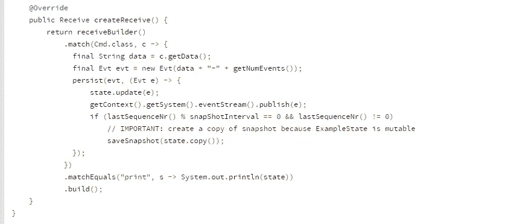

code example from [https://doc.akka.io/docs/akka/current/java/persistence.html](https://doc.akka.io/docs/akka/current/java/persistence.html)

目前，Vert.x 不提供开箱即用的恢复功能。从消息传递可靠性的角度来看，Akka 最多提供一次开箱即用，并且在利用 Akka 持久性时至少提供一次。与 Akka 类似，Vert.x 最多提供一次，但不提供至少一次的功能。最多一次意味着数据可能会丢失。至少传递一次保证消息至少传递一次。

从消息排序的角度来看，当一个参与者使用 tell 操作符直接向另一个参与者发送消息时，Akka 可以保证消息排序。如果有多个参与者向同一个目的地发送消息，它们将按发送者排序，但没有全局排序保证。Vert.x 还将按照从特定发件人发送消息的顺序将消息传递给任何处理程序。

# 开源视角和支持的语言

Akka 和 Vert.x 都是开源项目。Akka 支持 Scala 和 Java，而 Vert.x 支持 Java、Groovy、Ruby、JavaScript、Ceylon、Scala 和 Kotlin。

从成熟度的角度来看，Akka 已经存在了最长时间，从 2009 年开始，到本文发表时已经 8.5 岁了。Vert.x 始于 2013 年，本文发表时大约 4 岁。 [Lightbend](https://akka.io/team/) 是为 Akka 提供核心贡献者的主要公司，而 [RedHat](http://vertx.io/community/) 有许多全职开发人员在 Vert.x 上工作。

截至 2017 年 9 月，Akka 在 openhub.net 上的活跃程度非常高，去年有 1554 次提交，共有 601 名贡献者:

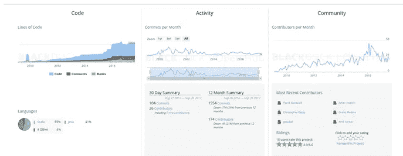

dashboard from openhub.net

Vert.x 也非常活跃，去年提交了 704 项，共有 124 名贡献者:

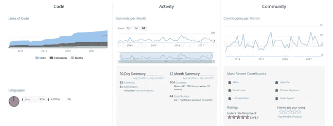

dashboard from openhub.net

# 附加组件和监控选项

前面我提到了 Akka 持久性组件，它可以用于额外的恢复功能。Akka 还具有附加组件，包括但不限于 Akka 集群和 Akka 流。Akka 聚类有助于参与者的位置透明性。如果一个参与者需要向另一个参与者发送消息，它使用 ID(而不是 actor ref ), Akka 集群负责将消息路由到正确的集群。如果一个参与者死亡，集群将负责重新启动该参与者。Akka Streams 是对 Akka actors 的流抽象。Dean Wampler 有一个比较 Akka 流和其他流技术的演示。他提到这有利于低延迟和复杂的事件处理用例。就每秒可以处理的消息数量而言，Akka Streams 可以处理非常大的容量，并且它对工作负载的并行化有很好的支持，但它不支持像 Spark 和 Flink 那样的分布式物化。对于 Vert.x，没有任何附加组件。

从监控的角度来看， [DataDog](https://www.datadoghq.com/lpg/?utm_source=Advertisement&utm_medium=GoogleAdsBrand&utm_campaign=GoogleAdsBrand-US&utm_content=Datadog&utm_keyword=%7Bkeyword%7D&utm_matchtype=%7Bmatchtype%7D&gclid=Cj0KCQjwjdLOBRCkARIsAFj5-GAnW2ktbP58e6Fq9n5IpGMhTmtVgfsGcwxYymvQ_qTQqXP5bx_rAAcaAqPAEALw_wcB) (见下面截图)和 [OpsClarity](https://developer.lightbend.com/docs/opsclarity/latest/home.html) 至少是监控 Akka 的两种选择。

*Diagram taken from* [*https://www.datadoghq.com/blog/monitor-lightbend/*](https://www.datadoghq.com/blog/monitor-lightbend/)

使用 Vert.x，有几个选项，包括 [Hawkular](http://vertx.io/docs/vertx-hawkular-metrics/java/) (见下面截图)和 [DropWizard](http://vertx.io/docs/vertx-dropwizard-metrics/java/) (JMX)。

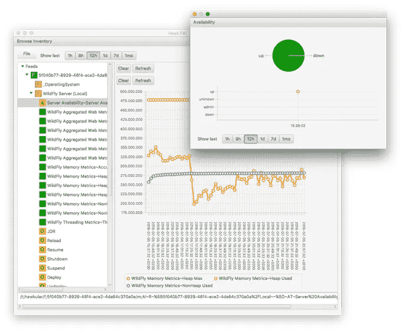

*Diagram taken from* [*https://github.com/pilhuhn/hawkfx*](https://github.com/pilhuhn/hawkfx)

# 摘要

在本文中，我们讨论了反应式编程的一些历史背景，同时也触及了 Akka 和 Vert.x 之间的一些相似之处和不同之处。

*   更喜欢为您的微服务使用参与者层次模型
*   擅长使用特定于语言的对象在参与者之间传递消息数据
*   需要 Akka 持久性附带的恢复和持久性功能，以便在崩溃时可以持久化和恢复参与者的内部状态
*   如果您需要至少一次交付(Akka 持久性)

一般来说，Vert.x vs. Akka 的一些原因包括:

*   更喜欢使用扁平的层次结构，而不是 Actor 模型
*   在传递消息数据时，更喜欢使用非特定语言的 JSON，而不是特定语言的对象
*   需要对 Scala 和 Java 之外的语言提供更广泛的支持(例如 Groovy、Ruby、JavaScript、Ceylon、Kotlin)
*   擅长最多一次传递(这可能导致消息丢失)

你的项目的具体需求将帮助你决定哪一个是你的正确选择，我鼓励你在每个项目上做一个原型。好消息是——两者都实现了 Reactive Streams 规范，这意味着如果该选项对您的用例有意义，您可以一起使用它们。

*注意—本文中的分析基于 Akka 2.5.4 和 Vert.x v3.4.2*

*声明:这些观点仅代表作者个人观点。除非本帖中另有说明，否则 Capital One 不属于所提及的任何公司，也不被其认可。使用或展示的所有商标和其他知识产权都是其各自所有者的所有权。本文为 2017 首都一。*

# 相关:

[对比开源 BPM 项目](/capital-one-developers/comparing-and-contrasting-open-source-bpm-projects-196833f23391)

[微服务——何时应对，何时协调](/capital-one-developers/microservices-when-to-react-vs-orchestrate-c6b18308a14c)

[主动做出反应](/capital-one-developers/being-proactively-reactive-7e112abf1579)

