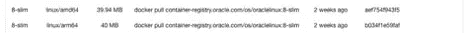

# 用波德曼在 OCI 建造多建筑集装箱

> 原文：<https://medium.com/oracledevs/building-multi-architecture-containers-on-oci-with-podman-67d49a8b965e?source=collection_archive---------0----------------------->


Photo by Albin Berlin: [https://www.pexels.com/photo/black-sail-ship-on-body-of-water-906982/](https://www.pexels.com/photo/black-sail-ship-on-body-of-water-906982/)

我们中的许多人已经开始使用波德曼。无论是希望尽可能多地利用开源工具，还是喜欢更容易的安装(例如在 Oracle Linux 8 上安装 Podman [] T1 ), Podman 对于许多开发人员来说都是构建和运行容器的可行解决方案。这是该主题的延续，我们已经讨论了在多架构世界中使用容器的[高级含义](https://blogs.oracle.com/developers/post/success-with-containers-in-a-multi-architecture-world)以及如何使用 Docker 构建[多架构容器。本文将讨论使用 Podman 构建多架构容器的实用性。](/@timclegg/building-multi-architecture-containers-for-oci-with-docker-59cea3b5a8c4)

# 先决条件

我假设您有一个 [OCI 账户](https://www.oracle.com/cloud/sign-in.html)，并且创建了一个名为 *hello-world* 的 OCI 容器库(OCIR)。如果您想跟随并亲自尝试，请确保您有这个存储库。参见 [OCI 文档](https://docs.oracle.com/en-us/iaas/Content/Registry/Tasks/registrycreatingarepository.htm)了解更多关于如何创建库的信息。

对于这个场景，我在 Oracle Linux 8(更确切地说是 8.5)上使用了 Podman v3.4.2。不同的版本可能会导致不同的结果。

你需要做的第一件事就是让波德曼登录 OCIR:

```
$ podman login phx.ocir.io
```

确保将上述主机名更新到您正在使用的任何地区！请参见[区域可用性](https://docs.oracle.com/en-us/iaas/Content/Registry/Concepts/registryprerequisites.htm#regional-availability)了解特定区域的 URL。 [OCI 集装箱注册文档](https://docs.oracle.com/en-us/iaas/Content/Registry/Tasks/registrypushingimagesusingthedockercli.htm)对此有更详细的描述，你也可以在 [OCI 文档](https://docs.oracle.com/en-us/iaas/Content/General/Concepts/regions.htm)中找到[区域键](https://docs.oracle.com/en-us/iaas/Content/General/Concepts/regions.htm)。

要使用的用户名是 <namespace>/ <username>(或者如果您使用的是 IDCS，<namespace>/oracleidentitycloudservice/<username>)。密码将是与您的帐户相关联的身份验证令牌。如果这看起来有点陌生或令人困惑，请看一下 [OCI 文档](https://docs.oracle.com/en-us/iaas/Content/Registry/Tasks/registrypushingimagesusingthedockercli.htm)以了解更多细节。</username></namespace></username></namespace>

完成本练习后，您可以使用以下命令退出 OCIR:

```
$ podman logout phx.ocir.io
```

# 建造集装箱

我们将使用一个超级基本的 docker 文件:

```
FROM container-registry.oracle.com/os/oraclelinux:8-slim
CMD echo “Hello world!”
```

这里没什么特别的，只是一个简单的例子。为了将重点放在容器构建上(而不是特定于语言的复杂性)，我完全省略了任何特定的应用程序二进制文件。

为了尽职调查，让我们确认基础映像在我们将要构建的两种架构中都可用。查看该容器的 [Oracle 容器注册中心](https://container-registry.oracle.com/)(要了解更多信息，请点击 *OS* ，然后点击 *oraclelinux* )，我们可以看到该容器支持两个平台(这两个平台都是我们想要构建的平台):



Sample screenshot of oraclelinux:8-slim containers and their respective platforms.

检查这一点总是一个好主意，因为您的基础映像应该存在于您将要构建的不同目标体系结构中。

现在我们需要创建两个容器映像(每个架构一个:arm64 和 amd64):

```
$ podman build --platform linux/arm64/v8 -t phx.ocir.io/<namespace>/hello-world:v1.0.0-linux-arm64 .
  <omitted for brevity>$ podman build --platform linux/amd64 -t phx.ocir.io/<namespace>/hello-world:v1.0.0-linux-amd64 .
  <omitted for brevity>
```

*— platform* 参数用于指定所需的目标架构(构建容器的架构)。对于上下文来说，一个平台通常由操作系统、架构和变体(可选的，并且经常被排除在外)组成，每一个都用正斜杠(/)分隔。

为了确认一切正常，请看一下构建的容器图像:

```
$ podman image ls
REPOSITORY                                    TAG                 IMAGE ID      CREATED         SIZE
phx.ocir.io/<namespace>/hello-world         v1.0.0-linux-amd64  de9a0c2f01c8  29 seconds ago  114 MB
phx.ocir.io/<namespace>/hello-world         v1.0.0-linux-arm64  0f3a0bc46798  43 seconds ago  136 MB
container-registry.oracle.com/os/oraclelinux  8-slim              b7c162609f52  6 days ago      114 MB$ podman image inspect phx.ocir.io/<namespace>/hello-world:v1.0.0-linux-amd64 | grep Arch
        "Architecture": "amd64",$ podman image inspect phx.ocir.io/<namespace>/hello-world:v1.0.0-linux-arm64 | grep Arch
        "Architecture": "arm64",
```

上面的输出有点混乱，但是如果你仔细观察足够长的时间，你会发现有两个 *hello-world* 容器。两者都被检查并确认为合适的架构(耶！)，所以我们已经准备好将图像推送到 OCI 注册中心(OCIR)。

```
$ podman push phx.ocir.io/<namespace>/hello-world:v1.0.0-linux-amd64
  <omitted for brevity>$ podman push phx.ocir.io/<namespace>/hello-world:v1.0.0-linux-arm64
  <omitted for brevity>
```

我们现在在 OCIR 有两幅图像。为了便于使用(运行)，我们需要创建一个清单。

# 创建清单

下面是如何使用 Podman 创建清单:

```
$ podman manifest create \
  phx.ocir.io/<namespace>/hello-world:v1.0.0 \
  phx.ocir.io/<namespace>hello-world:v1.0.0-linux-arm64 \
  phx.ocir.io/<namespace>hello-world:v1.0.0-linux-amd64$ podman manifest push phx.ocir.io/<namespace>/hello-world:v1.0.0 docker://phx.ocir.io/<namespace>/hello-world:v1.0.0$ docker manifest rm phx.ocir.io/<namespace>/hello-world:v1.0.0
```

第一个命令创建清单(hello-world:v1.0.0)，然后向其中添加两个容器(hello-world:v1.0.0-linux-amd64 和 hello-world:v1.0.0-arm64)。

第二个命令将清单推送到 OCIR。

为了开心，我们来看看清单:

```
$ podman manifest inspect phx.ocir.io/<namespace>/hello-world:v1.0.0
{
    "schemaVersion": 2,
    "mediaType": "application/vnd.docker.distribution.manifest.list.v2+json",
    "manifests": [
        {
            "mediaType": "application/vnd.oci.image.manifest.v1+json",
            "size": 569,
            "digest": "sha256:de9a0c2f01c8...",
            "platform": {
                "architecture": "amd64",
                "os": "linux"
            }
        },
        {
            "mediaType": "application/vnd.oci.image.manifest.v1+json",
            "size": 569,
            "digest": "sha256:0f3a0bc46798...",
            "platform": {
                "architecture": "arm64",
                "os": "linux"
            }
        }
    ]
}
```

一旦我们将它推送到 OCIR，我们真的不需要将它保存在本地缓存中，因此我们可以删除它:

```
$ podman manifest rm phx.ocir.io/<namespace>/hello-world:v1.0.0
```

# 结论

波德曼是一个伟大的工具。它支持我们有效构建多架构容器映像(和清单)所需的东西，使它成为我们工具箱中的一个有价值的工具！

本系列还有更多内容，我们将探索如何使用 Buildah 做同样的事情。敬请关注…

有问题吗？顺便来看看我们的[公开讨论](https://bit.ly/devrel_slack)！

请记住，您可以随时使用我们的免费等级免费试用这个[。](https://signup.cloud.oracle.com/?language=en&sourceType=:ex:tb:::::&SC=:ex:tb:::::&pcode=)