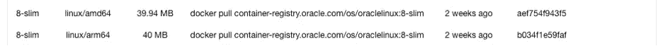

# 用 Buildah 构建多架构容器

> 原文：<https://medium.com/oracledevs/building-multi-architecture-containers-with-buildah-44ed100ec3f3?source=collection_archive---------0----------------------->


Photo by Tom Fisk: [https://www.pexels.com/photo/aerial-photography-of-container-van-lot-3063470/](https://www.pexels.com/photo/aerial-photography-of-container-van-lot-3063470/)

最近，我一直在研究如何成功地构建多架构容器(有人称之为系列)。首先我们看了一下涉及到的高层概念，然后深入到 T2 如何使用 Docker 构建多架构容器。接下来我们看了看[如何使用 Podman](/@timclegg/building-multi-architecture-containers-on-oci-with-podman-67d49a8b965e) 做同样的事情。现在我们将看看如何使用另一个工具来完成这个任务: [Buildah](https://buildah.io) 。你会问为什么？因为我们可以！不，实际上，拥有多种可用工具是有益的，因为我们可能有偏好或要求使用一种工具而不是另一种。当然还有其他方法来构建图像，但是除了本系列的最后一篇文章之外，我们不会更深入地研究这个主题(至少在此时)。

# 先决条件

如果你想跟进，你需要一个 [Oracle 云基础设施(OCI)账户](https://signup.cloud.oracle.com)和一个名为 *hello-world* 的 OCI 容器库(OCIR)。参见 [OCI 文档](https://docs.oracle.com/en-us/iaas/Content/Registry/Tasks/registrycreatingarepository.htm)了解更多关于如何创建存储库的信息。

对于这个场景，我使用了运行在 Oracle Linux 8.5 上的 Buildah v1.23.1。要查看您正在运行的 Oracle Linux 版本，请看一下 *cat /etc/os-release* 的输出。不同的版本可能会导致不同的结果。

我们之前看到的工具(Docker 和 Podman)对不同的操作系统都有相当不错的支持。不幸的是，Buildah 是一个“专属于 Linux”的工具。您可能希望在一个 Oracle Linux OCI 实例上运行这个程序。

# 入门指南

首先，我们需要了解如何使用 Buildah 认证(登录和注销)OCIR。登录(验证)到 OCIR 应该和我们用其他工具做的事情很相似:

```
$ buildah login phx.ocir.io
```

您需要为您正在使用的 OCI 地区使用正确的地区主机名。请参见[区域可用性](https://docs.oracle.com/en-us/iaas/Content/Registry/Concepts/registryprerequisites.htm#regional-availability)了解特定区域的主机名。 [OCI 集装箱注册文档](https://docs.oracle.com/en-us/iaas/Content/Registry/Tasks/registrypushingimagesusingthedockercli.htm)更详细地讨论了这一点，以及 [OCI 文档](https://docs.oracle.com/en-us/iaas/Content/General/Concepts/regions.htm)中的区域密钥。

确保您提供的用户名使用正确的格式。用户名的格式应该是 <namespace>/ <username>(或者如果您使用的是 IDCS，<namespace>/oracleidentitycloudservice/<username>)。密码将是与您的帐户相关联的身份验证令牌。如果这看起来有点陌生或令人困惑，请看一下 OCI 文档[以了解更多细节。](https://docs.oracle.com/en-us/iaas/Content/Registry/Tasks/registrypushingimagesusingthedockercli.htm)</username></namespace></username></namespace>

注销 OCIR 很容易完成:

```
$ buildah logout phx.ocir.io
```

现在我们可以与 OCIR 交互，让我们学习如何使用 Buildah 构建多拱容器！

# 建造集装箱

和以前的文章一样，我们将保持一个简短的 Dockerfile 文件:

```
FROM container-registry.oracle.com/os/oraclelinux:8-slim

CMD echo "Hello world!"
```

这是故意的。我们需要把重点放在容器构建上，而不是特定语言的复杂性上。

我们在以前的文章中已经这样做了，但是为了彻底，我们将检查以确保基础映像对于我们将要构建的两种架构(arm64 和 amd64)都可用。查看该容器的 [Oracle 容器注册表](https://container-registry.oracle.com/)(您需要点击 *OS* ，然后点击 *oraclelinux* 来查看我在下面展示的内容)，我们可以看到有两个平台受支持(这两个平台都是我们想要构建的):



总是检查以确保您有一个用于您将要构建的不同目标体系结构的基础映像！

使用 Buildah 时，有两种方法可以构建容器多拱容器映像。我称之为“简单路径”(批处理)和手动方法。

所以我就不拿 batched (easy)的方法来吊你的“胃口”了，先来看看怎么手动做事吧。

# 手动方法

## 建造集装箱

我们首先创建两个容器映像(每个架构一个:arm64 和 amd64):

```
$ buildah build --pull --platform linux/arm64/v8 -t phx.ocir.io/<namespace>/hello-world:v1.0.0-linux-arm64 .
  <omitted for brevity>$ buildah build --pull --platform linux/amd64 -t phx.ocir.io/<namespace>/hello-world:v1.0.0-linux-amd64 .
  <omitted for brevity>
```

*— platform* 参数用于指定所需的目标体系结构(将为其构建容器的体系结构)。一个平台通常由操作系统、CPU 架构和一个架构变体(这是可选的，并且经常被排除在外)组成，每个由正斜杠(/)分隔。

让我们检查我们刚刚构建的容器，寻找架构以确保它是正确的:

```
$ buildah build --pull --platform linux/amd64 -t phx.ocir.io/<namespace>/hello-world:v1.0.0-linux-amd64 .
  <omitted for brevity>$ buildah inspect phx.ocir.io/<namespace>/hello-world:v1.0.0-linux-arm64 | grep \"architecture\"
        "architecture": "arm64",
        "architecture": "arm64",$ buildah inspect phx.ocir.io/<namespace>/hello-world:v1.0.0-linux-amd64 | grep \"architecture\"
        "architecture": "amd64",
        "architecture": "amd64",
```

从上面我们可以看到，我们构建的两个容器都有正确的架构。太棒了。

是时候将图像推送到 OCI 注册中心(OCIR)了:

```
$ buildah push phx.ocir.io/<namespace>/hello-world:v1.0.0-linux-arm64
  <omitted for brevity>$ buildah push phx.ocir.io/<namespace>/hello-world:v1.0.0-linux-amd64
  <omitted for brevity>
```

随着我们的图像被推送到 OCIR，我们能够运行它们。问题是，我们不想为执行环境 CPU 架构调用每个变体。换句话说，如果我在一个 OCI A1 (Arm)实例上，我不想说 *docker 运行 phx.ocir.io/<命名空间>/hello-world:v 1 . 0 . 0-Linux-Arm 64*和当在 x86_64(又名 amd64) OCI 实例(如 E4 实例形状)上运行 *docker 运行 phx.ocir.io/<命名空间>/hello-world:v 1 . 0 . 0-Linux-amd64*。这有点乱。这在 Kubernetes (K8s)清单中是不可管理的。相反，我希望能够说 *docker 运行 phx.ocir.io/<名称空间> /hello-world:v1.0.0* ，并让它获得将要运行容器的架构的正确映像。这就是清单解决的问题。

## 创建清单

使用 Buildah 制作清单非常简单:

```
$ buildah manifest create phx.ocir.io/<namespace>/hello-world:v1.0.0 \
  phx.ocir.io/<namespace>/hello-world:v1.0.0-linux-arm64 \
  phx.ocir.io/<namespace>/hello-world:v1.0.0-linux-amd64
  <omitted for brevity>$ buildah manifest push phx.ocir.io/<namespace>/hello-world:v1.0.0 docker://phx.ocir.io/<namespace>/hello-world:v1.0.0
  <omitted for brevity>$ buildah manifest rm phx.ocir.io/<namespace>/hello-world:v1.0.0
  <omitted for brevity>
```

第一个命令创建清单(hello-world:v1.0.0)，向其中添加两个容器(hello-world:v1.0.0-linux-amd64 和 hello-world:v1.0.0-arm64)。

在第二个命令中，Buildah 将新创建的清单推送给 OCIR。

最后，为了保持整洁，我们删除了清单的本地(缓存)副本。

为了验证清单看起来是否良好，我们来检查一下:

```
$ buildah manifest inspect phx.ocir.io/<namespace>/hello-world:v1.0.0
{
    "schemaVersion": 2,
    "mediaType": "application/vnd.docker.distribution.manifest.list.v2+json",
    "manifests": [
        {
            "mediaType": "application/vnd.oci.image.manifest.v1+json",
            "size": 722,
            "digest": "sha256:abc123...",
            "platform": {
                "architecture": "arm64",
                "os": "linux"
            }
        },
        {
            "mediaType": "application/vnd.oci.image.manifest.v1+json",
            "size": 722,
            "digest": "sha256:xyz123...",
            "platform": {
                "architecture": "amd64",
                "os": "linux"
            }
        }
    ]
}
```

万一需要(或想要)，有一种手工完成的方法是很棒的。让我们试试分批，或者我喜欢称之为“简单”的方法。

# 分批(简易)方法

Buildah 可以负责为每个期望的目标平台构建容器以及清单，所有这些都在一个命令中完成:

```
$ buildah build --jobs=2 --platform=linux/arm64/v8,linux/amd64 --manifest phx.ocir.io/<namespace>/hello-world:v1.0.2 .
  <omitted for brevity>
```

下一步，我们需要将它推广到 OCIR:

```
$ buildah push phx.ocir.io/<namespace>/hello-world:v1.0.2
  <omitted for brevity>
```

虽然这里没有显示，但是如果您想查看构建的图像(将此视为“额外学分”)，请查看*buildah images–all*的输出。

对于咧嘴笑，我们可以看看清单:

```
$ buildah manifest inspect phx.ocir.io/<namespace>/hello-world:v1.0.2
{
    "schemaVersion": 2,
    "mediaType": "application/vnd.docker.distribution.manifest.list.v2+json",
    "manifests": [
        {
            "mediaType": "application/vnd.oci.image.manifest.v1+json",
            "size": 715,
            "digest": "sha256:abc123...",
            "platform": {
                "architecture": "amd64",
                "os": "linux"
            }
        },
        {
            "mediaType": "application/vnd.oci.image.manifest.v1+json",
            "size": 715,
            "digest": "sha256:xyz123...",
            "platform": {
                "architecture": "arm64",
                "os": "linux",
                "variant": "v8"
            }
        }
    ]
}
```

平台看起来很棒！有多简单？

# 结论

虽然 Buildah 不是最容易移植的工具(对 Linux 来说)，但它非常强大，可以让生活变得非常简单。能够在一个命令中构建容器*和*清单是非常强大的。

本系列没有试图穷尽我们所研究的工具的每一个角落(或者多架构容器的主题)。我真的希望它对理解在多架构世界中构建和使用容器的基础知识有所帮助。

在结束这一系列文章时，我想特别感谢我的同事阿苏，他在为我同行评审这一系列文章时帮了我很大的忙。直到下一次，保持位流！

当然，你可以在我们的[免费层](https://signup.cloud.oracle.com/?language=en&sourceType=:ex:tb:::::&SC=:ex:tb:::::&pcode=)上试试这个。

想讨论一下吗？加入我们[公共休闲频道](https://bit.ly/devrel_slack)的对话吧！