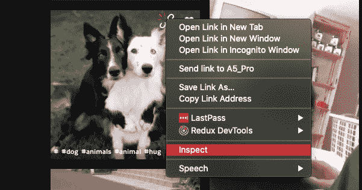

# 构建我的 Github 操作以向 PRs 交付 Doggoes

> 原文：<https://medium.easyread.co/building-my-github-action-to-deliver-doggoes-to-prs-d9cd5d4a42d0?source=collection_archive---------7----------------------->

## 因为谁不想好男生一推就出现呢？


期待已久的 GitHub Action 功能终于推出测试版，并准备在每个存储库中推出。GitHub 甚至在整个三月组织了[黑客马拉松](https://githubhackathon.com/)，鼓励人们创造更多令人敬畏和有用的行为。在浏览提交的内容时，我发现[是一个很酷的 GitHub 动作](https://github.com/ruairidhwm/action-cats),可以在拉取请求上发布 cat gifs。大声说出他的酷想法👏👏👏。

只有采取行动把狗狗们交给我们的公关，这才是对狗狗们的公平。那一刻我清楚地知道我的下一个 Github 行动计划会是什么。该去工作了。


# 创建 GitHub 动作的要点

[GitHub 动作](https://help.github.com/en/actions/getting-started-with-github-actions/about-github-actions)基本上是(与❤️一起)预制的工作单元，用于 GitHub 工作流(想想 [Travis](https://travis-ci.org/) 的构建)。Github 动作可以用 [Docker 容器](https://help.github.com/en/actions/building-actions/creating-a-docker-container-action)或 [JS/TS 脚本](https://help.github.com/en/actions/building-actions/creating-a-javascript-action)构建。用 JS/TS 创建 GitHub 动作的一个优点是可以从 [GitHub 工具包](https://github.com/actions/toolkit)中获得现成的模块。有了这样的集成支持，连接 GitHub 服务就容易多了(拜托🙄谁想要编写`**curl**`命令来进行 API 调用)。用 [TypeScript 动作模板](https://github.com/actions/typescript-action)就很明显了。有了这个决定，让我们开始写动作狗。

## 主运行文件

在 JS/TS GitHub 动作中，工作负载将从一个主入口点启动(考虑运行`**node src/index.js**`来启动 web 应用程序的一个节点进程，等等)。对于行动狗，这是我的主程序的基本设置

```
import * as core from "@actions/core";
import * as github from "@actions/github";
import { generate } from "./doggo/generator";(async function run(): Promise<void> {
  try {
    const ctx = github.context;
    if (!ctx.payload.pull_request) {
      throw new Error("Not in the context of a PR!");
    } const ghCli = new github.GitHub(core.getInput("github-token"));
    const doggo = generate();
    ghCli.issues.createComment({
      ...ctx.repo,
      issue_number: ctx.payload.pull_request.number,
      body: ``
    });
  } catch (e) {
    core.setFailed(e.message);
  }
})();
```

在一个可以触发 GitHub 工作流的事件期间，我们被提供了一个可以通过`**@actions/github**`模块访问的上下文对象。使用它，我能够检查我的有效载荷是否来自于一个`**pull_request**`，否则拒绝。接下来，我需要发布一个带有 doggo gif 内容的相应 pull 请求的注释。假设我的 doggo 生成器(我将在下一节中解释)工作正常，我可以检索 doggo gif 的 URL，在 pull 请求上创建注释非常简单，因为我只需要从我们的上下文对象和 PR 的编号中传递回购信息。此外，万一我们在这些操作中得到任何错误，调用`**core.setFailed(e.message)**`将会用错误消息将构建标记为失败。

## 该死的发电机

经过大量研究，我打算使用一个公共 API 来获得随机的 doggo gifs，但我找不到一个公共的 API(如 [dog.ceo](https://dog.ceo/) )并且也提供 gif(如 [GIPHY](https://giphy.com/) )。因为我没有办法安全地存储 GIPHY API 密匙，以便在 action-dogs 中使用，所以我回到了静态 JSON 数组的好方法。

想知道我是如何获得充满 doggo awesomeness 的数组(来自❤️ [吉菲](https://giphy.com/) ❤️)而没有在这个过程中生成任何 API 密匙吗？我实际上去了 GIPHY 网站，搜索 doggoes，向下滚动，直到在打开我的控制台之前呈现了大量的“giffy-boys”



有了这几行 JS

```
const dogsData = [];
document
  .querySelectorAll("a._2SwDiFPqIlZmUDkxHNOeqU")
  .forEach(e => dogsData.push(e.href));
var dataStr =
  "data:text/json;charset=utf-8," +
  encodeURIComponent(JSON.stringify(dogsData));
var dlAnchorElem = document.createElement("a");
dlAnchorElem.setAttribute("href", dataStr);
dlAnchorElem.setAttribute("download", "dogs.json");
dlAnchorElem.click();
```

它基本上从搜索结果页面上的所有“复制链接”元素中获取“href”值，将它们流式传输到一个 JSON 数组，并填充到一个文件中供我“下载”，“生成”只是从数组中随机选取一个 URL。

```
import dogs from "./dogs.json";export function generate(): string {
  return dogs[Math.floor(Math.random() * dogs.length)];
}
```

## 测试

我用 jest 为我的 doggo 生成器写了一个单元测试(但实际上主要是作为有趣描述的一个途径)。

```
import { generate } from "../../src/doggo/generator";describe("doggo generator", () => {
  test("to return a good boy", () => {
    Math.random = jest.fn().mockReturnValue(0);
    const good = "https://media3.giphy.com/media/mCRJDo24UvJMA/giphy.gif";
    const boy = generate();
    expect(boy).toBe(good);
  });
});
```

但是真正的测试是使用`**action-dogs**`本身的工作流(是的，您可以在它自己的 repo 上使用 GitHub 动作🤯).

```
name: "doggo"on: pull_requestjobs:
  build:
    runs-on: ubuntu-latest
    steps:
      - uses: actions/checkout@v2
      - uses: stanleynguyen/action-dogs@master
        with:
          github-token: ${{ secrets.GITHUB_TOKEN }}
```

现在我可以看到`**action-dogs**`和[一个公关样本](https://github.com/stanleynguyen/action-dogs/pull/1)一起工作。加油🙌🙌🙌！！现在我可以安全地在 GitHub Marketplace 上发布它了。

# Outtro

这就是我为了娱乐和学习而创作`**action-dogs**` 的故事。你可以在 [GitHub](https://github.com/stanleynguyen/action-dogs) 上找到源代码(因为它还能在哪里🤷‍♂️)和[市场](https://github.com/marketplace/actions/action-dogs)上的`**action-dogs**`。