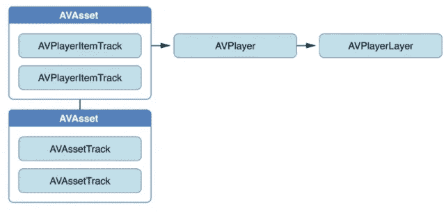
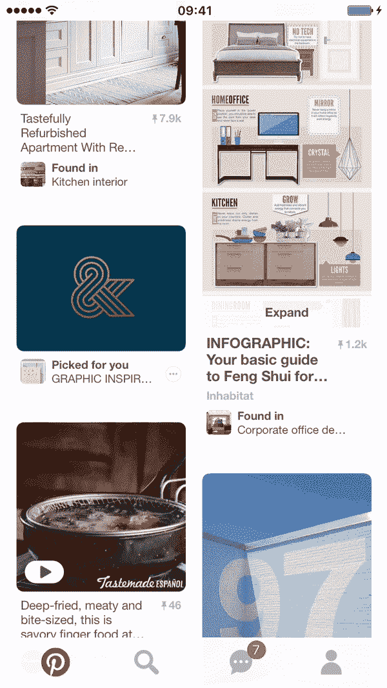
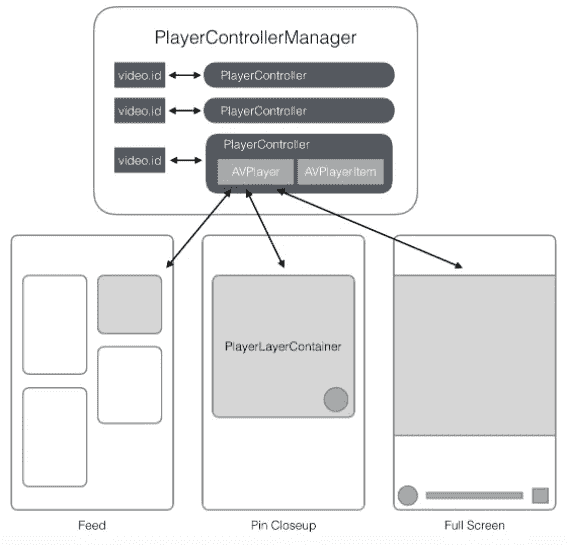
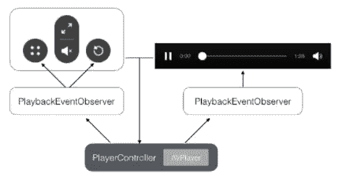
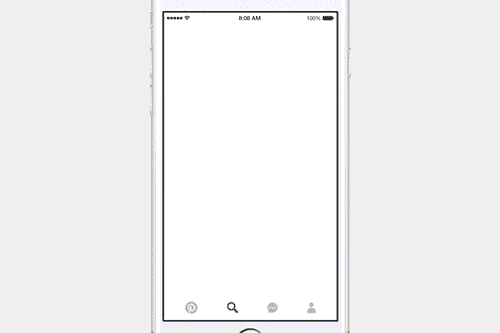

# 构建本机视频引脚

> 原文：<https://medium.com/pinterest-engineering/building-native-video-pins-7ff89ad3ec33?source=collection_archive---------2----------------------->

柳斌| Pinterest 产品工程师

每天都有数十亿视频在互联网上被观看，但 Pinterest 上的视频是独一无二的。在 Pinterest 上，你总是可以保存网络上的视频，在 2013 年，我们可以在你点击时在 Pin 上播放它们。视频帮助人们可视化如何将想法带入生活，这使它们成为 Pinterest 的完美媒介。事实上，我们发现在智能手机上观看视频的人在 Pinterest 上看到视频时采取行动的可能性是在其他应用程序上看到视频的两倍多。

今天，随着我们第一个本地视频播放器的推出，我们正在让在 Pinterest 上观看视频变得更加无缝。从今天开始，人们可以在 Pinterest 新推出的[探索、](https://blog.pinterest.com/en/explore-today%E2%80%99s-top-ideas)中观看专家和品位创造者的原生视频，也可以在他们的主页订阅源中观看他们关注的保存视频。

在本帖中，我们将深入探讨如何将视频构建到我们的 iOS 应用中，包括我们在与 AVFoundation 合作时学到的最佳实践，以及从头开始构建原生视频体验。

## AVFoundation 101

在这里，我们将介绍 AVFoundation 中的一些关键概念，作为本文其余部分的背景。对于那些一直在使用 AVFoundation 或 AVKit 的人，请随意跳过。

我们使用 AVFoundation 构建我们的视频体验，av foundation 是苹果提供的标准框架，位于核心媒体、核心音频和核心动画之上。它提供了一个强大框架的接口，允许开发者创建基于时间的视听媒体。

**条款**

*   **av player:**iOS 上视频播放的引擎，提供视频播放的控制接口。
*   `/* Examples of Provided APIs */ - (AVPlayerStatus)status; - play(); - pause(); - (void)seekToTime:(CMTime)time; - addPeriodicTimeObserverForInterval; - addBoundaryTimeObserverForTimes;`
*   av player layer:av player 将其视觉输出指向的 CALayer 的子类。可以把它想象成一个显示器:它为连接的 AVPlayer 呈现内容。这是你如何创建一个:
*   `+ (AVPlayerLayer *)playerLayerWithPlayer:(AVPlayer *)player;`
*   AVFoundation 中我们最喜欢的功能之一是允许开发人员针对单个 AVPlayer 创建多个 AVPlayerLayers，以便所有 AVPlayerLayers 同步播放该 AVPlayer 的输出。这使得模块化播放器容器视图和视图控制器之间的转换很容易实现。
*   AVPlayerItem:AVPlayerItem 用 AVAsset 初始化，表示一个可播放的资源。



## 目标

在构建视频框架时，我们有三个主要目标:

1.  满足当前和潜在的长期产品需求。因为我们正在构建一个客户端基础设施来适应未来的产品需求，所以我们将视频组件模块化、可移植且坚固耐用。
2.  了解资源，因为视频可能是极其资源密集型的，并可能导致 OOM 崩溃或磁盘空间不足的关机。此外，如果我们不小心，我们可能会很快耗尽用户的数据或电池。
3.  在滚动和过渡过程中，优先考虑性能并最大限度地减少丢帧。播放视频本质上是主线程密集型的，所以我们必须平衡视频播放体验及其潜在的 UI 性能影响。

## 用户场景

在深入研究该架构之前，让我们考虑以下用户场景:

1.  用户在主页馈送中发现视频大头针自动播放。
2.  用户点击它，视频放大到大头针特写镜头，并继续播放。
3.  用户点击全屏按钮，视频放大到全屏视图。



在这个场景中，涉及三个 ViewControllers，Feed、Pin close up 和 Full Screen。每一个都是复杂和模块化的，但它们都连续播放相同的视频，并由两个不同的交互式过渡连接，因此视频在过渡期间连续播放。此外，每个都有不同的播放控制界面。

## 概观

从上面描述的用户场景中，我们希望建立一些基线需求:

1.  确保播放同一视频的所有 ViewControllers 共享一个 AVPlayer-AVPlayerItem 对，以避免每个 ViewControllers 加载单独的缓冲区并维护单独的播放状态。
2.  因为#1，ViewControllers 不应该拥有 AVPlayer-AVPlayerItem 对。
3.  每个 ViewController 都应该管理自己的视图层次结构。由于 ViewControllers 在整个应用程序中被大量使用，如果它们共享相同的视图，管理移交可能会变得很有挑战性。

我们使用以下关键组件构建了我们的第一个架构迭代:

*   **PlayerController** (一个数据结构)保存 AVPlayer-AVPlayerItem 对，并提供 API 来控制回放和缓冲。
*   **PlayerControllerManager** (单例管理器)通过一个以视频标识符为关键字的字典持有对 PlayerControllers 的强引用。
*   **PlayerLayerContainer** (一个容器视图类)在所有 ViewControllers 中使用，包含一个从 PlayerController 的 AVPlayer 中创建的 AVPlayerLayer。

所有这些术语可能会令人困惑，因此下面的基本架构图应该会有所帮助。



图的顶部是单例管理器，它持有对 PlayerControllers 的强引用(在应用程序的其他地方只允许弱引用)。要访问 PlayerController，您只需要视频 ID。中央管理器设计使我们能够在需要时进行预取或清除。

视图控制器中的灰色框是 PlayerLayerContainers。每个都通过共享的 AVPlayer 创建一个 AVPlayerLayer，并将 AVPlayerLayer 放在其视图层次结构中。这有助于使这些视图控制器模块化，但是有一个警告，我们稍后会谈到。

## 控制

控制接口可以归纳为两类:推送器和拉出器。推动器是 Pinners 可以执行的操作，例如播放/暂停、静音/取消静音、搜索等。拉出器控制监听回放状态变化并相应地更新自身的元件(例如，进度指示符、缓冲指示符、时间戳等)。).

推杆控制很简单，但是拉杆稍微复杂一点。为了反映准确的回放状态，您必须收听许多不同的广播通知，并在各种属性值上设置键值观察。突出一对夫妇:

```
/* Notifications names */
AVPlayerItemDidPlayToEndTimeNotification
AVPlayerItemPlaybackStalledNotification 
AVPlayerItemNewAccessLogEntryNotification

/* Properties to KVO */
BOOL playbackLikelyToKeepUp;
NSArray<NSValue *> *loadedTimeRanges;
```

我们 iOS 开发者经常会遇到的一个问题是设置和移除观察者。特别麻烦的是看到一堆与观察者相关的代码到处都是。我们决定将所有这些逻辑包装在一个 EventObserver 对象中，该对象根据自己的对象生命周期处理侦听器和观察者的删除。它只监听基于其委托标志的特定事件，因为处理事件回调可能是相当密集的主线程。



## 警告

我们并不是生活在一个完美的世界中，SDK 中总是隐藏着一些棘手的警告。

*   **问题:**当视频正在播放时，针对 AVPlayer 创建 AVPlayerLayer 会导致播放中出现明显的跳跃。正因为如此，我们不能允许每个风投都有自己的 AVPlayerLayer。相反，他们必须共享同一个播放器层，以避免播放中的跳跃。
*   **解决方案:**我们扩展了 PlayerController 以拥有 AVPlayerLayer 的共享实例以及 AVPlayer-AVPlayerItem 对，同时重构 PlayerLayerContainer 的工作方式。我们从 UIKit 的第一个响应者类比中得到启发，提出了一个解决方案，其中每当 PlayerLayerContainer 变得可见时，它会声称自己是 PlayerController 的当前呈现者，然后返回 AVPlayerLayer，以便容器可以将其添加到视图层次结构中。
*   **问题:** AVPlayerLayer 持有对其 AVPlayer 的强引用，因此它无法在需要时清除缓冲区。
*   **解决方案:**问题#1 中的重构帮助解决了这个问题。当 PlayerLayerContainer 变得不可见时，它会重新提交当前演示者并删除其对 AVPlayer 的引用，从而允许 PlayerController 删除对 av player 的所有引用。
*   **问题**:错误代码:“无法解码”是由于一个 app 最多允许四个“渲染管道”的限制(参考 [Stackoverflow](http://stackoverflow.com/a/9933853/1218605) )。我们注意到一个应用程序可以创建四个以上的 AVPlayer 实例，但不能用 AVPlayerItems 连接四个以上的 av player。
*   **解决方案:**我们不*而*设置 AVPlayer 的 currentItem 到 AVPlayerItem，直到我们需要开始播放。然后，一旦不再需要回放，我们就移除当前项目。

## 其他提示

1.  *AVPlayerItemNewAccessLogEntryNotification*载有*AVPlayerItemAccessLogEvent*的最新条目，其中包含许多有用的信息，并已被证明非常有助于深入了解视频性能。
2.  视频播放的内置缓冲策略有助于避免开始播放时的停顿。在网络连接不良的情况下，如 3G 网络，播放器有时会在开始播放前缓冲 10 秒以上的数据。苹果在 iOS10 中引入了新的 API，*preferredForwardBufferDuration*，允许开发者调整这种内置行为。遗憾的是，对于 iOS 9 及以下版本，我们无能为力。
3.  音频对于出色的视频体验非常重要，但有时也是多余的，尤其是对移动用户而言。iOS 将复杂的声音行为分为几个标准类别，我们目前混合使用两个最常用的类别:

*   *avaudiosessioncategory playback*:这个音频类别的两个重要特征:
*   你的应用程序会切断后台播放的任何音乐/视频应用程序。
*   无论 iPhone 的硬件铃声静音控制如何，应用程序的音频流都会播放声音。
*   *AVAudioSessionCategoryAmbient*:当你的应用的音频会话设置为这个类别时，音频流将尊重硬件振铃器静音开关，这意味着当用户的硬件静音打开时，你将无法播放任何声音。
    请注意，您的应用不需要拘泥于这些提供的类别之一。我们对不同的用户场景使用不同的类别。

1.  如果您需要在视频缓冲时显示加载微调器，AVPlayerItem 上的 *playbackLikelyToKeepUp* 属性是您最好的朋友。
2.  如果你对视频流使用 HLS 协议，充分利用 *preferredPeakBitRate* 属性。当用户使用蜂窝网络时，我们将其设置为较低的值，以便前几个片段加载更快(导致等待时间更短)，这样我们就不会因加载不必要的高分辨率视频流而耗尽用户的蜂窝网络数据。

## 前瞻性产品开发

当我们在代码库中构建新的产品特性时，我们必须提前考虑产品进展，这样我们才能做出正确的架构决策。例如，我们希望建立一种方法，让本地视频在大头针特写时播放，我们预计下一步将建立一个沉浸式全屏视图，连续播放相同的视频。之后，我们可以考虑在中间添加一个自定义过渡，视频可以在过渡期间连续播放。这样的例子不胜枚举。



提前思考在很多方面都让我们受益。特别是，因为我们已经构建了大多数组件，我们能够在短短几周内为 [Explore](http://pin.it/Td6AtBk) 构建一个身临其境的 iOS 视频体验。

今天就访问新的 [Pinterest Explore](http://pin.it/Td6AtBk) ，亲自尝试一下这个新框架。

*鸣谢:非常感谢 Ricky Cancro，他与我紧密合作，不知疲倦地从头开始设计和实现所有的视频组件。感谢 Steven Ramkumar、Scott Goodson 和 Max Gu 一路上提供的宝贵反馈和建议！*