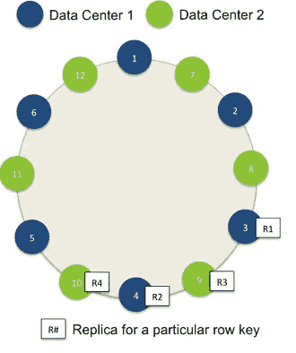
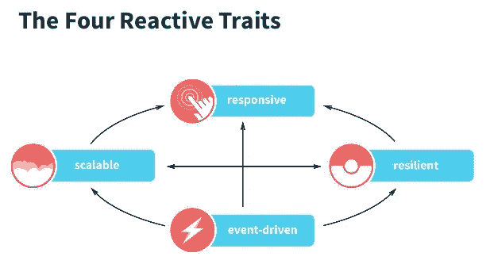
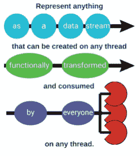

# 构建对象商店——以沃尔玛的规模在 Cassandra 中存储图像

> 原文：<https://medium.com/walmartglobaltech/building-object-store-storing-images-in-cassandra-walmart-scale-a6b9c02af593?source=collection_archive---------0----------------------->


Credit: [geralt / 13370 images](https://pixabay.com/en/users/geralt-9301/)

如果需要是所有发明(和创新)之母，那么约束(尤其是时间)绝对是之父。“去年在[沃尔玛实验室](http://www.walmartlabs.com/)，我们面临着提出解决方案的需求，却没有一个广阔的时间框架作为支点。一路走来，我们学到了很多东西，这段旅程就是我将要讲述的故事的背景。

[沃尔玛](https://www.walmart.com/)一直在使用专有技术存储其所有的产品图片和其他资产。随着沃尔玛开始大规模扩展产品组合，我们在设置产品图片时面临着严重的扩展问题。虽然产品映像的设置很慢，而且容易出错，更不用说它们位于第三方数据中心，但总有更重要的事情要做，直到有一天我们被告知旧系统将退役。我们有五个月的时间不仅要构建新系统，还要在不影响用户体验的情况下将数以百万计的图像从旧系统迁移到新系统！本着保持博客简洁的精神，我将只谈论我们旅途中出现的最重要的事情。

# **要求**

我们知道，我们现在能够写出的细节程度将有助于我们以后推动设计，并最终决定成功的程度。我们还选择将该系统视为一个**通用对象存储库**，它的第一个大用例是存储图像。最关键的需求是:

*   能够存储数以百万计的产品图片和资产
*   高可用性和极强的容错能力
*   线性可扩展性
*   99%的响应时间不超过 2 位数毫秒

所有上述需求都与以下事实直接相关:该系统中的任何问题都将影响 Walmart.com[和沃尔玛](https://www.walmart.com)的客户体验(没有图片的产品),并导致数千美元的收入损失。是的，在电子商务世界里，一张图片比一千个单词更有价值！

# **技术**

对于这个平台来说，最基本的是选择在哪里以及如何存储这些对象/图像。第一个明显的问题是内部供应商还是外部供应商？鉴于

*   过去几年，我们一直在使用外部供应商，当我们开始扩展时，情况看起来并不太好
*   我们谈论的是 Walmart.com 数以亿计的产品图片
*   了解我们用例的确切细微差别，并希望大规模构建一个通用对象存储库，谁是第一个用例是图像

我们决定采用内部解决方案。选择正确的技术将是我们需要做出的核心决策之一。列出推动这个决定的事情

*   这种高可用性系统的部署策略将是多数据中心、多云，这意味着无论我们选择什么，都需要无缝地支持这样的架构
*   随着数据增长到数百万亿字节，线性可扩展性意味着一个固有的分布式系统
*   必须支持现成的容错和数据冗余，以支持高可用性

**基于 Ceph 的存储**由一个内部平台团队提供支持，能够存储千万亿字节的数据。它看起来很有希望，我们很兴奋！它几乎满足了上述需求。在评估时，我们很快意识到

*   基于 Ceph 的存储要到年底才会在部署了处理站点流量的应用程序的多个数据中心推出
*   存储群集将与多个其他团队共享，这些团队将贡献自己的流量，这意味着不可预测的读/写性能，这是不可接受的
*   集群中保存数据的数据节点不是 SSD，这对于批处理系统来说很好，但对于实时任务关键型系统来说并不是首选

本着让数字决定的精神，我们做了一些性能测试，证实了上述假设。我们没有获得可预测的性能，对于基于 Ceph 的存储，95%的映像读/写时间往往在几十秒内。

**Cassandra-distributed database**以高可用性和线性可伸缩性著称，这是我们过去已经熟悉并使用过的东西。但是，将本质上是文件的图像存储在数据库中难道不是违背直觉的吗？可能吧，但当你在沃尔玛的大规模经营时，大多数经验法则都会被打破。我们认为最好是反复测试现有的信念/直觉，也就是你已经知道的东西，然后让机器来决定！



Apache Cassandra — [https://dzone.com/refcardz/apache-cassandra](https://dzone.com/refcardz/apache-cassandra)

*   Cassandra 完全满足了我们的要求，我们可以获得带 SSD 的裸机，并在我们想要的所有数据中心安装它们，此外，Cassandra 具有开箱即用的跨数据中心复制功能
*   之前使用过 Cassandra，我们在团队中已经有了必要的专业知识
*   通过端到端地拥有一切，我们现在可以考虑调整我们想要的任何东西，无论我们想要什么来支持我们的需求

让数字再次指引我们，我们做了一些性能测试，读/写数字(第 95 和第 99 百分位)在我们 90%的使用案例中都非常出色！我们的性能测试包括存储数百万不同大小的图像，相当于万亿字节的数据。其余 10%都是大小为 10 MB 的大图像，响应时间仍然可以接受。非常清楚——我们要将图像存储在数据库中。

# 设计考虑

**数据库模式**
Cassandra 支持 *blob* 数据类型，用它存储对象很直观。剥离我们的模式，最简单的形式是这样的

```
*CREATE TABLE object_store (
  key text,
  object blob,
  PRIMARY KEY (key)
 )*
```

直到我们测试物体，更具体地说，不同大小和图案的图像开始出现之前，这一切工作得很好。在有负载的情况下，高分辨率大图像的读/写速度变慢。在进一步调查和观察结果后，我们了解到存储/读取大对象增加了 Cassandra 节点和应用程序的 GC 压力，因为如果不完全读取文件，就不可能进行流式处理。CQL 还不支持流媒体。

一种直观的方法是

*   将较大的对象分割成较小的块，并将它们存储在 Cassandra 集群的不同节点中
*   一次向多个节点执行对象区块的异步并行写入，从而加快总写入时间
*   对对象块执行异步并行读取，并在应用程序级别进行聚合
*   更好的方法是使用 Http 协议支持的 transfer-encoding*Chunked*直接按顺序传输块，从而消除应用程序在内存中存储任何内容的需要

我们对这一想法进行了性能测试，并高兴地注意到，拆分和存储大块大对象导致读写的第 95 和第 99 百分位响应时间提高了 3 倍。我们还对大小对象的创建-更新比率(大约为 90–10)及其对压缩的影响进行了负载测试。我们确实注意到了一些压缩活动，但是它对对象的读/写性能的影响可以忽略不计。调整具体的 Cassandra 连接参数和设置是一个单独的帖子的一部分，所以我现在不会进入这些细节。

**反应范式**

*少就是多？*我们一直在考虑编写绝对最少的代码来完成工作而不牺牲可读性的想法。但是极小简单吗？简单是可读性的标志，可读性与维护的容易程度成正比。所以除了最少的代码库，我们还想要一个简单的代码库。看待代码简单性的一种方式是

*   从单线程的角度来看一切，而实际上是完全多线程的，因此不必担心同步/锁定
*   以简洁的方式表达错误处理，否则代码库会很快膨胀
*   遵循关注*需要发生什么*而不是*如何发生*的思维过程，以声明方式编写代码



Four Reactive Traits — [http://www.slideshare.net/rolandkuhn/akka-and-angular-js-persistent-gabbler](http://www.slideshare.net/rolandkuhn/akka-and-angular-js-persistent-gabbler)

我们将 Cassandra 数据库视为可观察对象，并以异步方式对数据做出反应的 eactive 范式非常有趣。RxJava 为我们提供了

*   编写简单、非阻塞的代码来响应事件流
*   保证在任何给定时间由单个线程运行
*   不必担心同步、锁、阻塞和其他多线程问题
*   大量操作符(很像函数式编程中的操作符),通过大理石图提供大量文档



RxJava — [http://www.philosophicalhacker.com/2015/06/12/an-introduction-to-rxjava-for-android/](http://www.philosophicalhacker.com/2015/06/12/an-introduction-to-rxjava-for-android/)

例如，对于我们的一个用例，我们能够表达

*   异步、并行写入/读取
*   ' n '对特定异常进行可变延迟重试

不到 15 行代码！更少的代码意味着更少的潜在错误。我们对这段代码进行了微基准测试，发现与以前使用的内部库相比，写/读性能提高了一个数量级。另一方面，

*   从功能上考虑，编写高阶函数和对数据流做出反应需要思维上的巨大飞跃(花力气编写漂亮简洁的代码是非常值得的)
*   调试用代码表达的事件序列需要一段时间来适应

**数据冗余**

从实现极高可用性的部署角度来看，该应用程序将是一个多 dc(网络拓扑策略)、多云应用程序。冗余因子被设置为 3。Cassandra 一致性级别设置为写入的 EACH_QUORUM 和读取的 LOCAL_QUORUM。有了这些设置，我们可以承受每个对象有一个节点关闭，而仍然没有影响。这在一致性和可用性之间提供了一个很好的平衡，让**记住了所有**我们的对象存储用例。

**动态调整图片大小**

[Walmart.com](https://www.walmart.com)要求一个产品有几种不同尺寸的图像。这些不同大小的产品图片被用在网站的几个地方，如搜索、货架等。也

*   这些调整大小的图像可以在原始图像建立时创建，并在运行时直接获取

运筹学

*   当请求特定大小时，可以在运行时动态创建它们

由于我们将使用 CDN 来缓存产品图像，我们决定使用选项 2，因为当请求的图像被调整大小时，这些调整大小的图像将在第一次昂贵的调用后被缓存。进一步的研究表明，数据量减少了 5 倍，这种方法似乎非常值得。

**迁移**


Migration — [http://www.bruffrfc.com/migration-of-website-to-new-server-in-english-were-moving-house/2015/09/18/](http://www.bruffrfc.com/migration-of-website-to-new-server-in-english-were-moving-house/2015/09/18/)

将数以百万计的图像从旧系统迁移到新的对象存储将是一项艰巨的任务，因此我们决定按以下顺序分多个阶段完成

1.  只为任何新创建的产品和现有映像的任何新更新发布对象存储。在观察了一个星期并确认事情按预期运行后
2.  创建迁移 api，提供产品 id，将图像从旧系统移动到新系统，更新元数据等
3.  在几周的时间里，每周批量迁移数百万张产品图像
4.  最后创建的 Http 301 永久重定向从旧的图像 url 到新的，以处理悬空链接，这将是在头几个月很多

# **总之**

我们学到的一些有趣的事情包括:

*   通用是好的，但是关注最重要的用例将有助于推动设计和关注重要的事情
*   当面临构建系统的多种方式时，最好通过运行负载来验证这些设计选项，获得数字，然后让机器来决定。更好的方法是在开发过程中对代码片段进行微基准测试。这真的有助于在两种方式之间做出选择
*   在大规模运营时，经验法则很可能会被打破，因此最好验证想法和信念
*   时间总是一个重要的因素，因此最好从合理的地方开始，快速行动，快速失败，然后进化

我希望你在这篇文章中发现了一些有趣的东西，并且喜欢这个博客。请关注更多的未来！