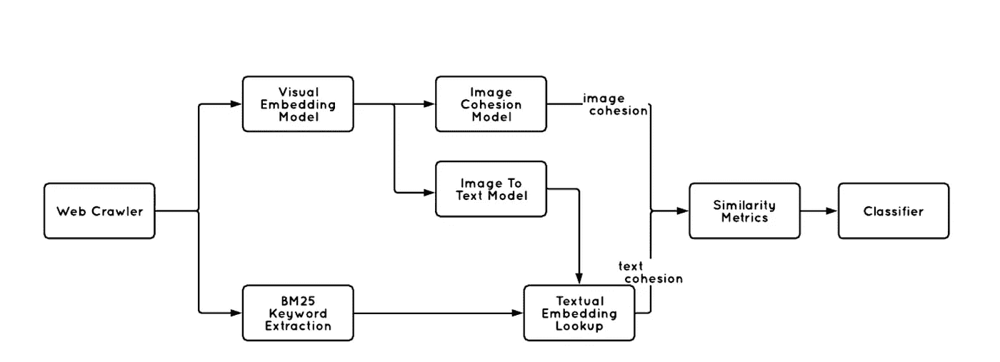

# 建立引脚内聚力

> 原文：<https://medium.com/pinterest-engineering/building-pin-cohesion-229c19fc617e?source=collection_archive---------0----------------------->

张文科，张向阳，曾庆龙，安德烈
Pinterest 工程，内容质量

在 Pinterest，我们正在建立一个视觉发现引擎，通过链接到更多信息，想法变得可行。一旦保存 Pin，其链接内容可能会随着时间的推移而更新或过期，因此了解 Pin 背后的链接页面的质量以改善点击体验至关重要。在本帖中，我们将讨论如何构建基于 Spark 和 TensorFlow 的 ML 管道来计算 Pin 和链接页面相关性信号。

# 概观

Pinterest 拥有来自 Pinners 的数十亿个图钉(图片是视觉书签)。为了保持现场和非现场内容的一致性，我们每天递增地重新索引 web 文档，并获取信号来测量 Pin 和链接页面之间的相关性。我们依靠嵌入的图像和文本内容来衡量视觉和语义的相似性。

**Figure 1.** Example of related and unrelated pin and web page

该系统被分解为:文本内聚信号，其比较 Pin 的显著关键词和来自其链接的网页的文本内容；图像内聚信号，其检测现场和非现场图像之间的图像相似性；图像-文本内聚信号，其利用视觉分类器比较图像和文本；最后，混合分类器将这些信号合并成 Pin 和登录页面内容之间的接近度的单一度量。

**Figure 2.** Pin cohesion signal overview

# 文本相关性

文本相关性是页面凝聚力的重要标志。直觉上，我们希望看到一个 Pin 的网页与其语义相匹配。例如，如果我们在标题为“白色沙发”的名为“现代家具”的板上看到一个大头针，我们可能会希望看到它链接到一个家庭装饰产品的零售网站。为了测量这种相似性，我们提取现场和场外文本信号，并在文本嵌入空间中进行比较。

当人们将管脚保存到他们的板上时，由于人工管理的内容，例如板名、管脚的标题和描述等等，我们可以对管脚周围的环境有所了解。这些信号通常足够丰富，我们可以为每个 Pin 生成文本标签，在计算文本相关度时用作现场文本信号。至于站外信号，我们需要知道网页在说什么。虽然我们可以从 HTML 中获得大量的内容类型，但我们主要关注页面的标题、描述和正文。标题和描述字段通常传达了网页中最重要的主题，而提取正文给了我们更精确的主题细节。在收集原始文本数据后，我们对它们进行标记化，并用 Okapi BM25 算法对标记进行评分。与经典的 TF-IDF 算法相比，BM25 算法能更好地消除不同文本长度的差异，并限制常见术语出现次数过多的影响。我们还维护一个本地网页语料库，以确保关键字质量。例如，“免费送货”和“隐私政策”等特定于网站的词更有可能出现在网页上，因此 IDF 得分较低。通过关键词提取，我们可以将一个链接的文本内容总结为一个文本标签列表，作为我们的非现场文本信号。

然后，我们在嵌入空间中比较现场和非现场文本信号，其中文本被表示为向量，并且语义相似的短语将彼此接近。将我们提取的文本信号映射到连续向量空间，我们可以通过计算两者的余弦相似度来推断 Pin 信息与其链接之间的文本相关度。

# 图像关联性

在我们当前的模型下，图像相关度信号由两个子成分组成:**图像** **视觉相似度**和**图像** **语义相似度**。

图像视觉相似性是一个原始信号，我们设计它来回答这样一个问题:我们是否可以在网页上找到一个看起来与保存在 Pinterest 上的图像相似的图像。我们可以通过计算大头针图像与其网页中的每张图像之间的视觉相似性来解决这个问题，然后取最大值。为了实现高精度和高召回率，我们利用一个训练有素的图像相似重复检测模型来预测图像对的视觉相似性得分。该模型是一个张量流前馈神经网络，它利用了视觉嵌入的迁移学习。更多细节可以在[这篇博客](/@Pinterest_Engineering/detecting-image-similarity-using-spark-lsh-and-tensorflow-618636afc939)中找到。

**Figure 3.** Example of semantic-related Image Pair

**Figure 4\.** Image Classification: “audrey hepburn style”, “1950s fashion”

然而，视觉相似性检测的失败并不一定意味着图像不连贯。例如，图 3 中的这两个图像看起来完全不同，但都显示了相同的产品(一辆白色的三层金属手推车)，应该被认为是一个紧密的组合。因此，我们构建了另一个原始信号，通过将图像转换为文本注释来捕获图像语义相似性。这个图像到文本模型是通过训练图像到文本注释分类器来开发的。我们集成了一个视觉模型，该模型将一幅图像分类到去年流量最大的 10K 搜索查询中，如图 4 所示。图像特征是使用度量学习训练的视觉嵌入，该度量学习优化了 Pinterest 的各种视觉任务。搜索查询首先被过滤以去除流行的拼写错误和趋势查询，并且被二进制编码以用于训练。参与最多的 Pin 映像将被删除重复，并被视为每个类别的正样本。分类器模型包含两个完全连接的层，并被训练以优化 sigmoid 交叉熵损失。随着图像被转换成预测的文本注释，我们可以容易地判断图像语义相似性，就像文本相关度一样，其中我们在文本嵌入空间中比较现场和非现场文本信号。

# 图像和文本的关联性

使用 Pinterest 视觉搜索，图像通常是用户浏览内容时的焦点，而当用户想要深入了解他们感兴趣的特定内容时，文本更具信息性和可操作性。因此，了解图片和文本在大头针和它的链接页面之间的对齐情况也很重要。

我们目前使用两种方法来比较图像和文本:图像分类和光学字符识别(OCR)。首先，我们重用前面讨论的分类器将图像转换为文本，但是将输出的文本注释与链接页面文本进行比较。其次，我们看到许多大头针图像包含突出链接网页的文本，尤其是那些为 Pinterest 设计的高质量原生创建者大头针。我们利用 OCR 技术从图像中提取文本以获得 Pin 的描述信息。一旦我们将图像映射到文本，我们就使用文本嵌入来比较图像和文本的相似性，如前一节所述。

**Figure 5.** OCR

最后一组原始信号包括:

*   文本相关度得分，用于衡量 Pin 的人为关键词是否与链接的文本内容相关
*   图像相关度分数，用于测量 Pin 和链接页面图像之间的图像视觉和语义相似性，以了解网页是否包含相关主题和样式的图像
*   衡量链接的文本内容是否与大头针图像主题互补的图像-文本相关度分数
*   文本-图像相关度得分，用于衡量链接的图像是否与其从网站文本内容中提取的关键词相关

在所有信号就绪的情况下，我们在人工标记的 gold 数据集上构建了一个二元分类器，以确定总体 Pin 内聚力。

# 结论

我们建立了引脚内聚信号来衡量引脚和链接页面的相似性。由于 Pin cohesion，自 2018 年 11 月以来，我们已经看到搜索和参与度方面的指标增长。这种信号为搜索、推荐和首页 feed 表面提供动力，作为排名信号，以提高 Pinterest 上的内容质量，并带动网站外的流量。

## 承认

Pin cohesion 是 Pinterest 中的一个合作项目。特别感谢我们的实习生和以下团队成员: *Peter John Daoud、Renju Liu、Nick DeChant、、Omkar Panhalkar、*、*、、Heath Vinicombe、Vincent Bannister、Jacob Hanger 和李卓远，感谢他们对本项目的所有贡献。*