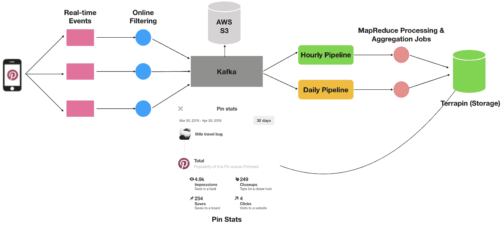

# 构建 Pin 统计

> 原文：<https://medium.com/pinterest-engineering/building-pin-stats-25ec8460e924?source=collection_archive---------2----------------------->

Mohak Nahta | Pinterest 产品工程工程师

几个月前，我们开始为企业建立一种方式，在他们的个人资料上创建和展示他们最新和最喜爱的内容。我们还想让企业更容易了解他们的引脚性能如何。如果一家企业能够迅速获得关于其内容的有用见解，他们就能更好地理解 Pinners 正在寻找的想法。这就是为什么我们建立了 Pin stats——对企业创建的 Pin 进行近实时分析。在本帖中，我们将介绍我们如何开发 Pin stats，以及如何近乎实时地记录、处理和聚合数十亿个事件。

# 挑战

我们想用 Pin stats 解决两个主要问题。

1.  **近乎实时的洞察力**:企业告诉我们，他们希望看到他们的 pin 在发布后的几个小时内表现如何。构建 Pin 统计的最大挑战之一是处理数百亿个事件，使我们能够将分析交付时间减少到两个小时，减少了 18 倍。
2.  **规范化**:每次有人将 Pin 保存到 Pinterest，我们都会将其作为一个单独的实例记录下来。以前，我们只为企业提供该 Pin 实例的分析。这意味着企业永远无法全面了解其内容的表现。有了 Pin stats，现在 Pin 的所有不同实例都聚合到一个规范的 stat 中，因此企业可以在 Pinterest 上看到其内容的全部影响。

# 履行

## *伐木*

项目的第一部分包括实时记录最初由企业拥有的 pin 上的所有事件，并将它们发送到[Apache Kafka](https://kafka.apache.org/)——Pinterest 使用的日志传输层。这很有挑战性，因为我们每秒钟都会收到数十万个各种各样的事件。

在我们的例子中，我们只想记录与企业相关的事件(即，只记录最初由企业创建的 Pin 上的印象)。由于我们严格要求在两个小时内显示 Pin stats ，我们不仅要实时记录事件，还要在记录前对其进行过滤。我们负担不起过滤离线事件的费用，因为筛选所有事件并只提取与业务相关的事件需要几个小时。

同时，在线过滤的成本非常高，因为它会涉及各种网络调用，并增加前端日志记录端点的延迟。我们实现了各种优化和试探法来最小化必要的网络调用数量。这确保了我们只有在相当肯定事件属于最初由企业创建的 Pin 之后才进行网络呼叫。这通过几个因素减轻了我们前端日志记录端点的负担。

## 处理

大量的事件意味着我们也需要以极其有效的方式处理它们。这就是为什么我们按照三个不同的时间范围聚合来划分新的 Pin 统计数据——每小时(滑动 24 小时窗口)、过去七天和过去 30 天。

对于每小时的部分，我们需要单独处理数据，以便尽快向企业展示。我们通过从我们的卡夫卡主题中引出两条不同的管道来实现这一点，一条处理小时数据，另一条处理每日数据。同时，我们通过各种规则确保两条管道的可靠性和一致性，以避免数据不一致。前者是数据摄取管道，每小时创建过去一小时内记录事件的表(大约每小时四十亿个事件)，然后我们使用高效的 MapReduce 作业对其进行处理和聚合。这意味着我们能够每小时将数据保存到存储中，并拥有按小时运行的数据工作流，以在非常精细的时间级别上聚合分析。后一个管道会生成一个每日表(约 1000 亿个事件/天)，由于 SLA 更长，该表会得到更彻底的处理和验证。

## 储存；储备

在短时间内记录、处理、验证和聚合了数百亿个事件之后，我们需要一种能够处理极其庞大的数据集的低延迟存储解决方案。我们决定使用[terra pin](/@Pinterest_Engineering/open-sourcing-terrapin-a-serving-system-for-batch-generated-data-7aa2f38c4472)——我们内部的低延迟服务系统来处理大型数据集。它满足了我们对弹性、容错和能够直接从亚马逊 S3 接收数据的要求。

# 课程

在这个过程中，我们学到了许多宝贵的经验。其中一个主要挑战是构建一个数据管道，该管道可以支持每秒钟数十万个事件的实时流，并且随着 Pinterest 的增长，该管道是可靠且可扩展的。特别是，很难让我们的分歧管道的工作方式，他们都与数据一致和可靠。

另一个巨大的挑战是过滤每秒钟大量的事件，这样我们就不会用我们永远不会处理的数据填充我们的管道。这很复杂，因为任何类型的过滤通常都需要网络呼叫，这最终会降低日志记录的速度。为了解决这个问题，我们预先使用各种信号来确保网络呼叫是必要的。

最后，我们在选择方法时学到了很多东西——无论是花几个月时间构建真正的实时管道，还是创建一个可以在不到两小时内提供数据的系统。我们设计了一个实时分析服务的原型，看看在当前的基础设施下是否可行，并最终决定采用一个接近实时的系统，以便更快地提供体验。

# 后续步骤

我们的下一步将是建立一个真正实时的系统，在上传 Pin 的几秒钟内显示 Pin stats 。我们还希望提供额外的指标，以便企业可以创建更好、更可行的 pin。

*鸣谢:没有 Pinterest* 不同团队的工程师们的帮助和支持，这个项目是不可能完成的。*我要特别感谢 Ryan Shih、Andrew Chun、Derek Tia、、Daniel、David Temple、Gordon Chen、、Jon Parise、Rajesh Bhatia、Sam Meder、Shawn Nguyen、Shirley Gaw、Tamara Louie、李瑱、Tiffany Black、魏冉刘和王艺凝。*