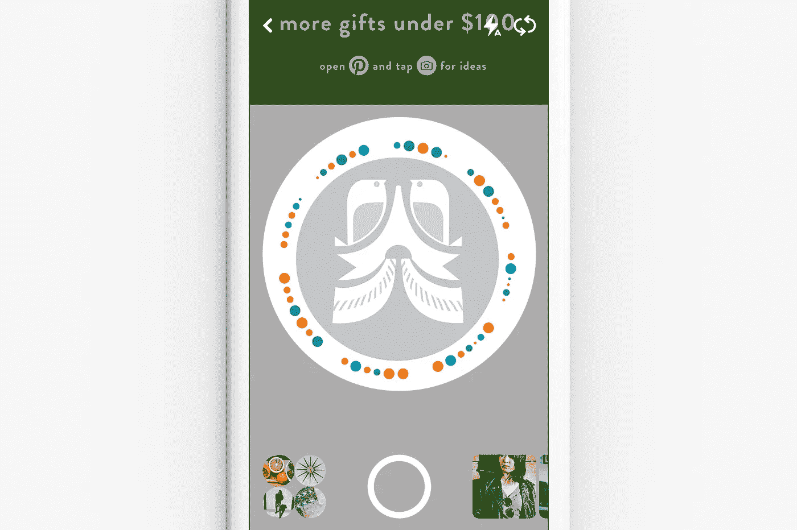
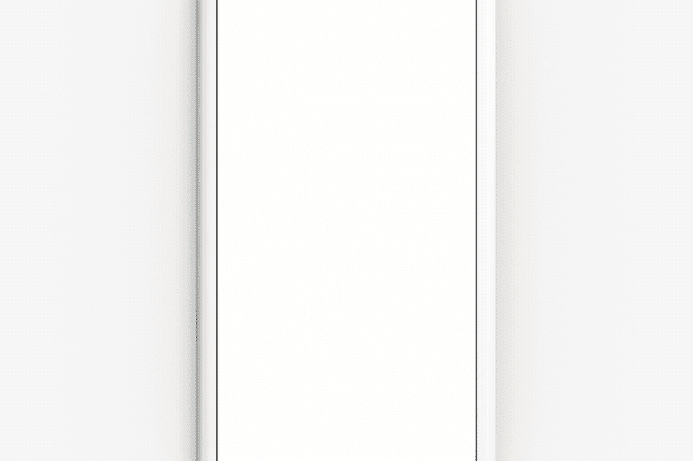

# 为 Pinterest 板和个人资料构建密码、可扫描代码

> 原文：<https://medium.com/pinterest-engineering/building-pincodes-scannable-codes-for-pinterest-boards-profiles-fa4f43cf8ff0?source=collection_archive---------3----------------------->

张佳维| Pinterest 工程师，搜索

今年早些时候，我们[推出了相机搜索](https://blog.pinterest.com/en/search-outside-box-new-pinterest-visual-discovery-tools),以帮助 Pinners 找到想法，尝试使用他们在现实世界中看到的东西进行搜索——无论是用当季新农产品制作的食谱还是与特定图案匹配的服装。今天，随着 [Pincodes](https://blog.pinterest.com/en/introducing-pincodes-discover-ideas-brands-and-publishers) 的发布，我们在将真实世界与 Pinterest 上的想法联系起来方面又迈出了一步。

Pincodes 是自定义代码，您可以通过扫描来发现品牌和出版商策划的创意和产品。当你看到一个密码时，只需在 Pinterest 应用程序中点击相机图标，然后指向该代码，就可以直接跳转到一个公告板或个人资料。有了 Pincodes，品牌可以使用任何纸板或简介，生成一个独特的代码，在商店、包装、杂志、广告等任何地方分享。

在本帖中，我们将分享我们如何与 [Quikkly](https://quikklycodes.com/) 合作构建和实现 Pincodes，Quikkly 以 SDK 的形式为应用开发者开发定制的可扫描代码解决方案。

## 编码密码

在 Pinterest，我们使用唯一的对象 ID 来识别公告板和 Pinner 个人资料。给定 Pinner 或 board 的对象 ID 和一个英雄图像，Quikkly 库生成一个由三种可能大小的 50 个点组成的密码。这些点大小提供了 log₂(3⁵⁰的最大数据容量)—大约 79 位，其中 64 位用于对象 ID，其余用于数据完整性。这些点被排列成等间距的组，这些组通知扫描仪圆上的 50 个点属于一个密码。

点的大小和组织是仅用于为密码编码数据的两个视觉属性。圆点的颜色是为了美观(在编码过程中不使用)。事实上，即使是黑白打印，密码也能工作。

## 扫描密码

智能手机相机拍摄的照片通常很大且有噪音，因此需要在解码前进行归一化处理。Quikkly 库首先缩小图像，使它们小到足以有效处理，但又大到足以让扫描仪识别最小的点。为了消除噪声，应用了一个过滤器来消除弱光下的颗粒，并消除任何视觉伪像，如相机在屏幕照片中捕捉的条纹。在解决了大小和噪声之后，扫描仪从图像中的高对比度边缘找到点及其位置，并从这些图案构建数据对象。这些包含对象 ID 的数据对象随后被解码，并用于导航到与对象 ID 相关联的电路板或引脚。

Quikkly 在扫描中面临的最大挑战之一是精确测量点。圆点的大小取决于相机的视角、角度和焦点。Quikkly 没有使用 Reed-Solomon 之类的标准纠错算法，而是使用概率解码给每个点一个属于大小桶(小/中/大)的概率*，而不是测量每个点在*这些桶之一中的*。有了这个，扫描仪可以考虑它不确定的点的多种潜在尺寸。*

## 在 Android 上集成密码扫描

在 Android 客户端中，我们为本机相机设置了一个`PreviewCallback`，只要预览处于活动状态，它就会在每个预览帧上被调用。在包含摄像机的片段中，我们声明了一个`PreviewListener`(由 Quikkly 提供)并将其交给我们的`CameraPreview`，这个类扩展了引用摄像机的`SurfaceView`和一个`SurfaceHolder`。然后我们在`PreviewCallback`中覆盖`onPreviewFrame(byte[] data, Camera camera)`方法来调用`PreviewListener`并通过 Quikkly 的扫描库向片段传递一个对象 ID。一旦我们收到片段中的对象 ID，我们就对其进行解码，以决定是否导航到一个概要文件或电路板。

## 解码对象 ID 并导航:

我们使用对象 ID(标识插针、电路板等。)对密码进行编码，因为限制存储在每个密码中的数据量允许代码设计中有更大的灵活性。类型(Pinner、board 等。)是在对象 ID 本身中编码的，因此在解码时，客户端只需执行按位操作来检测它是否应该导航到电路板或 profile。

## 在 iOS 和 Android 上导出大型密码图像

因为密码是要打印的，所以密码的导出图像和我们的行动号召标题必须是高分辨率的。我们使用 Pincode 中的可缩放矢量图形(SVG ),而不是调整从 Pincode 生成中收到的位图的大小。这些 SVG 是 XML 表示的矢量图像，可以在不损失图像质量的情况下轻松缩放。我们首先将 Pincode 生成的 SVG 和我们定制的行动号召 SVG 缩放成大位图。然后，我们将这两个位图合并成一个位图，可以保存到手机的相机胶卷中或打印出来。

## 在网络上将密码图像和 CTA 文本生成为 PNG 文件

为了能够在网络上生成密码图像，我们添加了一个后端 API，集成了 [Quikkly python SDK](https://pypi.python.org/pypi/quikkly-python-sdk) 。然后，前端从后端 API 检索 SVG 字符串，并将其与我们定制的行动号召 SVG 内联。下载密码后，我们将生成的密码 SVG 和自定义的行动号召 SVG 组合成一个大位图(png 文件)。以下是详细的步骤:

1.  克隆两个 SVG 节点:父节点的`innerHTML`
2.  对于生成的 Pincode SVG 图像中的英雄图像，通过其 URL 获取图像的二进制文件，对其进行 base64 编码，然后将其内联到[数据 URI](https://en.wikipedia.org/wiki/Data_URI_scheme) 中。
3.  使用数据 URI 中的 SVG 内容将每个 SVG 元素转换为图像元素。
4.  等待直到两个 SVG 图像都被解析
5.  创建一个具有所需导出大小的画布，并将密码和行动号召图像绘制到画布上
6.  将画布数据转换为数据 URL([today ataul](https://developer.mozilla.org/en-US/docs/Web/API/HTMLCanvasElement/toDataURL))
7.  将数据 URL 转换为 Blob，然后转换为对象/blob URL。这一步是必要的，因为数据 URI 方案是为小值设计的，不适用于大数据(见[https://stackoverflow.com/a/41755526/4056191](https://stackoverflow.com/a/41755526/4056191))。
8.  创建一个将 src 设置为对象 URL 的锚元素，然后触发一个 click 事件
9.  拆除锚元素和对象 URL

今天，我们将与 Pinners 喜爱的合作伙伴一起推出 Pincodes，包括 Nordstrom、Kia、 *REAL SIMPLE* 、Home Depot 和 Kraft Heinz，还将推出更多产品。在这个假日购物季节，请密切注意假冒商品！

*鸣谢:*特别感谢 Pinterest 的工程师 Kelei Xu、Mustafa Motiwala、Jack Hsu、Steven Ramkumar 和 Jeffrey Harris 以及 [Quikkly](https://quikklycodes.com/) 。

## 来源

quikkly
[https://developer . Android . com/reference/Android/hardware/camera . html](https://developer.android.com/reference/android/hardware/Camera.html)
[https://github.com/quikkly/](https://github.com/quikkly/)