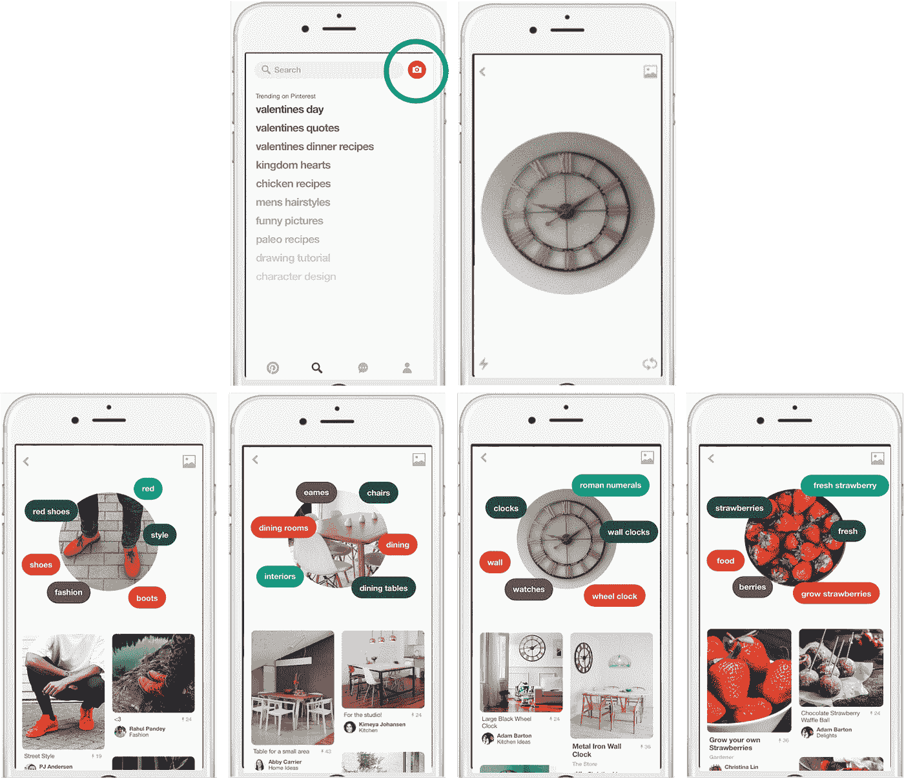
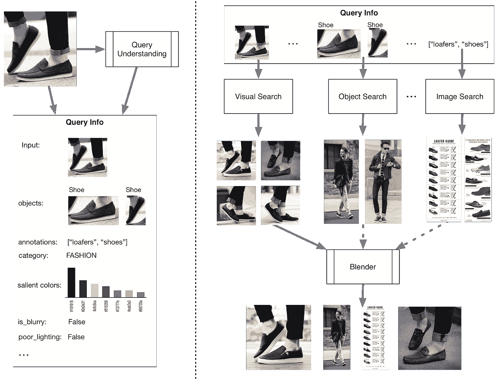
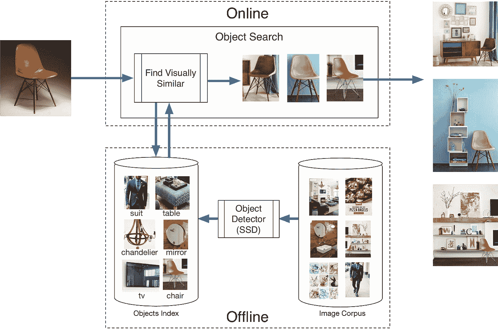

# 构建 Pinterest 镜头:一个真实世界的视觉发现系统

> 原文：<https://medium.com/pinterest-engineering/building-pinterest-lens-a-real-world-visual-discovery-system-59812d8cbfbc?source=collection_archive---------1----------------------->

Andrew Zhai | Pinterest 视觉搜索技术主管

最近，我们宣布了 [Lens BETA](https://engineering.pinterest.com/blog/introducing-future-visual-discovery-pinterest) ，这是一种使用手机摄像头从你身上发现周围世界的物体和想法的新方法。只需点击 Pinterest 应用程序中的镜头图标，将其指向任何东西，镜头就会返回视觉上相似的对象、相关的想法或已完成项目或上下文中的对象。Lens 使您能够超越手机相机的传统用途——自拍或保存场景——并将它变成一个强大的发现系统。它将 Pinterest 的魔力带入了现实世界，让你看到的任何东西都能在 Pinterest 上引出一个相关的想法。在这里，我们将分享我们如何构建 Lens 以及我们克服的主要技术挑战。

# 背景

2015 年，我们[推出了我们的第一个视觉搜索体验](https://engineering.pinterest.com/blog/introducing-new-way-visually-search-pinterest)，它使人们能够精确定位图像的各个部分，并获得视觉上相似的结果。有了视觉搜索，我们获得了一个平台来推进我们的技术，并通过优化相关结果和吸引人的结果来逐步改进系统。Pinners 对这些改进反应积极，现在每月产生超过 2.5 亿次独特的视觉搜索。

作为视觉搜索的下一个发展，我们引入了实时的[物体检测](https://engineering.pinterest.com/blog/introducing-automatic-object-detection-visual-search)。这不仅使视觉搜索更容易使用，而且当人们保存和选择它们时，我们也稳定地获得了对象的语料库。自推出以来，我们在短短六个月的时间内生成了数十亿个对象，并使用这些数据来构建新技术，如镜头和对象搜索。

如果你有兴趣更深入地了解我们如何将我们的视觉搜索技术扩展到数十亿张图像，并将其应用于 Pinterest，请看看我们在 Pinterest 上的[视觉发现论文](https://arxiv.org/abs/1702.04680)，该论文已被接受在今年的万维网(WWW)大会上发表。

# 透镜建筑

一根大头针就能让你陷入相关想法的兔子洞，让你发现来自全球 1.5 亿人的高质量内容。当我们开发 Lens 时，我们希望类似于这种体验，因此一个真实世界的相机图像可以将您与 Pinterest 上的 100B 想法联系起来。

Lens 将我们对图像和对象的理解与我们的发现技术相结合，为 Pinners 提供一系列不同的结果。例如，如果你拍了一张蓝莓的照片，Lens 不只是返回蓝莓:它还会给你更多的结果，如蓝莓烤饼和冰沙的食谱，排毒磨砂等美容想法或种植自己的蓝莓灌木的技巧。

为此，Lens 的整体架构分为两个逻辑组件。

1.  第一个组件是我们的查询理解层，在这里我们获取关于给定输入图像的信息。在这里，我们计算视觉特征，例如检测对象、计算显著的颜色以及检测照明和图像质量条件。使用视觉特征，我们还计算语义特征，如注释和类别。
2.  第二个组件是我们的混合器，因为镜头返回的结果来自多个来源。我们使用我们的视觉搜索技术来返回视觉上相似的结果，使用对象搜索技术来返回具有视觉上相似的对象的场景或项目(下面将详细介绍)，使用派生的注释来返回与输入图像在语义上(不是视觉上)相关的个性化文本搜索结果的图像搜索。混合器的工作是根据查询理解层中获得的信息动态地改变混合比率和结果源。例如，如果我们的注释是低置信度，则不会触发图像搜索，如果没有检测到相关对象，则不会触发对象搜索。

如上所示，镜头结果在视觉上并不严格相似，它们来自多个来源，其中一些仅在语义上与输入图像相关。通过为 Pinners 提供超越视觉相似的结果，Lens 是一种新型的视觉发现工具，它将真实世界的相机图像与 Pinterest 味觉图联系起来。

# 建筑对象搜索

有时你看到你喜欢的东西，比如一个很酷的钟或者一双运动鞋，但是你不知道如何设计鞋子或者这个钟在房间里会是什么样子。作为 Lens 的核心组件，对象搜索是我们为解决这些问题而构建的一项新技术。

随着深度学习技术的进步，如改进的图像表示和对象检测，我们现在可以前所未有地理解图像。

传统上，视觉搜索系统将整个图像视为一个单元。这些系统索引全局图像表示以返回与给定输入图像整体相似的图像。随着深度学习的进步带来了更好的图像表示，视觉搜索系统达到了前所未有的精确度。然而，我们希望推动视觉搜索技术的发展，使其超越以整个图像为单位的范畴。通过利用我们数十亿个对象的语料库，结合我们的实时对象检测器，我们可以在更细粒度的水平上理解图像。现在，我们第一次知道了图像库中数十亿物体的位置和语义。

对象搜索是以对象为单位的可视化搜索系统。给定一幅输入图像，我们在几分之一秒内从数十亿幅图像中找到视觉上最相似的对象，将这些对象映射到原始图像，并返回包含相似对象的场景。

# 视觉发现的未来

Lens 的测试版发布真的只是一个开始。我们正在继续改进我们的视觉技术，以更好地理解图像，因为我们面临的挑战是，图像是我们必须理解用户意图的唯一可用信号。这在真实世界相机图像的情况下尤其困难，因为人们在具有不一致图像质量和各种方向的各种照明条件下拍摄照片。

我们对对象和视觉搜索结合在一起所带来的可能性感到兴奋，并继续探索新的方法，利用我们的大规模对象和图像为世界各地的 Pinners 构建发现产品。

如果你有兴趣应对这些计算机视觉挑战并为 Pinners 开发出令人惊叹的产品，请[加入我们](https://careers.pinterest.com/careers/engineering)！

*鸣谢:Lens 是 Pinterest 的合作成果。我们要感谢 Maesen Churchill、Jeff Donahue、Shirley Du、Jamie Favazza、Michael Feng、Naveen Gavini、Jack Hsu、Jen、、Eric Kim、Dmitry Kislyuk、Vishwa Patel、Albert Pereta、Steven Ramkumar、Eric Sung、Eric Tzeng、Kelei Xu、、Zhefei Yu、和在产品发布上的合作，感谢 Trevor Darrell 的建议，感谢(Kevin) Jing、Vanja Josifovski 和 Evan Sharp 的支持。*