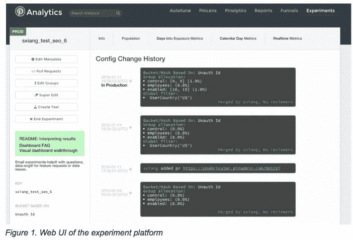
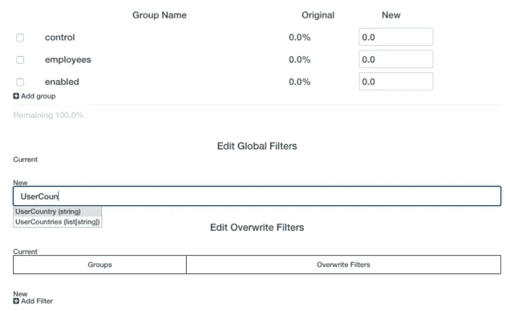
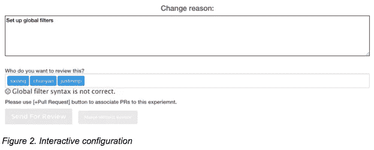
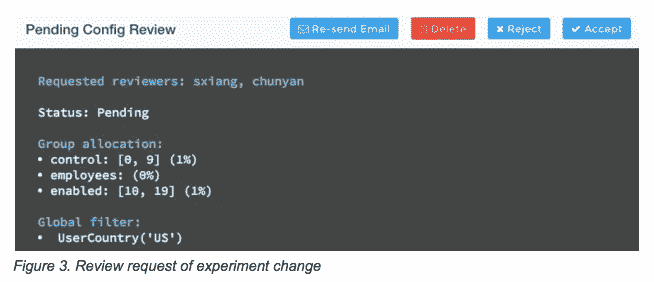
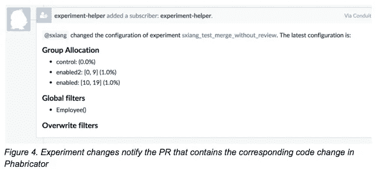
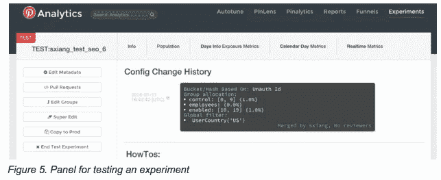
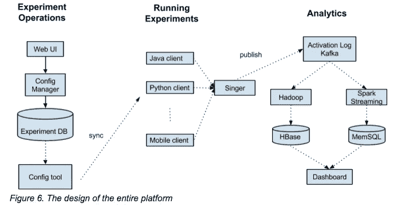

# 构建 Pinterest 的 A/B 测试平台

> 原文：<https://medium.com/pinterest-engineering/building-pinterests-a-b-testing-platform-ab4934ace9f4?source=collection_archive---------0----------------------->

硕翔| Pinterest 工程师，数据

作为一家数据驱动的公司，我们非常依赖实验来指导产品和功能。在任何给定的时间，我们都有大约 1000 个实验在运行，并且每天都在增加。因为我们在不断增加实验的数量并记录相应的数据，所以我们需要一个可靠的、简单易用的平台，工程师可以使用它而不会出错。为了消除实验人员的常见错误，我们引入了轻量级配置 UI、QA 工作流和简化的 API，支持跨多个平台的 A/B 测试。(有关我们的仪表板和数据管道的更多信息，请查看我们之前的[实验帖子](https://engineering.pinterest.com/blog/scalable-ab-experiments-pinterest)。)

在构建实验平台时，我们优先考虑以下要求:

1.  实时配置更改:我们需要能够实时快速关闭或增加实验，而无需为每个配置更改部署代码，特别是在修复站点事件时。
2.  轻量级过程:设置实验不应该比普通的特性发布更复杂，还应该防止用户犯可预见的错误。
3.  客户端不可知:用户不需要为每个平台学习新的实验方法。
4.  分析:为了做出更好的实验决策，我们构建了一个更易于使用的新分析仪表板。
5.  可伸缩性:我们需要整个系统在在线服务和离线实验数据处理方面都可以伸缩。

## 简化过程

Pinterest 的实验遵循一个共同的模式:

1.  创建具有初始配置的实验，创建假设并记录测试该假设的方法。
2.  向 Pinners 展示实验，添加新组，禁用组，并通过过滤器修改受众。
3.  通过将代码发送给所有 Pinners 或回滚并记录结果来完成实验。

在我们之前的框架中，这些更改是通过代码处理的，但是我们希望在 UI 中构建这些更改以提供交互式反馈和验证，并在基于配置的框架中独立于代码发布来推动更改。



常见的实验错误，如语法错误，不平衡的组分配，重叠的组或违反实验程序，都是交互式验证。我们还主动提供 typeahead 搜索建议，以减少人工输入的数量，如图 2 所示。现在做一个实验改变通常只需点击几下鼠标。



为了使配置可以被任意客户端实时访问，我们利用我们的内部系统以序列化格式存储所有实验设置，并在几秒钟内将它们同步到我们实验系统的每个主机。典型的配置文件在反序列化后包含以下内容:

```
{"holiday_special": 
    {
          "group_ranges": {
              "enabled": {"percent": 5.0, "ranges": [0, 49]}, 
              "hold_out": {"percent": 5.0, "ranges": [50, 99]}
           }, 
          "key": "holiday_special", 
           “global filter”: user_country(‘US’),
           “overwrite_filter”: {“enabled”: is_employee()},
           "unauth_exp": 0, 
           "version": 1
      }
  }
```

配置和代码分离的好处是实验设置的即时更新，这意味着像增加治疗组的流量这样的配置更改不需要部署代码。这将实验从生产部署时间表中解放出来，并大大加快了迭代的速度，尤其是在需要紧急更改的时候。

## 质量保证

一个实验可能会影响数百万个 Pinners，因此我们对实验操作和关键的质量保证工具有很高的标准。实验 web 应用程序还配备了一个审查工具，为每个实验更改创建一个审查流程。图 3 显示了修改组范围和过滤器的待定更改。审阅者通过用户界面指定，并将通过电子邮件通知。



对于大多数实验，我们有一个由平台开发人员、用户和数据科学家组成的跨团队助手小组。几乎每一项变更都需要由助手审核，助手会仔细检查计划、假设、关键结果、触发逻辑、过滤器设置、小组验证和文档。这样的过程在我们的 web 应用程序中强制执行，因此每次更改都需要填充一个助手。我们还有一个定期的实验助手培训计划，以确保每个团队至少有一个人获得认证。

实验通常与将控制/处理组信息嵌入到决策逻辑中的代码更改相关联。我们要求实验用户通过 Pull Requests 按钮在实验平台中添加一个 Pull Request (PR)链接，这样帮助者和分析师可以更容易地跟踪实验行为，并在需要时进行潜在的调试。此外，我们还将每个变更作为注释发送给 Phabricator(我们的存储库管理工具)中相应的 PR，如图 4 所示。



用户可以在 UI 中创建正在进行的实验的测试副本(如图 1 所示)。然后，它们将被移植到图 5 所示的测试面板。在测试面板中所做的任何更改都不会影响生产中的实验，只有测试工程师可以看到，他们可以使用一键复制到生产按钮在生产中启用它。



## 应用程序接口

实验 API 是用户将调用的接口，用于将他们的应用程序代码链接到他们通过 UI 进行的实验设置。提供的两种关键方法是:

```
def get_group(self, experiment_name)

  def activate_experiment(self, experiment_name)
```

具体来说， *get_group* 方法返回调用者将被定向到的组的名称。在内部，通过基于实验信息计算散列值来计算组，并且该方法没有副作用。另一方面，调用 *activate_experiment* 向日志记录系统发送消息，并对分析结果做出贡献。这两种方法足以涵盖大多数用例，通常以下列方式使用:

```
# Get the experiment group given experiment name and gatekeeper object, without actually triggering the experiment.
group = gk.get_group("example_experiment_name")

# Activate/trigger experiment. It will return experiment group if any.
group = gk.activate_experiment("example_experiment_name")

# Application code showing treatment based on group.
if group in ['enabled', 'employees']:
  # behavior for enabled group
  pass
else:
  # behavior for control group
  pass
```

上面代码中的 gatekeeper 对象 *gk* 是实验所需的用户/会话/元信息的包装器。除了上面显示的 Python 库，我们还实现了一个单独的 JVM (Scala 和 Java)库。还支持 Javascript 和移动应用程序(Android & iOS)。

## 设计和建筑



实验平台在逻辑上被划分为三个组件:配置系统、一组 API 和分析管道。它们由以下单向数据流连接:

1.  Configuration system 将用户在 web UI 上所做的更改保存到我们的实验数据库中，该数据库的信息定期以分钟级的粒度以序列化格式发布给每个服务。
2.  实验客户机获取实验配置并调用 API 来确定实验逻辑，比如实验类型和组分配。
3.  各种客户端生成的实验激活日志通过我们内部的[歌手服务](http://www.slideshare.net/DiscoverPinterest/singer-pinterests-logging-infrastructure)发送到 Kafka，分析管道将根据用户定义的指标创建实验报告，并在仪表板上交付。

## 摘要

该系统于去年夏天推出，支持 Pinterest 内部的大多数实验。团队特定的功能，如实时指标仪表板、实验电子邮件通知、交互式文档和协作工具以及 SEO API/UI 也正在添加到系统中。如果你对实验框架和分析平台感兴趣，[加入我们](https://careers.pinterest.com/careers/engineering/san-francisco)！

鸣谢:Pinterest 的多个团队为实验框架的形成提供了深刻的反馈和建议。主要贡献者包括硕翔、Bryant Xiao、Justin Mejorada Pier、Jooseong Kim、和数据工程团队的其他成员。