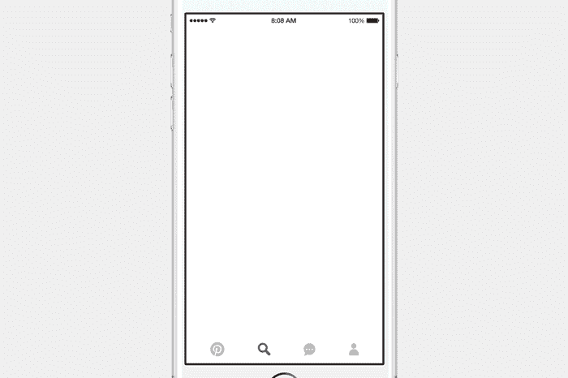
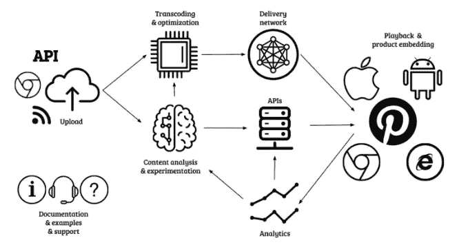

# 打造 Pinterest 的视频平台

> 原文：<https://medium.com/pinterest-engineering/building-pinterests-video-platform-2338dd1d213?source=collection_archive---------0----------------------->

作者:Norbert Potocki |视频和图像平台 Pinterest 工程经理

随着视频内容在互联网上变得越来越普遍，它成为 Pinterest 越来越重要的一部分。Pinterest 是世界上最大的视觉平台之一，人们在这里保存了数十亿份富媒体，这使得它成为进一步破坏视频的成熟平台。作为我们视频进展的一部分，我们去年推出了原生[视频引脚](https://blog.pinterest.com/en/ideas-come-life-video-pinterest)，以帮助 Pinners 更无缝地在 Pinterest 上观看视频。在这里，我们将介绍我们如何以及为什么在它背后建立一个视频平台。请继续阅读！

## 原生视频的优势

在决定建立我们自己的视频平台之前，我们考虑了许多因素。几年来，Pinterest 通过在 pin 中嵌入 YouTube 剪辑来提供第三方视频支持。这个简单的解决方案有效，但是有局限性。通过引入本地视频基础设施，我们获得了以下收益:

*   **内容多种多样。**随着原生视频播放器的推出，我们能够让合作伙伴有机会在 Pinterest 上为他们的观众创造多样化和独特的内容。
*   **更好地了解用户需求。**与嵌入相比，通过原生视频，我们可以更好地了解 Pinners 如何与剪辑进行交互，并轻松运行实验。从视频播放器中收集信号还可以让我们通过监控视频暂停的次数、热点(例如，TED talk 中特别有趣的部分可以在剪辑的中间)等来改进我们的基础设施。
*   **定制播放功能。由于视频播放器是 Pinterest 产品，我们可以控制它的进程。例如，我们可以将一些动画 GIF 作为视频发布，定制播放器允许我们隐藏控件，使它看起来像一个常规的 GIF 文件。**
*   **更好的推荐。**每次视频上传到 Pinterest，我们都会使用机器学习分析其内容，使用计算机视觉识别对象(例如西兰花、鞋子、抽象艺术)，并按主题进行分类(例如食物、产品和家居装饰)。这些信号用于提高我们每天做出的 100 亿条推荐的相关性，并帮助我们识别不应包含在平台上的内容(如垃圾邮件和非法内容)。
*   **迈向货币化战略的步骤。**我们现在可以灵活地通过注入广告(前期、中期或后期)、赞助内容或采用其他最适合出版商的模式为出版商带来价值。
*   更大的技术创新空间。随着内容数量的增长，我们遇到了新的技术挑战，例如为批处理提供高效的视频语料库访问、训练我们的深度网络、经济高效的重新编码等等。

## 在后台

我们的视频平台有多个可移动的部分，它们协同工作，使我们的视频体验非常棒。我们将在随后的文章中更详细地讨论它们，但这里有一个简短的总结。

**摄取管道+上传工具**

我们希望让视频体验对 Pinners 和内容制作者来说都很棒。我们的视频平台提供了多种上传媒体文件的方式，包括专用上传器[API](https://developers.pinterest.com/)、MRSS feed 摄取和支持视频出版商的专家创作者群体 [Pin Collective](https://business.pinterest.com/en/blog/introducing-pin-collective-group-expert-pinterest-creators) 。所有这些都让制片人的生活变得更加轻松。

**内容分析**

视频上传后，我们会分析其内容，向搜索引擎提供额外的信号。

**视频传送&回放**

Pinners 在不同的环境下访问视频。例如，一些人在日常通勤期间通过 3G 连接和小屏幕观看视频，而另一些人则通过 4K 的高速宽带接入观看视频。我们通过使用[自适应比特率流](https://en.wikipedia.org/wiki/Adaptive_bitrate_streaming)并从视频播放器和内容交付网络收集有关播放性能的信息，针对多种场景优化视频流。

**复习工具**

定制的审查工具使我们能够快速识别不需要的内容(自动和手动)，支持大型合作伙伴的计划发布，并审查自动分类结果。

**能见度&实验**

这包括文档、示例、分析等。Pinterest 是一家以实验为导向的公司，我们的系统允许轻松地尝试新功能，并了解人们对它们的反应。一旦特性准备好了，我们就记录并发布它。

## 挑战和经验教训

Pinterest 由数十亿条独特的动态内容组成，理解图像和视频之间的差异是关键。

优质视频内容稀缺。视频制作的成本很高，用户的期望也更高。这也导致相对更多的材料受到版权侵犯和删除请求。此外，vdeo 基础架构可能比静态映像昂贵得多，因为它们的大小以及所需的大量处理能力和带宽。

获取视频内容也需要时间。我们与几家大型内容提供商密切合作，了解对他们最有用的工程解决方案。例如，我们开发了 MRSS 饲料摄取服务，定制处理每个合作伙伴的现有饲料。我们还投资开发了可见性工具，以确保合作伙伴能够跟踪成功指标。

我们学到的最有价值的经验之一是了解消费者需求的重要性，包括:

*   他们愿意为观看内容奉献多少时间，他们会等待视频加载多久才会放弃它？对于像 Pinterest 这样的产品来说，这可能不到一秒钟，而对于视频点播平台来说，这可能需要几秒钟。
*   他们想要什么类型的内容？是 DIY 教程，美食 recipies，电影预告片还是全片？我们了解到从多种类型的内容开始并进行实验是最有效的长期解决方案。
*   有什么技术限制吗？如果大多数视图来自移动设备，则应考虑与移动带宽、电池消耗和默认静音相关的成本。如果是内部的 UHD 显示器，质量可能是首要考虑的问题。

## 下一步是什么

我们在 Pinterest 上做了大量工作来建立一个视频平台。这篇文章只是简要总结了我们的一些发现。敬请关注更多关于建筑和排名视频的帖子！

如果您有兴趣帮助我们为数百万 Pinners 和合作伙伴打造最佳视频体验，[联系](https://careers.pinterest.com/careers/engineering)！