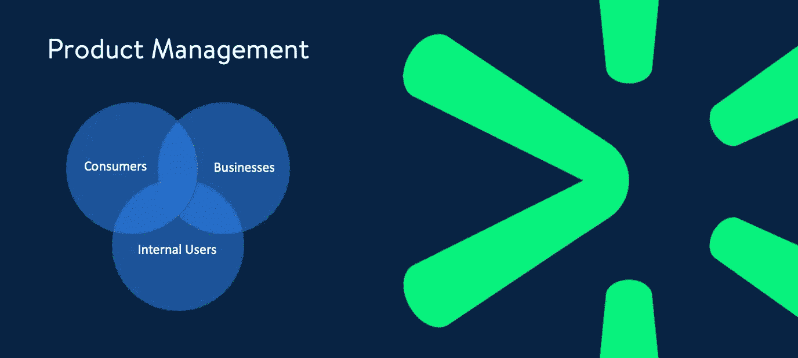
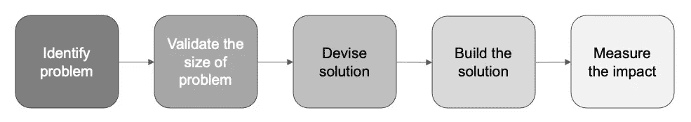
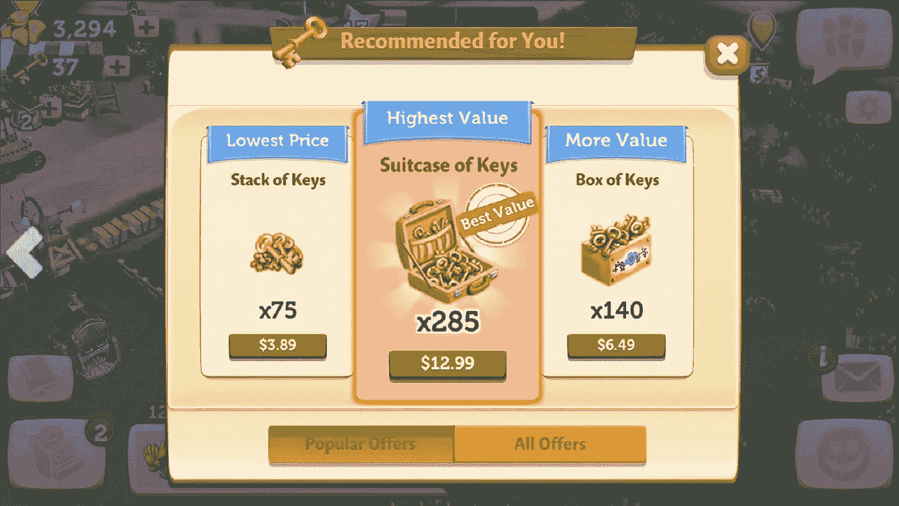

# 为消费者、企业和内部利益相关者打造产品

> 原文：<https://medium.com/walmartglobaltech/building-products-for-consumers-businesses-and-internal-stakeholders-608f25a905fa?source=collection_archive---------0----------------------->

过去几年，产品经理的角色在组织中变得越来越重要，它随着组织的成长阶段、规模和业务类型而变化。即使在同一个组织中，每个项目经理的期望也各不相同。我曾在三种不同类型的环境中为消费者(以下称为 B2C 产品)、企业和内部利益相关者构建产品，我观察到了这些环境中项目经理管理产品角色的差异和相似之处。这篇文章的目的是强调这三种环境中产品管理的细微差别。通常，我们会听到 B2C 和企业产品管理之间的差异。在这里，我想更深入地研究为外部企业(此后称为 B2B 产品)和内部利益相关者/用户分别构建的企业产品。

**什么是产品管理？**

人们经常听说，产品经理就像产品的首席执行官，或者是业务、技术和用户体验的[交叉点](/@bfgmartin/what-is-a-product-manager-ce0efdcf114c)。我认为产品经理应该做以下事情

1.  识别业务问题
2.  根据问题的大小验证是否值得解决问题
3.  想出解决问题的办法
4.  构建解决方案
5.  衡量解决方案的影响

**产品管理——B2C 产品 Vs B2B 产品 Vs 内部产品**

虽然上述 5 个方面对于所有三种类型的产品(B2C、B2B 和内部产品)的产品管理来说是共同的，但在以下维度上有显著差异，如进一步解释的那样。

*   目标
*   产品发现
*   外部因素
*   定价
*   影响
*   用户体验/用户界面设计

1.  **目标**

产品旨在帮助组织实现其收入或运营收入目标。影响营业收入的最大组成部分之一是 [SG & A](https://www.investopedia.com/terms/s/sga.asp) (销售、总务和行政)费用。大多数内部产品都是为了降低 SG &的费用而制造的。例如，在零售企业中，员工可能会花费大量时间来识别仓库中某个商品的位置或管理商店中的现金。这些问题可以通过构建合适的解决方案来减少开支。

另一方面，管理 B2C 或 B2B 产品的产品经理(pm)直接或间接有助于提高组织的顶线(收入)或“增长”。所有产品的主要目标不仅仅是增加收入。在 B2C 产品中，比如说，在电子商务业务中，重点可能是提高用户获取、参与或保留。项目经理专注于让用户满意，并确保产品向用户交付价值。所有这些产品最终都会间接导致收入上升。一些直接创收产品的例子是订阅、货币化产品和购买。同样，我们在 B2B 领域也有 SaaS 产品，其主要关注点是创收。

**2。产品发现**

产品发现是详细了解客户以开发完全满足其需求的产品的关键过程。

在 B2C 产品中，在 web/移动应用程序和热图分析工具中捕获的数据有助于项目经理获得许多见解。除了数据分析，采访用户并进行用户测试以了解他们的需求和担忧也很重要。PMs 还可以利用客户支持聊天会话和电话录音，这就像一个巨大的金矿，以了解用户。

在 B2B 产品中，洞察客户需求的最重要来源是直接与客户互动的销售团队。项目经理参加销售推介会议以评估客户需求和竞争是非常重要的。最近，B2B 产品的终端用户的行为也在使用网络/应用程序分析进行跟踪。

在内部产品中，内部利益相关者是洞察的主要来源。然而，通过对最终用户进行研究来验证需求和问题是很重要的。

**3。关注外部因素**

为了快速适应不断变化的环境，项目经理跟踪外部因素和竞争非常重要。

谈到 B2B 环境的一个例子，苹果[宣布](https://developer.apple.com/app-store/user-privacy-and-data-use/)它正在对其新的 iOS 14 进行彻底的改变，预计这将影响移动广告在 iOS 设备上的工作方式。在这种情况下，管理 AdTech 产品的项目经理应确保产品能够及时了解行业变化，从而应对这些变化

即使在 B2C 产品中，跟踪外部因素也同样重要，尤其是直接和间接竞争。有时候，不重新发明轮子是好的。项目经理可以模仿和增强竞争对手在目标群体中流行的特征。例如， [WhatsApp 随着 Snapchat 的*故事*的成功增加了*状态*功能](https://techcrunch.com/2017/02/20/whatsapp-status/)，这[提高了用户参与度](https://techcrunch.com/2017/05/03/whatsapp-status-million-users/)。

第三方面，内部产品的产品战略和路线图不太可能受到外部因素的影响，除非该产品与第三方产品紧密结合。

项目经理还应关注金融科技产品等监管机构的监管规定，无论环境类型如何。

**4。定价**

定价是 PMs 中需要的关键技能之一，因为它对转化率和盈利能力有重大影响。

在 B2B SaaS 产品中，PM 在确定价格和定价因素(如用户数量、事件和存储等)方面起着关键作用。项目经理应该分析竞争，了解采用他的产品的顾虑。

Pricing of Atlassian’s Jira based on the no. of users ([https://www.atlassian.com/software/jira/pricing](https://www.atlassian.com/software/jira/pricing))

谈到 B2C 产品，在移动应用程序游戏中管理应用内购买(IAP)的项目经理应该在最佳点对购买进行定价，以实现收入最大化，同时关注用户参与度和留存率。

Pricing of in app purchases in Farmville ([https://www.zynga.com/games/farmville-2/](https://www.zynga.com/games/farmville-2/))

另一方面，定价与 PMs 管理内部产品无关。但是，他们确实需要评估产品是应该内部构建还是应该采用现有的第三方解决方案。

**5。影响**

衡量产品/产品特性的影响是项目经理最重要的技能之一。根据产品的类型，跟踪与您的业务目标一致的正确指标是很重要的。

在 B2C 产品中，可以通过跟踪转化率、参与度和保留率等指标来衡量影响。使用网络/移动应用分析工具。

在 B2B 产品中，收入、活跃用户、客户数量和完成任务的平均时间等指标。应该被追踪。我们可以使用分析工具来跟踪其中的大部分。

在内部产品中，总时间、完成一项任务或节约成本所需的工时数等。可以被追踪。

**6。用户体验& UI 设计**

在 B2C 产品中，消费者是决定是否继续使用该产品的决策者。因此，最重要的是确保消费者的体验是最高质量的。重要的是，项目经理要识别出那些导致糟糕体验的交互点，以及那些卡住的点。

在 B2B 产品中，用户可能会遇到卡住的情况。在这种情况下，他们可能需要解决歧义，因为他们必须使用该产品。然而，随着竞争的加剧，对于项目经理来说，确保用户体验不被忽视是很重要的，因为决策者将最终用户的体验视为决策过程中的一个重要因素。

在一个内部产品中，UX 对于确保用户高效地完成任务是很重要的。然而，对视觉设计的关注可能没有 B2C/B2B 产品那么高。

总之，这三种类型的产品管理需要不同的技能和策略。最终，项目经理的目标是帮助企业实现其目标。有些经前综合症可能会在这三种类型之间转换，而有些可能会强烈倾向于其中一种类型。