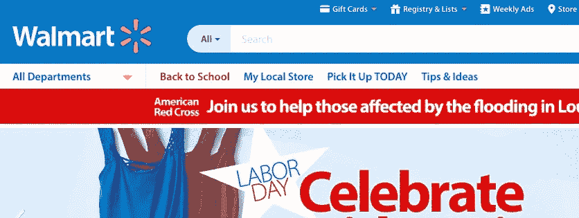
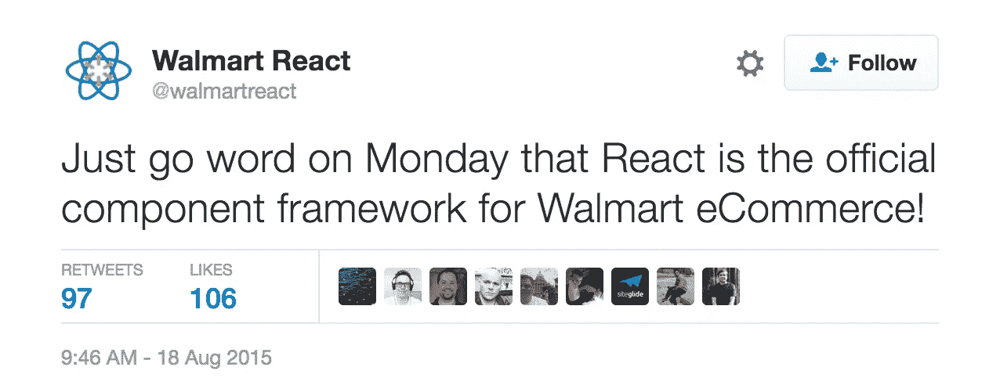
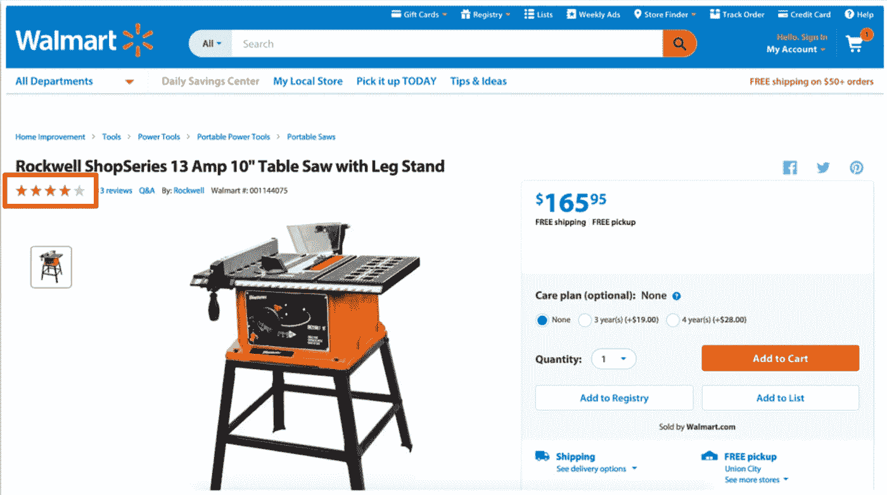
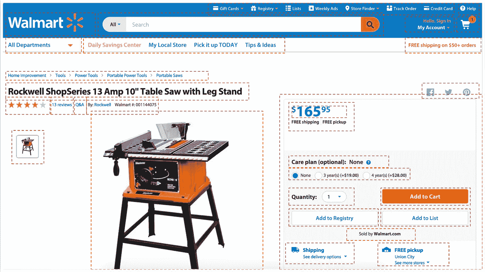

# 构建企业级的 React.js

> 原文：<https://medium.com/walmartglobaltech/building-react-js-at-enterprise-scale-17c17a36fd1f?source=collection_archive---------0----------------------->



# 介绍

沃尔玛已经将[**react js**](http://reactjs.net/)**&react toolset**大量整合到各种网站/网络应用中。React 以组件为中心的方法很好地融合了解决遗留堆栈问题，有助于加快采用和实现周期。工程师们喜欢这样的事实，即整个应用程序或页面可以被分解成更小的块，这些块是描述性的和可重用的 UI 元素。



在本帖中，我们将通读我们所面临的挑战，以及将整块页面分解成更小组件的思考过程。我们还将介绍沃尔玛工程组织如何贡献、分享想法、分享知识和代码——当工程组织横跨水平和垂直领域时，这不是一项容易的任务。

我们面临的挑战。

在我们的遗留系统中，所有的 UI 都在一个模板中，这使得阅读代码和进行修改变得更加困难。通常，一个好的实践是将一个较大的应用程序分解成较小的块，以帮助共享和重用代码库的不同部分。



例如，考虑这个产品页面上的分级视图。生成的 HTML 看起来类似下图。想象一下，将这段相同的代码复制粘贴到多个不同的页面上，会导致这样一个问题:“为什么这段 UI 代码可以存在于一个公共的地方，并且可以从一个真实的来源共享？”

暂停一会儿，想想在上面的例子中，我们如何构建更小的组件来制作更大的产品页面。



这里有一些更小的水平块，可以提取到更小的建筑块。 *React 非常适合这种基于组件的方法。*共享的较小块对应用开发者隐藏了标签、CSS、UX 的复杂性。

上述产品页面的 React 组件示例如下:

```
<Stars/>
<Breadcrumbs/>
<ProductTitle/>
<ProductImage/>
<Button/>
.... etc.
```

该评级的用户界面代码如下所示:

```
<Stars total={5} average={4.0} />
```

综上所述，我们已经阅读了我们所面临的挑战，组件是多么的棒，React 如何帮助我们构建更小的可共享、可重用和易读的组件。

在我们即将发布的博客文章中，我们将深入探讨这些可共享组件的流程和治理，以及如何在大型开发团队(> 300 人)中实现、部署和维护新组件。