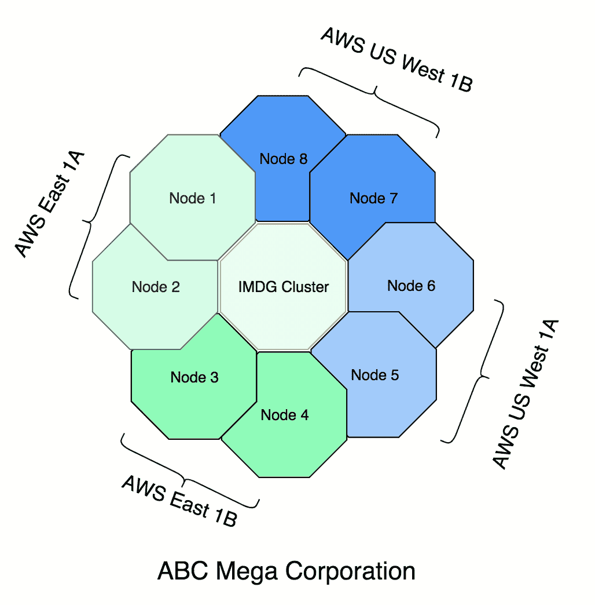
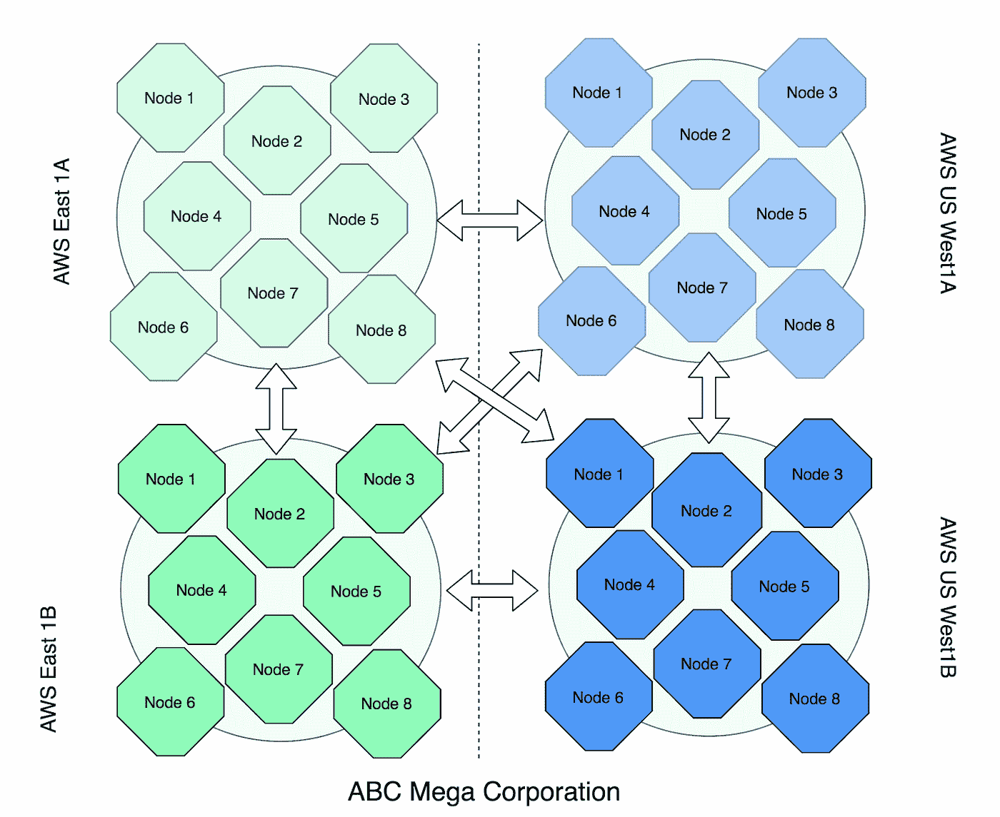
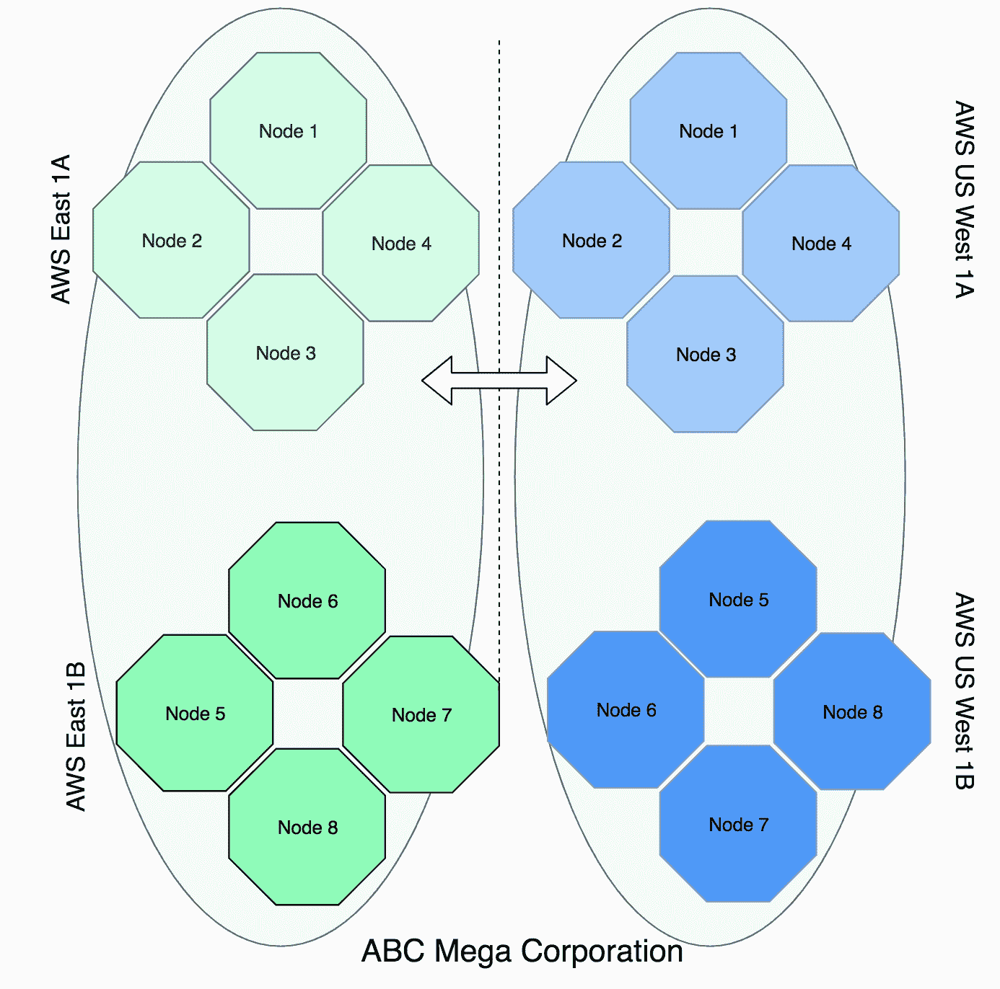
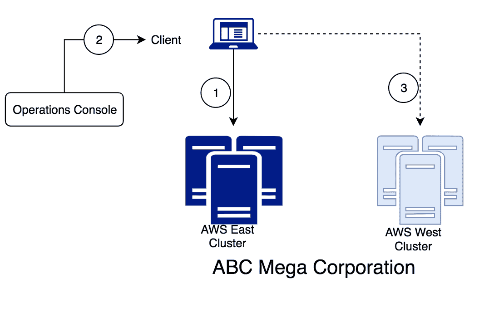
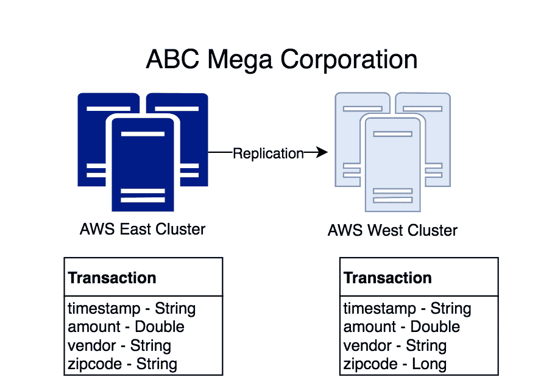
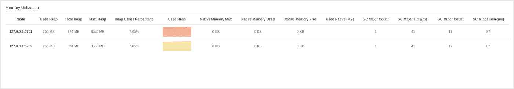

# 构建 IMDGs 的基础知识

> 原文：<https://medium.com/capital-one-tech/building-resilient-imdgs-with-hazelcast-23014d778086?source=collection_archive---------4----------------------->

## 使用 Hazelcast 构建弹性内存数据网格

在当今世界，数据至关重要。作为开发人员或数据科学家，您可能会从各种系统中获取数据。同样，你的数据可能来自*不同的系统。随着大数据技术的采用，这两种场景在企业系统中同时大规模出现。内存数据库是我们处理大型数据集并在几毫秒或更短时间内执行操作的方式之一。作为构建任何平台的关键组件，内存数据网格(从现在开始为 IMDG)是维护数据弹性的关键。*

使用它们构建高弹性数据解决方案有几个方面。就像一条链条，一个薄弱环节就会危及整个链条。在这篇博文中，我将讨论在构建高弹性 IMDG 解决方案时应该考虑的一些事情。我们将在下面详细研究内存数据网格的各种弹性方面，如基础设施、网络、数据、流程、备份、监控等。

在本帖中，我们还将考虑一个用例，其中“ABC Mega Corporation”在美国东部和西部拥有大量用户。北弗吉尼亚和加利福尼亚的 AWS 区域被用作他们的数据中心。我们将在整篇文章中使用这个用例来讨论数据弹性的各个方面。

*但是首先，什么是黑兹尔卡斯特？*

# 什么是 Hazelcast 内存数据网格？

让我们看看 Hazelcast 他们自己是如何定义的—[*hazel cast IMDG 是领先的开源内存数据网格(IMDG)。IMDGs 旨在通过在多台机器上分发数据来提供高可用性和可伸缩性。*](https://hazelcast.com/use-cases/imdg/) *"* 众所周知，它是 SQL 数据库的高速缓存，但是它也是分布式高速缓存的优秀解决方案，并且能够计算数据的位置。

因此，事不宜迟，让我们为哈兹卡斯特 IMDG 公司构建一个弹性平台。

# 基于基础架构的弹性

当我们为 ABC Mega Corporation 构建集群时，首先要考虑的事情之一是数据如何在数据中心内传播。构建高弹性解决方案意味着您希望将数据与任何数据中心故障隔离开来。这样，如果数据中心的连接中断，或者特定数据中心上的计算机受到硬件问题的影响，您的系统及其数据都不会崩溃。

让我们考虑为 Hazelcast 构建 IMDG 集群的不同选项。

## 跨数据中心的单个集群

一般来说，您希望避免构建跨数据中心的单个“集群”。最大的缺点是它是一个**‘单一’**集群，如果你的目标是构建一个弹性解决方案，这应该敲响警钟。在这种设置中，任何影响单个集群的问题都意味着您的整个系统(跨两个不同的位置)将会倒霉。您需要构建明确的备份配置，以确保您的主副本和备份副本不在同一个数据中心。

**延迟**:如果您的数据中心在地理位置上相互远离，那么您的“读取”和“写入”的总体延迟都会受到影响，因为数据的主副本可能与请求数据的应用程序不在同一个数据中心。如果您的系统配置为等待，直到数据写入主节点和备份节点，您还会遇到很长的写入延迟。

**复制:**在这个场景中，假设您只有一个集群，那么您不需要担心复制问题。

**数据一致性**:在这个场景中，假设您只有一个集群，那么您通常会有很高的数据一致性(因为没有任何其他集群可以用来比较不一致性)。

***注意—在撰写本文时，Hazelcast 官方不支持此配置，其主要原因是“距离会带来意外行为。”***

## 每个数据中心一个集群

这个解决方案是我们的另一个极端，每个数据中心都有自己的 IMDG 集群。该解决方案将提供多个群集，任何影响单个数据中心的问题都不会导致系统范围的故障。

**延迟**:您的应用程序应该配置为从同一个数据中心的集群中读取/写入。这将为您提供最佳的读写延迟。假设您的备份副本将在同一个数据中心内维护，那么对于同步备份写入，您的“写入”延迟将是可管理的。

**复制**:另一方面，您需要在所有集群之间复制数据。复制本身并不一定不好，但是您使用了额外的堆内存，并利用了相同的网络和额外的计算。有关更多详细信息，请参考“广域网复制”。

**数据一致性**:如果您的数据可以在任何集群中更新，那么它将通过复制过程进入。在数据被复制之前，您可能会在一小段时间内遇到数据不一致的情况。这个模型将导致*最终*的一致性。如果所有四个群集都采用相同的流量，则任何群集都可以预期约 75%的数据更新仅通过复制过程完成。注意—您应该注意复制期间潜在的数据冲突，这可能会导致数据完整性问题。

## 每个区域一个集群

此解决方案介于上面讨论的两个选项之间，在这两个选项中，您有多个群集，这些群集的节点在物理上彼此相距不远。在同一“区域”内，将数据从主节点移动到备份节点通常会有较低的延迟。因此，您的“写入”延迟不会受到严重影响，并且需要复制数据的群集数量会大大减少。

**延迟**:您的应用程序应该配置为与同一区域的 IMDG 集群通信，并且应该有合理的读/写延迟。假设您的备份副本保存在同一区域，但在不同的数据中心，您的“写入”延迟将介于上述两种同步备份写入选项之间。

**复制**:您需要在所有集群之间复制数据。假设您只管理两个不同区域中的两个集群，那么与上面的选项相比，您对内存、网络和 CPU 的总体影响要小得多。

**数据一致性:**如果您的数据可以在任何集群中更新，那么它将通过复制过程进入。在数据被复制之前，您可能会在一小段时间内遇到数据不一致的情况。假设您只有一个传入的复制流，并且如果两个集群共享相同的负载，则 50%的数据更新将通过复制传入；少于上述选项。这种模式将导致最终的一致性。和上面的选项一样，您应该注意在复制期间处理潜在的数据冲突，这可能会导致数据完整性问题。

# 数据弹性—备份计数、裂脑保护和协调

现在，我们已经构建了群集，让我们保护其中的数据。在 Hazelcast IMDG，节点不断地相互通信，以了解哪些成员是集群的一部分。如果一个节点出现故障，群集中的其他成员将自动检测故障，并跨其余节点调整数据。这个过程被称为**“集群重新平衡”**。

让我们来看看 ABC Mega Corporation 由于不同类型的故障而可能出现的某些情况。

# 故障场景#1

先从最简单的说起。我将使用一个有八个节点的集群示例，其中一个节点出现故障。群集的其他成员将检测到这一变化，群集将重新平衡自身。允许您的集群针对单节点或多节点故障提供保护的关键配置是*备份计数*。

这里的要点是，您希望根据预期的节点故障情况配置备份计数。备份数量越多，您就需要越多的备份副本跨计算机可用，代价是额外的空间和网络消耗。

# 故障场景#2

让我们看看另一种类型的失败。网络内的通信故障可能导致网络的某些部分无法到达其它部分。假设我们的集群由八个节点组成，备份数量为两个。不知何故，两组节点之间的连接丢失，形成两组五个节点。

这两个组中的每一个组都将表现得好像群集的某个部分已经丢失，并将立即开始重新平衡群集中的数据。如您所见，这将导致这些群集的数据丢失，连接到任一组的客户端都将看到受损的数据。这里提到的问题被称为*裂脑问题*，Hazelcast 提供了一个名为[的功能，即 Quorum configuration](https://docs.hazelcast.org/docs/latest/manual/html-single/#dealing-with-network-partitions) ，以确保网络中有最少数量的机器可供数据结构响应。如果集群大小低于配置的数量，将会导致“QuorumException”。

几乎所有高弹性系统都内置了某种自我修复功能。当您处理数据完整性至关重要的情况时，如果多个集群分布在不同的地理位置，您可能需要考虑数据协调选项。大体上，这里有两种选择。

*   第一种选择是定期与源系统协调数据。例如，夜间批处理可以保持 Hazelcast 集群中的数据同步。该选项将有助于协调任何一开始没有进入 Hazelcast 集群的数据。
*   第二个选项是利用 Hazelcast 的[协调功能](https://docs.hazelcast.org/docs/latest-dev/manual/html-single/#delta-wan-synchronization)，该功能允许您验证两个集群是否同步，如果发现任何一方的数据丢失，则启动数据传输。

# 运营弹性

到目前为止，我们已经为 ABC Mega Corporation 的集群实现了基础设施和数据特定的弹性。但是，对于 Hazelcast 集群的可用性，您仍然可能有盲点。如果运营流程没有考虑所需的可用性，并要求每次变更都要完全重建 Hazelcast 集群，情况尤其如此。

以下是在版本升级和数据升级期间实现弹性的两种不同方法。

*   **利用滚动升级功能:**参考文档，了解如何升级 Hazelcast 版本，而不必先终止整个 Hazelcast 集群。请参考此处的文档。
*   **为客户端提供自动故障转移配置:**将高可用性(HA)配置内置到客户端的配置中很有帮助。这样，如果它们正在通信的 Hazelcast 群集改变状态，它将自动检测并连接到 HA 群集，该群集可能是您在另一个位置或灾难恢复区域的另一个群集。这不仅可以在计划场景中保存系统，而且对于计划外的系统中断(如 EC2 故障，此时客户端会自动重新连接到另一个集群，而不会停机)也很方便。

对于 ABC Mega Corporation 的使用案例，部署在美国东部地区的客户端应用程序将部署在 AWS East 的 Hazelcast 集群作为其主服务器。在服务器再水化或计划部署期间，操作控制台将触发集群配置升级，以指向 AWS West 集群。操作控制台可以构建在应用程序中，这是手动触发的，或者它可以具有检测 IMDG 集群潜在问题的逻辑。

# 集束补液

如果您的流程要求您必须重建整个集群，那么您应该考虑如何用数据更新集群。有一些简单的解决方案，比如运行一个单独的进程，从记录系统中读取数据，并将其添加到 Hazelcast 集群中。这些可能有用。但是，一个更简单的选择是利用现有集群，并使用它来复制新建集群中的数据(如果您的数据大小允许的话)。

如果您的数据量很大，更好的选择是利用[热重启特性](https://docs.hazelcast.org/docs/latest-dev/manual/html-single/#hot-restart-persistence)，它允许在重启或升级时使用磁盘将数据带入内存。

# 数据格式升级

在考虑了以上所有选项之后，ABC Mega Corporation 的 IMDG 集群仍然缺少一个关键部分——如何引入数据结构更新。让我们来看一个场景，看看它为什么如此重要。

您有一个存储“交易”信息的映射，其中包括时间戳、金额、供应商、邮政编码等典型字段。系统以 BAU 模式运行，多个集群处理流量。引入了一项更改，允许邮政编码包含字母数字值。集群 A 使用字母数字值中的邮政编码进行升级，而集群 B 仍使用旧的五位数数值符号。现在，随着集群 A 中的数据被复制到集群 B 中，它会生成数据解析异常。

这类更改的黄金法则是，“添加新字段/不要修改现有字段”。

在这种情况下，以 proto 格式存储数据非常方便。在上面的场景中，如果我们在地图的数据结构中添加了一个新的字段，那么两种原型格式仍然是兼容的，并且当地图的两个版本同时存在时，不会导致复制中断。

如果启用了“热重启”之类的持久性机制，那么避免这种带有更新的中断性更改就变得更加重要。

# 永远为灾难做准备

弹性不仅仅是防止失败，还包括从失败中恢复的能力。因此，ABC Mega Corporation 必须建立适当的控制措施，帮助他们及时恢复。

# 备份/恢复

可以将群集配置为在不同的位置生成备份，然后可以使用该备份将数据装载/复制到群集中，然后再将数据提交到群集中。在这里参考 Hazelcast 文档[。](https://docs.hazelcast.org/docs/latest-dev/manual/html-single/#hot-backup)

# 来自另一个集群的种子数据

根据您的使用情况，如果您有多个启用了复制的集群，您可以在合理的时间内从另一个健康的集群从头构建一个新的集群。

但是，在某些情况下，您仍然希望启用备份/恢复。例如:

1.  多集群场景，其中您的集群包含特定于“状态”的数据(意味着您希望将数据保持在相同的状态，并且无法从另一个集群或备份加载所有数据)。
2.  多群集情形，其中由于需要同步的数据的大小，群集大小阻止复制成为可行的选项。

# 热重启

可以启用 Hazelcast 群集来将数据保存在磁盘上，然后在群集恢复运行时使用这些数据来“播种”数据。如果 Hazelcast 集群运行在固定的机器上，其中相同的磁盘总是可用于相同的实例，这是相当简单和直接的。但是，对于云应用程序，您需要在集群停止运行之前分离 EBS 卷，然后在新实例恢复后，在加载数据之前附加相同的卷。

# 监控系统—检测故障

ABC Mega Corporation 的 IMDG 集群几乎不可能在没有适当监控的情况下声称他们拥有高度弹性的系统。Hazelcast 构建了一个很棒的控制台工具来帮助可视化集群的内部细节，但是每个组织都有自己喜欢的监控和警报机制。

Image taken from :[https://docs.hazelcast.org/docs/management-center/latest/manual/html/#status-page](https://docs.hazelcast.org/docs/management-center/latest/manual/html/#status-page)

我发现 [JMX 豆](https://docs.hazelcast.org/docs/management-center/latest/manual/html/#clustered-jmx-via-management-center)非常有用，不仅可以理解集群和地图的状态，还可以观察模式。当然，JMX 提供的很多东西也可以通过 ManCenter 控制台本身看到。然而，JMX，或类似的解决方案，将提供集成所需的集成与您选择的监测工具。比如，*“我是否看到‘获取’或‘上传’操作的最大延迟在特定时间出现峰值？”*或“*当一个特定的进程运行时，我的内存使用量是否在攀升，集群是否会很快抱怨没有足够的本机或堆内存？”*这里有如此多的数据点可供使用，而基于 JMX 的 beans 提供了一种更简单的收集它们的机制，然后可以将它们输入到任何有 JMX 插件的监控系统中。

# 结论

正如我前面提到的，构建一个可靠的内存数据网格应该考虑网格的所有方面，从基础设施的创建到数据位置，到集群内外的备份，再到处理和更新过程中遵循的流程。监控和警报对于构建弹性系统至关重要，不容忽视。这些只是我的一些想法，基于我在有和没有 Hazelcast 的情况下构建 IMDGs 的经验。

我要感谢 Capital One 软件工程总监 Srinivas Alladi 的所有评论和专家意见。

*以上观点为作者个人观点。除非本帖中另有说明，否则 Capital One 不隶属于所提及的任何公司，也不被其认可。使用或展示的所有商标和其他知识产权都是其各自所有者的所有权。本文为 2019 首都一。*