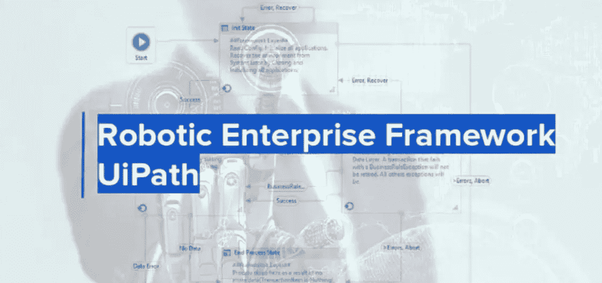
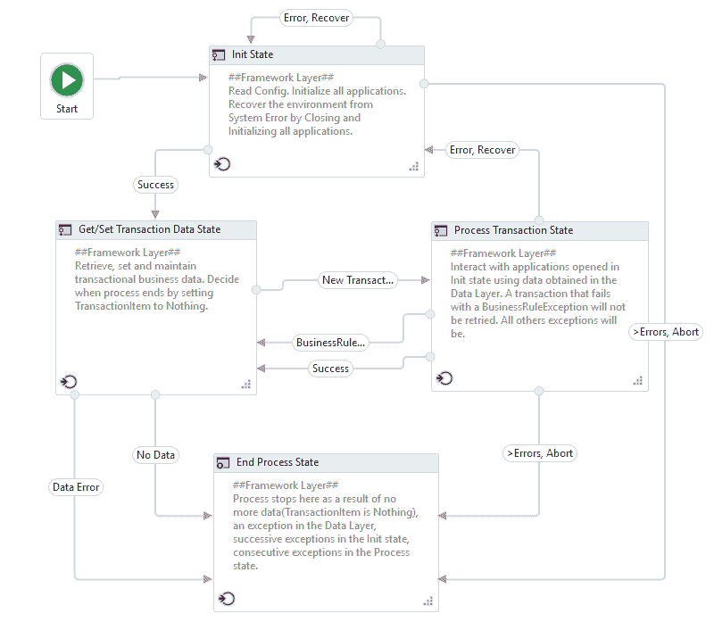
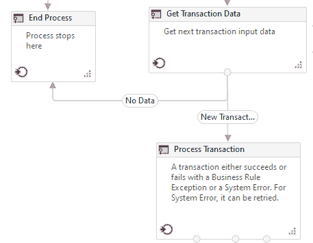
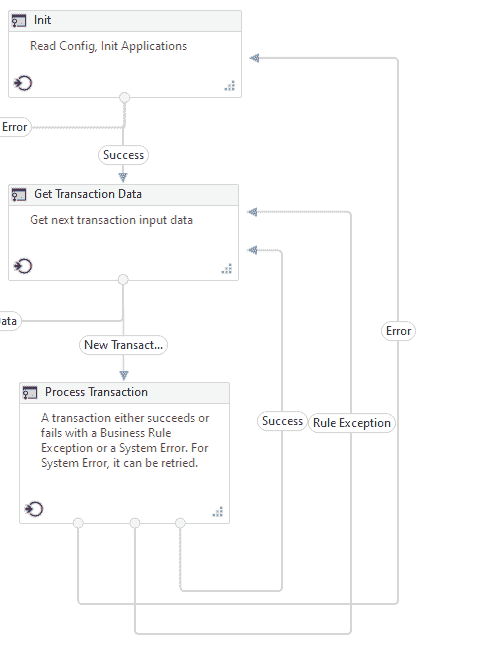
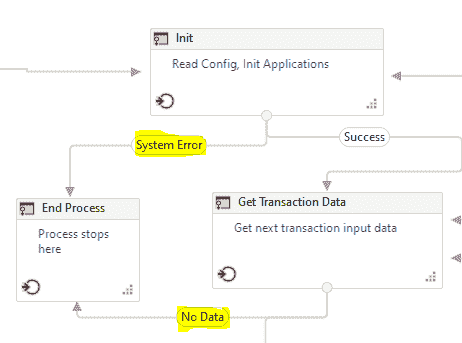

# 使用 UiPath 重新框架在 RPA 中构建弹性工作流

> 原文：<https://medium.com/globant/building-resilient-workflows-in-rpa-with-uipath-re-framework-9d32042c425a?source=collection_archive---------2----------------------->

**RPA？**

**R**obotic**P**process**A**automation(**RPA**)是一种趋势技术，它允许组织和个人自动化重复的手动任务，以跨多个应用程序和系统执行业务流程。

与传统 IT 解决方案相比，RPA 允许以很少的成本和时间实现业务流程自动化。RPA 是没有 API 或数据库访问异构传统系统的应用程序的理想解决方案，我们不想构建全新的应用程序。在这些情况下，简单地部署 RPA bot 可以为企业节省时间和金钱。

**RPA 平台**

RPA 软件平台是一种计算机软件，它允许以一系列操作或活动的形式实现业务流程自动化，可以称为工作流，利用另一个软件代理来执行自动化流程。

在 RPA 市场上，有几家供应商推出了他们独特的 RPA 软件平台。UiPath、Automation Anywhere、Blue Prism、Work Fusion、Pega、Power Automate 等。是 RPA 技术的一些领导者。

**工作流程**

为了促进不同类型业务流程的自动化，UiPath 提供了以下四种(截至 2020 年 11 月)不同的工作流布局类型

1.  顺序
2.  流程图
3.  状态机
4.  全局异常处理程序

RE 框架使用状态机布局作为主干。

**RE 框架？**

Robotic Enterprise Framework，通常也称为 RE framework，构建在事务性业务流程模板之上，在自动化项目的各个阶段使用**状态机**布局，并提供高级别的异常处理和应用程序恢复。

状态机是一种在执行过程中使用有限数量的状态的自动化。一个**有限状态机** (FSM)或者简称为**状态机**，是一个计算的数学模型。它是一个抽象的机器，在任何给定的时间都可以处于有限的**状态**中的一个状态。FSM 可以响应一些外部输入从一种状态改变到另一种状态；从一种状态到另一种状态的变化称为**转换**。

该框架帮助开发人员根据行业最佳实践原则自动化流程。从而使我们能够

*   清理开始并存在
*   自动恢复
*   重试次数
*   状态管理
*   干净的编码
*   记录

可再生能源框架的一些主要特点如下所述。

**可再生能源框架的好处**

**低代码签名:**RE 框架提供了一些清晰编写的、注释过的可重用函数，任何人都可以理解，以及一个注释过的 Main.xaml，它为流程设计架构带来了结构

**关注点分离:**框架实现与业务逻辑代码分离，允许开发人员和**中小企业**一样关注构建过程

**可重用性:**适用于任何类型的流程，独立于数据源(队列项、本地 excel 文件、数据库数据、API **检索的**数据)，独立于流程线性

**维护、扩展和升级:**易于维护，得益于代码轻量级和 SOC。通过编辑以标准方式连接到 Main.xaml 的 6 个空工作流，扩展以实现流程行为。使**开发人员**能够独立于业务代码升级或扩展框架，只需编辑一个文件，Main.xaml

**异常恢复和重试:**顶层异常恢复由框架层管理，带有重试规则，可以很容易地**配置**。

**审计:**跟踪机器人的工作，借助全新的 Workblock 概念，您可以选择尽可能多的细节和隐私；将您选择的业务信息添加到发布的日志中。

**借助 RE 框架进一步深化**

RE Framework State diagram

提供的有限状态有:

1.  **初始状态**

初始化状态用于启动应用程序并设置流程所需的静态变量。它充当构造函数。它也是一个清洁工作环境的地方，以便机器人可以不受任何干扰地执行该过程。这个国家机器的主要职责是:

*   **从全局配置文件中读取配置** —默认情况下，RE 框架提供了一种从. xlsx 文件中读取配置的方法。然而，修改模板以使用任何其他源(如 DB、JSON 文件等)是非常容易的。
*   **初始化所有必要的应用程序** —执行初始化工作流程中使用的应用程序的步骤。
*   **通过关闭并初始化 all，从机器人的系统错误中恢复环境**。

**2。获取交易数据状态**

在这种状态下，返回要处理的单个事务项。该状态返回的事务项充当流程状态的输入。

默认情况下，RE 框架提供的事务项是一个 QueueItem。但是，可以很容易地将其配置为使用 DataRow 或任何其他定制的类。

如果没有更多的事务项目需要处理，机器人将进入结束处理状态。

**3。处理交易**

这里实现了特定于业务的工作流，简而言之，实际的流程逻辑就是在这种状态下工作。如果我们从 MVC 的角度来考虑，流程事务状态将是我们编写业务逻辑的模型。

如果执行中出现错误，流程将进入初始状态，并根据配置的重试次数再次执行相同的事务。重试次数决定了出错时重试事务的次数。

如果流程执行成功或者存在业务/规则异常，那么它的执行将通过获取处于获取事务数据状态的下一个事务来继续。

**4。结束流程**

如果没有更多的事务要处理，或者出现系统错误，流程无法继续执行，则流程会进入这种状态。

**结论**

重新构建框架将有助于我们构建可扩展且强大的 RPA 机器人。该框架在 UiPath studio 中是一个模板项目，只需点击几下鼠标，就可以开始构建一个自动化项目。此外，您可以根据自己的需求对模板进行调整。