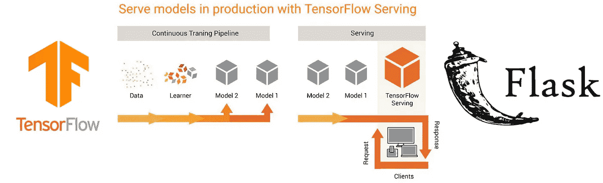

# 在几分钟内构建强大的生产就绪型深度学习视觉模型

> 原文：<https://medium.com/google-developer-experts/building-robust-production-ready-deep-learning-vision-models-in-minutes-acd716f6450a?source=collection_archive---------0----------------------->

## TensorFlow 服务综合实践指南

# 介绍

由于更快的计算、更好的存储和易于使用的软件，基于深度学习的解决方案肯定会从概念验证隧道走向现实世界！我们…