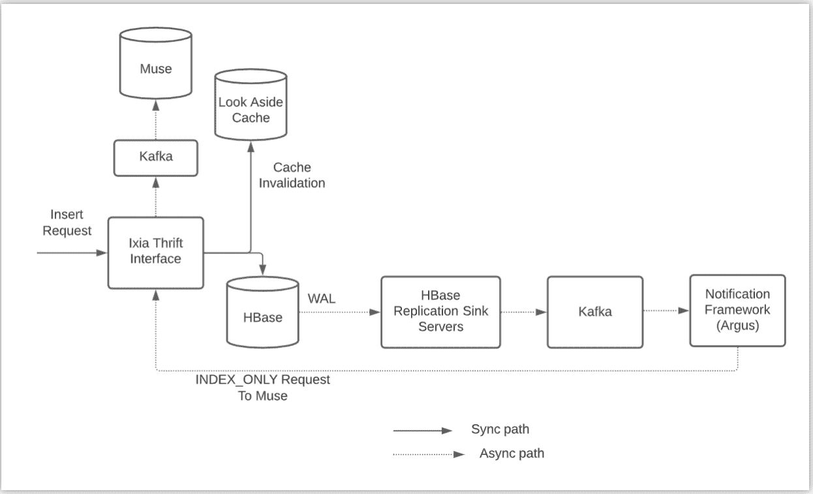
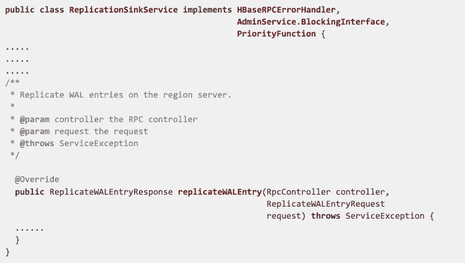
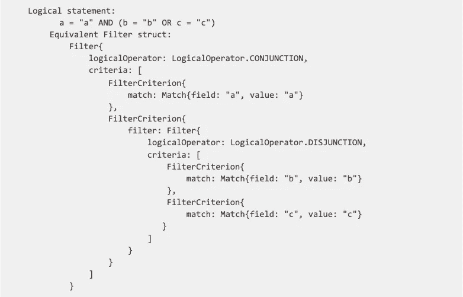

# 在 HBase 上构建可扩展的近实时索引

> 原文：<https://medium.com/pinterest-engineering/building-scalable-near-real-time-indexing-on-hbase-7b5eeb411888?source=collection_archive---------3----------------------->

Ankita Wagh |软件工程师，存储和缓存

HBase 是 Pinterest 最重要的存储后端之一，为我们的许多在线流量存储服务提供支持，如 Zen(图形数据库)和 UMS(宽列数据存储)。虽然 HBase 有许多优势，如高容量请求中行级别的强一致性、灵活的模式、低延迟的数据访问和 Hadoop 集成，但它本身不支持高级索引和查询。二级索引是我们的客户最需要的特性之一，但是在 HBase 中直接支持它是相当具有挑战性的。就查询效率和代码复杂性而言，随着索引数量的增长而维护单独的索引表不是一个可伸缩的解决方案。这促使我们构建一个名为 Ixia 的存储解决方案，在 HBase 上提供近乎实时的二级索引。设计灵感主要来自于 [Lily HBase Indexer](https://ngdata.github.io/hbase-indexer/) 。

Ixia 在 HBase 的基础上提供了一个通用的搜索接口，它扮演了事实来源数据库的角色。搜索引擎本身针对倒排索引查找进行了优化，存储索引。搜索引擎还提供丰富的搜索和聚合查询，并支持 Pinterest 的大多数索引和检索用例。

在本帖中，我们将首先简要介绍系统的架构和设计选择。然后，我们将介绍我们如何维护 Ixia 的数据一致性 SLA，我们如何解决灾难恢复问题，以及我们必须采取哪些措施来提高整体系统性能。最后，我们将提供一些关于未来工作和机会的指导方针。

# 体系结构

Figure 1: System architecture showing data flow

在各小节中，我们将简要描述每个组件，最后解释整个流程。

## HBase

HBase 是一个面向列的 NoSQL 数据库管理系统，运行在 Hadoop 分布式文件系统(HDFS)之上。它是仿照谷歌的大表，用 Java 编写的。它非常适合实时数据处理或对大量数据的随机读/写访问。我们使用 HBase 作为 Ixia 的真实数据库来源。

**复制机制&改变数据捕获(CDC)系统**

HBase 复制是一种将数据从一个 HBase 集群(主)复制到另一个集群(辅助)的机制。这是通过从活动集群向备用集群区域服务器重放预写日志(WAL)中的预写日志条目(WALEdits)来异步完成的。WALEdit 是一个表示一个事务的对象，可以有多个变异操作。由于 HBase 支持单行级事务，一个 WALEdit 只能有一行的条目。

我们引入了定制的 HBase 复制接收器服务器，实现备用集群的复制接收器 API。复制接收器服务提供了将 WAL 事件转换成消息的业务逻辑，并在不改变 HBase 代码的情况下将它们异步发布到 Kafka。如果复制接收服务器能够将此事件发布到 Kafka，它会向复制源(主)群集发送确认(ACK)。

Figure 2: Code snippet showing API of Replication Sink Service

名为 Argus 的内部通知框架接收 Kafka 事件，并基于这些事件触发业务逻辑。

这两个系统与 Kafka 一起构成了我们基于 HBase 的 CDC 框架的主干，除了 Ixia 之外，它还被广泛用于多个用例。HBase 复制接收器机制保证所有 wal 都发布到 Kafka，Kafka 的使用者为每个事件执行客户定义的业务逻辑。

## 搜索引擎

我们有一个名为 [Muse](/pinterest-engineering/manas-realtime-enabling-changes-to-be-searchable-in-a-blink-of-an-eye-36acc3506843) 的内部搜索引擎，这是一个通用的信息检索平台。Muse 针对在线服务进行了大量优化，并提供了丰富的搜索和聚合查询。Muse 在 Pinterest 上用于不同的关键用例，如家庭订阅、广告、购物等。Ixia 使用 Muse 作为搜索引擎，在非行键列中提供丰富的搜索功能。

我们评估了 Solr 或 ElasticSearch 作为搜索引擎的使用。两者都被业界广泛采用，并具有良好的查询和索引性能。Muse 与 Solr 和 Elasticsearch 的功能相当，它完全集成在 Pinterest 堆栈中。我们决定选择 Muse，以保持技术堆栈与 Pinterest 的其余部分保持一致。尽管如此，如果将来需要，我们在 Ixia 中的可插拔查询引擎接口使得切换到不同的搜索引擎更加容易。

## 隐藏物

Ixia 使用 Pinterest 的[分布式缓存基础设施](/pinterest-engineering/scaling-cache-infrastructure-at-pinterest-422d6d294ece)，由 [Memcached](https://github.com/memcached/memcached) 和 [Mcrouter](https://github.com/facebook/mcrouter) 提供支持。它使用后备缓存策略来优化读取性能并减少 HBase 上的负载。Ixia 的请求模式的特点是非常高的读写比率(~15:1)，添加缓存节省了大量基础设施成本。每个缓存条目对应一个 ixia 文档，该文档又对应一个 HBase 行。读取请求首先在缓存中进行同步检查，并在可用时返回给客户端，缺失的条目从真实源存储中异步回填。所有写请求首先在缓存中删除，以维护 Ixia 的数据一致性契约。Ixia 中的查询 API 提供了从文档中请求字段子集的灵活性。为了降低从缓存和 HBase 组装文档的实现复杂性，我们决定故意拒绝不包含所有请求字段的缓存条目，并将它们异步回填到缓存中。

我们试验了直写缓存策略，发现如果 Ixia 在写入时间写入缓存，命中率会非常低。由于较高的读/写比率，写流量非常低，以至于文档最终从 HBase 中读取，缓存不是很有用。在如上所述将策略改为后备之后，缓存命中率显著提高，一直在 90%左右。

## 端到端请求流

1.  当 insert/upsert 请求进来时，Ixia 从缓存中删除这个键，并同步写入 HBase(如图 1 所示)。WAL 在被复制到复制接收器服务器之后被发布到 Kafka。通知框架(Argus)使用更新事件并将请求发送给 Ixia，请求中带有一个标志，指示服务只能通过 Kafka 更新 Muse。删除/移除请求的流程类似。
2.  当一个查询请求进来时，Ixia 将它发送给 Muse 进行倒排索引查找。然后，Ixia 在 HBase 中对 Muse 返回的所有文档键执行正向数据查找，以确保这些文档存在于真理数据库的源中。
3.  当一个 Get 请求进来时，Ixia 直接从数据库获得结果，并将其返回给客户机。这个 RPC 是一个相对较薄的包装器，用于 KV 对 HBase 的直接访问。

# 数据模型

Ixia 是一个文档存储库，由以下不同的逻辑组件组成

名称空间— Ixia 的名称空间与 HBase 中的名称空间和 Muse 中的名称空间有 1:1 的映射。

文档键—这个键唯一地标识一个 Ixia 文档，并与 HBase 行键有 1:1 的映射。

表 Ixia 表映射到 HBase 表。

字段 Ixia 字段的结构为 <namespace>: : <hbase_column_family>: <hbase_column_name>，唯一标识一个 HBase 单元格和一个 Muse 索引字段。</hbase_column_name></hbase_column_family></namespace> 

# 模式管理和生存时间(TTL)支持

Ixia 支持在线模式更改。HBase 是无模式的，但是 Muse 使用预先声明的类型化模式。目前，Ixia 支持在不影响在线流量的情况下添加新的索引。这些索引需要部署在 Muse 配置和 Ixia 节俭层。新的索引以后可以由客户机为旧文档回填。

Ixia 支持 TTL，保证 Hbase TTL +/- cache TTL。如果文档在 HBase 中缓存并过期，可能会出现不一致的情况。因此，我们为对到期准确性更敏感的用例设置较短的缓存 TTL。

# 一致性模型

Ixia 类似于 HBase，支持强一致性 Get 请求。只有在对数据库的写请求成功后，索引才会更新。这是 CDC 框架的自然结果，因为 WAL 事件肯定会发布到复制接收器服务，从而发布到 kafka。通知框架使用这些消息，并通过 Ixia 向 Muse 发送索引请求。这种保证是使用 CDC 层进行索引的核心设计动机之一。查询 API 用于从搜索引擎中搜索文档。它提供了丰富的功能，如基于匹配、成员、范围等的过滤。，以及基于总和、平均值、最大值、最小值等的聚合结果，如图 3 所示。由于架构的异步索引，查询 API 最终是一致的。P99 从编写文档到搜索文档之间的延迟大约是 1 秒。

Figure 3: An example of Ixia’s query request

# 表演

Ixia 已经投入生产一年多了，为购物、广告、信任和安全等几个关键用例提供服务。由于组件的分布式本质，系统是可水平扩展的。API 节俭层和 Muse 具有基于 CPU 警报的自动伸缩功能。我们实施了监控和警报，以确保在扩展需求开始影响其他组件的系统可用性和可靠性之前满足这些需求。我们能够根据客户的需求调整节俭层、缓存层、muse 层和 HBase 层的配置。这些参数通常由 QPS、延迟、吞吐量、查询模式要求等因素决定。我们根据使用情形、数据量等的关键程度部署了专用和共享集群。我们的一个生产集群正在以大约 5 毫秒的 p99 请求延迟为大约 40k qps 提供服务，响应大小为大约 12KB，可用性 SLA 为 99.99%。整个系统的最大吞吐量峰值约为 250k qps。

# 灾难恢复

对于容错，Ixia 由两个 HBase 集群提供支持。活动群集为在线流量提供服务，并不断复制到备用群集。如果活动集群出现问题，我们有适当的机制来实现零停机故障转移，并在不影响可用性的情况下激活备用集群。

此外，还有一些系统可以定期拍摄 HBase 快照和连续的 WAL 备份。这两种机制共同为我们提供了真实数据来源的时间点恢复。

我们有 Map reduce 作业，它可以基于 HBase 快照确定性地导出一个索引。只要真实数据的来源完好无损，这个离线 Muse 索引可以用于在任何时间点启动新的 Muse 集群。

因此，如果出现数据损坏，我们有能力恢复真实来源的数据以及索引。

# 学习和未来工作

## 系统复杂性

在这样一个复杂的分布式系统上学习、贡献和装载客户机是一次很棒的经历。由于 HBase 本身缺乏对二级索引的支持，异步索引管道有多个组件增加了操作负载。

Ixia thrift 层的 API 表面积很大，这使得客户可以非常灵活地编写昂贵的查询。这使得我们有必要在各个层设置系统限制，以防止由于查询模式变化而导致的级联故障。诊断和调试这种复杂的错误会增加维护成本。

## 最终一致性

当前架构无法支持当前模型中的强索引一致性。由于 API 层是通用的可插拔存储和搜索后端，我们正在探索其他与 Ixia 一起使用的 NewSQL 数据库，它们可以支持强大的一致性并降低异步索引管道的复杂性。

我们目前支持 p99 延迟为几毫秒、SLA 为 99.5%的最终索引一致性。少量失败的索引更新被记录在磁盘上，并在稍后使用内部管道进行尝试，这些管道使用发布-订阅系统将数据从磁盘移动到数据湖。我们定期运行离线作业，从数据湖中读取这些失败的索引请求，并使用在线路径重试。

# 确认

我们要感谢整个存储和缓存团队，特别是和徐。我们还要感谢我们的搜索基础团队，特别是谢海滨。最后，我们要感谢所有客户的支持和反馈。

*要在 Pinterest 了解更多工程知识，请查看我们的* [*工程博客*](https://medium.com/pinterest-engineering) *，并访问我们的*[*Pinterest Labs*](https://labs.pinterest.com/?utm_source=medium&utm_medium=blog-article&utm_campaign=wagh-july-20-2021)*网站。要查看和申请空缺职位，请访问我们的* [*职业*](https://www.pinterestcareers.com/?utm_source=medium&utm_medium=blog-article&utm_campaign=wagh-july-20-2021) *页面。*