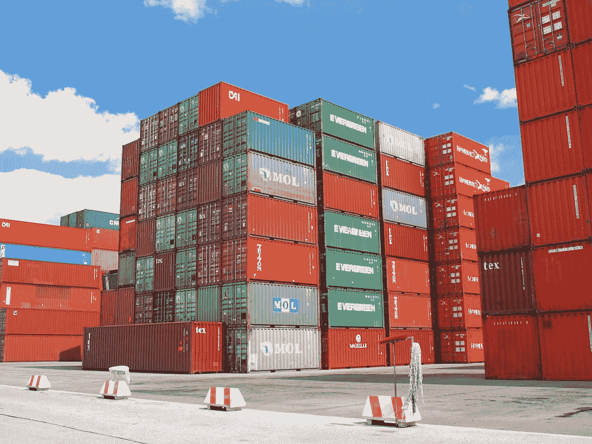

# 构建安全的 Docker 映像- 101

> 原文：<https://medium.com/walmartglobaltech/building-secure-docker-images-101-3769b760ebfa?source=collection_archive---------0----------------------->

Docker 容器使得软件的分发更加容易，并且简化了系统上的资源共享。默认情况下或用户自定义时，容器映像配置中的漏洞会导致安全事件。

本文总结了构建安全 Docker 映像的基本步骤。那些使用 Docker 图像的人会对本文感兴趣，这些图像要么是现成的，要么是在流行的基础图像上构建自定义层。本文将逐步引导您了解构建安全 Docker 映像的基本安全最佳实践，并评估现成的基础映像。



Image Source [https://pixabay.com](https://pixabay.com/photos/container-cargo-freight-harbor-489933/)

## **1。作为非根用户运行容器**

`root`是 Docker 容器中的默认用户。

如果在启动容器时没有指定用户，默认情况下，它将作为映像中设置的用户(docker 文件中的最后一个`USER`命令)或从父映像文件继承的用户(由 docker 文件中的`FROM`命令指定)运行。

如果用户既没有在启动容器时被指定，也没有出现在映像中，那么容器将作为`root` (uid 0)运行。

建议创建一个非 root 用户来运行容器的第一个进程。除此之外，必须删除任何不需要的用户。

运行以下命令找出用户名/用户 id。如果返回一个空白，这意味着容器作为根运行。

```
docker ps — quiet — all | xargs docker inspect — format ‘{{ .Id }}: User={{ .Config.User }}’
```

运行图像时，使用`USER`命令设置用户，以及 docker 文件中其后的任何`RUN`、`CMD`和`ENTRYPOINT`指令。

使用`DOCKER HISTORY`检查图像，查看用户是否设置运行命令

```
docker history <Image Name/ID>
```

## 2.从映像中删除不必要的包/软件

在 Docker 映像中包含不必要的包不仅会增大映像的大小，还会增加容器的攻击面。必须仔细检查所有 Docker 映像中已安装的包，并且必须只包括容器中服务运行所需的包。

人们可以通过使用 Alpine、BusyBox 等极简的基础图像来开始构建他们的 Docker 图像。

要列出容器中安装的所有软件包，请运行以下命令:

```
docker exec <CONTAINER_ID> apk info
```

上述命令专用于`apk`包管理器。根据您的映像包管理器，必须修改上面的命令。

还可以考虑在生产环境中使用映像之前删除软件包安装程序。


Image Source https:/[/](https://pixabay.com/photos/hamburg-port-of-hamburg-3021820/)pixabay.com

## 3.扫描并重建映像以包含安全补丁

无论您是从头开始构建 Docker 映像，还是在第三方映像的基础上构建映像，作为持续集成过程的一部分，对映像进行漏洞扫描是非常重要的。这包括扫描包含的包、二进制文件、库、文件等。针对一个或多个众所周知的漏洞数据库。

有许多流行的开源 Docker 扫描工具可用。一些最受欢迎的是 [Anchore-Engine](https://github.com/anchore/anchore-engine) 、 [CoreOs-Clair](https://coreos.com/clair/) 、 [Dagda](https://github.com/eliasgranderubio/dagda) 、 [Open-SCAP](https://csrc.nist.gov/projects/security-content-automation-protocol) 等。

## 4.启用 Docker 内容信任(DCT)

Docker 内容信任(DCT)使用数字签名来验证从远程 Docker 注册表中提取的图像的完整性。使用 DCT，图像发布者，无论是个人还是组织，都可以在他们的图像上签名。图像的消费者可以通过验证数字签名来验证图像的完整性，以确保图像没有被篡改。

如果启用了 DCT，`pull`、`run`和`build`，指令将仅适用于可信(签名)映像。

```
echo $DOCKER_CONTENT_TRUST
```

确保上述命令的输出为 1，因为它表示 DCT 已启用。默认情况下，禁用 DCT。要启用 DCT，请运行以下命令。

```
export DOCKER_CONTENT_TRUST=1
```

DCT 对于构建安全的 Docker 映像非常重要，因为它确保了基本映像及其发布者身份的完整性。如果出于某种原因，您希望在拉取、运行或构建映像时禁用 DCT，那么值设置为 false 的 *- disable content-trust* 标志可能会派上用场。

## 5.在 Dockerfile 中使用复制而不是添加

`COPY`和`ADD`指令在功能上非常相似。这两条指令都可以用来将本地文件复制到容器映像的文件系统中。`ADD`指令具有更多功能，如本地 tar 文件提取和远程 URL 获取。

在 Dockerfile 文件中使用`ADD`指令会带来不经扫描就从远程 URL 添加恶意文件的风险。

因此，`ADD`指令的最佳用途是将 tar 归档文件复制到映像文件系统中，并自动提取它们。只要有可能，必须使用`COPY`代替`ADD`指令。

用户可以通过使用`DOCKER HISTORY`命令来检查图像，以检查在构建图像时`ADD`命令的使用。

```
docker history <Image Name/ID>
```

## 6.不要在 Dockerfile 中存储任何秘密

密码、API 密钥、私有密钥和其他秘密决不能成为 other 文件的一部分。Dockerfile 中的秘密很容易被像`DOCKER HISTORY`这样的简单命令暴露，一旦暴露就可能被对手利用。

Dockerfile 永远不应该被用来传递秘密。要确保 docker 文件中没有秘密，一个简单的方法是使用`DOCKER HISTORY`命令并仔细检查它的内容。

```
docker history <Image Name/ID>
```

## 7.安装经过验证的软件包并使用可信基础映像

仅从受信任的资料库安装软件包。除此之外，使用校验和和数字签名来验证下载包的真实性和完整性。

使用`FROM`指令时，请务必使用标签。让我们深入研究一下这个建议。

```
FROM alpine
```

上面的命令是不好的，因为它总是拉最新的标签，这是经常变化的，也可能是不稳定的。

```
FROM alpine:3.11
```

上面的命令更好，因为它将基础映像固定到某个版本。人们仍然可以期待它的变化，包括小的更新和安全修复。如果想每次都使用相同的图像，那么他们可以通过`FROM`指令使用摘要。使用摘要还可以防止图像被篡改和损坏。

```
FROM alpine@sha256:ddba4d27a7ffc3f86dd6c2f92041af252a1f23a8 e742c90e6e1297bfa1bc0c45
```

此外，就像下载软件包时的基本映像一样，使用校验和和数字签名检查软件包的完整性和真实性。如果通过不安全的通道(HTTP)下载包，这将保护包免受意外损坏和 MITM。

## 8.从映像中删除 setuid 和 setgid 权限

`setuid`(执行时设置用户 ID)是 Unix 中一种特殊的权限类型，它允许用户以提升的权限执行某些程序。当设置了可执行文件的`setuid`权限时，用户可以使用与拥有该文件的[或](https://www.computerhope.com/unix/uchown.htm)用户相匹配的访问级别来执行该程序。

`setgid`(执行时设置组 ID)与`setuid`类似，唯一的区别是——当具有 setgid 权限的可执行文件运行时，它就像该文件所属的同一个组的成员一样运行。

从二进制文件中删除`setuid`和`setgid`权限可以防止它们被滥用于特权提升攻击。

要查找 Docker 映像中设置了`setuid`和`setgid`权限的所有可执行文件，请运行以下命令:

```
docker run <Image Name/ID> find / -perm +6000 -type f -exec ls -ld {} \; 2> /dev/null
```

映像的维护者必须仔细检查作为上述命令的输出返回的所有文件的列表，然后必须从所有不需要的可执行文件中删除`setuid`和`setgid`权限。

通过在 Dockerfile 文件中包含以下内容，可执行二进制文件也可以在构建映像时**缺省**。

```
FROM alpine:3.11

RUN find / -perm +6000 -type f -exec chmod a-s {} \; || true
```

## 9.小心使用 Dockerfile 中的更新指令

如果您在 Docker 文件中使用像`apt-get update`或`apk update`(取决于基本映像和包管理器)这样的包更新指令，请确保它们不会单独出现在一个 Docker 文件行中。

如果包更新指令出现在 docker 文件的一行中，那么将使用相同的缓存更新层。这将阻止任何新的更新成为后续构建的一部分。

要减轻此问题，请检查您的 docker 文件并删除任何单独出现的更新指令。如果您无权访问 docker 文件，您可以使用`DOCKER HISTORY`命令来验证没有单独的更新指令。

```
docker history <Image Name/ID>
```

你也可以使用你的`--no-cache`标志来消除任何缓存层，同时建立 Docker 图像。

## 10.将运行状况检查添加到 Docker 映像

`HEALTHCHECK`指令可用于检查集装箱是否仍在运行。如果 Docker 映像指定了运行状况检查，则除了正常状态之外，映像还将具有运行状况。健康状态最初为`starting`。每当健康检查通过，它就变成`healthy`(无论它之前处于什么状态)。连续失败一定次数后，变为`unhealthy`。

基于集装箱的健康状况，码头工人可以供应新的集装箱来替换不健康的集装箱。

```
HEALTHCHECK --interval=5m --timeout=3s \
 CMD curl [https://localhost:8443/version](https://localhost:8443/version) -k || exit 1
```

将上述`HEALTCHCHECK`指令包含到 Docker 文件将每五分钟检查一次在端口 8443 上运行的 web 服务器是否能够在三秒钟内提供版本 API。

可用性是安全性的三大支柱之一(另外两个是机密性和完整性)，而`HEALTHCHECK`指令可以用来确保 Docker 容器中运行的服务始终运行。

要确保 Docker 映像中存在`HEALTHCHECK`指令，请运行以下命令:

```
docker inspect --format='{{ .Config.Healthcheck }}' <Image Name/ID>
```

## 参考资料:

[https://docs . docker . com/develop/develop-images/docker file _ best-practices/](https://docs.docker.com/develop/develop-images/dockerfile_best-practices/)

【https://docs.docker.com/engine/reference/run/#user 号

【https://hub.docker.com/_/alpine 

[https://pixabay.com/photos/hamburg-port-of-hamburg-3021820/](https://pixabay.com/photos/hamburg-port-of-hamburg-3021820/)

[https://docs . docker . com/engine/security/trust/content _ trust/](https://docs.docker.com/engine/security/trust/content_trust/)

[https://docs . docker . com/engine/reference/command line/CLI/#环境变量](https://docs.docker.com/engine/reference/commandline/cli/#environment-variables)

[https://docs . docker . com/develop/develop-images/docker file _ best-practices/# add-or-copy](https://docs.docker.com/develop/develop-images/dockerfile_best-practices/#add-or-copy)

[https://Linux config . org/how-to-use-special-permissions-the-setuid-setgid-and-sticky-bits](https://linuxconfig.org/how-to-use-special-permissions-the-setuid-setgid-and-sticky-bits)

[https://docs . docker . com/engine/reference/builder/# health check](https://docs.docker.com/engine/reference/builder/#healthcheck)

[https://docs.docker.com/compliance/cis/docker_ce/](https://docs.docker.com/compliance/cis/docker_ce/)