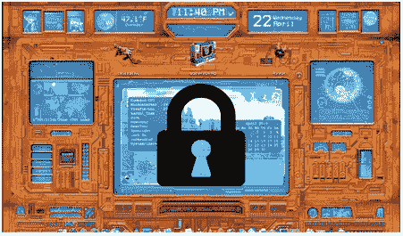
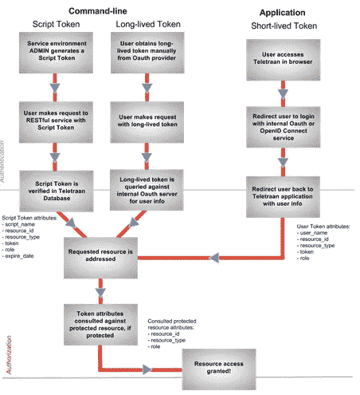
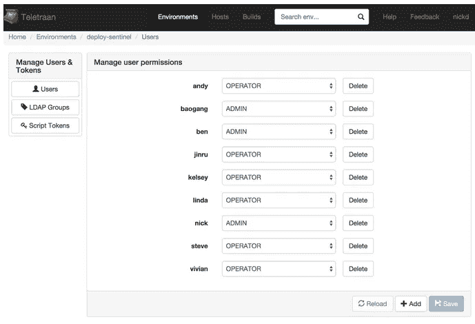

# 将安全性融入我们的部署服务系统

> 原文：<https://medium.com/pinterest-engineering/building-security-into-our-deployment-service-system-3d6992cb2584?source=collection_archive---------2----------------------->

Nick DeChant | Pinterest 基础设施工程师

我们使用自己构建的名为 [Teletraan](https://engineering.pinterest.com/blog/under-hood-teletraan-deploy-system) 的内部部署服务系统向全球的 Pinners 推送新代码。我们对 Teletraan 的目标是尽可能可靠和直接，为工程师消除任何与部署相关的问题。为了实现这一点，我们付出了巨大的努力来保持我们的部署过程和系统的安全。

以前，Teletraan 在执行操作时没有本机身份验证和授权检查，因此我们的产品和内部工具面临跨团队意外部署相关变更的风险。随着我们作为一个组织继续快速发展，拥有一个强大的权限控制机制以防止 Pinners 和我们作为工程师的生产力可能出现的不良体验是非常重要的。



## 基于角色的权限和访问控制列表

在 Pinterest，部署安全权限是基于个人团队所有权的想法。很重要的一点是，任何种类的权限系统都会对每个团队的部署过程产生最小的影响，而且还会保护他们的服务环境免受意外的更改。

我们的部署系统是一个传统的三层系统:前端 web UI，MySQL 后端和中间的 RESTful 服务(也称为 Teletraan 服务器)。Teletraan 服务器基于三种不同的令牌对来自 web UI 和命令行的请求进行身份验证:短期 OAuth 令牌、个人长期 OAuth 令牌和 Teletraan 托管脚本令牌。授权是通过对照用户角色或团队角色请求的资源要求来执行的。

Teletraan 在这方面的配置非常灵活。打开或关闭任何身份验证和授权的组合就像在配置文件中删除或添加行一样简单。

## 基于令牌的认证

当用户通过 web UI 访问 Teletraan 时，前端客户端将与我们内部的 OAuth 2.0 服务器一起工作，通过 OAuth v2 工作流并获得一个短期令牌。然后，web 用户界面将在 HTTP 头中使用此令牌，用于对 Teletraan 服务器的任何后续调用。例如，下面描述了使用特定令牌创建部署的命令行请求:

```
curl -H "Authorization: token <token>" -H "Content-Type: application/json" -X POST https://<yourSite>.com/v1/envs/<environmentName>/<stageName>/deploys/?build_id=12345&description=foo
```

此外，用户可以从 OAuth 服务器手动获取长期令牌，并使用它们通过 RESTful API 调用访问 Teletraan 服务器。短期令牌和长期令牌都是 OAuth 令牌。Teletraan 服务器将直接向 OAuth 服务器验证这些令牌。

Teletraan 服务器还发布和维护脚本令牌，供脚本使用。脚本标记不是 OAuth 标记。Teletraan 中只有管理员级别的用户可以为他们各自的环境创建脚本令牌。

我们计划在不久的将来开源 Teletraan，考虑到这一点，我们让我们的部署安全模型支持 OpenID Connect。使用您的 Google、Amazon 或任何其他 OpenID Connect 支持的登录服务进行身份验证很容易配置，其工作方式与查询我们的内部 OAuth 服务器相同。只需在配置文件中更改几个端点 URL。

## 批准

一旦通过身份验证，就会对 MySQL 数据库角色表进行授权检查。在命令行中，使用相同的方法对请求需求进行授权。



## 授权级别

我们创建了具有明确角色的分层级别，并让它们在未来随着新角色的出现而变化和发展。除了角色，我们还设计了一个称为资源的抽象层，其中包含 ID 和类型等信息。这使我们能够将我们的权限设计应用于具有不同分解组件的其他应用程序，例如主机或组，以及我们当前的 Teletraan 服务环境用例。



这种设计提供了一种有效的方法来保护我们的服务环境并确保部署安全。随着我们继续构建我们的云平台，我们打算在我们所有的云服务中使用这种模式。

我们很高兴在明年年初开源 Teletraan，它将支持访问控制列表模型。你可以在之前的[博客文章](https://engineering.pinterest.com/blog/under-hood-teletraan-deploy-system)中了解更多关于 Teletraan 作为部署服务系统的信息。

*鸣谢:Teletraan 由云工程团队的 Jinru He、Linda Lo、gang Song 和 Nick DeChant 构建。我们还要感谢云工程团队的 Devin Lundberg 在安全设计方面给予的帮助。*