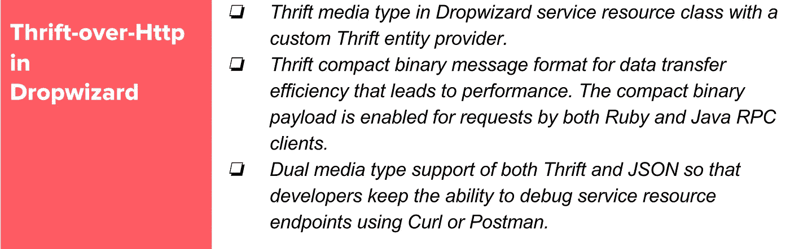
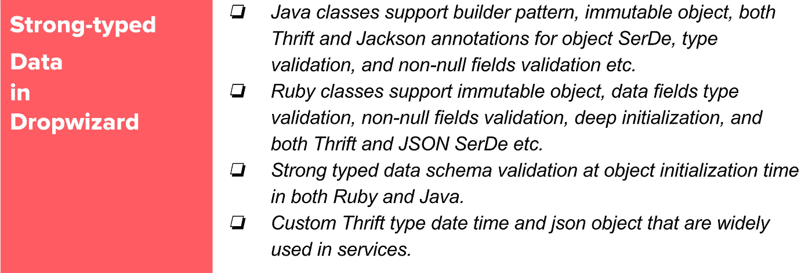
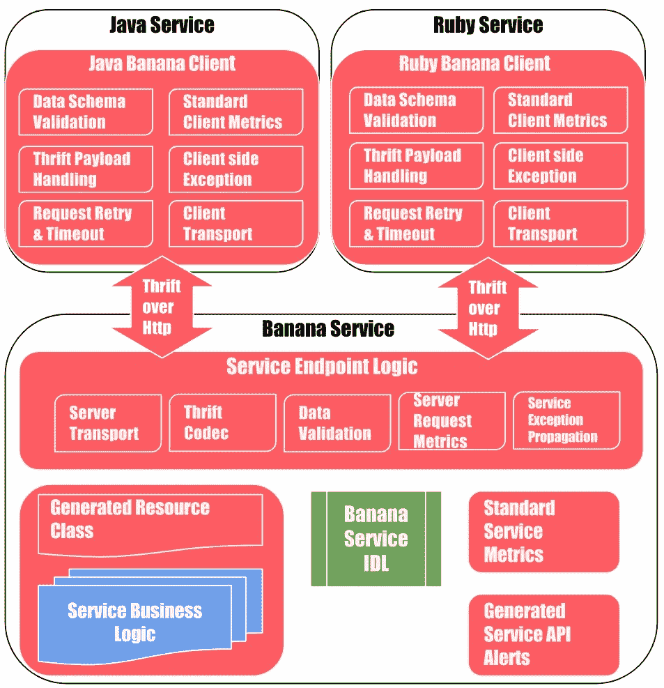
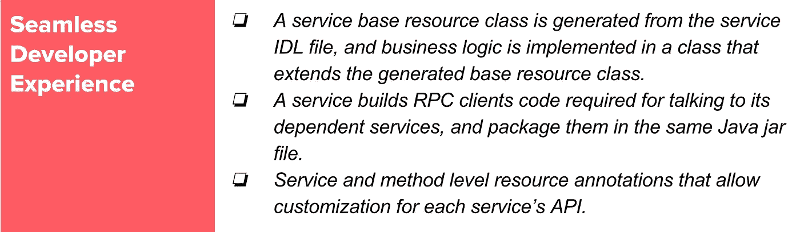
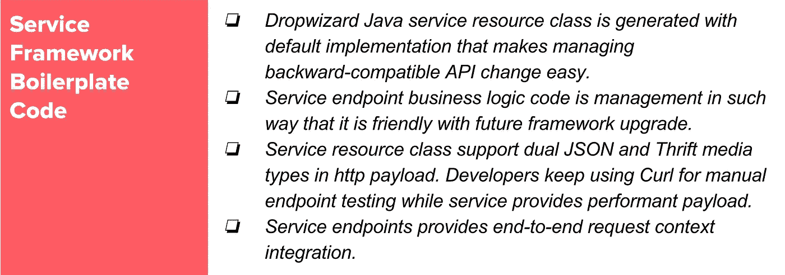
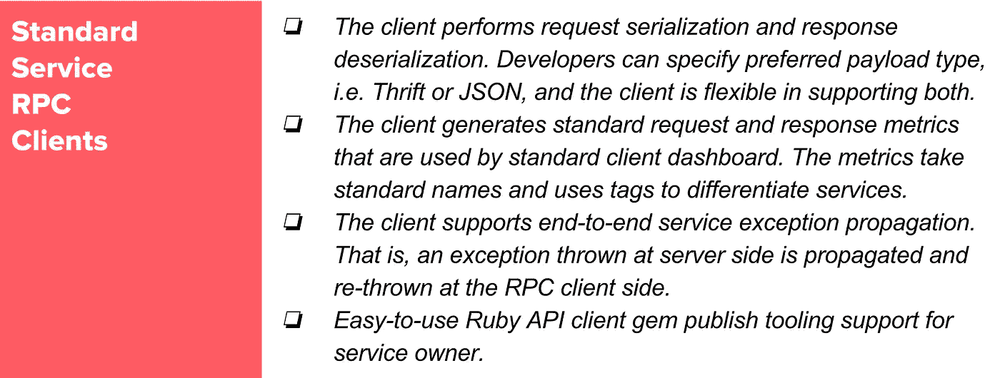
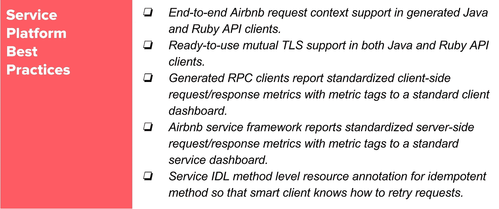

# Airbnb 的建筑服务，第 1 部分

> 原文：<https://medium.com/airbnb-engineering/building-services-at-airbnb-part-1-c4c1d8fa811b?source=collection_archive---------1----------------------->

## **本文是关于扩展服务开发的系列文章中的第一篇，着眼于核心结构，即支撑 Airbnb 新的面向服务架构的服务 IDL。**

*由、* [*费林零*](https://www.linkedin.com/in/frank-lin-7712154/) *和* [*接君卦*](https://www.linkedin.com/in/junjie-guan-5192b85a/) *n*

Alexis, one of our hosts, shows some of her guests how to shuck oysters in [East Boston](https://www.airbnb.com/experiences/168498)

Airbnb 正在加速将其基础设施向 SOA(面向服务的架构)迁移，但在构建新产品和新功能的同时，从单一的 Rails 服务向 SOA 迁移并非没有挑战。

在本帖中，我们分享了我们为扩展服务开发而设计和构建的东西——使用相同的工程师工时来构建更多更健壮、更高效、更易于维护的后端服务。这是关于这个话题的一系列文章中的第一篇；在本帖中，我们将呈现该方法和整体架构的鸟瞰图，后续的帖子将深入到具体的组件。

# 我们以前拥有的

在 Airbnb，后端服务大多是使用 [Dropwizard](http://www.dropwizard.io) web 服务框架用 Java 编写的，许多 Airbnb 专用的定制 Dropwizard 过滤器和模块标准化了服务器端的最佳实践。此外， *make-me-a-service* 工具帮助工程师引导一个随时可以部署的 Dropwizard 应用程序框架，在此基础上，工程师添加 RESTful 和 JSON-over-HTTP 服务资源端点。

然而，上述组合仍有许多不足之处；服务开发人员提出的主要缺点包括:

1.  它缺乏明确定义和强类型的服务接口和数据模式。如果不检查源代码，通常很难知道服务做什么以及如何发送请求和接收响应。此外，过去在进行违反合同的变更时，缺乏服务/客户合同验证曾导致生产事故。
2.  RESTful 服务框架不提供服务 RPCs 开发人员必须花费大量的时间为他们的服务编写 Ruby 和 Java 客户端。好的 RPC 代码不仅仅是 HTTP 客户端包装器；它应包括标准基础架构要求和平台最佳实践的可靠实施，例如，传递请求上下文、测量请求和性能指标、传播服务异常和原因、启用相互 TLS 以及对服务端点进行监控和警报。所有这些都需要数小时甚至数天的额外工程工作。
3.  与用于高性能服务间通信的紧凑的、模式化的二进制格式相比，JSON 请求/响应数据有效负载很大且效率很低(例如字符串字段名)，特别是对于第 95 和第 99 百分位的有效负载。

# 用于扩展服务开发的结构

## 现成的解决方案

服务的 API 包括服务接口和请求/响应数据模式。在 REST 服务领域，Swagger 之类的工具可用于自动化一些样板任务，如记录 REST API 和提供基本的客户端代码生成。然而，与成熟的服务 RPC 框架(如 Apache Thrift 和 Google gRPC)相比，大多数 REST 工具缺乏丰富的功能(如强类型支持、请求/响应验证、有效的有效负载编码和传输协议),这些功能可以加速健壮和高性能服务的开发。

Thrift 和 gRPC 是两种流行的 RPC 系统，被业界广泛采用。然而，将 Airbnb 的 HTTP 服务栈替换为任何一个都意味着基础设施的大规模大修，这将需要大量的工程资源，并对生产力造成重大干扰。

## 我们的方法

在权衡了不同技术方法的利弊之后，我们决定采用一种不会中断当前 Java 服务开发过程的方法，同时为将来逐步改进和发展服务架构提供了可能性。我们的方法是保留 Dropwizard 服务框架，在框架中添加定制的 Thrift service IDL(接口定义语言)，将传输协议从 *JSON-over-Http* 切换到 *Thrift-over-Http* ，并构建工具来生成不同语言的 RPC 客户端。

我们将在下面更详细地解释这种方法如何在最小化中断的同时扩大开发规模。

## 以节俭为服务

我们使用 Thrift IDL 来定义服务的 API——它的接口和请求/响应数据模式。在基于服务 IDL 的 Java 服务开发流程中，开发者在*中定义服务 API。thrift* 文件，通过 Airbnb 服务平台从这些文件中生成服务端代码和 RPC 客户端，这是帮助实施基础设施最佳实践的标准工具。这简化了服务开发，并允许工程师专注于编写服务业务逻辑，而不是管道和监控工作(例如，服务间传输、度量、警报和向后兼容的 API 管理)。

## 启用 HTTP 上的节约

服务开发人员熟悉 Dropwizard 服务框架，并为其构建了许多公共库。Dropwizard 是 *JSON-over-Http* (使用Jersey 和 Jackson 库)，但是我们想把 Thrift service IDL 带到服务开发中。由于不中断当前的服务框架和服务间通信协议很重要，我们扩展了 Dropwizard 的 Thrift 有效负载类型支持，使服务间通信协议从 *JSON-over-Http* 无缝过渡到 *Thrift-over-Http* 。

## 强类型 API

使用 Thrift 作为服务 IDL 本质上为服务 API 提供了清晰的定义和文档；而且，数据模式中的每个字段都有明确定义的类型，这些类型在生成的 Java 和 Ruby 数据类中被严格执行。通过内置的模式实施和精心设计的服务器端和客户端生成的代码，管理 API 向后兼容性变得更加简单和容易。

我们还扩展了普通 Apache Thrift IDL 之外的类型，增加了日期*和日期*日期*。类型扩展背后的基本原理是基于过去的经验——如果服务开发人员被限制在太少的类型集合中，他们最终会通过现有的类型(例如，作为字符串的日期)来改变他们想要的类型，绕过自动的类型检查和验证，并违背拥有强类型模式的目的。*

# Apache Thrift 之外的服务 IDL 和扩展

编写服务比简单地实现服务器端业务逻辑需要更多的工作。用不同的语言实现服务 RPC 客户端、设置和执行服务间通信、添加用于监控的服务端和客户端指标，以及采用标准的服务平台实践，这些都是繁琐的工作，容易出错，并且会导致巨大的工程成本。在 service IDL 出现之前，创建和管理服务的成本导致工程师和管理层在时间压力下回避 SOA。

我们希望使用 service IDL 进行的服务开发简单、经济高效，并在附加好处方面提供一个 step 函数。为此，香草阿帕奇节俭是不够的。我们对现有的 Thrift IDL 编译器进行了广泛的定制，以生成具有许多附加特性的服务样板代码和 RPC 客户端。我们相信这是加速 Airbnb 技术栈向 SOA 迁移的关键。

下图显示了一个示例 Java 服务，名为 Banana，使用服务 IDL、Ruby 服务和另一个 Java 服务，使用生成的服务客户端进行 RPC 调用。红色的组件是基于 Banana 的服务 IDL 自动生成/检测的。

## 服务 IDL 依赖和编译器集成

服务开发人员除了编写他们的服务 IDL 之外，还可以通过指向其他服务 IDL 文件来声明服务依赖。服务的 IDL 文件和它所依赖的服务的 IDL 文件都无缝地集成到现有的构建过程和构建工具中。服务开发人员做他们以前一直在做的事情，他们需要的所有 IDL 相关代码都是自动生成的，并显示在他们的 IDE 中，无需额外的步骤。

## 服务框架样板代码

我们用 Dropwizard 资源生成扩展了 Apache Thrift 代码生成器。生成的服务资源类和方法带有必要的 Jersey 和 Jackson 注释，以支持 HTTP 有效负载中的 JSON 和 Thrift 媒体类型——服务可以接收和返回 JSON 和 Thrift 请求/响应数据。节俭二进制传输是为了性能，而 JSON 是为了与旧服务兼容，并便于测试和调试。

由于生成了业务逻辑和 Dropwizard 之间的粘合代码，服务开发人员可以编写与底层 web 服务器框架无关的代码；因此，如果我们升级 Dropwizard 或放弃 Dropwizard，迁移会更容易。

## RPC 客户端

在服务 IDL 之前，工程师必须为与他们的服务对话的其他应用程序实现客户机。用一种以上的语言编写客户机不仅耗时，而且很快就会过时，失去对等性(例如，在 Ruby 和 Java 客户机之间)。有了 service IDL，现成的 Java 和 Ruby API 客户端就完全生成了。这些生成的客户机不是普通 Apache Thrift 附带的 Ruby 或 Java 的 Thrift 客户机。它们是 RPC 客户端，提供了许多普通 Apache Thrift 中没有的功能(例如，mTLS、重试、验证、请求上下文)。

## 服务平台标准实践

随着工程师构建更多的服务，所有服务都采用一致的最佳实践是非常重要的。例如，服务请求有关联的上下文信息，请求上下文应该在服务 RPC 调用链上传播。如果不同的服务以不同的方式传播这个上下文(或者根本不传播)，或者如果这个上下文是以不同的方式定义和获取的，那么这将很难管理。如果每个服务发出不同的度量标准并有不同类型的警报，那么 SRE 监控和调试 SOA 问题也会很头疼。在服务器端和客户端发出标准的请求和响应指标，不仅可以更好地监控服务拥有团队的内部和外部，还可以用来创建自动化的服务仪表板和警报。服务客户端也应该采用标准的 RPC 超时、重试和断路器逻辑；我们生成的 RPC 客户端使得服务开发人员不必自己实现这些 RPC 弹性特性。

# 结果

将 Thrift service IDL 添加到我们的 Java 服务框架中是迈向可靠、高性能和开发者友好的服务平台的重要的第一步。它是一个核心结构，随着 Airbnb 将其基础设施转向 SOA，可以在此基础上构建更多开发规模的功能。

新的服务 IDL 驱动的 Java 服务开发过程自发布以来已经被产品团队广泛接受。它大大提高了开发速度；使用 service IDL 构建的几个新的 Java 服务，从服务开始到获得生产流量，只花了三周时间——我们估计在之前的开发过程中，每个 Java 服务节省了 2-3 周的工程时间。我们计划将服务 IDL 支持扩展到 Ruby 服务。

在这篇文章中，我们展示了在最小化中断的同时扩展服务开发的方法，并介绍了作为该方法核心的服务 IDL。我们忽略了服务 IDL 的各种组件的许多设计和实现细节；在本系列的后续文章中，我们将对它们进行更深入的讨论。敬请期待！

如果你喜欢阅读这篇文章，并认为这是一个有趣的挑战，生产平台团队一直在寻找有才华的工程师[加入团队](https://www.airbnb.com/careers/departments/engineering)。

*非常感谢 Victor Peng、Xing An、Mike Parker、Liao、Mousom Dhar Gupta、Weibo He、Rahul Agrawal、Charlie Zhou、Lynn Lu、、Zhong、Luca Luo、、Jessica Tai 的贡献、支持和反馈。*