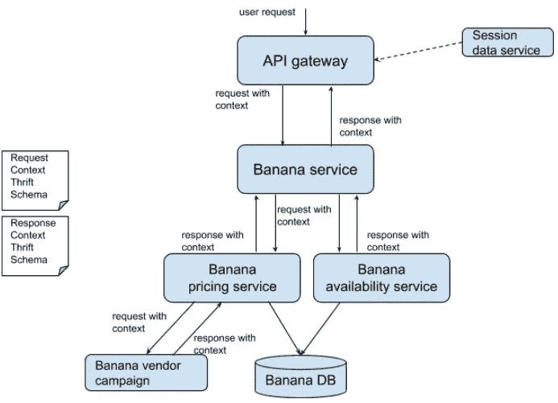
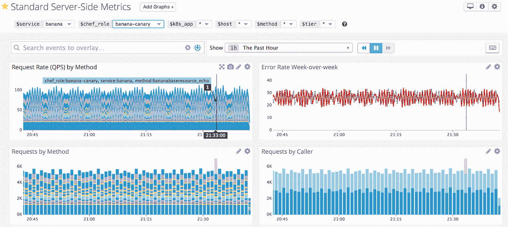
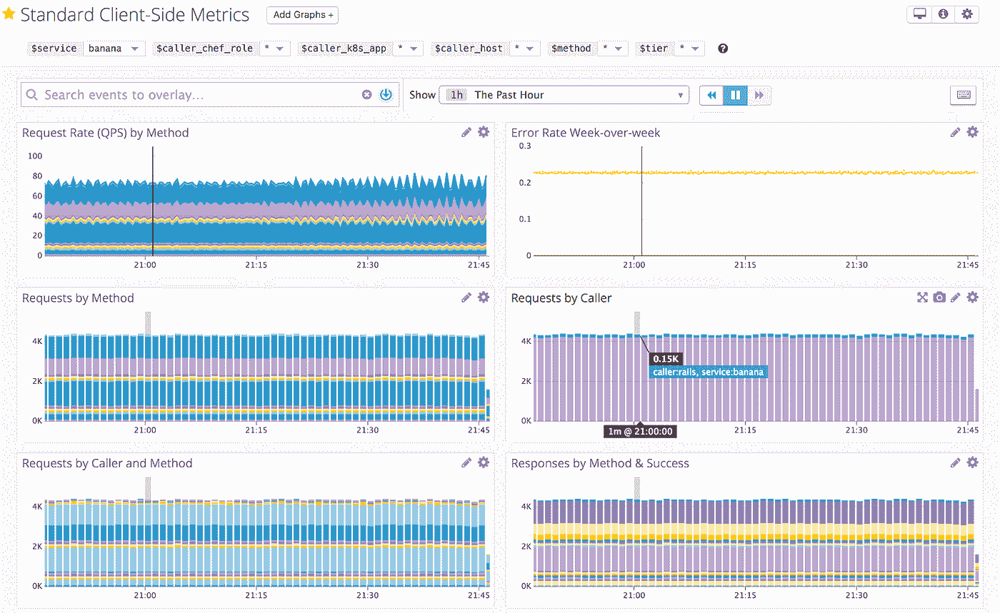

# Airbnb 的建筑服务，第 2 部分

> 原文：<https://medium.com/airbnb-engineering/building-services-at-airbnb-part-2-142be1c5d506?source=collection_archive---------2----------------------->

## 本文是关于扩展服务开发的系列文章的第二篇，着眼于支持 Airbnb 新的面向服务架构的一些关键工具。

*由***和**

****

**Vittoria is treating his guests to a [tour of the Limoncello factory](https://www.airbnb.com/experiences/165272), where family makes the liqueur on the Amalfi Coast of Italy**

**Airbnb 正在将其基础设施转向 SOA。一个可靠的、高性能的、开发人员友好的服务平台在架构演进中是必不可少的。在之前的[帖子](/airbnb-engineering/building-services-at-airbnb-part-1-c4c1d8fa811b)中，我们分享了我们为扩展服务开发而设计和构建的鸟瞰图，并展示了节俭服务 IDL 为中心的服务框架如何帮助提高开发速度。**

**随着工程师构建更多的服务，服务采用一致的平台范围的标准和实践是至关重要的。在这一系列文章的第二篇中，我们将分享我们如何构建一个服务平台来自动化并实施标准和最佳实践。**

# **为什么选择标准服务平台**

**首先，让我们看看当没有标准实践可遵循时，开发人员可能会选择在他们的 Java 项目中做什么:**

*   **不同项目中的 POJO 设计遵循不同的模式:有些是不可变的对象；其他人不是。有些使用构建器模式；其他的有许多构造函数；有的用龙目语；其他人手工做 getters 和 setters。**
*   **JSON 对象映射器的配置因服务而异。由于不一致，对象序列化和反序列化可能会失败。**
*   **最终客户端请求有各种相关的上下文信息，但不是所有的服务在调用下游服务时都会传播请求上下文。**
*   **服务发出非标准的服务器端或客户端指标，服务所有者创建非常不同的指标仪表板。**
*   **服务的健康监控和异常检测警报覆盖范围不一致；新创建的端点有时会缺少警报。**
*   **使用了不同的数据库客户端和 http 客户端库，包装器代码中缺少度量和日志记录。**
*   **服务客户端使用不同的 RPC 超时、重试和断路逻辑。**

**所有这些归结为一个词:不一致。各种各样的问题作为后果浮出水面。开发人员必须为构建新服务预算额外的时间来做大量的管道工作，而不是专注于业务逻辑；不匹配的 JSON 序列化代码会导致服务器端错误，需要花费大量时间来跟踪和修复；sre 发现，由于指标和警报不一致或缺失，监控服务和调试问题非常困难。**

**随着更多服务的建立，在服务平台上采用已发布的标准和一致的实践是至关重要的。然而，仅仅记录标准和推荐工程师遵循的最佳实践做不了**而不是**工作。工程师经常忘记它们，或者把它们推到以后(然后忘记)，当他们专注于编码业务逻辑以满足产品期限时。强制采用标准和实践的最有效的方法是将它们构建到服务平台中，工程师在这个平台上开发他们的服务。**

# **我们建造的东西**

**我们使用高度定制的 Thrift IDL 来定义服务的 API:它的接口和请求/响应数据模式。在基于服务 IDL 的 Java 服务开发流程中，开发者在*中定义服务 API。thrift* 文件，服务端代码和 RPC 客户端通过 Airbnb 服务平台的标准工具自动生成，这些工具执行 Airbnb 的基础设施标准和实践。**

## **请求和响应上下文**

**对 Airbnb web 应用程序的用户请求具有许多与之相关联的上下文信息。它至少包含一个惟一的用户 id(对于登录的用户)或一个访问者 id(对于注销的用户)。更丰富的上下文数据包括用户 IP 地址、用户地区、国家、货币、浏览器和设备类型。请求上下文数据有许多用途:**

*   **基于用户/访问者 id、区域设置和国家的功能展示。**
*   **试验使用用户 id、国家、地区或货币的策略。**
*   **基于用户 id、IP 地址和国家的授权策略检查。**
*   **基于用户 id 和 API 端点的服务框架限速。**

**在过去，请求上下文在单片 Airbnb Rails 应用程序中可用，但不会传播到下游服务。这是有问题的。例如，没有用户 id 就很难进行客户端实验或需要协调多个服务的增量特性展示。在 SOA 世界中，请求上下文应该与请求一起传播。请求上下文还支持标准服务平台安全策略检查和速率限制。为了服务的可靠性和弹性，请求上下文用于传播分布式服务 RPC 时间预算(用于响应截止时间和重试)。**

**相反，服务平台还应该在服务 RPC 调用图的响应流中传播上下文信息。为了服务的可靠性和弹性，下游服务将 RPC 的当前状态通知其上游服务是很重要的，这样可以做出最佳的重试和背压决定。在调用图中的某一点，服务可能还想评估最终用户信任和安全风险的请求。如果检测到有风险的请求，错误可以向上游传播，API 层可以硬阻止可疑用户执行进一步的操作。这些响应上下文数据是对响应本身的补充，并且是许多用例所需要的。**

**在我们的以服务 IDL 为中心的开发中，请求和响应上下文模式是用 Thrift 结构定义的，从中可以生成 Java 和 Ruby 类。这保证了跨 Java 和 Ruby 服务的一致的请求和响应上下文。上下文数据通过 http 请求/响应头传递，因此它们与实际的有效负载是分开的。在服务器端，请求上下文中间件提取头部并创建服务器业务逻辑代码可访问的请求上下文对象；同样，客户端中间件创建请求上下文头并提取响应上下文头。在 API 层中为每个最终用户请求实例化请求上下文，并在服务平台上沿着整个请求流传递。**

****

**Request and response context propagation**

## **标准指标和仪表板**

**在 Airbnb，服务所有者必须在服务投入生产之前完成生产准备清单。列表中的一个关键项目是指标。在过去，服务所有者发布不同的覆盖不均匀的度量，并创建在完整性、正确性、最新性和解释方面差异很大的度量仪表板。旧的指标命名约定是用服务名作为服务的所有指标的前缀。例如，Banana 服务将有一个*Banana . service . request . count*度量。这导致服务对于响应延迟和错误计数有不同的度量名称，这进一步导致每个服务有自己的服务仪表板。另一个问题是很难找到正确的仪表板和正确的图表，尤其是在发生事故时，sysops 工程师确实需要尽快找到它们来灭火。**

**在服务 IDL 驱动的开发中，服务资源方法样板代码和整个客户端代码都是从服务的节俭 IDL 中生成的。它允许在服务间通信层自动发布标准服务和客户端指标，模板化的标准仪表板可以免费提供给所有服务使用。**

**所有标准化指标都有相同的根前缀 *services_platform* ，后跟*服务*或*客户端*，然后是指标名称。例如，*services _ platform . service . request . count*和*services _ platform . client . request . count*分别跟踪服务器端和客户端的请求计数器。有一个统一的指标前缀是很重要的，因为它可以创建一个标准的服务仪表板，用于在 Datadog 上绘制所有标准指标。标准指标由各种标记修饰，这些标记允许对服务的单个主机和资源端点的健康和性能指标进行分解和深入研究。**

**服务器端指标的示例:**

*   **services _ platform . service . request . count，tags: [ *服务，角色，主机，方法，调用者***
*   **services _ platform . service . response . count，tags: [ *服务，角色，主机，方法，调用者，成功***
*   **services _ platform . service . response .[median | p75 | p95 | p99]，标签:[ *服务，角色，主机，方法，调用者，成功，状态代码，状态系列***
*   **services _ platform . service . exception . count，tags: [ *服务，角色，主机，方法，异常类，异常类型***

**标准的服务器端仪表板为所有带有 *services_platform* 前缀的服务器端指标提供。它们是模板化的，因此不同的服务可以使用相同的仪表板，并且模板变量允许深入到主机和方法指标:**

****

**Standard server-side dashboard**

**客户端指标是在 IDL 生成的 Ruby 和 Java RPC 客户端中发出的，它们反映了服务器端的指标:**

*   **services _ platform . client . request . count，tags: [ *服务，角色，主机，方法，调用者***
*   **services _ platform . client . response . count，tags: [ *服务，角色，主机，方法，调用者，成功***
*   **services _ platform . client . response .[median | p75 | p95 | p99]，标签:[ *服务，角色，主机，方法，调用者，成功***
*   **services _ platform . client . exception . count，tags: [ *服务，角色，主机，方法，调用者，异常类，异常类型***

**标准客户端控制面板可匹配:**

****

**Standard client-side dashboard**

## **服务 API 警报**

**管理健壮的服务需要密切监控服务的资源端点健康指标，而与指标相关的异常警报是其中的一个重要部分。然而，在过去，完全由服务开发人员手动编写与每个端点相对应的警报。我们经常观察到:**

*   **添加了新的服务资源端点，但没有相应的警报。**
*   **覆盖率不一致:例如，一些端点可能只对延迟发出警报，而其他端点只对错误率发出警报。**

**因此，警报覆盖范围的这些缺口导致异常发生时服务所有者没有被寻呼；sysops 或上游客户端服务所有者通知他们，他们的服务在很久以后出现故障。在标准服务平台上，标准服务器和客户端指标的可用性使得自动生成服务警报成为可能。**

**在以服务 IDL 为中心的服务开发中，一个*。thrift* 文件定义了服务的接口:一组强类型资源方法。它是服务的 API 的真实来源，因此是定义标准 API 警报的理想场所。在我们修改后的 Apache Thrift 编译器版本中，我们为修改后的代码生成器添加了服务级和方法级的资源注释，以便为每个方法生成大量的标准警告。**

**服务开发人员可以使用以下简单步骤添加服务 API 警报:**

1.  **在服务的 IDL 中添加警报注释。警报注释可以是方法级的，也可以是服务级的。**
2.  **通过注释指示标准服务警报集所需的警报阈值。**
3.  **运行服务 IDL 警报生成器工具，从服务的 IDL 文件创建一整套标准警报文件。**
4.  **如果没有警报注释，服务 IDL 警报生成器会使用默认阈值创建警报。**

**标准服务警报包括每个方法的方法级别的*高 p95 延迟*、*高 p99 延迟*、*高错误率*和*低 QPS* 警报，以及服务级别的*高错误率*和*低 QPS* 警报。这确保了覆盖服务平台上每个服务的所有端点。**

**因为阈值是在定义方法本身的 IDL 中的方法上定义的，所以很容易找到每个资源方法的警报是什么；它还将定义警报和定义方法打包在一起，以清楚地表明警报是服务开发中的头等大事。**

****

**Auto-generate service API alerts**

# **结果**

**当启动更多服务时，监控站点和调试问题的操作开销会增加。如果服务具有不一致的指标和不同的警报覆盖范围，维护 Airbnb 核心预订流的可靠性和可用性的难度会增加更多。**

**标准的运行状况和性能监控不仅是维护、调试和改进我们服务的关键，也是每个服务部署中确保不发生倒退的关键。根据标准服务指标生成警报可以让服务所有者和系统操作员尽早得到通知。标准服务平台鼓励并对所有服务实施基础设施标准和最佳实践，而不会产生额外的开发开销。它使得服务开发人员可以轻松地使用请求上下文、响应上下文、相互 TLS 等标准规范。以服务 IDL 为中心的服务平台使工程师能够专注于编写服务业务逻辑，而不是管道和监控工作。使用具有此处描述的标准化功能的服务平台，在之前的服务开发流程中节省的时间保守估计为 2–3 周。**

**在下一篇文章中，我们将深入探讨我们如何帮助服务所有者分析和管理平台性能的细节。敬请期待！**

**如果你喜欢阅读这篇文章，并对服务基础设施的工作感兴趣，生产平台团队一直在寻找有才华的工程师[加入团队](https://www.airbnb.com/careers/departments/engineering)。**

**非常感谢关、彭伟杰、邢安、迈克帕克、何伟波、蔡对本文的贡献。非常感谢 Charlie Zhou、Lynn Lu、、、钟、、、廖、Tiffany Low、Jimmy Ngo、Paul Baumstarck、Brian Wolfe、Swapnil Ralhan 提供的宝贵反馈。**