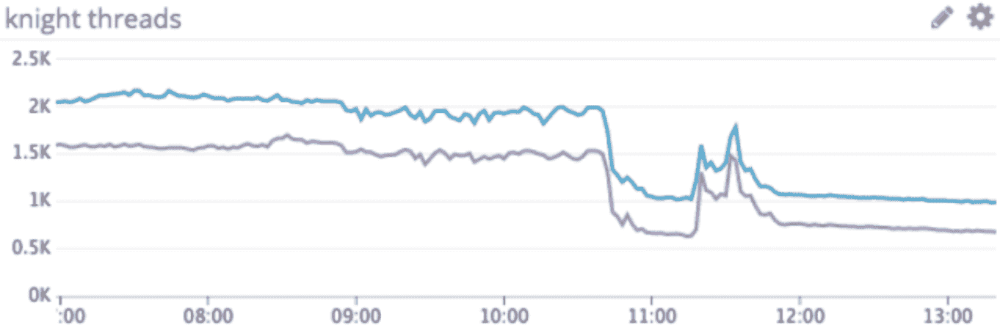
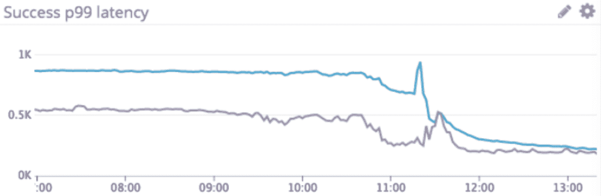
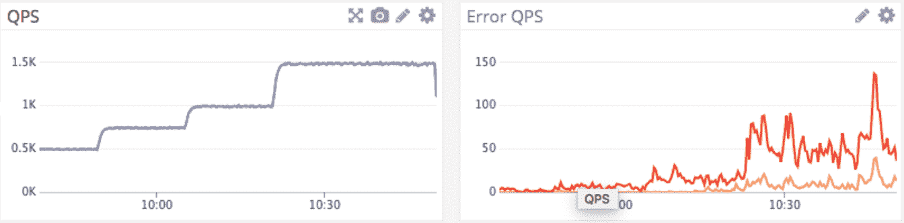
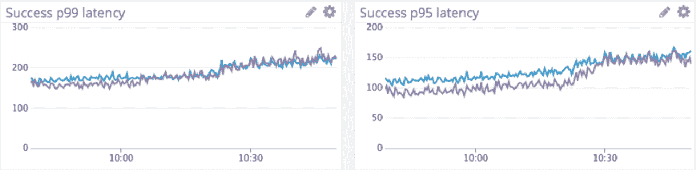
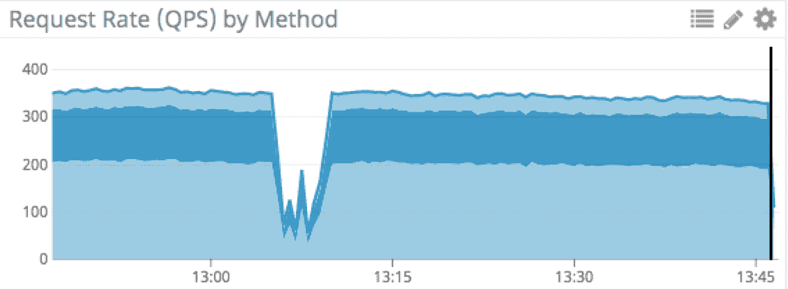
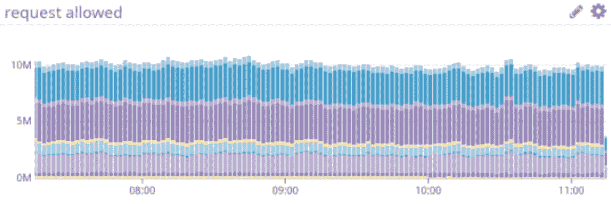
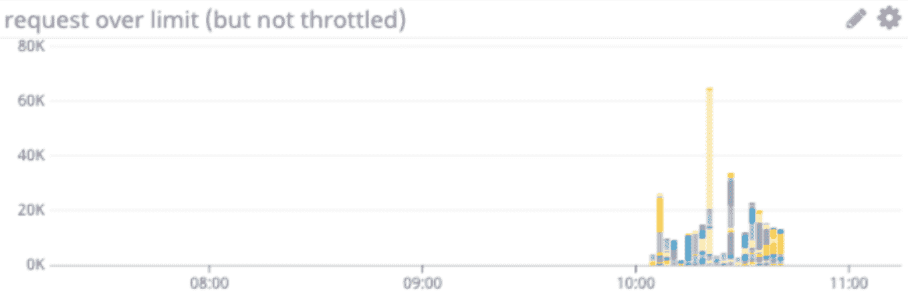
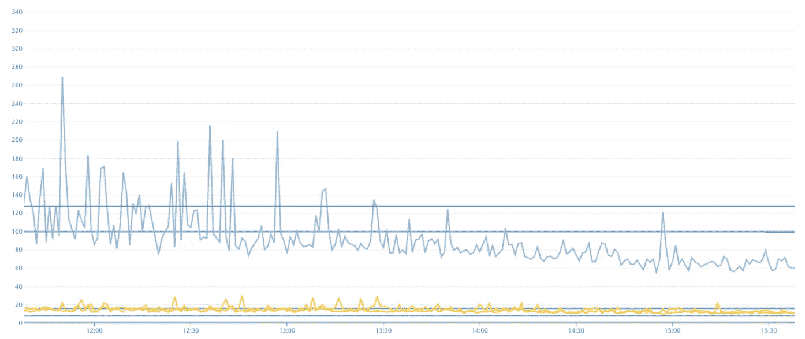
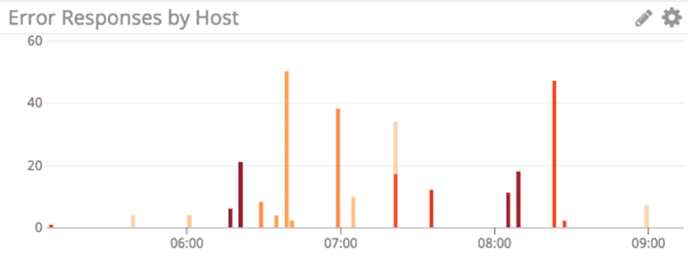
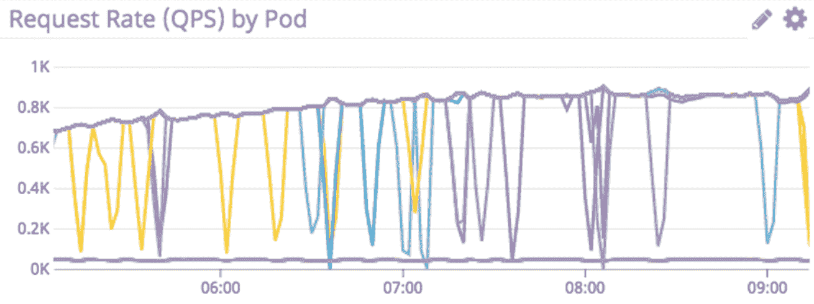

# Airbnb 的建筑服务，第 3 部分

> 原文：<https://medium.com/airbnb-engineering/building-services-at-airbnb-part-3-ac6d4972fc2d?source=collection_archive---------1----------------------->

## 在我们关于扩展服务开发系列的第三篇文章中，我们将深入探讨构建在标准服务平台中的弹性工程实践，该平台为 Airbnb 新的面向服务的架构提供支持。

作者: [*卫伯何*](https://www.linkedin.com/in/weibohe/)**

****

**A bright and spacious [Airbnb Plus listing](https://www.airbnb.com/rooms/plus/11474031) in London**

**A irbnb 正在将其基础设施转向面向服务的架构。一个可靠的、高性能的、开发人员友好的多语言服务平台是 Airbnb 建筑发展的基础组件。在我们的*系列的[***Part 1***](/airbnb-engineering/building-services-at-airbnb-part-1-c4c1d8fa811b)和[***Part 2***](/airbnb-engineering/building-services-at-airbnb-part-2-142be1c5d506)中，我们分享了我们是如何使用 Thrift service IDL 为中心的服务框架来规模化开发服务的；标准化服务平台如何鼓励和实施基础设施标准；以及如何在不产生额外开发开销的情况下对所有新服务实施最佳实践。***

**面向服务的架构培养了所有权并提高了开发速度。然而，它带来了一系列新的挑战。分布式服务的系统复杂性比单一应用程序高得多，许多过去在单一体系结构中工作的技术不再适用。在本帖中，我们分享了我们如何将弹性工程构建到服务平台标准中，并帮助服务所有者提高其服务的可用性。**

# **弹性是一个需求，而不是一个特性**

**在分布式服务架构中，服务弹性是一个硬性要求。随着服务间通信复杂性的增加，每个服务的响应能力和避免停机的能力都会降低。例如，Airbnb Homes PDP(产品详情页面)需要从 20 个下游服务获取数据。假设我们没有采取措施来提高我们的弹性，如果这 20 个依赖服务每个都有 99.9%的可用性，我们的 PDP 页面将只有 98.0%的正常运行时间，或每月大约 14.5 小时的停机时间。**

**没有什么比现实世界的生产事故根本原因分析更能清楚地说明弹性的影响了。在这些来自过去生产事故事后分析的样本中，我们可以看到一些常见的可靠性问题。**

**"*我们看到了多波流量增加(外部流量以及因请求失败而重试的流量)。从单轨铁路的角度来看，这导致我们 OAuth 服务的可用性持续下降。这影响了登录流程中涉及的大多数 API，并导致用户出现站点范围的身份验证问题，从而影响了核心业务指标。单轨错误率最初在 5 分钟内达到 25%,然后在 36 分钟内再次达到 5%。在停机期间，API 错误大幅增加，增加了 500 个错误。这表现为 P2/P3 的印象率、创建的信息和其他业务指标的下降。***

**"*当每个服务箱达到其极限时，它开始更频繁地超时，并导致上游 P2 服务重试。P2 服务的积极重试很快使其流量翻倍。因此，该服务试图创建太多代理连接，所有连接都超时。所有服务后端的延迟激增，导致运行状况检查失败。最终，所有 P2 服务的盒子都被标上了***

**“*在此期间，我们看到了 10 到 20 倍的 QPS 峰值，服务请求延迟在 P99 时增加了 10 倍以上。因此，上游客户端经历了请求失败。该服务使用计算密集型的哈希算法，我们认为根本原因是请求的峰值导致 CPU 利用率急剧增加，这使得其他请求的资源匮乏，并导致健康报告将单个服务节点标记为不健康。这种局部化的变化会对机群的其余部分产生级联效应，因为其他节点将不得不承担更多的流量。***

**处理过类似系统和事件的读者一定注意到了一些常见的可靠性问题:*请求峰值*，*系统过载*，*服务器资源耗尽*，*激进重试*，*级联故障*。过去，常见的容错措施，如请求超时、指数补偿重试和断路器的实施不一致。我们的标准化服务平台将弹性工程实践一致地构建到所有服务中，以降低任何单个服务成为网站可用性薄弱环节的可能性。**

# **我们建造的东西**

**Airbnb 核心预订流程上的所有服务必须支持高吞吐量，并对瞬时故障具有容错能力。从事核心业务服务的产品工程师应该只需要专注于构建新功能，而不是自己实现这些需求。我们实施的弹性措施是众所周知的模式，已经防止了核心预订流程中的停机。**

## **异步服务器请求处理**

**我们大部分的核心预订流程服务都是 Java 服务。在 [***第 1 部分***](/airbnb-engineering/building-services-at-airbnb-part-1-c4c1d8fa811b) 中，我们解释了我们如何为 Java 服务开发扩展 Dropwizard web 服务框架。在大多数 Airbnb 服务中，请求处理涉及到对下游服务或数据库的多次 RPC 调用。我们使用的 Dropwizard 版本具有同步请求处理功能，在这种情况下，当工作线程池处理 I/O 密集型工作时，服务器线程会空闲等待。因此，我们的服务在等待网络 I/O 时容易受到资源利用不足的影响，无法吸收突发流量，并且容易受到请求过载或重试风暴的影响。**

**利用最新 Dropwizard 框架中的异步响应特性，我们构建了一个端到端的异步请求处理流程，可以编写高度并发、无阻塞的应用程序。它连接 Dropwizard/Jersey 2 异步响应、我们内部构建的异步数据加载器框架和异步服务 IDL 客户端，用于服务间通信。异步请求处理有几个主要好处:**

*   **增加吞吐量:主 I/O 线程向异步执行器提交请求，然后返回接受新的入站请求。更少的 I/O 线程可以处理更多的并发请求，并更好地吸收高峰流量。**
*   **饥饿预防:一个服务可能有几个 I/O 或 CPU 密集型的端点。如果一个节点收到太多对这些昂贵的端点的请求，它将在试图处理那些昂贵的请求时饿死简单和快速的请求。使用异步请求处理，主 I/O 线程可以接受所有请求，并将它们分派到不同权重的请求队列。昂贵和便宜的请求可以并发执行。**

********

**With async request processing, a server typically uses fewer threads and has better tail latency when under load.**

## **请求排队**

**每个后端服务器在其定义的延迟服务级别目标内都有处理请求的数量限制。这个限制是有限资源的函数:CPU、内存、网络带宽、文件描述符、磁盘队列等。对于 Airbnb 的大多数服务，典型的工作负载模式涉及对下游服务和数据库的数据获取调用；应用轻量级逻辑来计算派生数据；以及根据所获取和导出的数据组成响应。换句话说，大多数服务都是网络 I/O 绑定的，而不是计算绑定的，因此更有可能受到内存的限制。为了理解资源枯竭是如何导致大范围失败的，让我们再来看一个样本生产事故的事后分析:**

**"*当每个服务箱达到其极限时，它开始更频繁地超时，并导致上游 P2 服务重试。P2 服务的积极重试很快使其流量翻倍。因此，该服务试图创建太多代理连接，所有连接都超时。所有服务后端的延迟激增，导致运行状况检查失败。最终，P2 服务的所有箱子都被标上了***

**请求排队是一种有效的技术，允许服务吸收突发的请求负载，防止服务由于资源耗尽而失败。更具体地说，我们用*自适应 LIFO* ( *后进先出*)实现了一个*控制的延迟* ( *CoDel* )队列，如文章 [*中所介绍的*](https://queue.acm.org/detail.cfm?id=2839461) 。**

****受控延迟队列****

**在正常操作条件下，服务器能够在请求到来时处理请求，并在 N 毫秒内清空队列，而 *CoDel* 请求队列使用 N 作为正常请求超时值。如果请求队列在 N 毫秒内没有被清空，它将使用一个更激进的请求超时值。积极的超时有助于防止常设队列的建立，从而保护服务器不被它跟不上的负载绊倒。**

****自适应后进先出法****

**在正常操作条件下，服务器按 FIFO 顺序处理请求。然而，当队列越来越大时，它就切换到 LIFO 模式。在排队期间，最后进入的请求比先进入的请求更有可能满足客户端请求的截止日期，因为先进入的请求在队列中等待的时间更长。**

**自适应后进先出法与 CoDel queue 在 Airbnb 的核心预订流程中很好地实现了高吞吐量、低延迟的服务，因为它们是有效的延迟预防措施。此外，我们看到定制请求队列实现实际上提高了单个服务主机的吞吐量和错误率。**

**我们将受控延迟队列(黄色)与之前的处理器(一个有界线程池(红色))进行了基准测试。在一个高吞吐量的 Java 服务中，切换到受控延迟队列提高了单主机吞吐量并降低了错误率。**

****

**在过载情况下，请求队列确实会导致第 95 和第 99 百分位延迟略有增加，如下图所示。**

****

**Bounded thread pool is shown in blue, while the controlled delay queue is shown in purple.**

## **甩负荷**

**事后分析的生产事件也不止一次引用了积极的客户端重试。事实上，这是级联故障最常见的原因，因为重试风暴没有给过载的服务任何恢复的空间。我们的标准内部服务客户端实现超时、重试和断路器模式。它将开发人员从编写自己的重试循环中解放出来，而重试循环通常是重试风暴的来源。然而，一个更有效的弹性特性是让客户端知道何时完全停止发送请求。**

****服务背压****

**服务器端请求队列状态是服务是否过载的最佳信号。当服务主机中的请求队列增加时，它会切换到 LIFO 模式，并开始快速失败带有背压错误的入站请求，直到请求队列水位线下降到安全阈值。当传播到客户端时，智能客户端将避免重试并快速失败上游请求。服务反压力需要服务器和客户机的协调，并且通过有意识地使一小部分请求失败来实现更快的恢复。更重要的是，它防止了我们在生产事件中看到的由于服务过载和重试风暴的组合而导致的级联故障。**

****

**在此标准服务器控制面板图中，我们可以看到一台主机的成功 QPS 急剧下降，但随后在 1 分钟内恢复。此实例的请求队列越来越多，服务器开始发送服务回压错误。智能客户端通过不重试任何请求并立即触发客户端断路器来处理服务过载信号。这种协调允许服务器自行恢复，并防止潜在的生产事故。**

****API 申请截止日期****

**我们使用的另一种减载技术是 API 请求截止期，这是 RPC 截止期传播的一种实现，它允许服务优雅地处理请求过载。Airbnb 的公共 API 端点都仔细设置了与延迟 SLO 相关的请求超时。每个入站 API 请求都有一个由 API 网关使用端点级超时设置的截止时间。最后期限随后随着请求向后端服务扩散而传播。服务器框架检查截止日期，并快速拒绝已经到达截止日期的请求。随着我们继续在跨服务间通信栈构建更多的弹性工程实践，我们将更加积极地设置 API 请求超时和强制执行截止日期。**

## **基于客户配额的速率限制**

**服务反压保护服务在过载情况下不会出现故障，但是，它不能区分不同上游调用者之间的流量。例如，我们的列表服务有 30 多个上游调用者。任何行为不端的调用者都可能发送过多的请求并影响其他客户端。**

**Airbnb 经历了几起核心服务事件，原因是流氓客户的负载过大。我们在由计数器服务和动态配置系统组成的标准服务框架中实现了基于客户端配额的速率限制。服务所有者可以在动态配置系统中定义客户端配额，服务将使用分布式计数器服务来跟踪配额并对任何滥用的客户端进行速率限制。**

********

**基于配额的速率限制与生产中的服务背压配合良好。在正常情况下，服务的容量在其上游调用者之间公平分配。当调用者行为不当时，速率限制保护服务免受意外负载，防止其他客户端的服务背压错误。**

## **依赖隔离和优雅降级**

**在分布式服务架构中，一个服务通常有多个下游依赖项。当依赖项的数量增加时，单个有问题的依赖项导致服务停止的可能性就变得更高。让我们看一个发生在 Airbnb 的例子:**

**P3 服务对内容审核服务有一种软依赖性，因为只有极小一部分请求会调用它。在该事件中，下游内容审核服务变得无响应，并且 P3 服务异步工作线程没有及时释放。最终，P3 服务耗尽了它的线程池，导致所有请求的错误增加。”**

**为我们的请求采用[隔板模式](https://docs.microsoft.com/en-us/azure/architecture/patterns/bulkhead)可以减轻这个问题。我们在异步请求执行器框架和服务平台上的服务间 IDL 客户端中实现了依赖隔离，类似于[网飞的 Hystrix](https://github.com/Netflix/Hystrix/wiki/How-it-Works#isolation) 的方法。独立的依赖项有独立的异步工作线程池，因此一个有问题的下游依赖项只会使相应的工作线程池饱和。如果有问题的依赖项恰好是软依赖项，例如产品详细信息页面上的趋势信息，则除了提供部分响应之外，服务的可用性不会受到影响。**

****

**Graph of thread pool sizes per dependency for a service.**

## **异常服务器主机检测**

**正如我们在事后分析中看到的，服务器主机故障是正常运行时间的常见威胁。当您在生产中拥有大量服务器时，一些服务器主机开始出现错误只是时间问题。**

***“一个服务实例在 PDT 下午 7:45 开始经历异常状态。实例的 QPS 下降，实例的错误率上升。服务团队的警报直到晚上 11:49 才被触发。中午 12:40，值班工程师发现了有问题的实例，并重启它以解决问题。”***

**这个事件突出了我们需要改进的三个工具:监视、检测和警告离群服务器。故障服务器的 QPS 下降和错误率上升是一个明显的信号。然而，我们的服务发现堆栈并没有捕获和处理它，而是需要人工干预。在轮换有故障的服务器主机之前，随叫随到的工程师必须在分散的仪表板中搜索，以便将症状与根本原因联系起来。因此，这种情况下的 MTTR(平均修复时间)时间比预期的要短得多。**

**客户端智能负载平衡是一种自动化的弹性措施，可以完全防止这些情况发生。在客户端智能负载平衡中，客户端维护一个服务器主机列表。它跟踪每个主机的成功率和响应延迟，并避免将请求路由到成功率低、延迟高的异常主机。我们将[特使](https://www.envoyproxy.io/docs/envoy/latest/intro/what_is_envoy)添加到我们的服务发现堆栈中，它支持[异常检测](https://www.envoyproxy.io/docs/envoy/latest/intro/arch_overview/outlier#arch-overview-outlier-detection)。**

********

**在生产中，当服务器主机的错误响应比正常情况高时，异常值检测会快速检测并将其排除，主机的流量会立即减少。在服务器出现故障后不到一分钟，自动恢复措施就会发挥作用，而且电话服务工程师根本不需要被呼叫。**

# **结论**

**在面向服务的架构中，服务间的通信复杂度随着服务数量和堆栈深度的增长呈指数级增长。维护站点可靠性和可用性的技术不同于整体架构。我们分享了我们在标准服务平台中构建的一些弹性工程最佳实践。它们是在服务器框架和客户端库中统一实现的。它们易于配置和使用。我们认为，在分布式服务架构中，弹性是一项需求，而不是可选特性。这项工作有效地防止了越来越多的潜在事故。**

**在任何情况下，无论是部署、流量激增、短暂的网络故障还是持续的主机故障，单个服务都应该保持其 SLO(服务级别目标)。标准服务弹性工程可以帮助服务所有者实现这一目标。弹性工程有助于整个工程，帮助服务所有者配置他们的 SLO、服务可用性验证测试、容量规划等。这根柱子遮住了低垂的果实。在我们的下一篇文章中，我们将分享我们为加强 SLO 而建设和计划建设的东西；失效注射试验；可靠性和可用性验证测试；和混沌工程。继续收听！**

**感谢、邢安、关、蔡、穆索姆·达尔·古普塔、索尼娅·斯坦、贾森·简、奥斯汀·朱对我们复原力工程项目中使用的图书馆的贡献。感谢迪伦·赫德的编辑评论。**

**如果你喜欢阅读这篇文章，并且觉得你会喜欢在服务基础设施上工作，生产平台团队总是在寻找有才华的工程师来加入团队。**