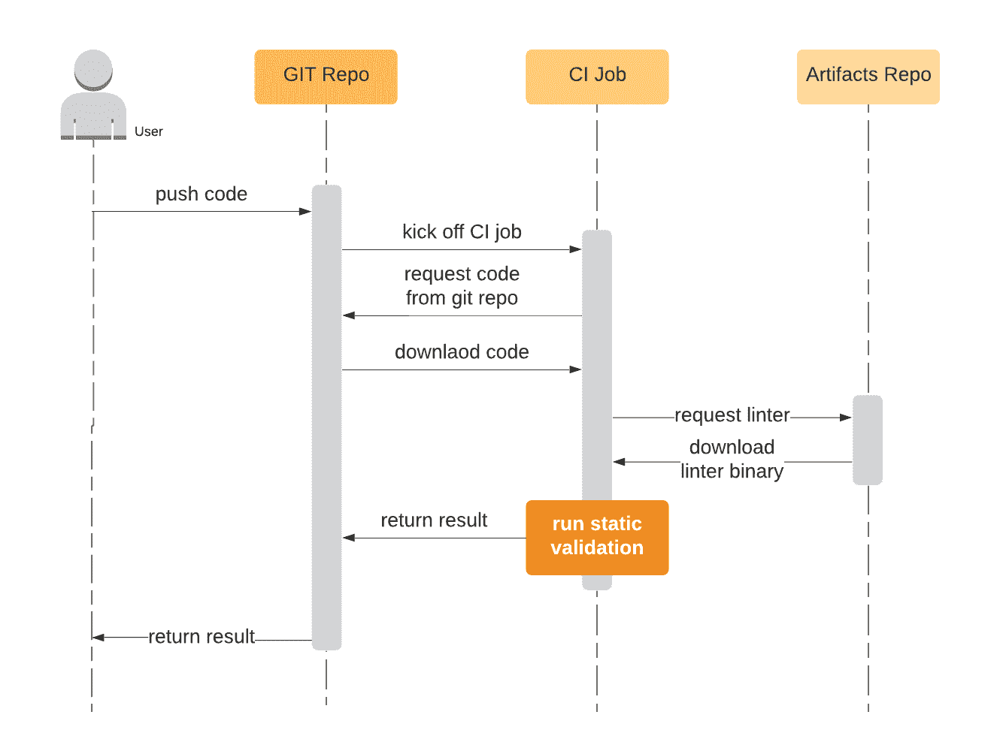
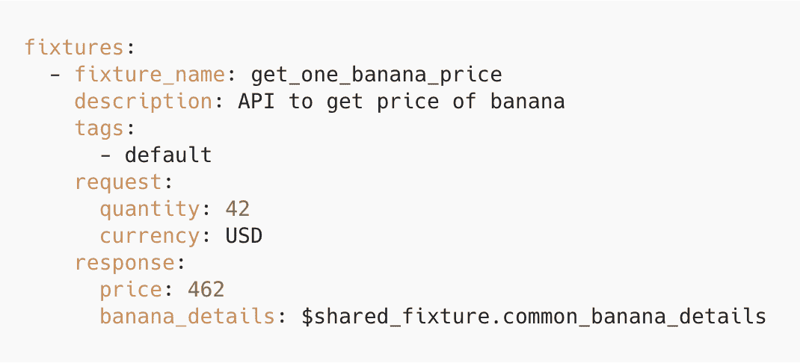
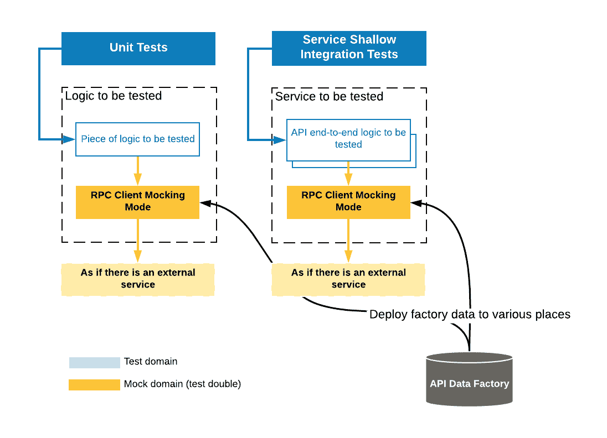

# Airbnb 的建筑服务，第 4 部分

> 原文：<https://medium.com/airbnb-engineering/building-services-at-airbnb-part-4-23c95e428064?source=collection_archive---------1----------------------->

在我们关于扩展服务开发系列的第四篇文章中，我们将深入探讨在 Airbnb 中为服务开发构建基于模式的测试基础设施。

*[*【关】*](https://medium.com/u/4f808559467d?source=post_page-----23c95e428064--------------------------------)*[*【戴瑞】*](https://medium.com/u/1b89b21582d7?source=post_page-----23c95e428064--------------------------------)*[*邢安*](https://medium.com/u/d02261f5687c?source=post_page-----23c95e428064--------------------------------)***

****

# **介绍**

**在 Airbnb 建筑服务系列的[第 1 部分](/airbnb-engineering/building-services-at-airbnb-part-1-c4c1d8fa811b)、[第 2 部分](/airbnb-engineering/building-services-at-airbnb-part-2-142be1c5d506)和[第 3 部分](/airbnb-engineering/building-services-at-airbnb-part-3-ac6d4972fc2d)中，我们分享了我们如何围绕节俭服务 IDL 构建标准化服务平台，以鼓励和执行所有新服务的基础设施标准和工程最佳实践，而不会产生额外开销。**

**虽然这种新的架构解决了一个庞大的代码库的一些基本问题，但它也带来了新的挑战，阻碍了工程生产率和质量。在这里我们很乐意分享一些我们在 2019 年出货的作品。**

# **为什么面向模式的基础设施对服务测试至关重要**

**在微服务架构中，API 成为很多组件之间的边界和桥梁。它为服务提供者和消费者之间的交互定义了一个清晰的契约。我们观察到了一些关于微服务测试的挑战。**

## **1.突破 API 变化**

**在微服务架构中，修改 API 是一种常态。不幸的是，我们已经看到了一些由 API 变更引起的生产事故。从过去事故的尸检中引用一些话:**

> **“在部署相应的服务代码更改之前，添加新的数据字段破坏了列表可用性服务的 API xxx。有问题的部署在错误激增后会自动回滚。”**
> 
> **"只有在我们确定不再使用这些字段后，才应该弃用架构字段。然而，首先部署了删除 xxx 中使用的字段的更改，随后在 xxx 端没有 gem 升级。向后不兼容的更改中断了 xxx 服务。**

## **2.服务消费者缺乏可用的 API 模拟数据**

**API 是[测试加倍](https://martinfowler.com/bliki/TestDouble.html)(生产对象的模仿、伪造、存根等)的热点，跨越不同的地方，如单元测试和集成测试。如果没有支持，工程师们会在不同的地方重复花费时间和精力来创建模拟数据、客户端和服务。**

**这也导致工程师经历不必要的重量测试设置。例如，启动相关服务甚至虚拟数据库。这些沉重的努力会适得其反。测试应该是轻量级的，并且经常运行。**

## **3.缺乏对 Mock 语义正确性的保证**

**除了前期成本之外，很难捕捉嘲讽数据的语义正确性，因为服务业务逻辑在不断发展，手动维护的测试数据很容易变得不同步。这导致测试随着时间的推移变得越来越没用。**

## **4.缺乏对服务所有者的验证**

**API 是服务和它的消费者之间的边界。这是 API 按预期实现的最低要求。**

**然而，如果没有框架级别的验证支持，服务所有者会发现他们自己很难针对他们的 API 端点设置验证，这可能与 API 消费者使用的验证集不同。**

## **5.缺乏 API 测试质量的实时指标**

**最后但同样重要的是，工程师对 API 测试覆盖率和测试数据质量几乎一无所知。对于 API 测试，没有等同于代码覆盖率的度量，代码覆盖率是一个广泛使用的度量，有助于测量单元测试的质量。**

## **6.最重要的是:以轻量级和可伸缩的方式进行测试**

**鼓励工程师以单一风格构建测试是我们最不希望的。这种隐藏的巨大障碍将把我们带回起点:缓慢的测试、不可信的测试结果、紧密耦合，以及用微小的变化破坏数量惊人的测试。**

**为了以轻量级和可伸缩的方式应对上述挑战，我们发现服务模式是关键。**

***请注意，成功的测试故事需要很多关键的组成部分，组织层面的教育和最佳实践，可扩展的测试运行程序，持续集成基础设施(CI)，持续交付基础设施(CD)，测试环境，等等。* ***在这篇文章中，我们将只关注服务 API 测试的模式方面。*****

# **服务所有者和消费者如何受益**

**在接下来的小节中，我们将深入探讨我们为服务 API 测试构建的面向模式的基础设施。我们为服务所有者和消费者构建了以下工具:**

****对于服务所有者:****

1.  ****静态 API 模式验证**:自动向后兼容性检查&模式链接器。尽可能早地捕捉突破性的 API 变更。大规模实施模式最佳实践**
2.  ****API 集成测试框架(AIT)** :验证 API 端点行为，无需编写样板文件。它提供实时 API 集成测试覆盖度量**

****对于服务消费者:****

1.  ****API 嘲讽框架:**它在单元测试和轻量级集成测试中都透明地使用了接近真实世界的嘲讽 API。不需要为上游服务创建模拟客户端或端点。**
2.  ****API 集成测试框架(AIT):** 使用服务所有者使用的相同 API 模拟数据来确保语义与服务实现保持同步。**

**让我们更深入地了解一下每个组件的工作原理。**

# **I .静态 API 模式验证**

**静态 API 模式验证是我们构建的一个工具，用于自动检测错误的 API 模式更改:**

*   **向后兼容性检查侧重于检测潜在的 API 突破性更改。**
*   **Schema Linter 旨在加强我们的 IDL 最佳实践。**

**这两种检查非常相似，因为它们都需要为所有更改的模式构建和遍历抽象语法树(AST)。我们创建了一个 linter 二进制文件，可以很容易地插入到不同的构建系统中。(例如 Java 和 Ruby)。**

****

**Figure: Flow charts that describe how Schema Validation works**

**检查本身的活动图如下所示。请注意，我们已经将两种检查合并到一个图表中，以更好地反映它们的差异。**

****

**Figure: Implementation of Schema Validation**

**有了分析模式 AST 树的能力，现在我们能够捕获突破性的 API 变更以及不遵循我们的最佳实践的更新。**

****

## **模式验证的好处**

****1。尽早发现突破性 API 变更****

**在自动化工具出现之前，这两种检查都是通过手工代码审查来进行的，这是不可伸缩的，并且可能会导致问题。**

**现在有了静态模式验证，我们就能够检测坏的 API 更改，并在代码合并之前阻止它们(例如，字段类型更改、字段 id 更改)。**

****

**Figure: Dashboard of detected API breaking change**

****2。大规模实施模式最佳实践****

**我们能够在无需人工干预的情况下实施 API 内部最佳实践。一个简单的例子是创建一个没有值的新枚举类型，这是一个定时炸弹:如果枚举名称和值无意中发生变化，就可能发生序列化错误。**

**这种错误很难在测试中检测出来，而且成本很高。由于静态模式验证，现在可以在 CI 中很早很容易地捕获它。**

# **二。基于模式的 API 数据工厂**

**API 数据工厂是一种机制，用于定义语言不可知的、**模式验证的**请求和响应装置，如 yaml 文件，以简化创建用于模拟和测试的 API 数据的**繁琐的**和**易错的**过程。**

**如果模式是一个 API 的轮廓，那么 API 数据工厂就是这个轮廓。它用有意义的数据来具体化 API。它提供了两个基本功能:**

*   **在单元测试和集成测试中模拟依赖服务 API。**
*   **使用具体化的 API 请求/响应验证 API 端点的正确性。**

****

**Figure: With these fundamental abilities, we built frameworks that helps both API consumers and API producers**

## **夹具文件实现**

**每个 API 数据工厂 fixture 文件都与一个 API 端点相关联。为了对数据实施模式遵从性，这种关联至关重要。**

****

**Figure: The structure of fixture files under a service**

**为了让我们的读者对夹具数据有一个直观的理解，下面是一个简单的例子。**

****

**Figure: simple example of what a fixture file looks like**

## **API 数据工厂功能**

****1。语言不可知且灵活****

**它将与语言无关的 API 数据存储为 yaml，可以嵌入到任何程序中，并由任何程序轻松使用。它还支持各种用途的扩展功能。(例如，共享夹具数据、灵活匹配、数据断言注释)**

## ****2。自动化模式验证****

**在每次 API 数据工厂更新时，验证可以在本地或 CI 中自动运行，以确保正确性。如果原始 fixture 数据的请求/响应不符合相应的模式，那么验证可以清楚地将错误精确到行和列。**

****3。测试的共享 API 数据****

**手工制作用于测试的 API 数据对于服务所有者和客户来说都是困难和乏味的，尤其是当 API 数据被深度嵌套时。创建共享数据工厂有助于生产者和消费者之间的数据重用。**

****4。自动数据生成****

**此外，我们构建了工具来基于匿名化的生产流量轻松生成夹具数据，从而消除任何手动数据创建并提高生产率。这也将有助于确保模拟数据示例具有真实的用途。**

****5。API 测试数据质量指标****

**因为数据工厂是基于模式的，我们可以潜在地测量 API 测试数据的质量，例如，有多少 API 字段被验证。这给了我们一种模拟数据充分性和 API 测试数据覆盖的感觉。**

# **三。API 模拟框架**

**API Mocking Framework 是嵌入在核心服务框架 k 中的组件**，它提供**模拟的接近真实世界的 API 交互**作为测试中真实服务的替代。****

**它用在这两个地方:**

*   **单元测试:[白盒测试](https://en.wikipedia.org/wiki/White-box_testing)一段包含调用依赖服务 API 的逻辑，没有设置它的依赖服务。**
*   **浅层集成测试:[黑盒测试](https://en.wikipedia.org/wiki/Black-box_testing)一个服务，不设置它的依赖服务。**

****

**Figure: How API Mocking is utilized in various kind of tests**

## **API 模拟框架特性**

****1。无处不在的 API 模仿:客户端还是服务端****

**除了嵌入模拟客户端之外，您还可以在“模拟模式”下与一个活动的服务应用程序进行交互，以一种可靠而廉价的方式获得假的 API 数据。**

**当 RPC 客户端不可用时，通常需要这种交互。例如，在前端/移动领域，模拟数据可以用来测试页面渲染，而不是经历一系列实时 API 调用的痛苦。**

**无论何时需要 API 模拟(单元测试或集成测试)，都不需要创建假的客户端或假的服务。测试程序可以与内部自动生成的 RPC 客户端进行交互，就好像它正在进行真正的服务调用一样。模拟模式是在带有配置标志或请求上下文标头的情况下启用的。**

****

**Figure: The API Mocking transparently wrap both RPC client and Service API Layer, such that mocking can be enabled anywhere**

****2。浅层集成测试的依赖性隔离****

**为了再次强调我们的目标，我们试图避免在我们的微服务架构中隐藏一块巨石:当测试一个服务时，我们不想测试服务本身之外的组件。我们称之为浅层整合测试。**

**API Mocking 框架为依赖隔离提供了一个干净的解决方案。它目前被用在诸如功能集成测试或隔离负载测试的地方，以捕捉单个服务中可能的回归。**

****3。所需的各种模拟选项****

**模仿模式可以通过 config 或 HTTP 头打开。**

*   ****匹配**:当模拟模式开启时，从用户的角度来看，与真实服务交互是一样的。在幕后，mocking 框架将找到第一个符合提交的请求的超集的 fixture 请求。**
*   ****stub**:在提交请求之前，您可以 stub 应该返回哪个 fixture 响应。**
*   ****延迟模拟**:您可以为每个模拟交互配置一个模拟延迟峰值。**

# **四。API 集成测试框架(AIT)**

## **什么是 AIT？**

**API 集成测试框架(AIT)是一个框架，**允许服务在生产环境**中使用预定义的测试数据**来验证自己，而无需编写样板文件，**并且**确保模拟数据**的语义正确性。**

****

**Figure: work flow of AIT**

**简单的流程如下所示:**

1.  **服务所有者定义了一些配置，这些配置将验证与预定义的测试数据(在 API 数据工厂中定义)相关联**
2.  **目标运行服务将公开一个 API 验证网关作为系统端点，它将路由到相应的自动生成的端点验证请求。**

## **AIT 的好处**

****1。无需编写样板代码即可验证生产者服务****

**根据[测试金字塔](https://testing.googleblog.com/2015/04/just-say-no-to-more-end-to-end-tests.html)，服务端点正确性是其他复杂端到端测试的基础。理想情况下，在这个模式驱动的世界中，测试 API 端点所需的干净信息应该仅仅是纯 API 测试数据表示，没有额外的测试设置开销。因此，**

****

**注意，在生产者服务验证中，依赖关系仍然可以作为一个选项被模拟出来。因此，我们可以用一种超级轻量级的方式进行端点验证。**

****2。模拟数据经过语义验证****

**通过利用 API 数据工厂，可以重用为单元测试或其他模拟场景定义的相同测试数据。**

**同时，生产者服务使用嵌入断言逻辑的相同预定义测试数据来验证自己，这进一步确保了语义和逻辑的正确性。如果在部署管道中捕获到意外的实时响应，提供者服务将被锁定部署，直到问题得到解决。**

****

**Figure: A simplified example of AIT**

**这样的机制帮助我们一举两得:**

*   **在上面的 fixture 响应中，带注释的字段总是有效的，并且服从断言，这使得这段数据对于模仿目的总是有效的。**
*   **在真实的响应中，同样的断言逻辑也必须通过，这使得它在生产和模拟之间保持一致。**

****3。提供实时 API 测试覆盖工具****

**AIT instruments real time API Test Coverage metrics 不需要手动和重复编译，不仅可以帮助人们了解他们测试的实时健康状况，还可以为提供商服务团队成员提供清晰的见解和激励，以提高他们的 API 测试覆盖率。**

****

**上面是 Airbnb 的一个团队的真实例子，在这里我们可以看到实时统计数据和一个超清晰的轨迹，以实现更好的 API 测试覆盖率。有了这样的工具，我们不仅可以清楚地了解哪些服务，还可以了解哪些端点在不同的环境中正确地工作。**

****4。可插拔性和轻量级****

**由于其轻量级和独立的性质，AIT 可以很容易地与不同 CI/CD 阶段的测试跑步者集成。这样的抽象使得 API 验证与外部世界的耦合更少，并且使得我们的基础设施的其他部分更容易发展。**

# **总结与展望**

**强类型模式为我们构建有效的 API 端点测试基础设施提供了关键的杠杆点。它通过共享 API 测试数据和 API 逻辑来连接服务提供者和服务消费者，使 API 测试更加准确、有意义和减少冗余。**

# **欣赏**

**感谢、肖恩·亚伯拉罕、哈维·拉米雷斯、曾小涵、艾哈迈德·哈利法、乔伊·叶、詹姆斯·奥斯特罗夫斯基以及所有人一路走来的支持！**