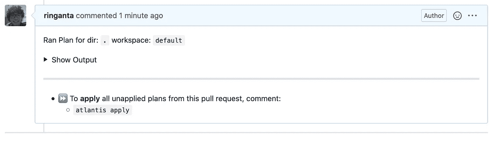
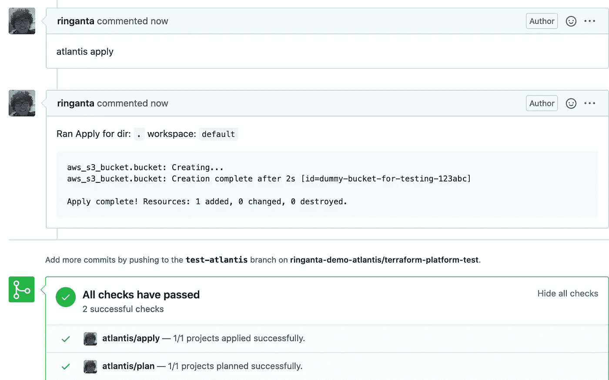
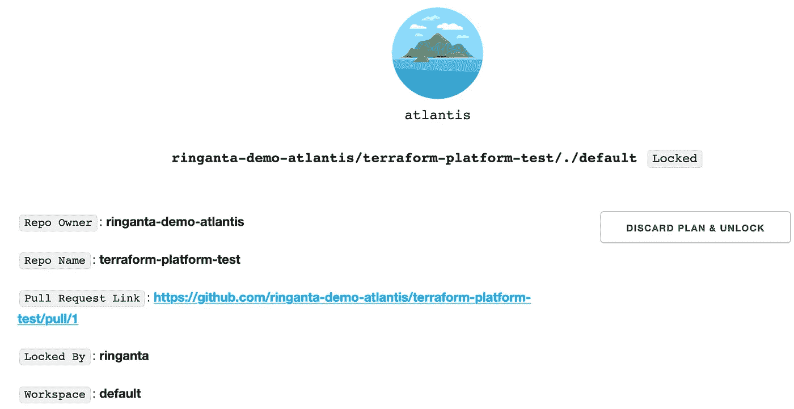

# 使用 AWS、Atlantis 和 GitHub 为您的团队构建 Terraform 平台

> 原文：<https://medium.easyread.co/building-terraform-platform-for-your-team-using-aws-atlantis-and-github-5412a1cd2370?source=collection_archive---------0----------------------->


Photo by [Esther Jiao](https://unsplash.com/@estherrj?utm_source=medium&utm_medium=referral) on [Unsplash](https://unsplash.com?utm_source=medium&utm_medium=referral)

[**Terraform**](https://www.terraform.io/) 是管理云基础设施的多功能工具。它是开源的，已经上市 5 年多了。它是将基础设施实现为代码(IaC)的最流行的工具。使用代码管理云基础设施为自动化铺平了道路。与使用点击方法(如 web UI)相比，代码可以在团队之间实现更好协作。

这篇文章帮助你为使用 [**EC2 实例**](https://aws.amazon.com/id/ec2/instance-types/) 托管亚特兰蒂斯的团队建立一个平台。 [**Atlantis**](https://www.runatlantis.io/) 是运行 Terraform 的拉式请求自动化。你可以把它想象成一个执行者，当变化发生时，它监控并运行 Terraform。一个 EC2 实例就足够了，因为 Atlantis 通常只由内部团队使用。Atlantis 需要在应用之前将执行计划临时保存到磁盘。与在多个实例上运行 EC2 以获得高可用性相比，在 EC2 不可访问的情况下更快地恢复更重要，也更划算。在多个 EC2 实例中运行 Atlantis 意味着所有实例都需要访问一个共享目录，这使得设置更加复杂和难以维护。

在本例中，您使用 GitHub 作为存储 Terraform 平台的 Terraform 项目的地方。Atlantis 将在每次创建新的 PR 时运行。Atlantis 可以检测 PR 是否包含 Terraform 项目并执行它。当新的提交被推送到现有的 PR 时，它也运行。

将 Atlantis 与 GitHub 集成意味着你需要将 Atlantis 暴露在互联网上。这是必要的，这样 Atlantis 将能够从 GitHub 接收 webhooks。Atlantis 有一个网络界面，但它没有任何认证机制。您将使用 GitHub OpenID Connect 提供程序来保护 Atlantis web 界面。

# 为 Terraform 平台调配 AWS 资源

Terraform 平台的一个组件是 EC2 实例，Atlantis 将安装在该实例中。您将使用这个 Terraform 模块[https://registry . terra form . io/modules/ringanta/ec2-Atlantis/AWS/](https://registry.terraform.io/modules/ringanta/ec2-atlantis/aws/)来启动 EC2 实例。这个模块需要一个 SSH 公共密钥。它处理使用弹性 IP、安全组启动 EC2，并从默认 VPC 中选择一个子网。

Terraform 平台的其他组件包括 S3 铲斗和 DynamoDB 工作台。S3 存储桶用于存储其他 Terraform 项目的远程状态。您可以将一个铲斗用于多个 Terraform 项目。每个项目都有自己的键。当使用 S3 作为 Terraform 后端时，DynamoDB 是一种锁定机制。一个 DynamoDB 表支持多个 Terraform 项目。

让我们使用`**mkdir atlantis-server**`为 Atlantis 平台创建一个目录。然后使用`**cd atlantis-server**`将工作目录更改为新创建的目录。在运行 Terraform 项目之前，您需要为 EC2 生成一个 SSH 密钥对。使用`**ssh-keygen -t rsa -b 2048 -f ~/.ssh/atlantis-server_rsa**`命令。SSH 公钥存储在`**~/.ssh/atlantis-server_rsa.pub**`上。您将需要 SSH 公钥的内容作为`**main.tf**`文件中的一个参数。让我们用下面的内容创建一个文件`**main.tf**`。

Terraform main.tf

用上面生成的 SSH 公钥的内容替换 **SSH_PUBLIC_KEY** 。S3 存储桶名称由所有 AWS 用户共享，因此您可能需要根据自己的需要找到一个更独特的名称。`**attach_admin_policy = true**`参数将使用 EC2 实例角色将 **AdministratorAccess** 角色附加到 EC2。AdministratorAccess 是授予 AWS 帐户完全访问权限的 AWS 内置角色。

让我们创建`**providers.tf**`文件，并在那里声明 Terraform AWS provider 和其他 Terraform 配置。

Terraform providers.tf

让我们用下面的内容创建`**outputs.tf**`文件。该文件打印安装 Atlantis 所需的信息。

Terraform outputs.tf

一切就绪，您就可以为 Terraform 平台提供 AWS 资源了。在运行下面的 terraforms 命令之前，需要在执行命令的本地计算机上配置具有适当权限的 AWS 凭据。

1.  设置将提供资源的 AWS 区域。例如，如果您想在新加坡提供资源，您需要导出下面的变量，`**export AWS_REGION=ap-southeast-1**`。有关所有可用的 aws 地区，请咨询[https://docs . AWS . Amazon . com/AWS C2/latest/user guide/using-regions-avail ability-zones . html # concepts-available-regions](https://docs.aws.amazon.com/AWSEC2/latest/UserGuide/using-regions-availability-zones.html#concepts-available-regions)。
2.  运行`**terraform init**`初始化 Terraform 项目。
3.  运行`**terraform plan -out=tfplan.out**`生成执行计划并检查执行计划。
4.  通过执行`**terraform apply tfplan.out**`应用更改。

上面的 Terraform 命令为 Atlantis 创建了一个 EC2 实例，为 Terraform 远程状态创建了一个 S3 桶，为远程状态锁定创建了一个 DynamoDB 表。所有这些资源都是在 AWS_REGION 变量定义的区域中创建的。在提供了所有资源之后，让我们使用以下命令将所有 Terraform 文件保存到 Git 存储库中。

```
git init
echo -e ".terraform\ntfplan.out" >> .gitignore
git add .
git commit -m 'Initial commit'
git remote add origin <GITHUB_REPO_URL>
git push -u origin master
```

大多数情况下，您不需要将 Terraform 状态文件提交到 git 存储库中。我们将为这个 Terraform 项目破例，因为这个项目不会改变太多。该项目使用本地状态文件。Git 是一种与其他团队成员共享 terraform 文件和状态文件的机制。建议将这个本地 git 存储库发布到其他团队成员可以访问的中央存储库。

# 为亚特兰蒂斯准备 GitHub 凭证

Atlantis 建议创建一个专门的 GitHub 用户，其名称应易于识别为 Atlantis。这很重要，因为 Atlantis 会以这个用户的身份写评论。Atlantis 需要一个具有存储库范围的 GitHub 个人访问令牌(PAT)才能运行。按照[https://www . run atlantis . io/docs/access-credentials . html # generating-an-access-token](https://www.runatlantis.io/docs/access-credentials.html#generating-an-access-token)为 Atlantis 生成 GitHub PAT。

Atlantis web UI 由 OAuth2 代理保护，GitHub 作为 OpenID Connect 身份提供者。OAuth2 代理需要来自 GitHub OAuth 应用程序的 OAuth 客户端 id 和密码。GitHub 在[https://developer . GitHub . com/apps/building-OAuth-apps/creating-an-OAuth-app/](https://developer.github.com/apps/building-oauth-apps/creating-an-oauth-app/)上提供了创建新 OAuth 应用的指南。GitHub OAuth 创建需要以下信息:

*   应用程序名称是 OAuth 应用程序的名称
*   主页 URL 是主页或 OAuth 应用程序。值的格式为`**https://<ATLANTIS_DOMAIN>**`。 **ATLANTIS_DOMAIN** 必须替换为`**terraform output atlantis_xip_domain**`的输出。
*   授权回调 URL 是 OAuth2 代理回调 URL。该字段的值为`**https://<ATLANTIS_DOMAIN>/oauth2/callback**`。

成功创建 OAuth 应用程序后，记录 OAuth 客户端 id 和客户端密码。稍后配置 Atlantis 时需要这些信息。

# 设置和配置 Atlantis

Atlantis 将被安装在上面用 Terraform 创建的 EC2 上。Ansible galaxy 上有一个 Ansible 角色可以在 Linux 虚拟机上安装和配置 Atlantis。这个角色可以在 https://galaxy.ansible.com/ringanta/atlantis[找到。该角色还安装和配置保护 Atlantis 安装所需的其他软件包。](https://galaxy.ansible.com/ringanta/atlantis)

*   确保安装了 Ansible 2.9。您可以使用 pip 安装 Ansible，如下所示`**pip install --upgrade ansible**`。
*   确保工作目录在`**atlantis-server**`目录中。
*   创建一个可行的库存文件，并将文件命名为`**hosts**`。将上面创建的 EC2 实例添加到库存文件中。文件内容应该如下所示。

```
; filename: hosts
[atlantis]
<ATLANTIS_IP> ansible_user=ubuntu
```

用来自`**terraform output atlantis_ip**`命令的值替换 **ATLANTIS_IP** 。

*   创建一个 vault 密码文件来加密和解密 Ansible 变量值，`**openssl rand -base64 18 > vault-pass-file**`
*   用以下内容创建一个脚本文件(如`**playbook.yml**`)。

Atlantis Playbook

用适当的值替换下列占位符:

*   **ATLANTIS_DOMAIN** 值可以使用`**terraform output atlantis_xip_domain**`命令获取。
*   **GH_USER** 和 **GH_TOKEN** 是来自[为 Atlantis](http://localhost:1313/posts/build-terraform-automation-platform-for-your-team-using-ec2-atlantis-and-github/#prepare-github-credential-for-atlantis) 准备 Github 凭证部分的 Github 用户名和 PAT。使用 Ansible Vault 加密 **GH_TOKEN** 值，以便安全提交，`**ansible-vault encrypt_string --vault-password-file vault-pass-file '<GH_TOKEN>'**`
*   **GH_WEBHOOK_SECRET** 是一个随机值，也需要在 Github webhook 配置上设置。使用以下命令生成并加密值`**ansible-vault encrypt_string --vault-password-file vault-pass-file $(openssl -rand -base64 18)**`。
*   **GH_REPO_LIST** 表示哪些存储库被允许运行 Atlantis。为了方便起见，允许某些 Github 组织下的所有存储库。例如，使用`**github.com/ringanta-demo-atlantis/***`来允许`**ringanta-demo-atlantis**` Github 组织下的所有存储库。
*   OAUTH2_COOKIE_SECRET 是一个随机值，可以使用`**ansible-vault encrypt_string --vault-password-file vault-pass-file $(openssl -rand -base64 18)**`命令生成并加密。
*   **OAUTH2_CLIENT_ID** 和 **OAUTH2_CLIENT_SECRET** 是来自[为 Atlantis 准备 Github 凭证](http://localhost:1313/posts/build-terraform-automation-platform-for-your-team-using-ec2-atlantis-and-github/#prepare-github-credential-for-atlantis)部分的 Github OAuth 客户端 ID 和 SECRET。使用`**ansible-vault encrypt_string --vault-password-file vault-pass-file '<OAUTH2_CLIENT_SECRET>'**`命令对 **OAUTH2_CLIENT_SECRET** 进行加密。
*   **OAUTH2_GH_ORG** 是一个 Github 组织，其成员被允许访问 Atlantis web UI。例如，使用`**ringanta-demo-atlantis**`允许`**ringanta-demo-atlantis**` Github 组织的成员访问 Atlantis web UI。

下一步是使用`**ansible-galaxy role install -p roles ringanta.atlantis**`从 Ansible Galaxy 下载亚特兰蒂斯角色。之后运行`**playbook.yml**`剧本。本行动手册将安装和配置 Atlantis 以及保护它所必需的其他包。

`**ansible-playbook -i hosts --vault-password-file vault-pass-file --private-key ~/.ssh/atlantis-server_rsa playbook.yml -v**`

一旦 Atlantis 启动并运行，创建一个新的 Github webhook。关于如何为 atlantis 创建 webhook，请咨询[https://www . run Atlantis . io/docs/configuring-web hooks . html # github-github-enterprise](https://www.runatlantis.io/docs/configuring-webhooks.html#github-github-enterprise)。确保使用与`**playbook.yml**`剧本文件中相同的 webhook 密码值。最后一步是验证 Atlantis 是否设置正确。使用浏览器访问`**https://<ATLANTIS_DOMAIN>**`上的亚特兰蒂斯。您将看到使用 Github 按钮进行**登录。点击按钮，您将被重定向到 GitHub 授权页面。授权应用程序访问您的 GitHub 帐户。你将被重定向到亚特兰蒂斯登陆页面。**

Atlantis 已经安装并配置好了。让我们将 Ansible 相关文件提交给 git 存储库。

```
echo vault-pass-file >> .gitignore
git add .
git commit -m 'Install and configure Atlantis'
git push
```

# 试用 Terraform 平台

您可以通过在上面运行 Terraform 项目来尝试新创建的 Terraform 平台。该项目必须托管在 Atlantis 存储库允许列表中的一个存储库中。让我们创建一个简单的 Terraform 项目，利用现有的 S3 桶和 DynamoDB 表。用以下内容创建`**providers.tf**`文件。

Terraform providers.tf

将 Terraform 项目文件添加到 git 存储库中，并将其发布到 GitHub。确保 GitHub 库是 Atlantis 允许列表的一部分。

接下来，您将使用 terraform 创建一个虚拟铲斗。提交 Terraform 变更作为 PR，并通过 Atlantis 执行变更。为此，请在本地创建一个新分支。将当前分支更改为新分支后，创建包含以下内容的`**main.tf**`文件。

```
resource "aws_s3_bucket" "bucket" {
    bucket = "dummy-bucket-for-testing-123abc"
}
```

将变更提交到本地 git 存储库，将其推送到 Github，并创建一个新的 PR。Atlantis 将选择变更并报告执行计划。下面是 Atlantis 运行`terraform plan`后的报告示例。



Terraform Platform Atlantis Plan

在验证 Terraform 执行计划正确后，通过在 GitHub PR 页面上发布`**atlantis apply**`评论来应用更改。Atlantis 将运行更改并报告结果。以下是成功应用执行计划后的 Atlantis 结果示例。



Terraform Platform Atlantis Run

Atlantis UI 显示 Terraform 项目的活动锁定。一旦 PR 被合并，该锁将被删除。我们还可以从 web 用户界面中删除锁。这是 Atlantis web UI 上一个活动锁的例子。



Terraform Platform Atlantis Web UI

# 结论

在本文中，我将向您展示如何使用 EC2、GitHub 和 Atlantis 为您的团队建立一个 Terraform 平台。该平台使用 S3 作为远程状态后端，使用 DynamoDB 表作为 S3 后端的锁定机制。Terraform 和 Ansible 用于为平台提供和配置基础设施。所有配置都在 Git 存储库中进行版本控制，并推送到 GitHub。还演示了如何使用 Terraform 平台运行 Terraform 项目。Atlantis 检测到一个 PR 并向 PR 页面报告执行计划。用户需要审查执行计划并发布`**atlantis** **apply**`以应用执行计划。