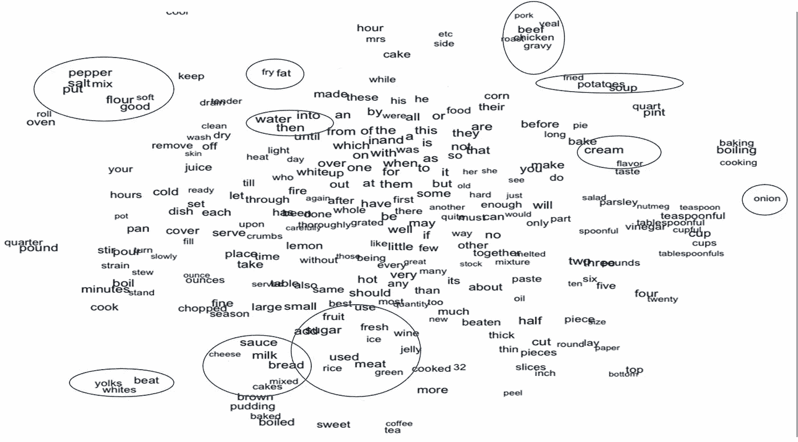
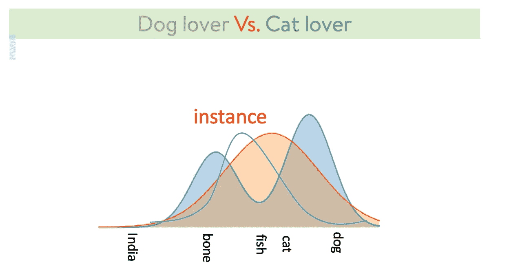
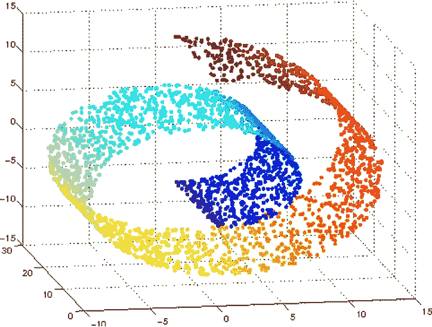

# 数据稀缺时构建文本模型

> 原文：<https://medium.com/walmartglobaltech/building-text-model-when-data-is-scarce-53d9f48aabb9?source=collection_archive---------5----------------------->

机器学习方法在文本数据上的应用已经相当成功，具有广泛的应用，如来自客户评论的产品情感、社交网络上的趋势话题以及从产品数据中提取有意义的概念。当涉及到分类任务时，有监督的方法比无监督的方法表现得好得多。然而，监督模型需要训练数据——所需的训练数据量取决于手头任务的复杂性。

生成训练数据通常是手动的，因此需要大量的人工参与——大部分来自领域专家。因此，生成训练数据，特别是对于大量数据，是耗时、昂贵的，并且由于疲劳而容易出错。为了减少这些缺点，需要探索可以用更少的数据工作的替代方法。但这可能吗？在本文中，我们来看看一些有用的方法。

**标签背景**

数据标记有两种方法——主动和被动。被动方法不区分接下来要标记的未标记点。另一方面，主动方法智能地选择下一个有望改善模型性能的数据点。然而，主动标记需要标记和建模的多次迭代(一次迭代用于识别要标记的新数据点，对其进行标记，并构建模型)。因此，主动标签法有较长的上市时间。

可以利用被动标签来争取更好的上市时间。当与集合方法结合使用时，被动标记可以创造奇迹。集成方法组合多个弱标记器来产生强标记器。(强标注器是正确标注每个数据点的实体，而弱标注器有时可能会出错。例如，给定患者的症状，医学专家可以是疾病的强标记者，而庸医或化学家可以是弱标记者)。使用弱标签集合的想法已经存在很长时间了(事实上 AdaBoost 是 20 年前出于这个目的开发的)。最近，通气管[1]已经被设计成将多个弱标记器结合在一起。在该系统中，来自多个弱标签器的标签被组合以产生比单个弱标签器更准确的标签。为此，通气管使用了一个图形模型。不幸的是，在一个数据实例可能有多个标签的情况下，scub 不能处理多标签的情况(例如，一件衬衫可能同时有黑色和红色)。一个显而易见的问题是，是否有可能扩展通气管，以处理多标签的情况。事实证明，这很难，因为通气管的设计方式。然而，有可能建立替代方法。我们已经尝试了两种，效果很好。第一种方法是基于弱标记者的加权多数投票；第二种是基于分类器的另一层，该分类器以来自弱标签器的标签作为输入，以实例的实际标签作为输出来训练。下面是弱标签和利用这些弱标签产生更好的最终标签的集成方法的快照。

Ensemble Approach

**减少参数数量**

文本输入可能包含词汇表中的大量术语，但并非所有术语都与手头的分类任务相关。使用单词到 vec 表示范例的概念，每个标签可以被表示为一个向量。我们似乎可以只关注那些与标签有很好相似性的术语。这具有显著减少要学习的参数数量的期望效果。

Reducing number of terms

在上面的例子中，当我们将相似的概念映射到它们的嵌入维度时，它们被放置得更近(为了简单起见，我们在这里显示的是 2 维)。

考虑如上所示的词汇表。如果我们对食物类型的分类感兴趣，圈起来的术语比其他的更有意义。尽管如此，这些术语只是整个词汇的一小部分。因此，如果我们基于它们与感兴趣的概念的距离来消除大部分术语，则得到的模型将具有少得多的要学习的参数。这里，我们可以使用输出标签和输入之间的相似性的概念，并使用一组经过删减的输入来构建模型。因此，我们有了“基于相似性的方法”。

**使用分布式概念**

假设我们对宠物食品的分类感兴趣:狗粮、猫粮等等。我们可以认为狗粮是词汇的一种分布，其中与狗粮相关的词汇将比其他词汇具有更高的权重。同样，我们可以为猫粮构建一个分布图。给定一个食物描述，我们想把它归为两种食物类型中的一种。在这种情况下，如果输入实例更接近狗粮分布而不是猫粮分布，那么直观地将它分类为狗粮是有意义的。

对于这种方法，我们现在需要两个概念。分布的概念和两个分布之间的距离。对于每个单词/术语，我们可以从标记的示例(如下)中计算每个类别的频率，以获得分布。分布 P 如何与分布 Q 相关被测量为 KL 散度。不幸的是，KL 散度是不对称的，即 KL(P，Q)与 KL(Q，P)不同。因此，我们使用一种修正形式的 KL 散度，我们称之为 KLD 或 KL 距离，它使得测度对称。

KL distance

在训练时，任务是学习标签的分布。给定一个输入实例，我们可以根据 KLD 预测最接近标签集的标签。

为什么基于分布的方法应该适用于稀缺数据？从概念上讲，我们受标签之间分布差异的引导。同样，与食物类型不相关的术语在标签分布中的支持度为零或很低。因此，分类将主要取决于在标签分布中具有非平凡支持的术语。

An example of KL distance

**在流形的固有维度中使用分类器**

数据可能来自一个流形，因此分类器应该遵循这样的原则，即流形中较近的点应该具有相同的标签。换句话说，按照欧几里德距离接近的点不一定具有相同的标签。

An example of data on manifold (source: [https://www.semanticscholar.org/paper/Algorithms-for-manifold-learning-Cayton/100dcf6aa83ac559c83518c8a41676b1a3a55fc0](https://www.semanticscholar.org/paper/Algorithms-for-manifold-learning-Cayton/100dcf6aa83ac559c83518c8a41676b1a3a55fc0))

流形学习研究[2]表明，RKHS 空间的函数有能力捕捉数据分布。更令人鼓舞的是，基于空间中的核的线性分类器可以是一个好的分类器。为了简化，预测值是一组核的线性组合的简单函数，其可以在训练实例和当前实例之间计算。这样的模型也很容易学习。

**没有标签数据时的一包无人监管的把戏**

当几乎没有标记数据时，我们该怎么办？我们可以利用一套无人监管的技术。一个简单的解决方案是使用正则表达式和单词嵌入来查找与标签相似的单词或术语。为此，我们可以使用自然语言处理的现有技术(例如，词汇化、词干化、word2 矢量映射)。通过启发式规则，更复杂的处理是可能的。启发式规则可以以规范化规则的形式从领域专家那里收集。或者，可以通过自动解析自动创建启发式规则。

最后，这些启发法在实践中有效吗？我们已经用现实生活中的例子进行了产品属性提取的实验。我们已经看到了跨多个属性的 1000 量级的标记数据的显著性能(96%的准确度)。另一个相关的问题是，这种方法是否适用于基于图像的分类。大多数图像模型具有大量参数，并且如预期的那样，需要大的数据集(大约 1 万或更多)用于甚至简单的二进制分类。希望我们将在未来的文章中再次讨论这个问题。

鸣谢:这是与 Tuhin Bhattacharya、Abhinav Rai、Gursirat Singh Sodhi、Arpit Gupta、Ashish Gupta、Himanshu Rai、Diksha Manchanda、Rahul Bansal 和 Abhijit 蒙达尔合作的一部分。

***参考:***

1.  拉特纳，a .，巴赫，S.H .，埃伦贝尔，H. *等* **浮潜:弱监督下的快速训练数据创建*。****《VLDB 日报》* ***29、***709–730(2020)。[https://doi.org/10.1007/s00778-019-00552-1](https://doi.org/10.1007/s00778-019-00552-1)
2.  米哈伊尔贝尔金，帕萨尼约吉，维卡斯辛德瓦尼。**流形正则化:从有标签和无标签的例子中学习的几何框架。** *J .马赫。学习。第*号和第**号决议第 2399 至 2434 段(2006 年)**