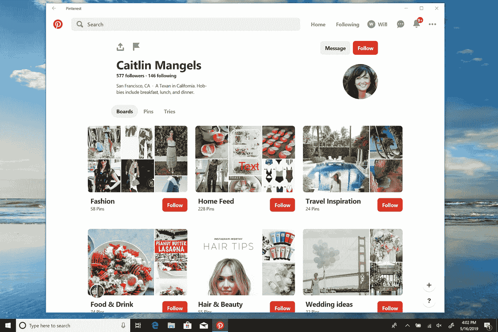
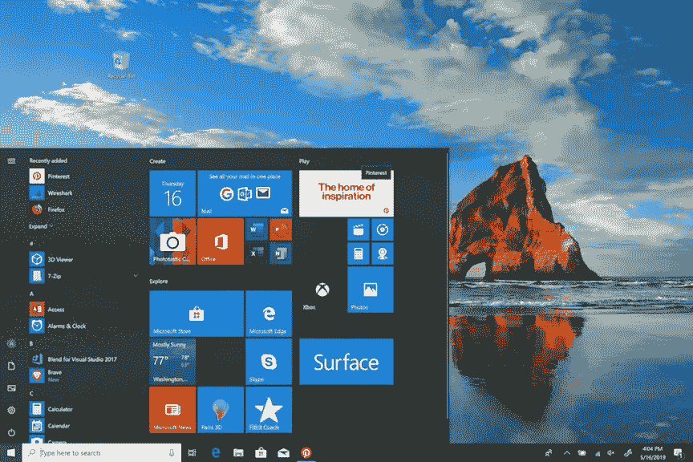

# 为 Windows 10 构建 Pinterest 应用

> 原文：<https://medium.com/pinterest-engineering/building-the-pinterest-app-for-windows-10-5e29f2146f7d?source=collection_archive---------4----------------------->

Will Yau |成长工程

**解决用户问题**

由于我们专注于开发帮助 Pinners 在所有兴趣、地点和平台中寻找灵感的方法，我们知道我们必须改善 Windows 的体验。从桌面访问 Pinterest 需要使用浏览器，经常会打开许多标签，这可能会成为一种负担。为了创造更加无缝的体验，今天我们[正式推出](https://newsroom.pinterest.com/en/post/introducing-the-pinterest-windows-app)Windows 10 平台上的 Pinterest 应用程序。Pinterest 可以从开始菜单&任务栏中轻松访问，并与 Windows 进行了更深入的集成，Pinners 现在可以通过更加增强和迷人的体验进行浏览。

**利用 PWA**

Windows 应用是建立在[渐进式网络应用](/@Pinterest_Engineering/a-one-year-pwa-retrospective-f4a2f4129e05) (PWA)之上的。由于他们桌面上的 Pinners 已经默认为 pinterest.com，他们已经熟悉了产品体验。该网站也是功能齐全，不断更新，我们有许多优秀的人在网站上工作，使它每天都更好。因为它是 PWA，所以它可靠、快速且引人入胜[【1】](https://developers.google.com/web/progressive-web-apps/)，有效地利用了服务工作者、缓存、通知等等。它也有一个适当的应用清单，并利用共享和其他功能。

**Windows 商店作为分销渠道**

我们的桌面 web Pinner 分布与其他 web 类似，大多数在运行 Windows 10 的 Windows 设备上，这几乎是 Windows 用户群的一半。正如微软最近[公布的](https://news.microsoft.com/bythenumbers/en/windowsdevices)，全球有超过 8 亿台 Windows 10 设备。随着这些 Pinners 能够访问[微软商店](https://www.microsoft.com/en-us/p/pinterest/9pfhdsf91b9r?cid=newsroom_blog_20190530)，这是 Pinterest 向他们提供更多服务的绝佳机会。

除了它是一个很好的分发渠道之外，微软商店也很灵活，并将打包的 PWA 视为一等公民，可以访问 Windows 10 功能 API。这使我们能够利用我们的工程团队已经完成的所有伟大工作。PWA 应用程序在应用程序大小方面自然较小，允许更短的安装时间，同时保持持续更新，因此应用程序永远不会过时或过时。服务人员的可用性使我们能够像大多数原生应用程序一样提供真正的离线体验。

然而，新的机遇也带来了新的挑战。这些挑战包括下载和应用崩溃，这两者都是不可避免的，但也是我们一直在与微软合作尽可能减少的问题。此外，获取漏斗是一个繁琐的过程(需要两次点击安装)，导致较高的下降相比，正常的网络获取漏斗。

**全新价值和卓越体验**

总的来说，我们对早期的结果很满意。Pinners 的早期反馈非常支持，因为他们发现了在浏览器之外寻找灵感的价值。我们继续通过添加 Windows 功能进行改进，如动态磁贴、跳转列表和丰富通知。我们将使更多的集成与其他应用程序(即。分享等。).敬请期待！