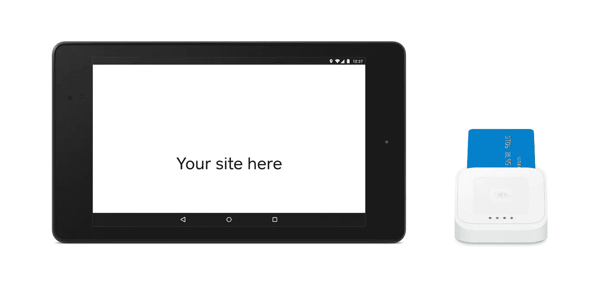

# 为 Android 和 iOS 建立基于网络的销售点

> 原文：<https://medium.com/square-corner-blog/building-web-based-points-of-sale-for-android-ios-9dfbc0f261e4?source=collection_archive---------0----------------------->

> 注意，我们已经行动了！如果您想继续了解 Square 的最新技术内容，请访问我们的新家[https://developer.squareup.com/blog](https://developer.squareup.com/blog)

使用 Square，您可以构建一个 web 应用程序，切换到 Square 销售点应用程序来接受当面支付。最棒的是，你可以在 Android 和 iOS 上做到这一点，因此有可能建立一个基于网络的销售点，可以利用 Square 的硬件在 iOS 和 Android 上接受当面支付。在这篇文章中，我们将通过必要的步骤来构建你自己的应用程序。



为了制作一个跨平台的 web app，我们需要逻辑来检测目标设备运行的是什么平台。准确地做到这一点可能真的很难，有很多专门解析用户代理的库。为了使这个例子简单，我们将使用在这个[堆栈溢出答案](http://stackoverflow.com/a/21742107/4541769)中粗略列出的 javascript 解决方案，它在用户代理上使用正则表达式。

```
var userAgent = navigator.userAgent || navigator.vendor;if (/android/i.test(userAgent)) {
    return "Android";
}
if (/iPad|iPhone|iPod/.test(userAgent) && !window.MSStream) {
    return "iOS";
}
return "unknown OS"
```

如果用户在 Android 或 iOS 设备上，那么我们将显示一个按钮，单击该按钮将切换到原生 Square 销售点应用程序。对于桌面和其他平台，我们将展示一个虚拟的[电子商务表单](https://docs.connect.squareup.com/articles/adding-payment-form)，供用户输入他们的卡信息。

## 开始之前

如果您尚未创建 Square 帐户或注册应用程序来获取 API 凭证，请遵循本[Square API 入门](https://docs.connect.squareup.com/articles/getting-started/)指南中的步骤 1 和 2。你需要你的`application id`并填写你的`callback url`。

## 构建 URL

你可以通过一个链接启动到原生 Square 应用的切换，就像导航到网络上的任何其他页面一样。请记住，这个链接看起来会与你通常放在`href`中的略有不同。

**iOS:**
基本结构是有一个像这样的链接`<a href="square-commerce-v1://payment/create?data=PARAMETERS">`，其中`PARAMETERS`是一个编码的 JSON 对象，包含关于销售价格的信息，Square 应用程序应该允许支付的投标等。您的`PARAMETERS`可能看起来像这样:

```
{   
   "amount_money": {
     "amount": 500,
     "currency_code": "USD"
   },
   "callback_url": "myapp-url-scheme://payment-complete",
   "client_id": "MY_APPLICATION_ID",
   "version": "1.2",
   "notes": "Rental fee",
   "options": {
     "supported_tender_types": [
       "CREDIT_CARD",
       "CASH",
       "SQUARE_GIFT_CARD",
     ]
   }
 }
```

一定要记得用类似`encodeURIComponent()`的函数对它们进行编码，这样你最终的 URL 看起来就像这样:

```
<a href="square-commerce-v1://payment/create?data=%7B%22amount_money%22%3A%7B%22amount%22%3A500%2C%22currency_code%22%3A%22USD%22%7D%2C%22callback_url%22%3A%22myapp-url-scheme%3A%2F%2Fpayment-complete%22%2C%22client_id%22%3A%22MY_APPLICATION_ID%22%2C%22version%22%3A%221.2%22%2C%22notes%22%3A%22Rental%20fee%22%2C%22options%22%3A%7B%22supported_tender_types%22%3A%5B%22CREDIT_CARD%22%2C%22CASH%22%2C%22SQUARE_GIFT_CARD%22%5D%7D%7D">Click on me to Check out!</a>
```

您可以在[使用 iOS 版销售点 API 指南了解更多选项。](https://docs.connect.squareup.com/articles/register-api-ios/)

**安卓:** 安卓链接看起来很不一样，但如果你以前用过安卓，应该会有些熟悉。你所要做的就是把你的意图直接放在链接里:

```
<a href="intent:#Intent;action=com.squareup.register.action.CHARGE;package=com.squareup;S.browser_fallback_url=https://my.website.com/index.html;S.com.squareup.register.WEB_CALLBACK_URI=https://my.website.com/index.html;S.com.squareup.register.CLIENT_ID=sq0ids-yOurCLieNtId;S.com.squareup.register.API_VERSION=v1.3;i.com.squareup.register.TOTAL_AMOUNT=100;S.com.squareup.register.CURRENCY_CODE=USD;S.com.squareup.register.TENDER_TYPES=com.squareup.register.TENDER_CARD,com.squareup.register.TENDER_CARD_ON_FILE,com.squareup.register.TENDER_CASH,com.squareup.register.TENDER_OTHER;end">Buy Now!</a>
```

交易的所有信息被添加到不同的参数中。参见参考资料[使用 Android Web API](https://docs.connect.squareup.com/articles/web-api-android/)。

## 把所有的放在一起

现在我们有了粗略检测操作系统的逻辑，以及处理 iOS、Android 和 web 支付的逻辑。我们代码的其余部分由 HTML 和 javascript 组成，它们将所有东西粘合在一起。别忘了，测试代码的一个简单方法是使用 [ngrok](/@tristansokol/easing-your-development-with-ngrok-5389d6bbbc68) 将您的开发环境暴露给一个 URL。

如果您对该代码或使用 web API 进行销售有任何疑问，请[阅读更多文档](https://docs.connect.squareup.com/articles/register-api-overview)，或留下评论，或在 Twitter 上联系我们( [@SquareDev](https://twitter.com/SquareDev) )。并查看我们在下面创建的示例中的最终代码！