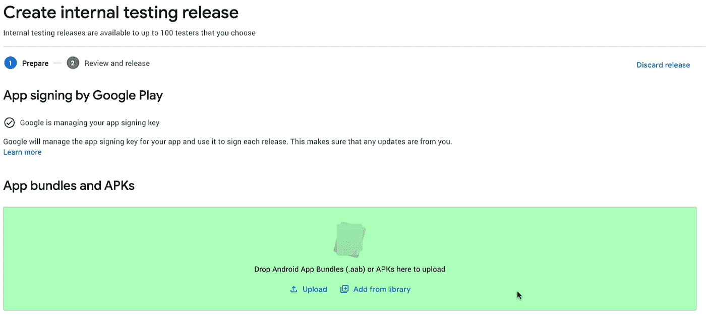
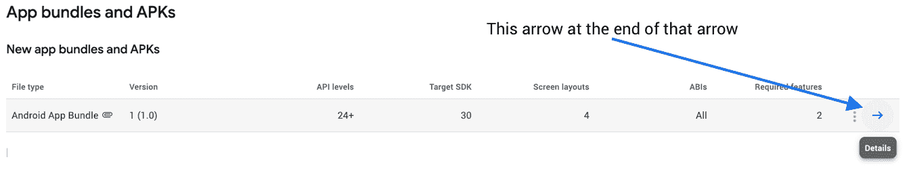
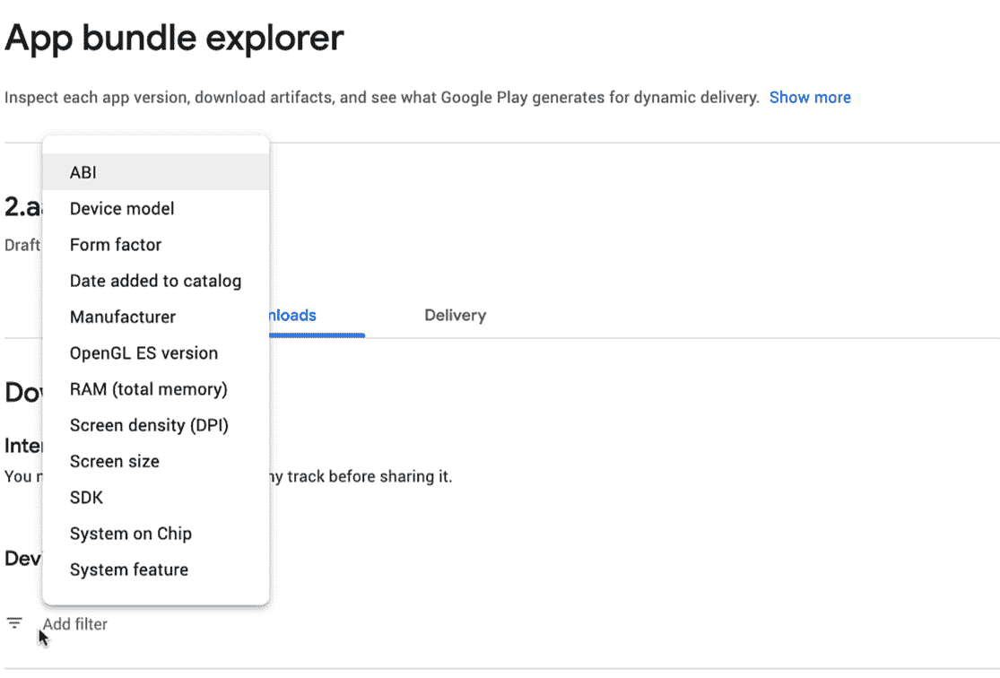

# 构建您的第一个应用捆绑包

> 原文：<https://medium.com/androiddevelopers/building-your-first-app-bundle-bbcd228bf631?source=collection_archive---------0----------------------->


## Android 应用捆绑包是 Android 应用的新的官方发布格式。

> **本文以视频形式提供，并在帖子末尾有链接。**

通过 Android 应用捆绑包，我们创建了一种解锁格式，其中包括向您的用户发送较小的应用。当磁盘空间变得紧张时，较小的应用程序*更可能被安装*而*不太可能被卸载*。

在本帖中，我们将进一步了解如何构建您的第一个应用捆绑包，如何使用 Play 控制台上传它，并深入了解一些配置选项。

> **开始不需要对你现有的代码库做任何改变。**

你需要做的就是使用命令行或 Android Studio 创建一个 Android 应用包。

# 在命令行上构建

在命令行上，您将像这样运行一个`bundle`任务:

```
./gradlew bundleRelease
```

然后在应用程序的构建目录中找到这个包。默认位置是`app/build/outputs/bundle/release`。

这个包需要签名。使用`jarsigner`时，您可以这样签署捆绑包:

```
jarsigner -keystore $pathToKeystore app-release.aab $keyAlias
```

一旦用实际值替换了变量并输入了密钥库密码，包就会被签名并准备好上传。

# 在 Android Studio 中构建

在 Android Studio 中，选择“Build = > Generate Signed Bundle/APK”并按照对话框进行操作。

无论您使用命令行还是 Android Studio，该过程都将为您留下一个已构建和签名的发布包，可以随时上传到 Play Store。

## 通过播放控制台上传

要将您的应用捆绑包上传到 Play Store，请在所选的发布轨道上创建一个新版本。您可以将捆绑包拖放到“应用包和 apk”部分，或者使用 [Google Play 开发者 API](https://developers.google.com/android-publisher) 。



Highlighted (green) section of Play Console for upload of App Bundles.

一旦上传了捆绑包，Play Store 就可以根据用户的配置优化它提供给用户设备的 apk。这反过来减少了下载和安装的规模。

# 探索您的 Android 应用捆绑包

要查看 Play Store 如何将您的应用程序发送到用户的设备，您可以单击捆绑包行末尾的“详细信息”按钮。



Screenshot of the highlighted “Details” button

在详细信息屏幕中，您已经看到了许多关于您的应用捆绑包的信息，如版本代码、minSdk 级别、目标 Sdk、所需功能、权限、屏幕布局、本地化等等。

你还可以为你的应用程序下载签名的 apk，以查看 Play Store 向特定设备提供了什么。要导航到那里，点击“探索捆绑包”,然后打开“下载”标签。

您可以选择一个特定的设备，也可以从“添加过滤器”选项卡中应用一个或多个过滤器。



Opened filter tab in the app bundle explorer

# 下载应用捆绑包并在本地安装

在应用捆绑包浏览器中，在屏幕的末端，有一个“下载”按钮，它提供了一个 zip 文件，其中包含几个 APK，这些文件是为特定设备量身定制的。

下载并解压缩文件后，可以使用包含目录中的“adb install — multiple *.apk”将包含的 APK 安装在本地仿真器或设备上。

虽然这组中的每个 apk 都与保证正确执行您的应用程序相关，但我想指出的是，为了提供您的应用程序的核心功能， **base.apk** 必须安装在设备上。除了代码和资源，基本模块还包含合并的 AndroidManifest 和整个应用程序的共享依赖项。

每个功能模块或配置部分都提供了自己的资源，并且可以包含代码，但是基础模块将它们联系在一起。

# 禁用优化

您可以在每个模块的`build.gradle`文件中禁用优化。你所要做的就是编辑`language`、`density`或`abi`属性，并将`enableSplit`设置为`false`。这将告诉构建系统它不应该优化这个特定的维度。

> **除非你有充分的理由，否则我建议不要接触这一部分，因为将 enableSplit 设置为 false 会显著增加应用程序在设备上的安装大小。**

```
// This configuration specifies how an app bundle should be split
// in terms of language, density and cpu architecture (abi).
// The default values are true.
// This means a split will be generated.bundle **{** language **{**
        enableSplit = true
    **}
**    density **{**
        enableSplit = true
    **}
**    abi **{**
        enableSplit = true
    **}
}**
```

也可能有例外，比如当你的应用程序内置了自己的语言选择器，而你想让所有潜在的语言随时可供选择。但即便如此，使用 Android 应用捆绑包也能让你按需加载功能。这可以用来避免预装应用程序中只有一小部分用户可能需要的部分。

由于我们使您能够以编程的方式下载和安装功能，因此我们提供了您可以使用的非捆绑 API。它是 PlayCore 库的一部分，在我们的现代 Android 开发技能系列的下一篇文章和本视频[中有所涉及。](https://www.youtube.com/watch?v=5HriGkqNqwk)

捆绑愉快！

## 这是这篇文章的视频版本