# 构建下一个无服务器应用程序:完全指南。

> 原文：<https://medium.com/google-developer-experts/building-your-next-serverless-application-the-complete-guide-98e48f85bd3c?source=collection_archive---------0----------------------->

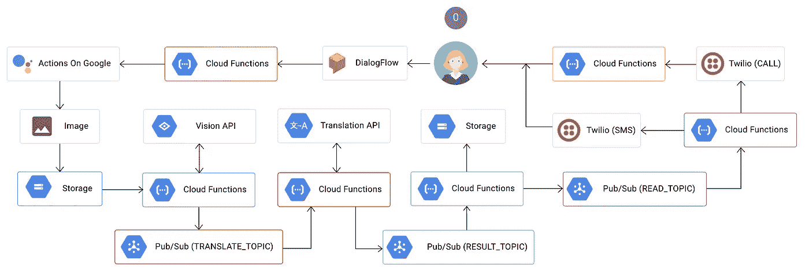

The overall architecture of our serverless application

我打赌你已经听说过无服务器架构:云计算的下一次进化。术语“无服务器”实际上是云计算中两个领域的总称:后端即服务(BaaS)和功能即服务(FaaS)。

借助 BaaS，我们将应用程序分解成更小的部分，并完全通过外部服务实现其中的一些部分。这通常是通过调用 API(或 [gRPC](https://grpc.io/) 调用)来完成的。最受欢迎的后端服务之一是谷歌的 [Firebase](https://firebase.google.com/) ，这是一个用于移动和网络应用的实时数据库(有很多其他很酷的功能)。

另一方面，功能即服务是计算即服务的另一种形式:FaaS 是一种构建和部署服务器端代码的方式，只需在供应商提供的 FaaS 平台上部署单个功能(因此得名)。

既然我们已经就无服务器架构的正确定义达成一致，**让我们构建一个完整的“无服务器应用程序”。**

我们要构建的应用程序是一个聊天机器人，它能够从图片中提取文本内容(可选地将其翻译成不同的语言)，并通过 SMS(或电话)将结果发送回用户。这种应用程序可以用来从给定的图像甚至视频流中提取其他有用的信息，并向用户或一组用户发送 SMS 通知。

我相信你现在正在想一个更有趣的用例。如果是这样，请告诉我！

让我们开始吧…

# 1-创建聊天机器人

对于我们的用例，我们希望与我们的代理(又名。“聊天机器人”)并向它提供一些包含一些文本的内容，以便提取和稍后分析(可能是一本书或一份报纸的一页？).

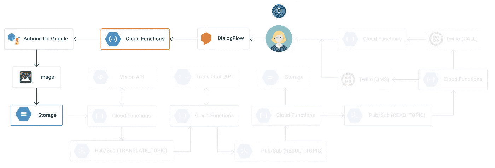

## 为我们的代理创建“对话流”

由于“聊天机器人”部分不是我们在这篇文章中的主要关注点，我们将“保持简单，愚蠢”并在 DialogFlow 中设计一个快速对话，如下所示:

1.  创建一个意图“阅读”。
2.  添加几个用户的表达，例如“阅读此文本”或“提取文本”。
3.  添加一个“读取”动作。
4.  启用 webhook 的使用(参见下面的实现)。

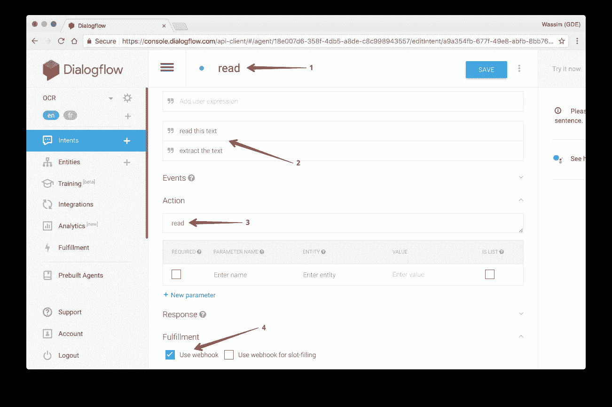

## b-实现代理逻辑

现在，让我们为实际拍摄照片的代理编写逻辑代码。

首先，我们需要两个效用函数:

1.  `captureImage`使用用户相机拍摄图像的功能。
2.  `uploadImage`上传图片到谷歌云存储(GCS)的功能。

这里实现了`captureImage`功能。该功能使用 MacOS 上可用的系统实用程序`imagesnap`来实际访问相机，捕捉图像并将图像文件存储在`/tmp/google-actions-reader-${Date.now()}.png`下。然后，该函数返回`base64`中的名称和文件内容:

```
const fs = require('fs');
const child_process = require('child_process');
const Buffer = require('safe-buffer').Buffer;/**
 * Capture the image from the user computer's camera.
 */
function **captureImage**() {
  return new Promise((res, rej) => {
    const file = `/tmp/google-actions-reader-${Date.now()}.png`;
    try {
      child_process.execSync(`imagesnap -w 1 ${file}`);
      const bitmap = fs.readFileSync(file);
      res({
        base64: new Buffer(bitmap).toString('base64'),
        file
      });
    } catch (err) { rej(err); }
  });
}
```

下一个函数`uploadImage`将简单地把图像上传到 GCS 的`cloud-function-ocr-demo__image`桶中:

```
const child_process = require('child_process');/**
 * Uploads the file to GCS.
 *
 * @param {object} data The GCP payload metadata.
 * @param {object} data.file The filename to read.
 */
function **uploadImage**(data) {
  child_process.execSync(
    `gsutil cp ${data.file} gs://cloud-function-ocr-demo__image`
  );
  return data.file.split('/').pop();
}
```

> 请记下桶的名称`cloud-function-ocr-demo__image`，我们稍后会用到它。

现在我们已经准备好了两个实用函数`captureImage`和`uploadImage`，让我们在**读取**意图逻辑中使用它们(还记得上面对话框中的意图吗？):

```
/**
 * The "read" intent that will trigger the capturing and uploading
 * the image to GSC.
 *
 * @param {object} app DialogflowApp instance object.
 */
function **readIntent**(app) {
  **captureImage**()
    .then(**uploadImage**)
    .then(content => {
      app.tell(`I sent you an SMS with your content.`);
    })
    .catch(e => app.ask(`[ERROR] ${e}`) );
}
```

这个`readIntent`基本上会捕捉图像，然后上传到 GCS。

现在我们已经实现了代理的所有逻辑，让我们创建主云函数来处理 DialogFlow 的请求:

```
const aog = require('actions-on-google');
const DialogflowApp = aog.DialogflowApp;/**
 * Handles the agent (chatbot) logic. Triggered from an HTTP call.
 *
 * @param {object} request Express.js request object.
 * @param {object} response Express.js response object.
 */
module.exports.**assistant** = (request, response) => {
  const app = new DialogflowApp({ request, response });
  const actions = new Map();
  actions.set('read', **readIntent**);
  app.handleRequest(actions);
};
```

`assistant`云函数将由 HTTP 调用触发。例如，如果用户说“阅读此文本”(如上所述)，这是在 **read** 意图中定义的一个表达式，则该调用将由 DialogFlow 进行。

## c-部署云助手功能

> 本节将作为本指南其余部分的示例。

为了部署云功能，我们可以使用带有以下参数的`gcloud`命令:

```
gcloud beta functions 
  deploy **<function-label>** 
  **<trigger-type>** 
  --source **<source-code>** 
  --entry-point **<function-name>**
```

1.  `<function-label>`是功能标签，可以与`<function-name>`相同或不同。
2.  `<trigger-type>`是您的功能将如何被触发(主题、http、存储…等)。
3.  `<source-code>`是托管函数源代码的 Google Cloud Repository。**这不会是其他的公共 Git 库吧！**
4.  `<function-name>`是实际导出的函数名(在你的代码中)。

> 你也可以使用 Google 云存储空间来存放你的函数的源代码。但是我们不会在这里讨论这个。

哦，对了…

> 如果你的组织有一个持续交付策略，将你的源代码托管在谷歌云仓库(Git repo)是一个好主意。

在我们的例子中，下面是完整的命令:

```
gcloud beta functions 
  deploy ocr-assistant 
  --source https://source.developers.google.com/projects/...
  --trigger-http
  --entry-point assistant
```

如果您想知道，Google 云存储库源代码有以下格式:

```
https://source.developers.google.com/projects/**<project-id>**/repos/**<repo-id>**/moveable-aliases/**<branch-name>**
```

一旦部署，您的功能应该准备好被触发:

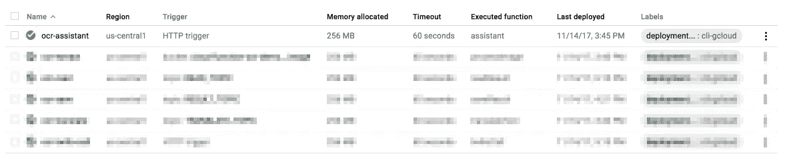

您还将获得一个公共 URL，如下所示:

```
*https://us-central1-****<project-id>****.cloudfunctions.net/ocr-assistant*
```

这是我们将在 DialogFlow 项目中使用的 URL。

## 抓住你了。！

如果你一直在仔细观察，你可能已经注意到了`captureImage`函数需要……嗯，访问一个摄像头！这意味着我们将无法将这一特定功能部署到谷歌云平台上。相反，我们将在我们的特定硬件上托管它，比如说一个 Raspberry PI(为了简单起见)，并使用不同的 URL(显然)。

> 你可以使用[谷歌云函数模拟器](https://cloud.google.com/functions/docs/emulator)在本地运行你的云函数。请记住，这只是为了开发的目的。**不要将其用于生产应用。**

## d-添加履行网址

然后让我们添加履行 URL，它指向将处理代理请求的`assistant`云函数:


现在，我们已经完成了应用程序的第一部分，主要是将我们的图像上传到 GCS。

# 2-处理图像

到目前为止，我们只讨论了云功能—FaaS。让我们跳到后端即服务(或 BaaS)部分。

我们希望能够从图像中提取一些内容，在我们的例子中是文本。我们有大量的开源库可以做到这一点，比如 OpenCV 或 Tensorflow。不幸的是，这些库要求我们在机器学习和图像(或声音)处理方面拥有某种专业知识。雇佣这些专家并不容易！此外，理想情况下，我们不想维护这些代码，我们希望我们的解决方案能够自动伸缩，以防我们的应用程序变得流行。简单说，我们不想管理这个功能。幸运的是，谷歌云平台覆盖了我们:

1.  Google Vision API 允许我们提取内容。
2.  使用[谷歌翻译 API](https://cloud.google.com/translate/) 允许我们……嗯，翻译内容。

以下是该功能的子架构:

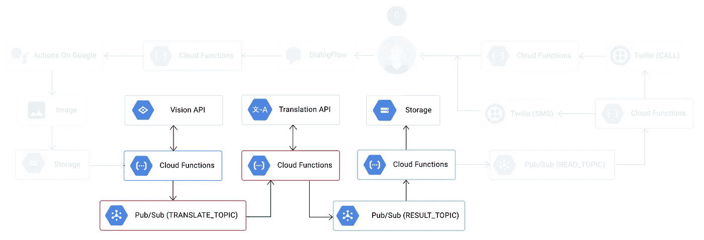

## a-从图像中提取内容

为了能够处理图像，我们需要两个函数:

1.  `processImage`每当有新图像上传到 GCS 的桶中时触发的云功能`cloud-function-ocr-demo__image`。
2.  `detectText`使用谷歌视觉 API 从图像中提取文本的功能。

下面是`processImage`的实现:

```
/**
 * Cloud Function triggered by GCS when a file is uploaded.
 *
 * @param {object} event The Cloud Functions event.
 * @param {object} event.data A Google Cloud Storage File object.
 */
exports.**processImage** = function processImage(event) {
  let file = event.data;

  return Promise.resolve()
    .then(() => {
      if (file.resourceState === 'not_exists') {
        // This was a deletion event, we don't want to process this
        return;
      }

      return **detectText**(file.bucket, file.name);
    })
    .then(() => {
      console.log(`File ${file.name} processed.`);
    });
};
```

`detectText`函数的实现很简单(我们后面会改进):

```
const vision = require('@google-cloud/vision')();/**
 * Detects the text in an image using the Google Vision API.
 *
 * @param {string} bucketName Cloud Storage bucket name.
 * @param {string} filename Cloud Storage file name.
 */
function **detectText**(bucketName, filename) {
  let text;

  return **vision
    .textDetection({ 
      source: { 
         imageUri: `gs://${bucketName}/${filename}` 
      }
    })**
    .then(([detections]) => {
      const annotation = detections.textAnnotations[0];
      text = annotation ? annotation.description : '';
      return Promise.resole(text);
    });
}
```

我们现在需要部署`processImage`云函数，我们希望每当有新图像上传到`cloud-function-ocr-demo__image`桶中的 GCS 时，它就会被触发:

```
gcloud beta functions 
   deploy ocr-extract
   --source https://source.developers.google.com/projects/...
   --trigger-bucket cloud-function-ocr-demo__image 
   --entry-point processImage
```

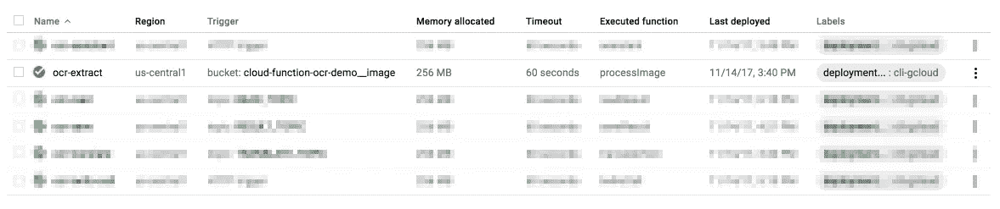

现在让我们添加一些翻译…

## 翻译文本

翻译提取的文本将由特定的 Google Cloud 发布/订阅主题`TRANSLATE_TOPIC`触发，并将由两个操作组成:

1.  检测提取内容的语言。我们将在之前的`processImage`函数中完成这项工作。我们可以为此创建另一个云功能，但不要让我们的架构过于复杂！
2.  `translateText`:将内容翻译成给定语言。

让我们用语言检测功能来改进我们现有的`processImage`云功能:

```
const vision = require('@google-cloud/vision')();
const translate = require('@google-cloud/translate')();
const config = require('./config.json');/**
 * Detects the text in an image using the Google Vision API.
 *
 * @param {string} bucketName Cloud Storage bucket name.
 * @param {string} filename Cloud Storage file name.
 * @returns {Promise}
 */
function **detectText**(bucketName, filename) {
  let text;

  return vision
    .textDetection({ 
      source: { 
         imageUri: `gs://${bucketName}/${filename}` 
      }
    }) .then(([detections]) => {
      const annotation = detections.textAnnotations[0];
      text = annotation ? annotation.description : '';
      return **translate.detect(text);**
    }) .then(([detection]) => {
      if (Array.isArray(detection)) {
        detection = detection[0];
      }

      // Submit a message to the bus for each language 
      // we're going to translate to **const tasks = config.TO_LANG.map(lang => {
        let topicName = config.TRANSLATE_TOPIC;
        if (detection.language === lang) {
          topicName = config.RESULT_TOPIC;
        }
        const messageData = {
          text: text,
          filename: filename,
          lang: lang,
          from: detection.language
        };

        return publishResult(topicName, messageData);
      });** return Promise.all(tasks);
    });
}
```

让我们解释一下我们添加的新的额外代码:

我们首先添加了对 Google 翻译 API 的调用，以便检测提取文本的主要语言`translate.detect(text);`。然后，在下一个块中，我们基本上迭代配置文件中的`config.TO_LANG`数组，并发布一个具有特定有效负载的`TRANSLATE_TOPIC`，该有效负载包含文本内容(`text`)、源语言(`from`)和我们想要翻译到的目标语言(`lang`)。如果源语言和目标语言相同，我们就发布`RESULT_TOPIC`。

## 关于谷歌云发布/订阅的补充说明

为了方便起见，我们还包含了一个新的实用函数`publishResult`，它负责发布一个发布/订阅主题。它基本上使用 Google Cloud 发布/订阅 API 来创建(如果需要)和发布给定的主题:

```
const pubsub = require('@google-cloud/pubsub')();/**
 * Publishes the result to the given pub-sub topic.
 *
 * @param {string} topicName Name of the topic on which to publish.
 * @param {object} data The message data to publish.
 */
function **publishResult**(topicName, data) {
  return pubsub
    .topic(topicName)
    .get({ autoCreate: true })
    .then(([topic]) => topic.publish(data));
}
```

然后让我们创建`translateText`云函数来翻译提取的文本:

```
const translate = require('@google-cloud/translate')();
const Buffer = require('safe-buffer').Buffer;
const config = require('./config.json');/**
 * Translates text using the Google Translate API. 
 * Triggered from a message on a Pub/Sub topic.
 *
 * @param {object} event The Cloud Functions event.
 * @param {object} event.data The Cloud Pub/Sub Message object.
 * @param {string} event.data.data The "data" property of 
 *    the Cloud Pub/Sub Message. 
 *    This property will be a base64-encoded string that 
 *    you must decode.
 */
exports.**translateText** = function translateText(event) {
  const pubsubMessage = event.data;
  const jsonString = Buffer.from(
                       pubsubMessage.data, 'base64'
                     ).toString();
  const payload = JSON.parse(jsonString);

  return Promise.resolve()
    .then(() => {

      const options = {
        from: payload.from,
        to: payload.lang
      };

      return **translate.translate(payload.text, options);**
    })
    .then(([translation]) => {
      const messageData = {
        text: translation,
        filename: payload.filename,
        lang: payload.lang
      };

      return **publishResult(config.RESULT_TOPIC, messageData);**
    });
};
```

这个函数的实现是不言自明的:我们基本上调用`translation.translate(payload.text, options);`，一旦我们得到结果，我们就发布带有翻译内容的`RESULT_TOPIC`。

现在是时候使用与之前相同的命令部署`translateText`云功能了。该函数将由`TRANSLATE_TOPIC`主题触发，因此我们确保将其用作触发类型:

```
gcloud beta functions 
   deploy ocr-translate
   --source https://source.developers.google.com/projects/...
   --trigger-topic TRANSLATE_TOPIC
   --entry-point translateText
```

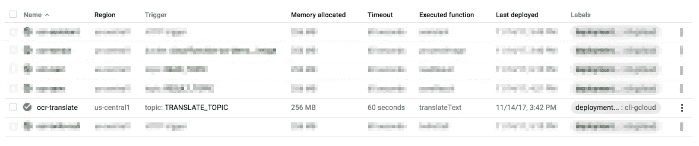

## 保存翻译的文本

到目前为止一切顺利，我们现在已经成功捕捉到图像，上传到 GCS，处理它，提取文本，然后翻译它。最后一步是将翻译后的文本保存回 GCS。

下面是该函数的实现:

```
const storage = require('@google-cloud/storage')();
const Buffer = require('safe-buffer').Buffer;
const config = require('./config.json');/**
 * Saves the data packet to a file in GCS. 
 * Triggered from a message on a Pub/Sub topic.
 *
 * @param {object} event The Cloud Functions event.
 * @param {object} event.data The Cloud Pub/Sub Message object.
 * @param {string} event.data.data The "data" property of 
 *    the Cloud Pub/Sub Message. 
 *    This property will be a base64-encoded string that 
 *    you must decode.
 */
exports.**saveResult** = function saveResult(event) {
  const pubsubMessage = event.data;
  const jsonString = Buffer.from(
                       pubsubMessage.data, 'base64'
                     ).toString();
  const payload = JSON.parse(jsonString);

  return Promise.resolve()
    .then(() => {
      const bucketName = config.RESULT_BUCKET; // Appends a .txt suffix to the image name. 
     const filename = renameFile(payload.filename, payload.lang);

      **const file = storage.bucket(bucketName).file(filename);**

      **return file.save(payload.text)
        .then(_ => publishResult(config.READ_TOPIC, payload));**
    });
};
```

`saveResult`由保存翻译文本的主题`RESULT_TOPIC`触发。我们简单地使用该有效负载并调用 Google 云存储 API 来将内容存储在一个名为`config.RESULT_BUCKET`(也就是`cloud-functions-orc-demo`)的桶中。一旦完成，我们发布的`READ_TOPIC`主题将触发下一个云功能(见下一节)。

是时候使用与之前相同的命令部署`saveResult`云功能了。该函数将由`TRANSLATE_TOPIC`主题触发，因此我们确保将其用作触发类型:

```
gcloud beta functions 
   deploy ocr-save
   --source https://source.developers.google.com/projects/...
   --trigger-topic RESULT_TOPIC
   --entry-point saveResult
```

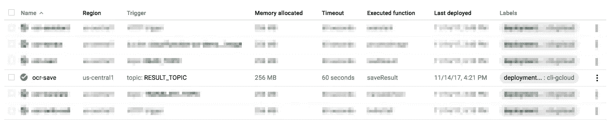

# 3-发送短信通知

最后，我们现在准备从 GCS 中读取翻译后的文本，并通过 SMS 将其发送到用户的手机上。

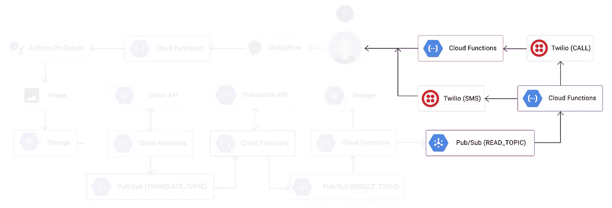

## 从 GCS 中阅读翻译文本

从 GCS 中读取文件也是一个简单的操作:

```
const Buffer = require('safe-buffer').Buffer;/**
 * Reads the data packet from a file in GCS. 
 * Triggered from a message on a Pub/Sub topic.
 *
 * @param {object} event The Cloud Functions event.
 * @param {object} event.data The Cloud Pub/Sub Message object.
 * @param {string} event.data.data The "data" property of 
 *    the Cloud Pub/Sub Message. 
 *    This property will be a base64-encoded string that 
 *    you must decode.
 */
exports.**readResult** = function readResult(event) {
  const pubsubMessage = event.data;
  const jsonString = Buffer.from(
                       pubsubMessage.data, 'base64'
                     ).toString();
  const payload = JSON.parse(jsonString); return Promise.resolve()
    .then(() => **readFromBucket(payload)**)
    .then(content => **sendSMS(content)**.then(_ => **call(content)**));
};
```

在`readResult`函数中，我们使用了另一个实用函数`readFromBucket`，顾名思义，它从给定的 GCS 桶中读取内容。下面是详细的实现:

```
const storage = require('@google-cloud/storage')();
const config = require('./config.json');/**
 * Reads the data packet from a file in GCS. 
 * Triggered from a message on a Pub/Sub topic.
 *
 * @param {object} payload The GCS payload metadata.
 * @param {object} payload.filename The filename to read.
 */
function **readFromBucket**(payload) { // Appends a .txt suffix to the image name.
  const filename = renameFile(payload.filename, payload.lang); const bucketName = config.RESULT_BUCKET;
 **const file = storage.bucket(bucketName).file(filename);**  const chunks = [];

  return new Promise((res, rej) => {
    file
      .createReadStream()
      .on('data', chunck => {
        chunks.push(chunck);
      })
      .on('error', err => {
        rej(err);
      })
      .on('response', response => {
        // Server connected and responded with 
        // the specified status and headers.
      })
      .on('end', () => {
        // The file is fully downloaded.
        res(chunks.join(''));
      });
  });
}
```

就这么简单。现在，让我们部署`readResult`云函数，并使其从`READ_TOPIC`主题触发:

```
gcloud beta functions 
   deploy ocr-read
   --source https://source.developers.google.com/projects/...
   --trigger-topic READ_TOPIC
   --entry-point readResult
```

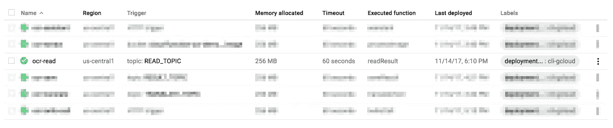

**b-发送短信通知**

说到给用户的手机发送短信，我们使用的是很棒的 Twilio 服务，它……很好用！

> 使用 Twilio 服务需要您创建一个开发者帐户。

```
const Twilio = require('twilio');
const TwilioClient = new Twilio(
   config.TWILIO.accountSid,
   config.TWILIO.authToken
);/**
 * Sends an SMS using Twilio's service.
 *
 * @param {string} body The content to send via SMS.
 */
function **sendSMS**(body) {
  return TwilioClient.messages
    .create({
      to: '+33000000000',
      from: '+33000000000',
      body: body || 'MESSAGE NOT FOUND'
    });
}
```

**打电话(奖金)**

通过电话将翻译的内容发送给用户有点棘手，因为您需要提供两个功能:

1.  `call`哪个打电话:**这实际上是打电话给用户！**
2.  `twilioCalls`它是 HTTP 端点，将处理由`call`函数发出的传入调用。

为了演示这个过程是如何工作的，让我们先来看看`twilioCalls`的实现:

```
const Twilio = require('twilio');
const VoiceResponse = Twilio.twiml.VoiceResponse;/**
 * Handles the incoming Twilio call request. 
 * Triggered from an HTTP call.
 *
 * @param {object} request Express.js request object.
 * @param {object} response Express.js response object.
 */
module.exports.**twilioCall** = function(request, response) {
  return readFromBucket({
    filename: 'twilio_user_33000000000.txt'
  }).then(content => {
    const twiml = new VoiceResponse();
    twiml.say(`
    <Say voice="woman">Hi, this is your extracted text:</Say>
    <Pause length="1"></Pause>
    <Say voice="woman">${content}</Say>
    `);
    res.writeHead(200, { 'Content-Type': 'text/xml' });
    res.end(twiml.toString());
  });
};
```

`twilioCall`函数负责从 bucket 中读取文件，并发送回一个 XML 响应，这要归功于 Twilio 标记语言( [TwilioML](https://www.twilio.com/docs/api/twiml) )。

然后，您需要部署这个云函数，以便获得`call`函数所需的公共 URL:

```
gcloud beta functions 
   deploy ocr-twilio-call
   --source https://source.developers.google.com/projects/...
   --trigger-http
   --entry-point twilioCall
```

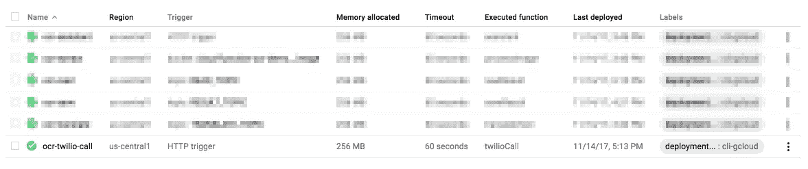

部署后，您将获得一个如下所示的公共 URL:

```
https://us-central1-<projet-id>.cloudfunctions.net/ocr-twilio-call
```

接下来，我们将在`call`函数中使用这个 URL:

```
/**
 * Triggers a call using Twilio's service.
 */
function call() {
  return TwilioClient.api.calls
    .create({
      url: 'https://the-url-from-above/ocr-twilio-call',
      to: '+33000000000',
      from: '+33000000000'
    });
}
```

搞定了。现在，您的 Twilio HTTP 端点已经为传入呼叫做好了准备。

# 结束了！

在本指南中，我们实现了一系列执行不同任务的云功能:

1.  `assistant`处理来自 DialogFlow 的代理请求。
2.  `processImage`从上传的图像中提取文本。
3.  `translateText`将提取的文本翻译成不同的语言。
4.  `saveResult`将翻译后的文本保存到 GCS。
5.  `readResult`从存储在 GCS 中的文件中读取翻译文本。
6.  `twilioCall`处理来电请求。

以下是所有已部署的云功能的概述:

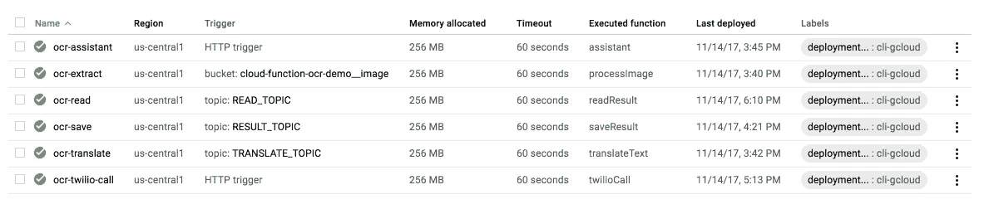

这是完整的架构:


## 尝试一下

为了测试应用程序，我们首先需要部署 DialogFlow 代理。我们选择在 Google Assistant 上部署它，因为我们的`assistant`云功能是为了处理 Google Assistant 的请求。如果你想部署到其他服务(Slack、脸书、Twitter 等)，你只需要提供和部署其他云功能。

从集成选项卡中，选择 Google Assistant 并单击**测试**按钮:

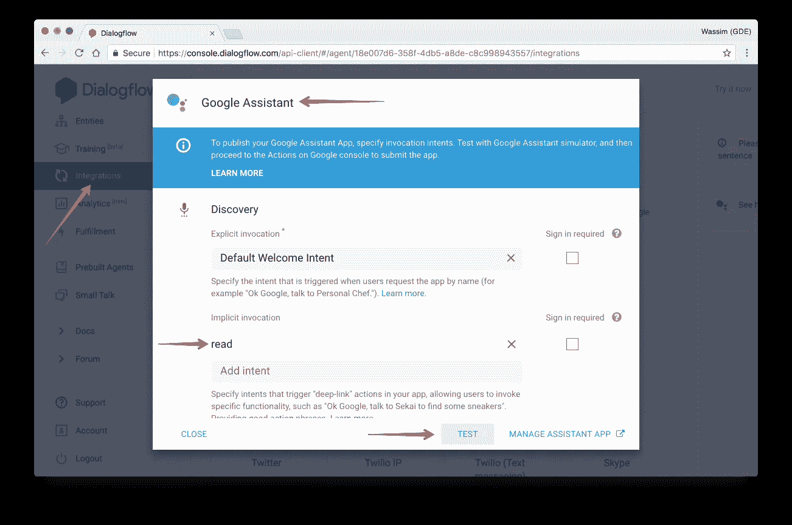

这将打开 Google simulator 上的操作，允许您直接在 bowser 中测试您的代理。或者，您也可以使用手机或 Google Home 设备:


> 注意，我们给我们的代理起了一个名字:莎士比亚。我们在同一个模拟器的总览面板中完成了这项工作。

作为示例文本，我们将使用以下引文(出自 [Ziad K. Abdelnour](https://twitter.com/blackhawkinc) ):


这是我们的`readResult`函数发送的短信:


# ⚠️重要笔记⚠️

1.  在我的示例代码中，我没有处理任何错误。**应该的！**
2.  在我的示例代码中，我没有记录任何内容。**应该的！**
3.  **在我的样本代码中，我没有编写单元测试。你应该！**

以下是完整的源代码:

[](https://github.com/manekinekko/serverless-application-demo) [## manekinekko/无服务器应用程序演示

### 在 GitHub 上创建一个帐户，为无服务器应用程序演示开发做贡献。

github.com](https://github.com/manekinekko/serverless-application-demo) 

## 恭喜你！您刚刚构建了第一个真正的“无服务器”应用程序！还有，2018 新年快乐🎉✨🎁

*在 Twitter 上关注我*[*@ manekinekko*](https://twitter.com/manekinekko)*了解更多关于网络和云平台的信息。*