# 内置的 Python 函数 map()、filter( ) & reduce()，您应该马上开始学习。

> 原文：<https://medium.com/quick-code/built-in-python-functions-map-filter-reduce-you-should-literally-learn-right-now-9213cbfe4bad?source=collection_archive---------0----------------------->

## 如果你不知道如何使用它的特性，那么任何语言都没有任何意义

这些函数通常在函数式 python 编程中使用。

这些函数通常与匿名( **lambda** )函数一起使用，但是您也可以将它与由( **def** 关键字定义的普通函数一起使用。

map()、reduce()和 filter()在 python 2 中都可用，但是在 python 3 中 reduce()函数被移到 functools 模块中。

## Lambda(匿名)函数

我们先来了解一下 python 中的匿名函数是什么，

这个函数以关键字 **lambda** 开始，参数和表达式都用( **:** )分隔

***λ参数:表达式***

**例如:**

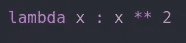

这将与

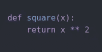

如你所见，lambda 函数不需要任何名字，这就是为什么它被称为匿名函数。

当我们需要一个无名函数时，或者在函数式编程的情况下，我们使用这个函数。

还有一点我要提的是**什么是可迭代**？

iterable 是可以使用 for 循环迭代的任何对象，

例如:列表、字符串、字典、元组

## 地图( )

**语法:** map(函数，iterable，。。。)

这里，
函数将在 iterable 的每个元素上执行。

另外，您应该知道 map()将返回一个迭代器，而不是一个特定的值，所以它的值可以在任何需要的时候使用。

您可以在 map 函数中传递多个 iterable，但要记住的重要一点是，如果不同大小的 iterable map 在消耗最短的 iterable 时会停止。

让我们从列表中找出每个元素的平方。

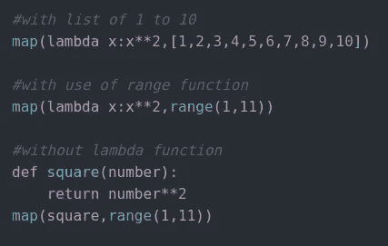

所有这个函数都做同样的事情，它会返回 1 到 10 的平方，但是你知道它会返回一个迭代器，就像这样，

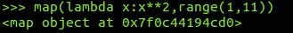

但是您可以在 list()函数中传递 map()，或者使用 for 循环来查看结果，

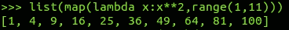

Accessing element using list( )

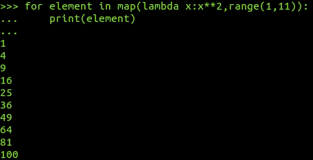

Accessing element using for loop

**地图()【具有多重可迭代】**

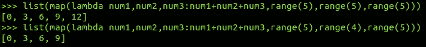

第二次看到它停在最小的迭代范围(4)。

## 过滤器( )

**语法:** filter(函数，iterable，。。。)

与 map()不同，filter()函数不会将输入值转换为新值，但它会返回一个与函数中提到的条件相匹配的值。

顾名思义，它会根据某些条件从 iterable 中过滤出元素。

让我们从一个元素列表中找出奇数和偶数。

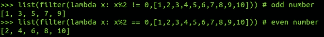

## **减少()**

**语法:** reduce(函数，可迭代)

由于 map()函数将对 iterable 的每个元素逐一执行函数，
在 reduce()中该函数将累计执行函数指定的操作，
该函数将返回唯一的单个值，

此外，我们必须从 python3 中的 functools 模块导入它

让我们看看它是如何工作的，

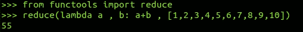

让我们来理解刚刚发生的事情，
这将，
从 a，b 开始，它将是 1，2
执行 a + b，它将是 3
现在 a，b 将是前一个 a + b 的结果，它是 3，列表中的下一个元素
让我们在下图中更好地理解它

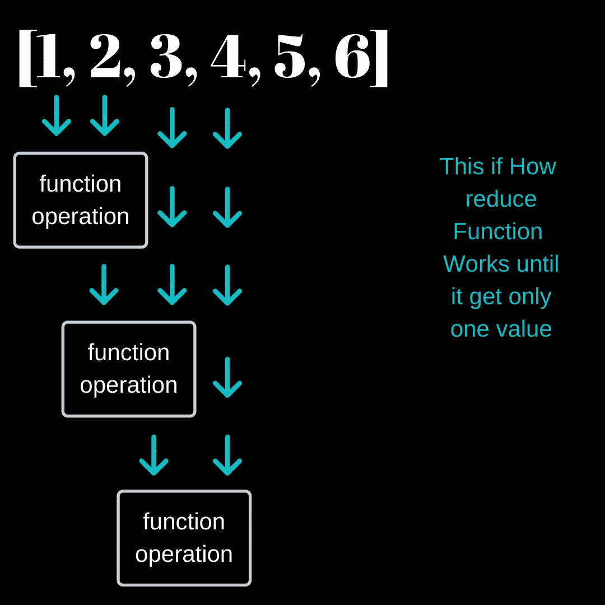

现在，map()和 filter()函数返回一个迭代器，您可以通过循环或 list()函数来访问它，

但是你也可以像这样通过 next()函数访问它的元素，

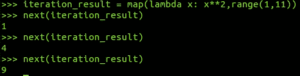

在本文中，我探索了 python 非常强大和有用的内置函数，

**Map( )**
→ map(函数，可迭代，。。。)
→对一个可迭代的每个元素执行函数
→返回一个迭代器
→为一个可迭代的每个元素生成一个新值
→在多个可迭代的情况下，会在最小的可迭代用尽时停止。

**Filter( )**
→filter(函数，可迭代，。。。)
→对可迭代的每个元素执行函数
→返回迭代器
→返回满足函数定义的特定标准的值

**Reduce( )**
→reduce(函数，可迭代)
→累计执行函数指定的运算
→返回单个值

让我们看看，如果您决定不想使用这个内置函数，或者您可能不知道，事情会变得有多复杂。
使用和不使用地图的示例

**例如:**

4521369741 →你已经找到了这些数字的总和，直到它是一个位数。
这样:4+5+2+1+3+6+9+7+4+1 = 42>4+2 = 6(输出)

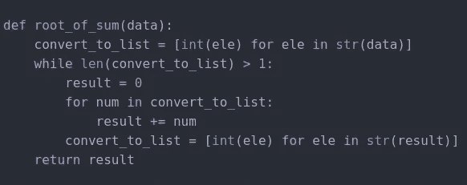

without use of map( )

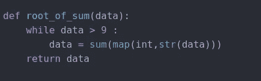

with use of map ( )

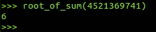

output in both cases

你知道吗，我自己写的代码，当时我不知道这个函数的存在，但是现在我知道这个函数了，你也知道了。

> “如果你有一个简单的方法可以得到相同的结果，不要浪费你的时间去建立不同的方法，那只会浪费你的时间和精力。”

但是有可能你不知道对于某些问题存在一个简单的方法，但是如果你探索的足够多，你最终会找到一个。

**继续学习&继续前进**