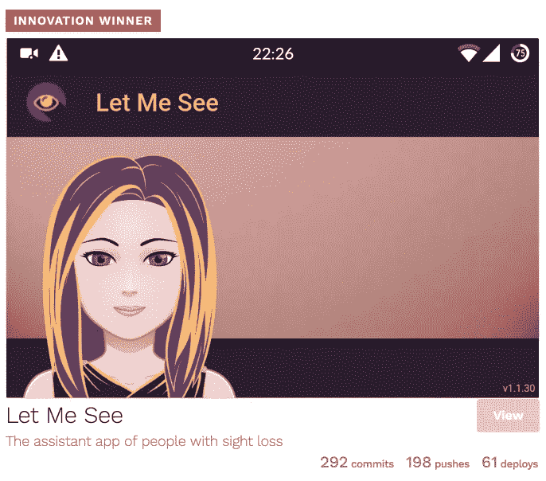

# 用 Ionic 2 构建:让我想想，一个移动应用和一个渐进式 Web 应用！

> 原文：<https://medium.com/google-developer-experts/built-with-ionic-2-let-me-see-a-mobile-app-and-a-progressive-web-app-38eec31e89b8?source=collection_archive---------3----------------------->

Image form [https://www.angularattack.com/](https://www.angularattack.com/)

> *原载于 2016 年 6 月 23 日*[*blog . ionic . io*](http://blog.ionic.io/built-with-ionic-2-let-me-see/)*。*

让我看看，在 2016 年 Angular Attack hackathon 上获得创新奖的应用程序是由巴黎 [SFEIR](https://www.sfeir.com/) 的开发者倡导者 [Wassim Chegham](https://twitter.com/manekinekko) 和网络技术领域的[谷歌开发者专家](https://developers.google.com/experts/people/wassim-chegham)在 [Attila Csanyi](https://twitter.com/attilacsanyi) 和 [Uri Shaked](https://twitter.com/UriShaked) 的帮助下用 Ionic 2 在 48 小时内完成的。

“让我看见”的主要目的是通过朗读文本和大声分析颜色来帮助失明者“看见”他们周围的东西。

这也是一个[进步的网络应用](http://blog.ionic.io/what-is-a-progressive-web-app/)，我们对此非常兴奋，因为我们一直想找到一个很棒的 PWA 示例来展示给你们大家！

“让我看看一个用 Ionic 2 建造的 PWA 的令人敬畏的例子，”帮助评判黑客马拉松的 Ionic 支持工程师贾斯汀·威利斯说。“它包括成为一名 PWA 所需的一切——一名服务人员和一份*manifest . JSON*——这意味着你可以在离线时使用它，并将其添加到你的主屏幕上，以获得那种本地感觉。《让我看看》最让我喜欢的一点是，它展示了用 Ionic 2 构建 PWA 是多么容易，也展示了混合应用的主要优势:不仅可以作为原生应用运行，还可以像 web 应用一样运行。”

瓦西姆已经使用 Ionic 1 好几年了，每当他的团队需要为客户或内部应用程序构建健壮的 AngularJS 移动应用程序时。他一直想尝试离子 2，并认为黑客马拉松是一个完美的机会。

“由于 CLI 帮助我们搭建了应用程序，开始使用 Ionic 2 和 Ionic 1 只需几分钟，如果不是几秒钟的话，”Wassim 说。“这对黑客马拉松至关重要；你不会想把时间花在调试你的构建系统或修改配置上。”

Wassim 应用程序 UI 使用简单的组件，因为它是一个语音驱动的界面，所以他使用基本的 UI 组件，如工具栏和卡片组件。

“我们可能会在未来的版本中添加更多功能，然后利用一些更高级的 UI 组件，如动作表或手势，但我们需要深入思考这一点，因为我们必须为我们的目标受众提供最好的 UX，”他说。“该应用程序使用标准的 HTML5 APIs，如 Navigator.getUserMedia()来捕捉用户的语音，但更重要的是，捕捉外部世界的视频进行图像处理，这是该应用程序的全部目的。”

谷歌云视觉 API 使得图像处理成为可能。让我看看还使用其他图形 API，如 Canvas 和 SVG，用于 UI 的某些部分。

“多亏了 Ionic，所有这些 Web APIs 都很容易集成，因为它在设计上是一个网络友好的平台，”Wassim 说。"增加对渐进式网络应用程序的支持非常简单."

Wassim 希望该应用程序可以离线安装和使用，所以他添加了一个 manifest.json 文件，其中包含必要的细节，如应用程序图标、主题颜色、名称等。、以及用于离线支持的服务人员。

“此外，Ionic 附带了一个构建系统 Gulp，可以让你轻松地完成定制任务，”他补充道。“我发现这真的很方便，因为我可以将我的自定义“sw-precache”任务添加到“build:after”生命周期中，这基本上是在每次构建后生成服务工作器，并使其保持最新。”

对于第一次迭代，团队的 MVP 是交付一个可工作的、易于访问的应用程序，因此他们关注 Web 平台以确保它按预期工作。该应用程序仍处于概念验证阶段，不可用于生产。

“让我看看和使用现代网络 api 的创新给我留下了深刻的印象，”威利斯说。“让我看看向你展示现代网络的可能性，以及它已经从静态网页走了多远。”

如果你已经用 Ionic 2 建立了一个 PWA，我们很乐意听到它！请让我们知道 http://blog.ionic.io/的

*关注*[*@ manekinekko*](https://twitter.com/manekinekko)*了解更多关于网络平台的信息。*