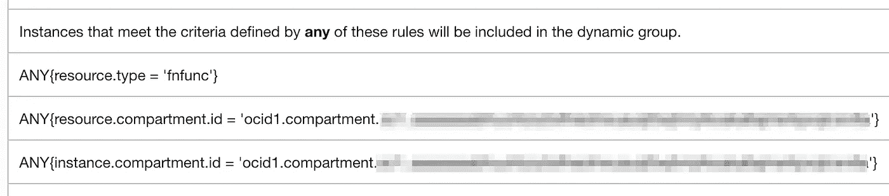
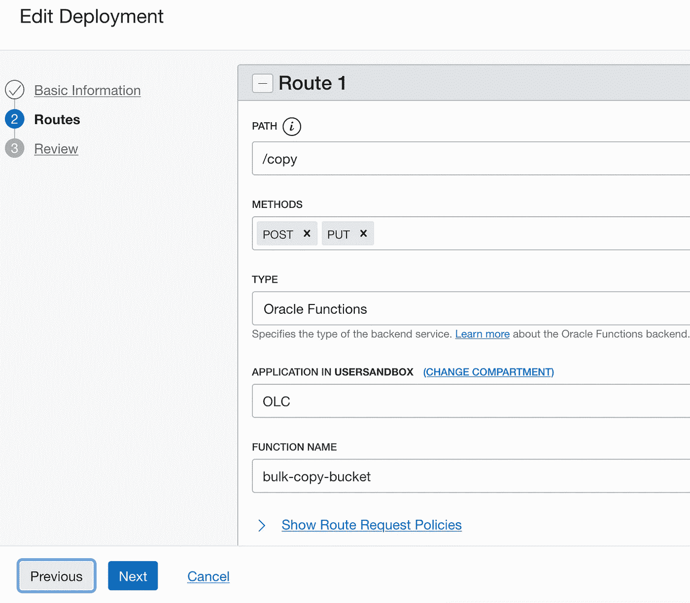

# Oracle 云中对象的批量复制

> 原文：<https://medium.com/oracledevs/bulk-copy-of-objects-in-oracle-cloud-973911a01efd?source=collection_archive---------0----------------------->

本文将展示我们如何在 Oracle 云基础设施(OCI)中高效地将桶中的对象从一个区域批量复制到另一个区域。此外，我们还将了解如何在没有第三方工具的情况下，在您的组织内实现这一运营服务。

对象存储因其效率、耐用性和成本而成为云架构不可或缺的一部分。OCI 对象存储是一项区域性服务，只要您有互联网连接，并且可以访问其中一个[对象存储端点](https://docs.oracle.com/iaas/api/#/en/objectstorage/latest/)，就可以从任何地方访问。OCI 对象存储也可以在 OCI 地区使用服务网关。

## 概观

我在这里讨论了两种方法:

1.Python 脚本从 OCI 的 OCI 云外壳(或)计算虚拟机运行

2.一种无服务器的方法，使用 OCI 函数和类似的 Python 运行时，结合 OCI API GW，使其更具可操作性和可重用性。

最好有一个拥有对象存储系列管理权限的 OCI 租户访问权限、一个虚拟机(或云外壳)和支持该工作的策略。稍微熟悉一下 OCI 函数。如果你需要快速复习，可以参考我以前写的关于 [OCI 函数](/oracledevs/an-exploration-using-oci-functions-4c5d4e70d00c)的文章。

注意，这些方法是直接在对象存储桶之间复制对象，而不是下载/上传对象。

## 用例


源 bucket 位于 US-PHOENIX-1 区域，目标是将其所有对象转移到 UK-LONDON-1。[地区间网络延迟仪表板](https://docs.oracle.com/en-us/iaas/Content/Network/Concepts/inter_region_latency.htm)有助于了解地区间的网络往返。

*顺便说一句，请记住获得贵组织 IT 安全团队的批准，以确保您没有违反任何数据驻留政策。*

## 简单的 Python 编程方法

这种方法很容易下载程序并执行。

1.  启动云外壳或虚拟机(VM)或使用现有计算资源继续。
2.  对于虚拟机，安装 Python3。云外壳配备了 Python3 和 OCI SDK。
3.  在 OCI 设置策略以允许计算机管理对象存储

```
*Allow dynamic-group* OLC_DYNG *to manage object-family in compartment* COMPARTMENT_NAME

Allow service objectstorage-us-phoenix-1 to manage object-family in tenancy
```

第一个策略授权 VM 管理桶中的对象，第二个策略允许对象存储服务将对象从 US-PHOENIX-1 复制到其他区域。

在 OLC 动力集团，

```
*ANY{instance.compartment.id =* ‘ocid1.compartment.oc1..aiiiiiiii*********************************’}
```

[4。下载](https://github.com/oracle/oci-python-sdk/blob/master/examples/object_storage/object_storage_bulk_copy.py)样本批量复制程序

5.找到租赁对象存储命名空间
单击您的配置文件下的租赁链接，您将进入下面的页面。


6.在 UK-LONDON-1 中创建一个占位符存储桶，从 US-PHOENIX-1 中的现有存储桶复制内容。

7.运行 Python 程序

对于云 Shell，使用委托令牌(-dt)

```
cloudshell:~ (us-phoenix-1)$python3 bulk_copy.py -dt  -sb SOURCE_BUCKET -sr us-phoenix-1 -sn *******namespace -db DEST_BUCKET_LONDON -dr uk-london-1 -dn *******namespace####################################################################
Connecting to Object Storage
####################################################################Connecting to Object Storage Service for source region - us-phoenix-1
Succeed.Connecting to Object Storage Service for destination region - uk-london-1
Succeed.####################################################################Running Object Storage Bulk Copy                            
####################################################################
Written by Tim S and Adi Z, July 2020
Starts at        : 2021-12-10 02:00:02
Command Line     : -dt -sb SOURCE_BUCKET -sr us-phoenix-1 -sn *******namespace -db DEST_BUCKET_LONDON -dr uk-london-1 -dn *******namespace
Source Namespace : *******namespace
Source Region    : us-phoenix-1
Source Bucket    : SOURCE_BUCKET
Source Prefix    : 
Dest   Namespace : *******namespace
Dest   Region    : uk-london-1
Dest   Bucket    : DEST_BUCKET_LONDON
State  File      : SOURCE_BUCKET.DEST_BUCKET_LONDON.wrk####################################################################
Start Processing 
####################################################################
02:00:02 - Creating 50 copy request workers.
02:00:02 - Creating 50 status workers.
02:00:02 - Loading list of objects from destination bucket (DEST_BUCKET_LONDON) to ignore exiting files.
02:00:03 -    Loaded 2988 files.
02:00:03 - Getting list of objects from source bucket (SOURCE_BUCKET). Copies will start immediately.
02:00:04 -    Enqueued 1150 objects to be copied####################################################################
Finish queuing files, start checking
####################################################################
02:00:04 - Waiting 60 seconds before checking status.
02:01:04 - Determining copy status
02:01:12 -    KNOWN: 0, REQUESTED: 0, COMPLETED: 1150, FAILED: 0, CANCELED: 0####################################################################
Copy Completed at 02:01:12
####################################################################
```

对于虚拟机，使用实例主体(-ip)

```
$ python3 bulk_copy.py -ip -sb SOURCE_BUCKET -sr us-phoenix-1 -sn *******namespace -db DEST_BUCKET_LONDON -dr uk-london-1 -dn *******namespace####################################################################                              Connecting to Object Storage                              ####################################################################Connecting to Object Storage Service for source region - us-phoenix-1
Succeed.
Connecting to Object Storage Service for destination region - uk-london-1
Succeed.####################################################################                            Running Object Storage Bulk Copy                            ####################################################################Written by Tim S and Adi Z, July 2020
Starts at        : 2021-11-26 18:31:13Command Line     : -ip -sb SOURCE_BUCKET -sr us-phoenix-1 -sn *******namespace -db DEST_BUCKET_LONDON -dr uk-london-1 -dn *******namespaceSource Namespace : *******namespace
Source Region    : us-phoenix-1
Source Bucket    : SOURCE_BUCKET
Source Prefix    :
Dest   Namespace : *******namespace
Dest   Region    : uk-london-1
Dest   Bucket    : DEST_BUCKET_LONDON
State  File      : SOURCE_BUCKET.DEST_BUCKET_LONDON.wrk
####################################################################                                    Start Processing                                    ####################################################################
18:31:13 - Creating 50 copy request workers.
18:31:13 - Creating 50 status workers.
18:31:13 - Getting list of objects from source bucket (SOURCE_BUCKET). Copies will start immediately.
18:31:14 -    Enqueued 1150 objects to be copied
####################################################################                          Finish queuing files, start checking                          ####################################################################18:31:14 - Waiting 1 seconds before checking status.
18:31:15 - Determining copy status
18:31:17 -    KNOWN: 621, REQUESTED: 276, COMPLETED: 3, FAILED: 0, CANCELED: 0
18:31:17 - Waiting 1 seconds before checking status.
18:31:18 - Determining copy status
18:31:24 -    KNOWN: 0, REQUESTED: 386, COMPLETED: 545, FAILED: 0, CANCELED: 0
18:31:24 - Waiting 1 seconds before checking status.
18:31:25 - Determining copy status
18:31:28 -    KNOWN: 0, REQUESTED: 0, COMPLETED: 861, FAILED: 0, CANCELED: 0
####################################################################                              Copy Completed at 18:31:28                               ####################################################################
```

## 运营服务方法

这将是一种可重用性更高且无需服务器的方法，可以将其设置为组织中的内部服务。在这个方法中，我们将创建一个简单的 API(私有或公共)网关服务，使这个程序具有更好的可用性。请记住，这些函数有 5 分钟的超时时间，如果作业没有在 5 分钟内完成，那么函数将会终止。该方法负责处理对象，报告任何剩余的剩余部分，并重新处理。


1.  用[这个](https://gist.github.com/sathya-oracle/e7c78cffa5358993d11a0248c5364072)示例代码创建一个函数。

```
$ fn init -runtime python bulk-copy-bucket
Creating function at: ./bulk-copy-bucket
Function boilerplate generated.
func.yaml created.
$ cd bulk-copy-bucket/
$ vi func.py ##Copy the code here##
$ fn -v deploy --app OLC
Deploying bulk-copy-bucket to app: OLC
Bumped to version 0.0.2
```

2.创建 API GW



3.设置策略让函数管理 OLC _ 动态组中的对象
，您可以通过以下方式向函数添加权限:

```
ANY{resource.type = ‘fnfunc’}
*ANY{resource.compartment.id =* ‘ocid1.compartment.oc1..aiiiiiiii*********************************’}
```

*注意:您可以根据您的安全团队的指示来细化策略，以允许粒度访问*。

4.在 API GW 中进行部署以调用函数



5.现在，将区域 1 的 bucket A 中的对象复制到区域 2 的 bucket B 中，将参数发送到 API GW https 链接，如下所示。


POST


RESPONSE

响应返回详细的对象计数状态。理想情况下，如果请求的/取消的/失败的对象计数中仍有对象，则捕获该输出并用相同的参数重新提交。

当 OCI 函数超时时(基本上，该函数不能在给定时间内复制所有对象——这里是 300 秒)，响应将是`status: 504 message: Timed out`。这种情况下，您需要重新提交作业来复制剩余的对象。

下次重新提交作业时，默认情况下，程序将只复制上一个窗口中没有重复的项目&如果您想替换目标 bucket 中的现有对象，请将 POST 参数中的 ***ignore_exist*** 参数设置为 ***true*** 。

## 结束语

以上是在 OCI 变成运营服务的按需复制的桶。它可以用多个名称空间(或租用)进行扩展，并用一种高效的编程语言(如 GO)重写，以获得更快的响应。此外，如果您确实将它设置为组织中的内部服务，您可能希望考虑通过 API GW 启用身份验证。

如果需要将一个存储桶对象连续复制到另一个存储桶对象，可以利用 OCI 存储桶级别的复制功能。如果您需要持续的双向复制或跨多个云供应商，您可以考虑使用 [Rclone](https://rclone.org/) 来管理它，并且/或者您需要管理流中的数据转换，然后使用 [Apache NiFi](https://sathya-oracle.medium.com/migrating-object-storage-from-aws-to-oci-using-apache-nifi-edf3310c899f) 。

## 参考

 [## 对象存储概述

### Oracle 云基础架构对象存储服务是一个互联网规模的高性能存储平台，它…

docs.oracle.com](https://docs.oracle.com/en-us/iaas/Content/Object/Concepts/objectstorageoverview.htm) [](https://nifi.apache.org/) [## 阿帕奇尼菲

### Apache NiFi 支持强大且可伸缩的数据路由、转换和系统中介逻辑的有向图。

nifi.apache.org](https://nifi.apache.org/)  [## Rclone

### Rclone 是一个命令行程序，用于管理云存储上的文件。它是云供应商的功能丰富的替代产品…

rclone.org](https://rclone.org/) [](https://github.com/oracle/oci-python-sdk/tree/master/examples) [## OCI-python-SDK/master Oracle 上的示例/oci-python-sdk

### 面向 Python 的 Oracle 云基础设施 SDK。通过在…上创建帐户，为 oracle/oci-python-sdk 开发做出贡献

github.com](https://github.com/oracle/oci-python-sdk/tree/master/examples)