# 打破 Android 性能神话

> 原文：<https://medium.com/androiddevelopers/busting-android-performance-myths-d85ae1d87f22?source=collection_archive---------0----------------------->


## 了解 Android 性能神话如何经得起考验

多年来，关于 Android 的性能出现了几个神话。虽然有些神话可能很有趣，但在寻找创建高性能 Android 应用程序时被送上了错误的方向，这一点也不好玩。

在这篇博文中，本着流言终结者的精神，我们将检验这些流言。为了打破神话，我们使用真实世界的例子和工具，你可以使用。我们关注主要的使用模式:作为开发者，你可能在你的应用中做的事情。有一个重要的警告，请记住，出于性能原因，在决定使用编码实践之前进行度量是非常重要的。也就是说，让我们打破一些神话。

# 误解 1: Kotlin 应用程序比 Java 应用程序更大更慢

Google Drive 团队已经将他们的应用程序从 Java 转换为 Kotlin。这一转换涉及 170 个文件中的 16，000 多行代码，涵盖了 40 多个构建目标。在团队监控的指标中，第一个是启动时间。

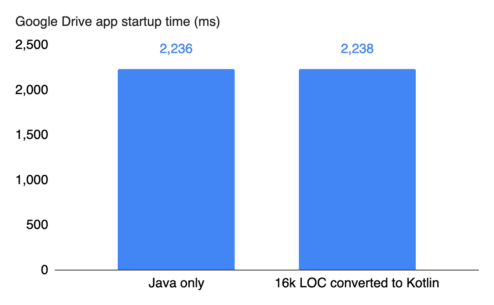

正如你所看到的，转换到科特林没有实质性的影响。

事实上，在整个基准测试套件中，团队没有观察到任何性能差异。他们确实看到了编译时间和编译代码大小的微小增加，但大约 2%没有显著影响。

在好处方面，该团队实现了 25%的代码行减少。他们的代码更干净，更清晰，也更容易维护。

关于 Kotlin 需要注意的一点是，你可以也应该使用代码收缩工具，比如 R8，它甚至有针对 Kotlin 的特定优化。

# 误解 2:getter 和 setters 很贵

出于性能原因，一些开发人员选择公共字段，而不是使用 setters 和 getters。通常的代码模式如下所示，getFoo 作为我们的 getter:

```
public class ToyClass { public int foo; public int getFoo() { return foo; }}ToyClass tc = new ToyClass();
```

我们将其与使用公共字段 tc.foo 进行了比较，后者的代码打破了对象封装，直接访问字段。

我们在装有 Android 10 的 Pixel 3 上使用 [Jetpack 基准库](https://developer.android.com/studio/profile/benchmark)对此进行了基准测试。基准测试库提供了一种非常好的方法来轻松测试您的代码。该库的特点之一是它预先准备了代码，所以结果代表稳定的数字。

那么，基准测试显示了什么？

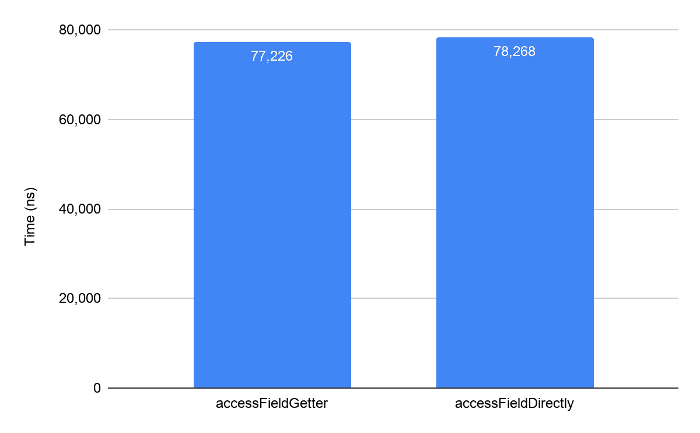

getter 版本的性能与直接进入字段的版本一样好。这个结果并不令人惊讶，因为 Android 运行时(ART)在代码中内嵌了所有琐碎的访问方法。所以在 JIT 或 AOT 编译后执行的代码是一样的。事实上，当您在 Kotlin 中访问一个字段时——在本例中是 TC . foo——您是在根据上下文使用 getter 或 setter 来访问该值。然而，因为我们内联了所有的访问器，所以 ART 已经涵盖了这里:在性能上没有区别。

如果您不使用 Kotlin，除非您有充分的理由将字段公开，否则您不应该破坏良好的封装实践。隐藏你的类的私有数据是有用的，你不需要仅仅因为性能原因而暴露它。坚持使用 getters 和 setters。

# 误解 3:lambda 比内部类慢

Lambdas 是一种方便的语言构造，尤其是引入了流式 API 之后，它可以实现非常简洁的代码。

让我们来看一些代码，在这些代码中，我们对来自一个对象数组的一些内部字段的值求和。首先，通过 map-reduce 操作使用流式 API。

```
ArrayList<ToyClass> array = build();int sum = array.stream().map(tc -> tc.foo).reduce(0, (a, b) -> a + b);
```

这里，第一个 lambda 将对象转换为整数，第二个 lambda 将它产生的两个值相加。

这与为 lambda 表达式定义等价类形成对比。

```
ToyClassToInteger toyClassToInteger = new ToyClassToInteger();SumOp sumOp = new SumOp();int sum = array.stream().map(toyClassToInteger).reduce(0, sumOp);
```

有两个嵌套类:一个是 toyClassToInteger，它将对象转换为整数，第二个是 sum 操作。

显然，第一个例子，使用 lambdas 的例子，要优雅得多:大多数代码评审员可能会说使用第一个选项。

但是，性能差异呢？我们再次在装有 Android 10 的 Pixel 3 上使用 Jetpack 基准库，我们没有发现性能差异。

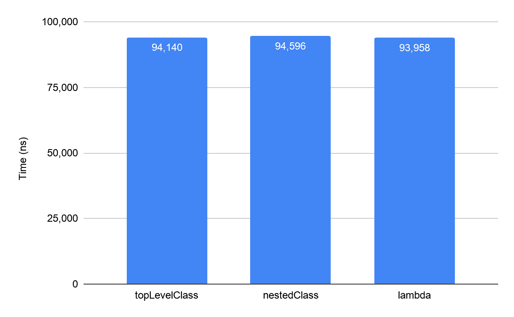

从图中可以看出，我们还定义了一个顶级类，性能也没有什么不同。

性能如此相似的原因是 lambdas 被翻译成匿名内部类。

所以，不要写内部类，用 lambda:它创建了更简洁、更干净的代码，你的代码审查员会喜欢的。

# 误解 4:分配对象是昂贵的，我应该使用池

Android 使用最先进的内存分配和垃圾收集技术。几乎每个版本都改进了对象分配，如下图所示。

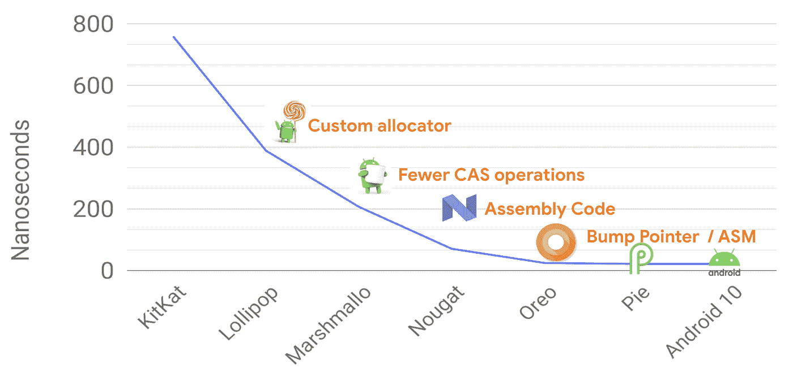

垃圾收集在各个版本之间也有了显著的改进。如今，垃圾收集对 jank 或 app 流畅度没有影响。下图显示了我们在 Android 10 中通过分代并发收集对短命对象的收集所做的改进。在新版本 Android 11 中也有明显的改进。

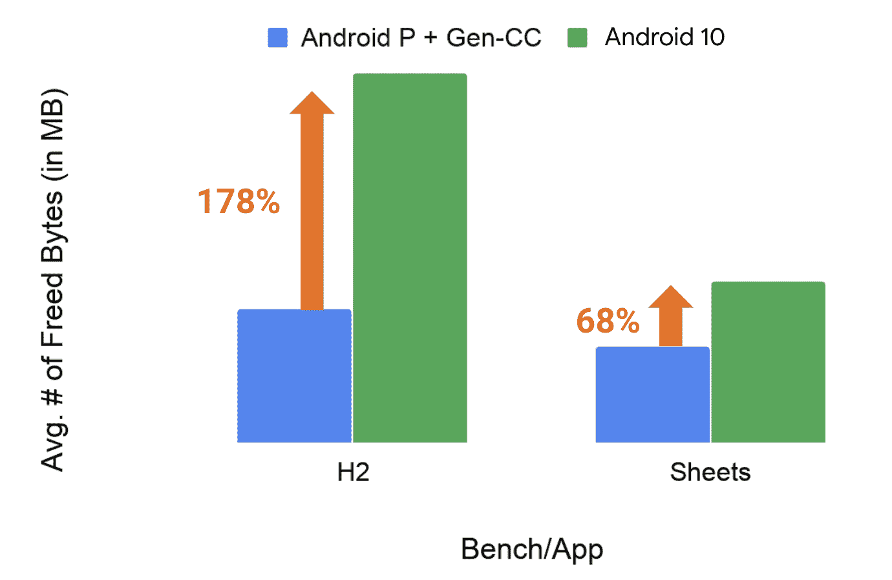

在 GC 基准测试中，如 H2，吞吐量大幅增加了 170%以上，在真实应用中，如 Google Sheets，吞吐量增加了 68%。

那么这如何影响编码选择，比如是否使用池来分配对象？

如果您认为垃圾收集效率低，内存分配成本高，那么您会认为创建的垃圾越少，垃圾收集就越少。所以，不是每次使用时都创建新的对象，而是维护一个常用类型池，然后从那里获取对象？因此，您可能会实现如下内容:

```
Pool<A> pool[] = new Pool<>[50];void foo() { A a = pool.acquire(); … pool.release(a);}
```

这里跳过了一些代码细节，但是您在代码中定义了一个池，从池中获取一个对象，并最终释放它。

为了测试这一点，我们实现了微基准来测量两件事:从池中检索对象的标准分配的开销，以及 CPU 的开销，以确定垃圾收集是否会影响应用程序的性能。

在这种情况下，我们使用了一个带有 Android 10 的 Pixel 2 XL，在一个非常紧密的循环中运行了数千次分配代码。我们还通过添加额外的字段来模拟不同的对象大小，因为大小对象的性能可能不同。

首先，对象分配开销的结果是:

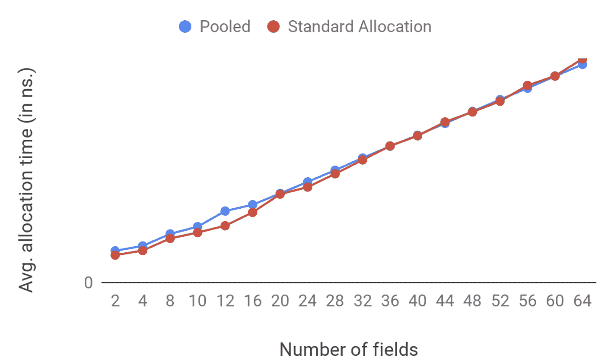

其次，垃圾收集的 CPU 开销的结果是:

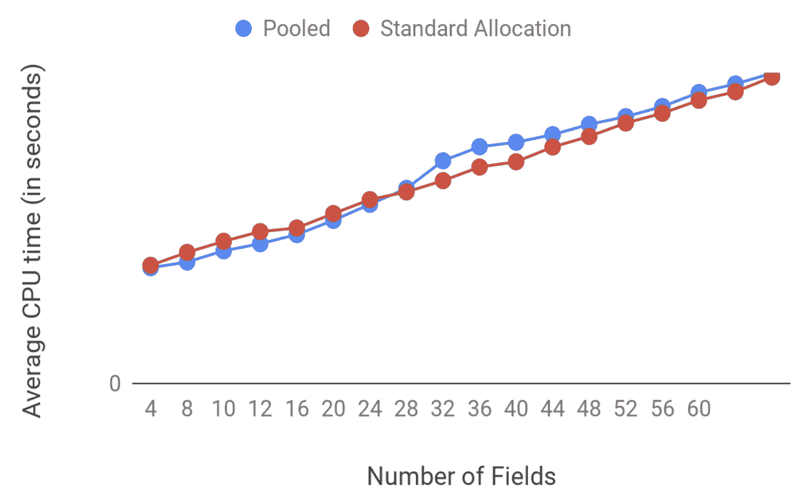

您可以看到标准分配和对象池之间的差别很小。然而，当涉及到较大对象的垃圾收集时，池解决方案会稍微差一些。

这种行为实际上是我们从垃圾收集中所期望的，因为通过汇集对象，您增加了应用程序的内存占用。突然，您占用了太多的内存，即使因为您正在共享对象而减少了垃圾收集调用的次数，每次垃圾收集调用的成本也会更高。这是因为垃圾收集器必须遍历更多的内存，以决定哪些仍然有效，哪些应该被收集。

这个流言被终结了吗？不完全是。对象池是否更高效取决于您的应用程序的需求。首先，不要忘记使用池的缺点，除了代码的复杂性:

*   可能会占用更多内存
*   冒着让对象存活超过所需时间的风险
*   需要非常高效的池实现

但是，池的方法对于大型或分配成本高的对象可能很有用。

要记住的关键是在你选择之前要测试和衡量。

# 误解 5:剖析我的可调试应用程序没问题

在你的应用程序可调试的时候对其进行剖析会非常方便，毕竟，你通常是在可调试模式下编码的。而且，即使 debuggable 中的剖析有点不准确，能够更快地迭代应该可以补偿。可惜没有。

为了验证这个神话，我们查看了一些常见活动相关工作流的基准。结果如下图所示。

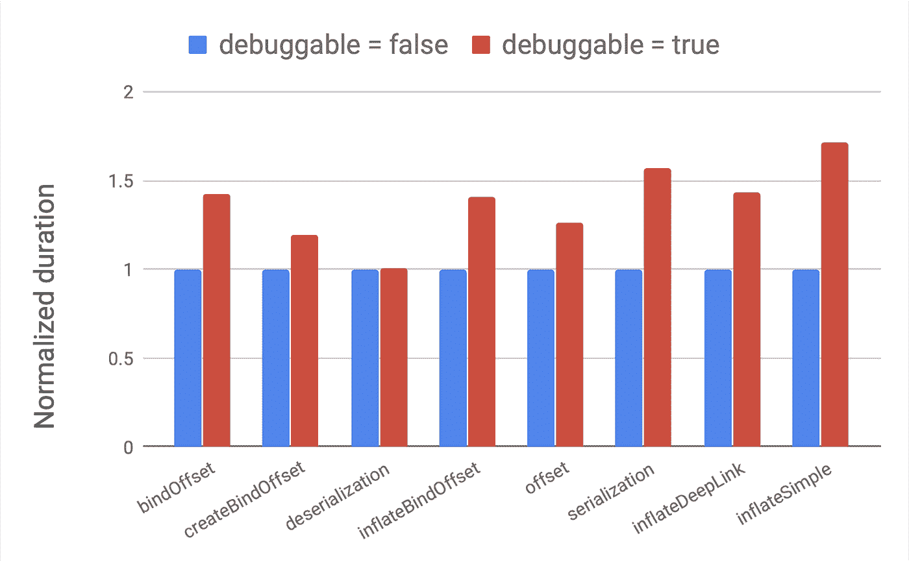

在一些测试中，比如反序列化，没有影响。然而，对于其他人来说，基准上有 50%或更多的回归。我们甚至发现了慢了 100%的例子。这是因为当你的代码可调试时，运行时很少对它进行优化，所以用户在生产设备上运行的代码是非常不同的。

在 debuggable 中进行评测的结果是，你可能会被误导到应用程序中的热点，并且可能会浪费时间优化一些不需要优化的东西。

# 奇怪的事情

我们现在要远离流言蜚语，把注意力转向一些更奇怪的事情。这些都不是我们可以打破的神话。相反，这些事情可能不会立即变得明显或容易分析，但结果可能会让你的世界天翻地覆。

# 陌生感 1: Multidex:对我的 app 性能有影响吗？

apk 越来越大。他们已经很久没有适应传统 dex 规范的约束了。如果您的代码超出了方法计数限制，Multidex 是您应该使用的解决方案。

问题是，有多少方法是太多了？如果一个应用程序有大量的 dex 文件，会对性能产生影响吗？这可能不是因为您的应用程序太大，您可能只是想根据特性拆分 dex 文件以便于开发。

为了探究多个 dex 文件对性能的影响，我们使用了 calculator 应用程序。默认情况下，它是一个单一的 dex 文件应用程序。然后，我们根据它的包边界将它分割成五个 dex 文件，以模拟根据特性的分割。

然后，我们测试了性能的几个方面，从启动时间开始。

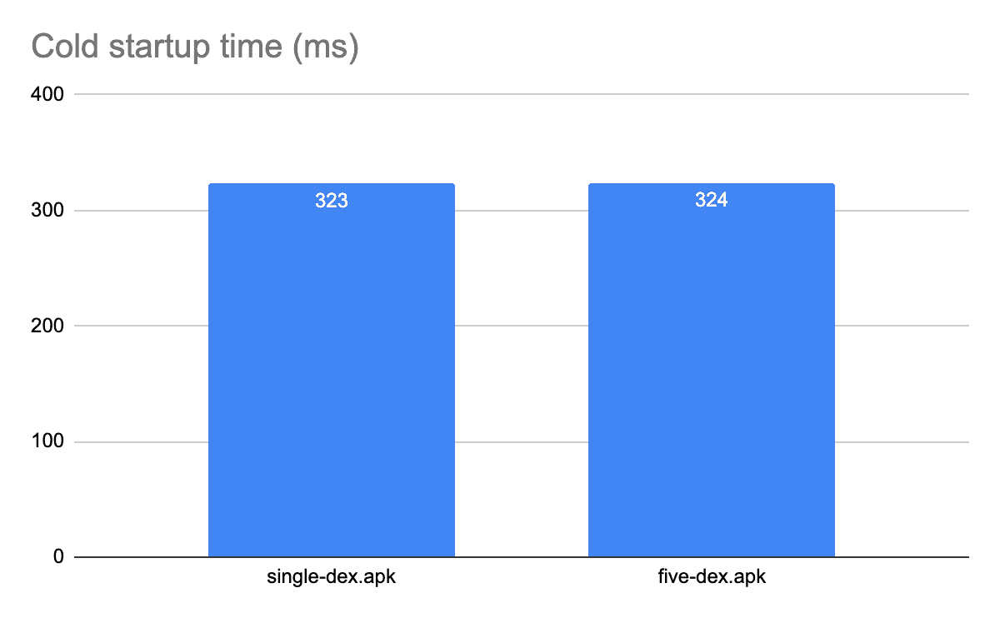

所以分割 dex 文件在这里没有影响。对于其他应用程序，可能会有轻微的开销，这取决于几个因素:应用程序有多大以及它是如何分割的。然而，只要合理地分割 dex 文件，并且不添加数百个文件，对启动时间的影响应该是最小的。

APK 的大小和内存怎么样？

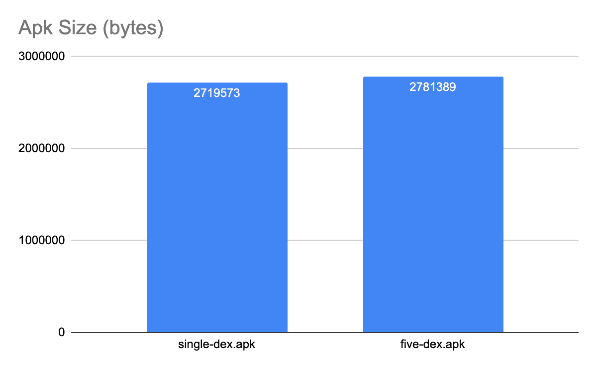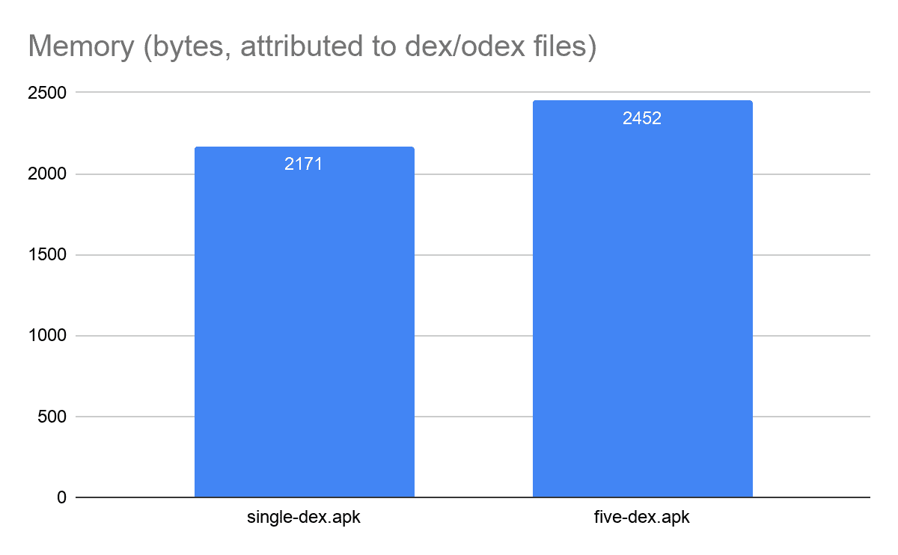

正如你所看到的，APK 大小和应用程序的运行时内存占用都略有增加。这是因为，当您将应用程序拆分为多个 dex 文件时，每个 dex 文件都有一些用于符号表和缓存的重复数据。

但是，您可以通过减少 dex 文件之间的依赖性来最小化这种增加。在我们的例子中，我们没有努力去减少它。如果我们试图最小化依赖，我们会期待 R8 和 D8 工具。这些工具自动分割 dex 文件，并帮助您避免常见的缺陷和最小化依赖性。例如，这些工具不会创建比所需更多的 dex 文件，也不会将所有的启动类放在主文件中。但是，如果您对 dex 文件进行自定义分割，请始终测量您要分割的内容。

# 陌生感 2:死代码

将运行时与 ART 这样的 JIT 编译器一起使用的好处之一是，运行时可以分析代码，然后优化它。有一种理论认为，如果代码没有被解释器/JIT 系统分析，它可能也不会被执行。为了验证这一理论，我们检查了谷歌应用程序生成的艺术档案。我们发现很大一部分 app 代码没有被 ART 解释器-JIT 系统分析。这表明许多代码实际上从未在设备上执行过。

有几种类型的代码可能不会被分析:

*   错误处理代码，希望不会经常执行。
*   向后兼容的代码，不能在所有设备上执行的代码，尤其不能在 Android 5 或更高版本的设备上执行。
*   不常用功能的代码。

然而，我们看到的不对称分布强烈表明应用程序中可能存在大量不必要的代码。

快速，简单，免费的方法来删除不必要的代码是缩小与 R8。接下来，如果您还没有这样做，请将您的应用程序转换为使用 [Android 应用程序捆绑包](https://developer.android.com/guide/app-bundle)并播放功能交付。它们允许您通过只安装被使用的特性来改善用户体验。

# 学习

我们已经打破了许多关于 Android 性能的神话，但也看到，在某些情况下，事情并不明朗。因此，在选择复杂的优化或者甚至是打破良好编码实践的小优化之前，进行基准测试和测量是至关重要的。

有很多工具可以帮助你衡量和决定什么最适合你的应用。例如，Android Studio 有针对本机和非本机代码的分析器，它甚至有针对电池和网络使用的分析器。有工具可以挖掘得更深，比如 Perfetto 和 Systrace。这些工具可以提供非常详细的视图，例如，在应用程序启动或执行过程中发生的情况。

Jetpack 基准库消除了测量和基准测试的所有复杂性。我们强烈建议您在持续集成中使用它来跟踪性能，并在您添加更多功能时查看您的应用程序的行为。最后，同样重要的是，不要在调试模式下进行分析。

Java 是 Oracle 和/或其附属公司的注册商标。