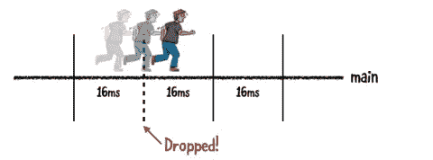
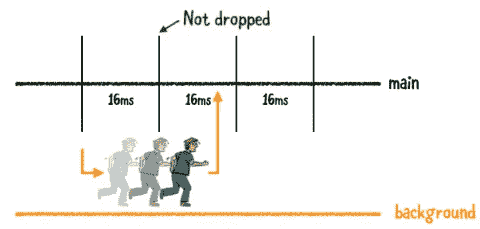
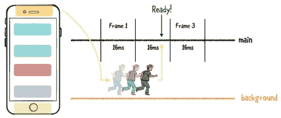
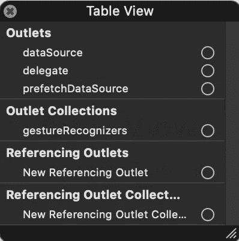
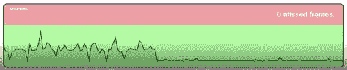

# 通过预取 API iOS 使 TableView 和 CollectionView 的性能更加流畅

> 原文：<https://medium.com/globant/butter-smooth-performance-of-tableview-and-collectionview-with-prefetching-api-ios-428fcc46c56e?source=collection_archive---------0----------------------->

# 起伏滚动

平滑滚动符合每秒 60 帧(FPS)的显示限制。因此，应用程序需要每秒刷新 60 次用户界面，这意味着每帧大约有 16 毫秒的时间来呈现内容。系统会丢弃显示内容时间过长的帧。

当应用程序跳过一些帧并移动到下一帧时，会有起伏的滚动体验。丢帧操作的一个可能原因是长时间运行阻塞了主线程。

所以你必须分离出长时间运行的操作，并把它们转移到后台线程。这允许用户处理任何触摸事件。当后台操作完成时，您可以根据操作在主线程上进行任何所需的 UI 更新。

下图显示了丢帧的情况:



一旦你把工作移到后台，事情看起来就像这样:



现在，您有两个并发线程正在运行，以提高您的应用程序的性能。

# 预取的工作原理

如果能在单元格必须显示数据之前就开始获取数据，那就更好了。
所以在 iOS 10 中，苹果推出了预取 **UITableView** 和 **UICollectionView 的 API。在这个故事中，我将解释预取的用途以及如何正确使用预取**

当我们需要从远程或本地内存下载大型对象(图像或视频文件)时，预取非常有用。预取在访问数据模型时也给了我们惰性加载:我们不需要获取所有的数据模型，只需要下载差不多就可以显示了。预取减少了电池和 CPU 的消耗。它提供了更好的用户体验和流畅度。



苹果没有提到可视单元格之外将预取多少行。

*   **tableView(_ table view:UITableView，prefetchRowsAt index paths:[index path])**对于最初在屏幕上可见但没有滚动的行，不会调用 table view。
*   在最初可见的行变得可见之后，将立即调用 table view**(_ table view:UITableView，prefetchRowsAt indexPaths:[index path])**，index paths 变量包含大约 7 到 10 个最接近可见区域的行。
*   取决于滚动速度，预取中的**索引路径**，该方法将包含不同数量的行。在正常的滚动速度下，它通常包含一行。如果你快速滚动，它将包含多行。

# 实施

在 **UITableView** 和 **UICollectionView** 中引入了新的属性 prefetchDataSource:

```
**@available**(iOS 10.0, *****)
**weak** **open** **var** prefetchDataSource: **UITableViewDataSourcePrefetching**?
```

我们必须确认 UITableViewDataSourcePrefetching 协议与 UITableViewDataSource 和 UITableViewDelegate 相同。

```
Class ViewController: UITableViewDataSourcePrefetching {}
```

通过编程或从故事板(界面)将视图控制器绑定到表视图预取数据源

```
tableView.prefetchDataSource = self
```

运筹学



苹果推出的预取 API `UITableViewDataSourcePrefetching`协议有两种方法:

```
Required method:**public** **func** **tableView**(_ tableView: **UITableView**, prefetchRowsAt indexPaths: **[IndexPath]**)Optional method:**optional** **public** **func** **tableView**(_ tableView: **UITableView**, cancelPrefetchingForRowsAt indexPaths: **[IndexPath]**)
```

# 例子

```
func tableView(_ tableView: UITableView, prefetchRowsAt indexPaths: [IndexPath]) { for indexPath in indexPaths { guard operations[indexPath] == nil else { return } if let loader = dataStore.downloadImage(indexPath.row) { operationQueue.addOperation(loader)
       operations[indexPath] = loader }
    }
}
```

当不再需要时，取消下载(正在进行的数据):

```
func tableView(_ tableView: UITableView, cancelPrefetchingForRowsAt indexPaths: [IndexPath]) { for indexPath in indexPaths { if let loader = operations[indexPath] { loader.cancel()
        operations[indexPath] = nil
    }
  }
}
```

检查 willDisplay 方法中的 while 数据是否已在运行。

```
func tableView(_ tableView: UITableView, willDisplay cell: UITableViewCell, forRowAt indexPath: IndexPath) { guard let cell = cell as? ImageTableViewCell else { return }cell.downloadImageView?.image = nil if let loader = operations[indexPath] { if let image = loader.image {
       cell.downloadImageView.image = image
     } else {
      loader.completeHandler = { [weak self, weak cell] image in
         guard self != nil else {return}
         cell?.downloadImageView.image = image }
     }} else { if let loader = dataStore.downloadImage(indexPath.row) {
          operationQueue.addOperation(loader)
          operations[indexPath] = loader
          loader.completeHandler = { [weak self, weak cell] image in
          guard self != nil else {return}
          cell?.downloadImageView.image = image
      }
  }
 }
}
```

# 性能检查


Without Prefetching 8 frame missed



With Prefetching 0 frame missed

# 结论

预取协议允许我们在显示行之前延迟加载数据和加载的数据，这允许良好的用户体验以及更平滑的滚动和加载过程。

参考来自[苹果 WWDC](https://developer.apple.com/videos/play/wwdc2016/219/)参考图片来自 [Raywenderlich](https://www.raywenderlich.com/7341-uicollectionview-tutorial-prefetching-apis)