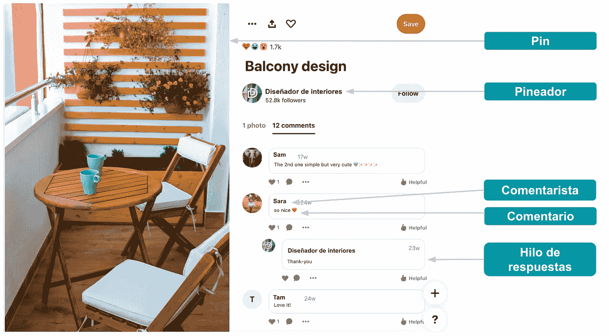
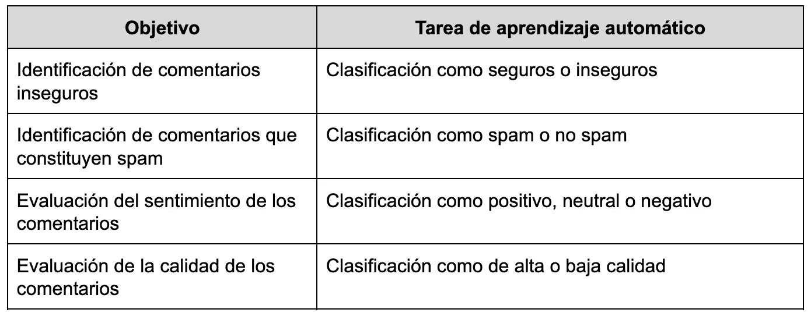
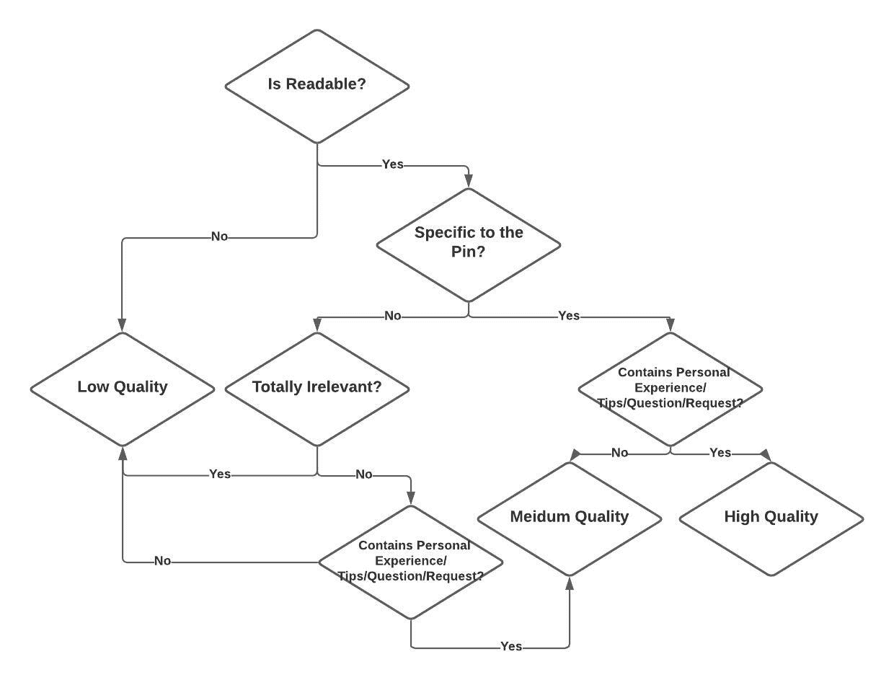
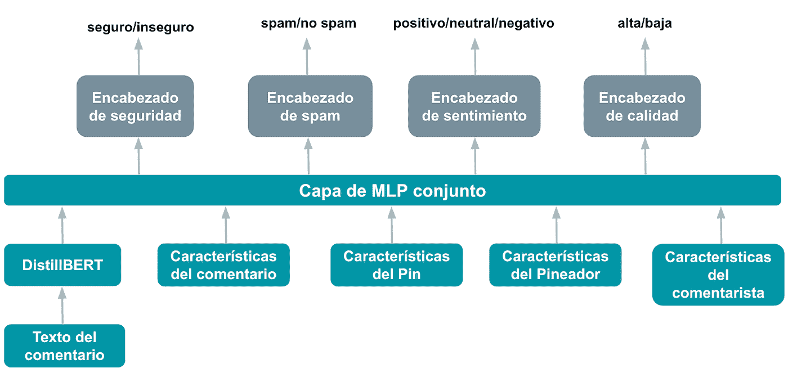
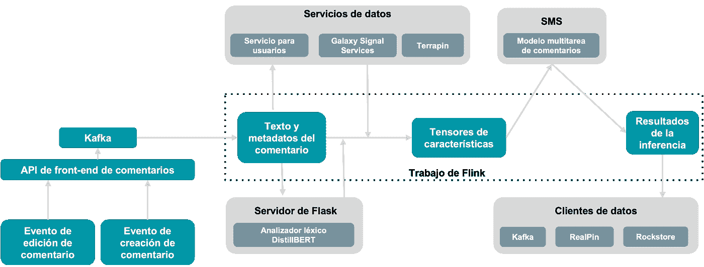

# Pinterest 如何通过机器学习培养健康的评论生态系统

> 原文：<https://medium.com/pinterest-engineering/c%C3%B3mo-fomenta-pinterest-un-ecosistema-sano-de-comentarios-gracias-al-aprendizaje-autom%C3%A1tico-329579b629ca?source=collection_archive---------5----------------------->

Yuanfang Song | 信任与安全机器学习工程师 Qinglong Zeng | 内容质量信号工程总监;Vishwakarma Singh | 信任与安全机器学习主管

*这篇文章最初发表于 英语.Read the English version* [*here*](/pinterest-engineering/how-pinterest-powers-a-healthy-comment-ecosystem-with-machine-learning-9e5c3414c8ad) *(T7 )*

随着 Pinterest 不断发展,从一个只存储想法的地方到一个发现激发行动的内容的平台,直接在该平台上发布内容的创作者增加了原生内容。随着 Pinterest 创作者生态系统的增长,我们致力于通过 [创作者行为准则](https://business.pinterest.com/es/creator-code/) 等举措确保 Pinterest 保持积极和鼓舞人心的环境,这是一项内容政策,要求创作者在发布 Idea Pins 之前接受某些指导方针(例如“善待”和“验证信息”)。我们还为这些引脚的评论提供保护功能,包括提醒以保持积极的态度,删除评论和过滤关键字的工具,以及防止垃圾邮件的信号。从技术角度来看,我们使用最先进的机器学习技术来识别违反社区政策的评论,并近乎实时地采取行动。我们还使用这些技术来首先显示最具启发性和最高质量的反馈,以提供更高效的体验并促进参与。

自从 3 月份引入机器学习解决方案以自动检测可能违反政策的评论并采取适当措施之前,我们观察到评论报告率下降了 53%(每百万次评论展示的用户评论报告数量)。

在这里,我们分享了我们如何构建可扩展的近实时机器学习解决方案,以识别违反政策的评论,并根据评论质量对评论进行分类。

**Figura 1: Ecosistema de comentarios en Pinterest**

# 一个评论的面孔

从广义上讲,我们确定了评论的四个方面:不安全或评论是否违反了我们的[社区指南](http://policy.pinterest.com/es/community-guidelines),垃圾邮件,感觉和质量。评论的感觉可以是积极的,中立的或消极的。评论的质量可以是高或低。我们通过内在维度来衡量评论的质量:可读性,与引脚的相关性和细微差别。注释是可读的,如果它没有错误并且是可以理解的。相关的评论是具体的,并且与引脚的内容有关。带有细微差别的评论是问题、提示、建议或请求,或描述用户的个人体验或与 Pin 的交互。带有细微差别,可读性和与引脚相关的评论被认为是高质量的。

# 机器学习解决方案

我们利用机器学习技术来识别违反政策的评论(不安全和垃圾评论),并评估评论的感受和质量。我们对这些步骤中的每个步骤进行建模以创建分类任务,如表 1 中所述。目前,我们的机器学习解决方案支持多种语言(英语,法语,德语,葡萄牙语,西班牙语,意大利语和日语),并将在未来扩展到其他语言。

**Tabla 1\. Objetivos de los comentarios transformados en tareas de clasificación**

## 数据用于培训

我们仅使用标记为英文的注释来训练模型。我们采用混合方法来限制收集标记数据的成本。标记为不安全,垃圾邮件和非垃圾邮件的评论是通过对社区报告的评论进行人工验证获得的。标记为安全的评论是通过随机抽样 Pinterest 上的所有评论生成的,因为不安全评论的数量非常低。用正面和负面情绪类标记的数据是通过随机抽样的评论的人体标记获得的。由于负面评论的频率也非常低,因此我们使用[Vader 情绪分析器](https://github.com/cjhutto/vaderSentiment)对负面情绪标记的评论进行采样。对于质量标签,我们收集评论者对评论质量的每个因素的反馈。最后,我们使用图 2 所示的决策流程图将这些响应分为三个质量类别。目前,我们将所有中等质量的评论视为高质量的评论,我们可能会考虑将来使用单独的处理来对评论质量进行更精细的控制。

**Imagen 2: Etiquetado de la calidad de un comentario mediante factores intrínsecos**

## 模型

我们设计了一个多任务模型,如图 3 所示。它通过调整强大的下一代预训练变换器模型([DistillBERT](https://huggingface.co/distilbert-base-multilingual-cased)多语言)来利用迁移学习。这种设计选择在整体性能、生命周期成本和开发速度方面提供了最佳价值。成本降低是因为我们使用预训练模型,需要相对较少的标记数据进行后续训练,并且在整个生命周期中只需要维护一个模型。我们的评估表明,多任务模型的性能与每个分类任务的独立模型的性能相当。我们使用预先训练的多语言模型,因为它有助于我们将模型的覆盖范围扩展到英语以外的许多语言,而无需对这些语言进行专门的培训。

为了提供上下文并提高模型性能,我们还使用了引脚、绘图仪和注释器功能以及其他注释功能,这些功能是 Pinterest 注释生态系统的组成部分(如图 1 所示)。这些特征与 DistillBERT 的最后一层隐藏层的输出配对,并被引入到组合的多层感知器(MLP)中,这也允许跨特征进行交叉学习。引脚功能包括[PinSage](https://arxiv.org/abs/1806.01973)的数据表示和引脚语言。绘图仪和注释器的特征包括它们之间的相似之处,这些相似之处源于[PinnerSage](https://arxiv.org/abs/2007.03634)的数据表示和配置文件特征,例如语言。注释的其他特征是注释的长度和语言。

**Figura 3: Arquitectura del modelo de comentarios multitarea**

每个任务标题都有自己的输出层,该输出层在类之间产生分数分布。二进制分类标头使用 sigmoidea 激活输出和二进制交叉的损失。情绪分类标头使用一个 softmax 输出层和一个交叉损耗。对于每个训练数据实例,只有任务标头对数据点具有标签的全局损失函数有贡献。该模型使用 Tensorflow 和 Keras 实现,并在多个 GPU 上使用数据并行性进行训练。我们优化了检索率和误报率。我们设定了评分截止值,以识别不安全、负面情绪和垃圾评论。

## 推论

我们实现了模型推理,允许使用 Pinterest 的[数据流平台](/pinterest-engineering/unified-flink-source-at-pinterest-streaming-data-processing-c9d4e89f2ed6)([Flink](https://flink.apache.org/))近乎实时地对新创建/编辑的评论进行评分,如图 4 所示。我们在 Pinterest 的在线模型服务平台上托管了多任务反馈模型([SMS](/pinterest-engineering/building-a-dynamic-and-responsive-pinterest-7d410e99f0a9))。为了准备 DistillBert 的条目,我们将相应的词法分析器托管在 Python [Flask](https://flask.palletsprojects.com/en/2.0.x/) 中作为服务。Flink 作业从 [Kafka](https://kafka.apache.org/intro) 队列接收注释及其关联的元数据,该队列由前端 API 服务完成,与注释创建或编辑事件相关。此工作使用注释语言作为过滤器,仅对支持的语言的注释进行推断。它通过 HTTP 与 Flask 服务通信以获取 DistillBert 输入。它从各种 Pinterest 数据服务(如[Galaxy Signal Service](/pinterest-engineering/pinterest-visual-signals-infrastructure-evolution-from-lambda-to-kappa-architecture-f8f58b127d98)和[Terrapin](/pinterest-engineering/open-sourcing-terrapin-a-serving-system-for-batch-generated-data-7aa2f38c4472))获取模型所需的其他输入特征。Flink 的工作将所有特征转换为张量,然后向 SMS 发出预测请求。最后,它将推理结果发送到各种数据客户端,如 Rockstore、RealPin 和 Kafka,以便其他客户端可以使用这些数据。Rockstore 是一个分布式的键值存储和 MySQL 后端存储,以及 Pinterest KVStore 平台的协调和管理 API。RealPin 是一个高性能的对象检索系统,具有高度可定制的分类,聚合和过滤功能。

Figura 4\. Flujo de trabajo de inferencia para calificar comentarios

# 服务

我们有两个单独的服务工作流,它们使用推理结果和应用策略,并对反馈进行分类。工作流的分离提供了逻辑模块化,并简化了操作、管理和诊断。第一个工作流过滤掉不安全的垃圾评论,而另一个工作流则使用情绪和质量得分以及其他因素执行适当的过滤或分类操作。目前,我们将回复视为独立评论,并提供类似的处理方式。

# 结论

我们的机器学习解决方案可针对可能违反政策的评论提供强大的防御,并确保我们的绘图人员社区可以参与和获得灵感的安全生态系统。有害评论的识别和质量评估将继续发展,因为背景,发展趋势和其他细微差别所起的作用,如讽刺,否认,比较,基调,极性,感觉和意义的转变等。我们计划迭代改进我们的解决方案,并修订我们的社区指南。我们还看到了将模型用于其他用例的机会,例如字幕,直接消息和其他基于文本的用户参与形式。

# 致谢

非常感谢 Nina Qiyao Wang,Beatrice Zhang,Abhishek Jathan 和 Hanyi Zhang 为该模型的开发和实施做出的贡献。我们感谢 Maisy Samuleson 和 Ashley Chin 的分析、产品信息和支持。感谢 Andrey Gusev 为我们提供信息和建议。感谢 Shaji Chennan Kunnummel 和 Nilesh Gohel 分享他们的技术专长。最后,我们感谢 Harry Shamshanky 支持发布此博客。

*有关 Pinterest 工程的更多信息,请访问我们的*[*工程博客*](https://medium.com/pinterest-engineering)*,并访问*[*Pinterest Labs*](https://www.pinterestlabs.com/?utm_source=medium&utm_medium=blog-article-link&utm_campaign=song-et-al-january-18-2022&utm_content=spanish) *。要查看可用的机会并申请,请访问我们的*[*就业*](https://www.pinterestcareers.com/?utm_source=medium&utm_medium=blog-article-link&utm_campaign=song-et-al-january-18-2022&utm_content=spanish)*页面。(T19)*