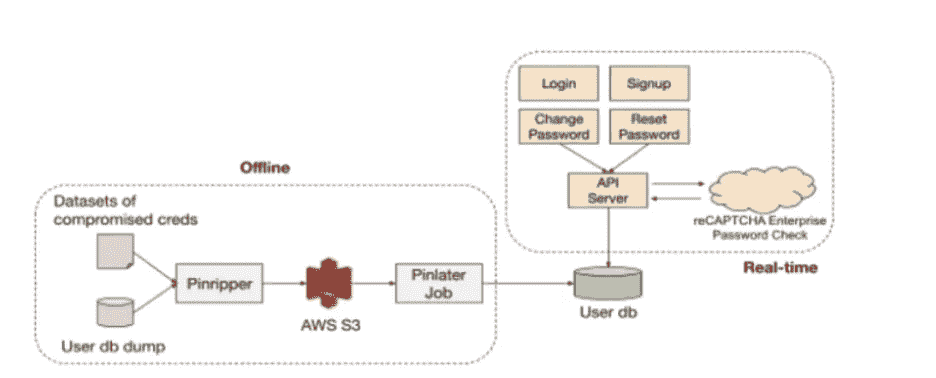
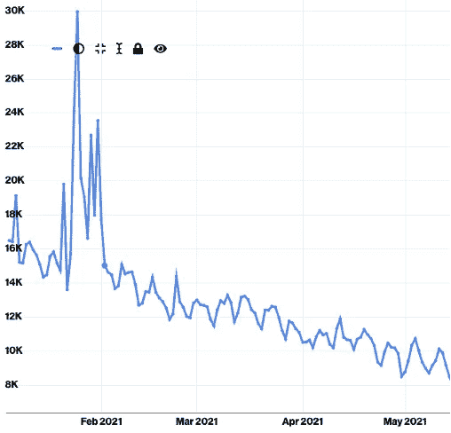
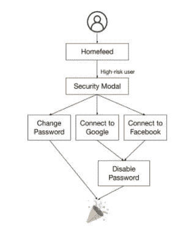
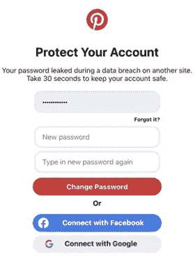
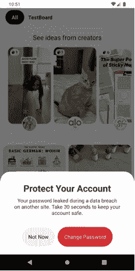
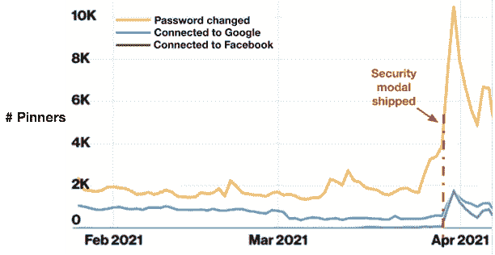

# 我们如何保护用户的密码

> 原文：<https://medium.com/pinterest-engineering/c%C3%B3mo-protegemos-las-contrase%C3%B1as-de-los-usuarios-7ad8810e51ef?source=collection_archive---------6----------------------->

本文原载于 English, see the English version

Yuru Shao | 软件工程师

Aalaa Satti | 软件工程师

Amine Kamel | 生产安全主管

在 Pinterest,我们确保帐户安全的方法之一是保护用户的密码。由于多种原因,密码可能会出现问题,包括人们经常重复使用密码,选择容易记住的密码,并与其他人分享构成密码或实际密码的详细信息。因此,如果我们希望提供安全和愉快的 Pinterest 体验,处理这些问题并非易事。在这篇文章中,我们将深入研究我们用来实现这一目标的一些技术。

# 主动检测受损凭据

多年来,一些[网站泄露了用户的](https://haveibeenpwned.com/PwnedWebsites)凭据,允许凭据填充攻击。通过密码保护用户帐户涉及识别最易受攻击的用户(凭据已泄露的用户)。这是通过嵌入离线数据集和实时验证来检测凭据受损的用户帐户来实现的。图 1 展示了我们的整体方法。

**Figura 1\. Detección de credenciales comprometidas y señalamiento de usuarios de alto riesgo**

## 无连接的数据集

Pinripper 是我们内部开发的工具,可帮助检测凭据受损的 Pinterest 用户。它的工作原理是摄取 Pinterest 用户凭据和已知受损凭据的记录,然后尝试在两者之间找到用户匹配项。正确识别的匹配首先基于电子邮件匹配,然后是这些电子邮件匹配的密码的 bcrypt 哈希之间的匹配。然后,Pinripper 会将这些已识别用户的 ID 上传到 S3 存储库,Pinlater(我们在 Pinterest 上的异步作业调度服务)会将其标记为进行风险评估。

## 密码验证器 reCAPTCHA

离线数据集的集成极大地帮助我们发现高风险用户。然而,主要的限制是,我们不能利用用户的实时操作,为那些使用泄露或违反密码的人。为了解决这个问题,我们整合了 Google 的 reCAPTCHA Enterprise 密码验证器 API,以同时识别凭据受损的用户。集成涵盖用户流,包括登录、注册、密码更改和密码重置。我们如何利用用户参与此功能的一个例子是通过阻止重置和使用已知的受损凭据更改密码。与脱机方法类似,我们考虑了这些结果,并更新了用户数据库,以标记所谓的高风险用户。

# 高风险账户保护

除了检测高风险用户帐户外,我们还为具有已知高风险帐户的用户提供特定保护。

## 方案保护

通过我们的信任和安全团队,我们实施了规则,在识别可疑活动时自动保护高风险用户,以限制帐户购买。例如,如果高风险用户帐户从我们不熟悉的新设备登录,我们会立即将该帐户置于受保护模式,使所有用户会话无效并发送电子邮件通知。如图 2 所示,截至 2021 年 2 月,我们每天以编程方式保护超过 12,000 名用户。随着越来越多的用户采用妥协保护,这一数字正在下降。

**Figura 2\. Número de cuentas protegidas mediante programación**

## 承诺保护

我们还为具有已知高风险帐户的用户提供特定的交互保护。这样做的同时最大限度地减少摩擦并优化用户体验。我们不是强制所有拥有高风险帐户的用户更新密码,而是仅在登录时激活这些特定用户的特定“体验”。根据他们登录的平台,只要我们确信他们是帐户的真正所有者,高风险用户将在他们的启动源中体验到一种横幅,要求他们保护他们的帐户。

图 3 显示了用户交互是如何工作的。当用户访问他们的主源时,我们会检查他们是否被标记为高风险用户。如果是,则显示安全模式(如图 4a 所示)或安全警告(如图 4b 所示)。用户可以选择更改密码或登录到其社交媒体帐户。如果您选择通过单一登录提供商(SSO)登录来保护您的帐户,我们将禁用您的 Pinterest 密码,将来他们可以使用您的 Google 或 Facebook 会话登录。

**Figura 3\. Ventaja de la interacción de usuario para proteger la cuenta**

**Figura 4a. Modal de seguridad en la web**

**Figura 4b. Aviso de seguridad en el celular**

如图 5 所示,我们看到在提交 Web 安全模式后采取措施的用户数量大幅增加。这是用户愿意参与保护的明确证据。

**Figura 5\. Número de usuarios involucrados en las protecciones**

## Chrome 密码保护

2021 年 1 月,Chrome 发布了新的密码保护功能(T1)。我们立即采取措施确保我们的产品兼容。具体来说,Chrome 会标记被泄露的密码以及用户存储的弱密码,并将用户重定向到该网站的密码更改页面。在我们的例子中,根据用户是否已登录,您将被重定向到密码更改或重置页面。

# 吸取的教训

随着数据泄露的日益普遍以及密码破解工具的复杂性,保护密码对您的帐户安全至关重要。

我们对用户的建议如下:

1.不要在不同的地方重复使用密码

2.使用密码管理器(也有效地防止网络钓鱼)

3.启用双因素身份验证(2FA)。最好将 Fast IDentity Online (FIDO) 用于敏感帐户

如果您是安全专业人员,建议您考虑以下几点:

1.为您的用户执行主动的受损凭据检测

2.激励您的用户(鼓励他们使用更安全的密码,建议他们启用 2FA 等)提高您帐户的安全性

对账户的可疑活动采取行动,并主动保护用户

*有关 Pinterest 工程的更多信息,请查看我们的* [*工程博客 [*](https://medium.com/pinterest-engineering) *并访问我们的* [*Pinterest Labs*](https://labs.pinterest.com/) *网站。如需查看和申请职位,请访问我们的* [*工作*](https://www.pinterestcareers.com/#utm_source=medium&utm_medium=blog-article-link&utm_campaign=shao-satti-kamel-july-16-2021-spanish) *页面。(T19)*