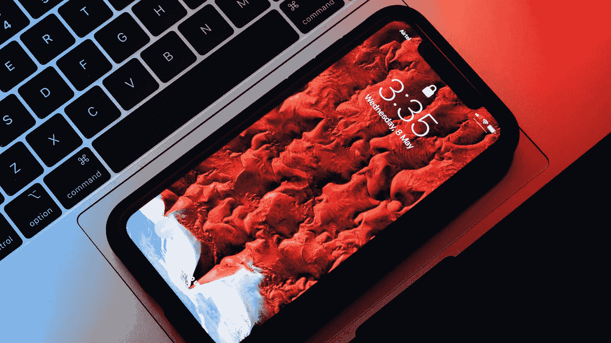
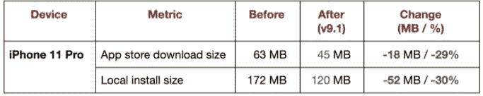

# 我们如何将 Pinterest 的 iOS 应用程序的大小减少了 30%以上 / 50 MB

> 原文：<https://medium.com/pinterest-engineering/c%C3%B3mo-redujimos-el-tama%C3%B1o-de-la-aplicaci%C3%B3n-de-pinterest-para-ios-en-m%C3%A1s-de-un-30-50-mb-6901f3b38aea?source=collection_archive---------1----------------------->

作者: Liang Ma | App Foundations 软件工程师

本博客最初发表于 英语.To read the English version, click [here](/pinterest-engineering/how-we-reduced-pinterests-ios-app-size-by-30-50mb-68d7f8425882)

我们都知道应用程序的大小很重要(下载大小[1]和本地安装大小[2])。此外,应用程序的大小与客户交互之间存在相关性。人们经常根据大小来决定使用软件,甚至按兆字节支付带宽。请记住,卸载率可能会随着应用程序大小增加而增加,因此用户试图释放设备上的磁盘空间。

最近,我们对 Pinterest 的 iOS 应用程序 v9.1 进行了改进,大大减小了其大小:

Tabla 1: El iPhone 11 Pro es nuestro dispositivo objetivo.

因此,我们看到*应用程序安装*(用户从应用程序商店下载应用程序)自发布以来新版本的增加。

# 什么是问题

为了让您了解上下文,在 Pinterest 上,我们在 iOS 版本中使用了[Bazel](/pinterest-engineering/developing-fast-reliable-ios-builds-at-pinterest-part-one-cb1810407b92)。如果你不认识 Bazel,这篇[文章值得一读。](https://github.com/pinterest/xchammer/blob/master/Docs/BazelForiOSDevelopers.md)

为了创建我们的本地化文件,我们有一个持续集成(CI)作业,它会自动扫描应用程序的所有源代码(通过 Bazel 查询),并将其发送到[Mojito](https://github.com/box/mojito)进行翻译。这工作得很好,直到我们添加了几个扩展。

每个[扩展](https://developer.apple.com/app-extensions/)都是一个模块,它有自己的[Build](https://docs.bazel.build/versions/master/build-ref.html#BUILD_files)文件。Bazel 实现后,进程将本地化字符串从主应用程序包复制到每个扩展包。但是,这会在每个扩展中生成 Localizable.strings 文件的副本,从而增加了应用程序包的整体大小。

因此,我们决定删除扩展的本地化副本。

# 解决方案

首先,我们更新了 BUILD 文件,以便扩展停止复制主应用程序包中的本地化字符串。

但是,通过此更改,NSLocalizedString 无法正确加载本地化字符串。进一步调查后,我们了解到两个宏都使用 +[NSBundle mainBundle],但 +[NSBundle mainBundle] 丢弃了包含“当前应用程序可执行文件”的包,该包是从扩展调用时应用程序的子文件夹。例如,它是 /path/to/Pinterest.app **/PlugIns/SiriExtension.appex/** 而不是 /path/to/Pinterest.app/。我们进行了更改以设置所需的路径,以便 NSLocalizedStringWithDefaultValue 可以从主应用程序的包中读取本地化的字符串。

所有这些更改所节省的空间—**(所有 Localizable.strings 文件的大小**)*****(具有这些重复位置的扩展的数量)—大约占应用程序总大小的**30%。**

# 长期计划

作为后续行动,我们计划将本地化资源放在各自的扩展/SDK 中,而不是依赖于应用程序包,这具有以下优点:

每个软件包都是独立的,因此它不需要主应用程序的软件包来运行或测试位置,并且可以包含在一个独立的应用程序中。

NSLocalizedString 和本地化 API 通常在扩展代码中工作。

● 我们可以让软件包成为开源的。

还有其他可以改进的领域,例如消除不必要的非面向消费者的代码本地化,研究大小更有效的图像格式,以及编译器级别的其他优化。请随时了解更多新闻,如果您对此类机会感兴趣,请访问我们的[就业页面](https://www.pinterestcareers.com/)。

*[1] 下载大小是从 App Store 下载应用程式时传输的实际大小,只有在应用程式超过 Apple 设定的 200 MB 限制且使用者未连线至 WiFi 时才会显示,除非使用者变更预设设定。此外,它是压缩的,因此它比通常的安装尺寸小。(T15)*

*[2] 本地安装大小是应用程序在手机磁盘上占用的实际大小(设置->iPhone 存储->Pinterest->应用程序大小)。它被缩小到您的手机型号,所以它通常小于通用尺寸。(T17)*

我们正在构建世界上第一个视觉发现引擎。全球有超过 4.75 亿人使用 Pinterest 来梦想,计划和准备他们想要做的事情。[*加入我们的团队!(T4) (T5)*](https://careers.pinterest.com/careers)