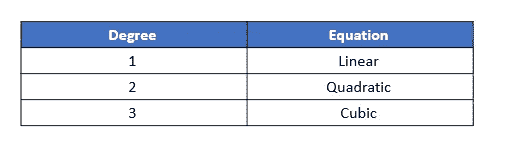

# 一个求二次方程根的 c 程序

> 原文：<https://medium.com/edureka/c-program-quadratic-equation-1483f6a182af?source=collection_archive---------3----------------------->


Quadratic Equation — Edureka

计算一个二次方程的根是我们小时候学过的东西。然而，二次方程的复杂性随着时间的推移而增加。处理这个问题的方法也发生了变化。在这篇文章中，我们将看看如何写一个 C 程序来寻找一个二次方程的根。

以下是本文将涉及的要点:

1.  什么是二次方程？
2.  根的类型
3.  理解算法
4.  一个求二次方程根的 c 程序

我们开始吧。

# 什么是二次方程？

在深入本帖的编码部分之前，我们先来了解一下到底什么是二次方程？这一节将让你很好地理解二次方程，这将有助于理解算法。所以，让我们回到解决方案。二次方程被称为二次方程。如果你不熟悉术语“度”，它是一个方程的阶，它的值等于方程中的最大指数。



## 标准符号法

让我们看看什么是二次方程的标准形式，这将有助于你快速识别它们。

***ax2 + bx + c = 0*** 是二次方程的标准形式，其中变量 a、b、c 的值是已知的。x 的值是未知的，a 不等于 0。

当你在图上画二次方程时，你会得到一条曲线(抛物线)。这个方程与轴相交的点就是它的**根**。通常，一个二次方程有 2 个根。让我们讨论一个二次方程的根的细节。

# 根的类型

有几种不同的方法可以找到给定的二次方程的根。比如给定的二次方程因式分解，使用完全平方公式，最后一种方法涉及到使用二次公式求根。我将坚持最后一种方法，因为与其他方法相比，它的缺点较少。

假设我们的二次方程是标准形式 ***ax2 + bx + c = 0，*** 那么我们可以使用的公式是-


现在，我们来谈谈根。基本上，分子中平方根(B2–4ac)内的项也称为判别式。它能告诉你更多关于二次方程根的性质。让我们看一看

1.  如果判别式的值是正的，这意味着我们有两个本质上是**实数**的根。
2.  如果它的值是负的，你有一对本质上复杂的根(例如- 5i，8i)。
3.  如果它是 0，你会得到 2 个具有相等值和实数的根。

现在你已经对二次方程和它们的根有了深刻的理解，我们可以从算法开始，当你在现实世界的问题中实现你所学到的东西时，你会感觉很神奇。

# 理解算法

让我们一步一步地了解如何编写一个程序来寻找二次方程的根。

1.  首先，我们要求用户输入 a、b 和 c 的值，形成二次方程。
2.  一旦你有了这些值，你需要检查输入的值是否不是 0。如果它是 0，我们的 x 2 项将是 0，我们的方程将不再是二次的。
3.  现在，您有了一个有效的二次方程，可以计算它的判别式。
4.  在得到判别值后，您可以检查上面讨论的 3 个条件来了解根的性质。
5.  在了解自然之后，你可以计算它的根。

让我们看看 C 程序，找出一个二次方程的根。

# 求二次方程根的 c 程序

```
#include<stdio.h>
#include<math.h>
#include<conio.h>
#include<stdlib.h>/*Function to know the nature of roots and calculate the roots of given quadratic equation*/
void RootsofQuadratic(int a, int b, int c)
{
if (a == 0)  /*Checking for value of a*/
{
printf("The value of a cannot be 0");
return;
}
int d = b*b - 4*a*c;
double SquarerootDescriminant = sqrt(abs(d));
if (d > 0)
{
printf("The Roots are Real in Nature n");
printf("%fn%f",(double)(-b + SquarerootDescriminant)/(2*a),(double)(-b - SquarerootDescriminant)/(2*a));
}
else if (d == 0)
{
printf("The roots are equal and Real in Nature n");
printf("%f",-(double)b / (2*a));
}
else // d < 0
{
printf("The Roots are Complex in Nature n");
printf("%f + i%fn%f - i%f", (double)b/(2*a),SquarerootDescriminant,-(double)b / (2*a), SquarerootDescriminant);
}
}
int main()
{
int a;
int b;
int c;
printf("For a quadratic equation of form ax2 + bx + c = 0 enter values of a, b, cn");
scanf("%d%d%d", &a, &b, &c);  /*Asking for input*/
RootsofQuadratic(a, b, c);
return 0;
}
```

**输出:**


对于输入的值，我们得到了 2 个复数根。下次如果你有一个复杂的二次方程要解，这个程序肯定会节省你一些时间。

本文到此为止。我希望你已经理解了这个概念和 C 程序来寻找二次方程的根。

如果您想查看更多关于市场上最流行的技术的文章，比如人工智能、DevOps、伦理黑客，您可以参考 [Edureka 的官方网站。](https://www.edureka.co/blog/?utm_source=medium&utm_medium=content-link&utm_campaign=c-program-quadratic-equation)

> 1.[A C 程序基本结构](/edureka/basic-structure-of-c-program-ed3bf9c72632)
> 
> 2.[C 中的斐波纳契数列](/edureka/fibonacci-series-in-c-3207f0f57eb6)
> 
> 3.[如何在命令提示符下编译 C 程序](/edureka/compile-c-program-in-command-prompt-e6cd3ce11d8e)
> 
> 4. [C 编程教程](/edureka/c-programming-tutorial-36bc0380175f)

*原为 2019 年 7 月 15 日在*[*https://www.edureka.co*](https://www.edureka.co/blog/c-program-quadratic-equation/)*发布。*