# C 编程:掌握 C 所需的基础知识

> 原文：<https://medium.com/edureka/c-programming-tutorial-36bc0380175f?source=collection_archive---------1----------------------->


C 编程语言开发于 20 世纪 70 年代中期，但仍然被认为是所有编程语言之母。它支持多种功能，并且足够强大，可以直接与硬件单元和内核交互。本 C 编程教程涉及，

*   C 程序设计语言简史
*   数据类型和变量
*   第一个 C 程序
*   C 程序设计中的循环
*   C 程序设计中的条件语句
*   C 程序设计中的数据结构
*   用线串
*   功能
*   结构和联合
*   重要的面试问题

# C 程序设计语言简史


c 语言是由**丹尼斯·里奇**于 1972 年在贝尔实验室(美国)开发的。它是一种通用的、结构化的、独立于机器的、简单而灵活的编程语言。它主要是作为系统编程语言开发的，用来编写操作系统。

## C 语言程序设计的特点

*   **高级语言**

c 在其库和内置特性方面提供了强大的抽象，使其与机器无关。它足以开发系统应用程序，如内核、驱动程序等。

*   **结构化语言**

c 语言支持结构化编程，其中包括使用**函数。**函数降低了代码复杂度，完全可重用。

*   **丰富的库**

与它的前辈不同，C 语言结合了多个内置的**算法**和**逻辑**函数以及许多内置库，使得开发更快更方便。

*   **可扩展**

c 语言是一种高级语言，也对升级开放。因此，这种编程语言被认为是**可扩展的**，就像其他高级语言一样。

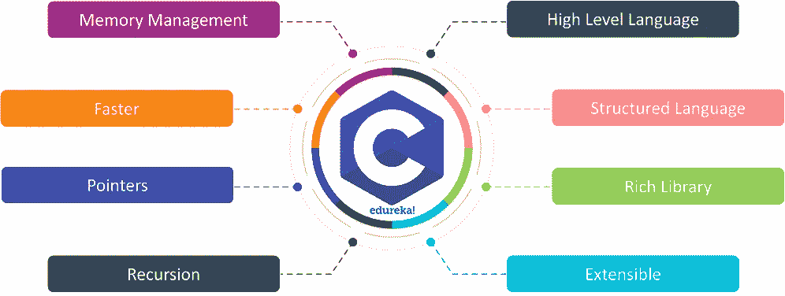

*   **递归**

c 语言支持包含递归的函数**回溯**。在递归过程中，一个函数在另一个函数中被多次调用。

*   **指针**

c 允许用户使用**指针**直接与内存交互。我们在内存、结构、函数、数组、堆栈等等中使用指针。

*   **更快**

c 语言带有最少数量的**库**和**内置**函数，这使得编译和执行时间更少，系统面临低开销。

*   **内存管理**

c 提供了最好的内存管理。它可以动态地分配和释放内存。 **malloc()、calloc()、realloc()** 函数用于动态分配内存，而 **free()** 函数用于在任何时刻释放已使用的内存。

# 数据类型和变量

C 中的数据类型大致分为以下四个类别**。**


**基本数据类型**

基本数据类型被认为是 C 提供的最基本和主要的数据类型。基本数据类型下的数据类型如下。

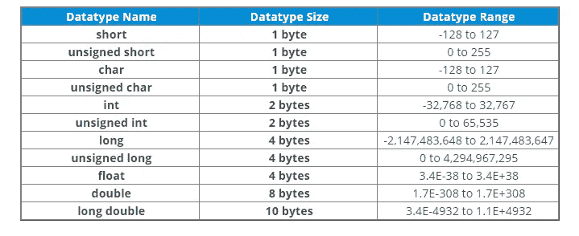

**派生数据类型**

一个**派生类型是由一个或多个基本**类型**组合而成的**。它们是 C 库中预定义了功能的对象类型。

**枚举数据类型**

枚举数据类型用于在 C 编程语言中声明**整型常量**，以便整型常量名称易于记忆和维护。关键字 **enum** 用于声明枚举的数据类型。

例子: **enum** plug{on = 1，off = 0 }；

**无效数据类型**

void 数据类型是一种空数据类型，在 c #中用作不返回值的函数的返回类型。

示例:

**C 语言中的变量**

变量被定义为存储一个确定数据类型的值的保留内存空间。变量的值不是恒定的，相反，它允许变化。c 中主要支持五种类型的变量。

*   局部变量
*   全局变量
*   静态变量
*   自动变量
*   外变量

**局部变量**

任何在代码块或函数中声明的变量，并且其范围被限制在特定的代码块或函数中，被称为**局部变量。**

//示例

```
void Edureka()
{
int Local_variable=10;
}
```

**全局变量**

任何在代码块或函数之外声明的变量，其作用域跨越整个程序，并允许任何函数改变其值，这种变量称为**全局** **变量**。

//示例

```
int Global_variable=10;
void Edureka()
{
int Local_variable=20; }
```

**静态变量**

任何使用关键字 **static** 声明的变量都被称为 a。静态变量在程序的整个执行过程中保留声明的值，并且不会在多次函数调用之间改变。

//示例

```
**void** Edureka()
{
**int** Local_variable =10;//
**static** **int** Static_variable =10;
Local_variable=Local_variable+1;
Static_variable =Static_variable+1;
printf("%d,%d",x,y);
}
```

**自动变量**

自动变量可以通过使用关键字 **auto 来声明。**默认情况下，C 语言声明的所有变量都是自动变量。

//示例

```
**void** main()
{
    **int** Local_variable=10;  //(automatic default)
    auto **int** auto=20;   //(automatic variable)
};
```

**外部变量**

外部变量通过使用 **extern** 关键字来声明。我们可以通过使用外部变量在多个 C 源文件中共享一个变量。

//示例

```
extern external=10;
```

让我们执行第一个 C 程序。

# 第一个 C 程序

在本 C 编程教程中，我们将了解一个 C 程序的**基本结构。任何基本的 C 程序都由以下部分组成**


*   **预处理指令**

预处理器指令在每个 C 程序的开头用一个特殊字符 **#** 声明。它们被定义为预定义的**函数**或**宏**程序，由 C 编译器在**编译**过程中调用和编译。

*   **功能**

C 程序中的函数被定义为主程序的**细分程序**。函数提供代码*的可重用性*并降低*代码的复杂性。*

*   **变量**

**变量**被定义为一个名字，声明用来存储 C 程序中的值。C 中使用的每个变量都有一个特定的数据类型，它决定了变量内存的*大小*和*布局*。

*   **语句&表达式**

语句只不过是我们提供给计算机进行编译的指令，而另一方面，表达式被认为是产生结果值的*数学*或*逻辑*语句。

*   **评论**

注释是开发人员在代码中编写的消息，以便于理解编程时使用的代码的逻辑。编译器不会编译这些注释。评论写在 **//** 或 **/* */内。**

现在让我们执行我们的第一个 Hello World 程序。

```
#include<stdio.h>
  **int** main(){
  printf("Hello World");
  **return** 0;
}
```

// **输出**

`Hello World`

# C 程序设计中的循环

C 中的循环被定义为一个编程语句，该语句被设计为执行特定的代码段达特定的次数或直到满足特定的条件。c 语言中主要有三个循环语句。

**为循环**

**For 循环**在 C 编程中是一个控制流语句，允许你执行特定的代码段进行有限次迭代。for 循环有三个参数，分别是*初始化变量、计数器变量、*和*递增/递减变量。*

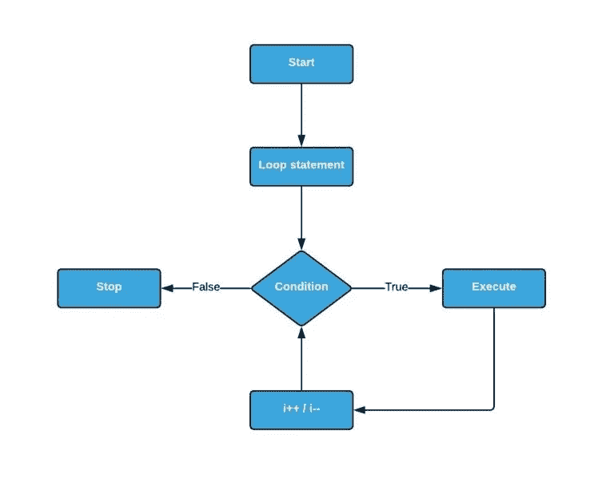

for 循环的流程图如下:

//示例

```
#include<stdio.h>
**int** main()
{
**int** i;
**for** (i=1; i<=5; i++)
{
printf("%dn", i);
}
**return** 0;
}
```

//输出

**While 循环**

**C 编程中的 While 循环**是一个控制流语句，它会重复执行自身，直到满足给定的*布尔*条件。While 循环可以认为是一个*重复的 If 语句。*

for 循环的流程图如下:

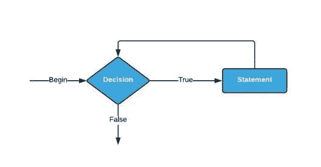

//示例

```
#include<stdio.h>
**int** main()
{
**int** count=1;
**while** (count<= 5)
{
printf("%d ", count);
count++;
}
**return** 0;
}
```

//输出

12345

**Do-While 循环**

**Do While 循环**在 C 编程中被认为是一个完全类似于普通 While 循环的条件语句。唯一的区别是 Do While 循环将布尔/条件语句放在循环的末尾。这使得 *Do While 循环至少执行一次。*

for 循环的流程图如下:

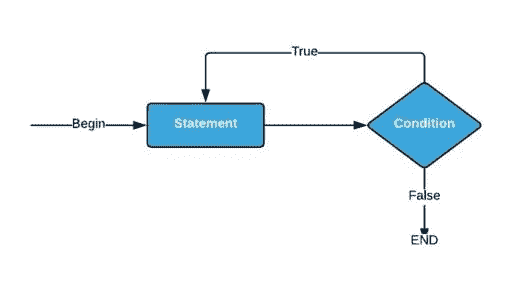

//示例

```
#include<stdio.h>
**int** main()
{
**int** j=0;
**do** {
printf("Value of the variable j is: %dn", j);
j++;
}**while** (j<=5);
**return** 0;
}
```

//输出

`Value of the variable j is: 0`
`Value of the variable j is: 1`
`Value of the variable j is: 2`
`Value of the variable j is: 3`
`Value of the variable j is: 4`
`Value of the variable j is: 5`

# C 程序设计中的条件语句

C 语言中的条件语句可以被定义为这样的编程语句，它们被设计来决定程序语句在指定的数学或逻辑条件下的执行流程。本 C 编程教程中重要的**条件语句**如下。

**如果**

**If 语句**C 语言中的 If 语句是一个编程条件语句，在一个条件上执行一段代码，前提是它为真且有效。以下是**条件下**的流程图。


//示例

```
#include<stdio.h>
**int** main()
{
**int** number=0;
printf("Enter a number:");
scanf("%d",&number);
**if**(number%2==0){
printf("your number is %d and it is an even number",number);
}
**return** 0;
}
```

//输出

`Enter a number:4`
`your number is 4 and it is an even number`

**否则——如果**

**Else If C 语言中的条件语句**用于执行两条语句中的一条。条件语句执行提供的代码段*为真且有效*。以下是 **else-if** 条件的流程图。

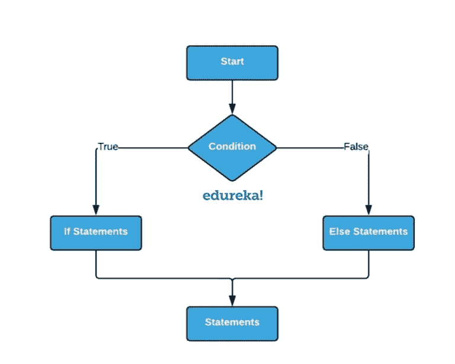

//示例

```
#include<stdio.h>
**int** main()
{
**int** number=0;
printf("enter a number:");
scanf("%d",&number);
**if**(number%2==0)
{
printf("your number is %d and it is an even number",number);
}
**else** {
printf("your number is %d and it is an odd number",number);
}
**return** 0;
}
```

//输出

`Enter a number:5`
`your number is 5 and it is an odd number`

**else-if 阶梯**

**Else If C 语言中的阶梯**是一组连续的 Else-If 语句，用于*执行一组给定语句中的*一条真实有效的语句。下面是**其他-如果阶梯**条件的流程图。

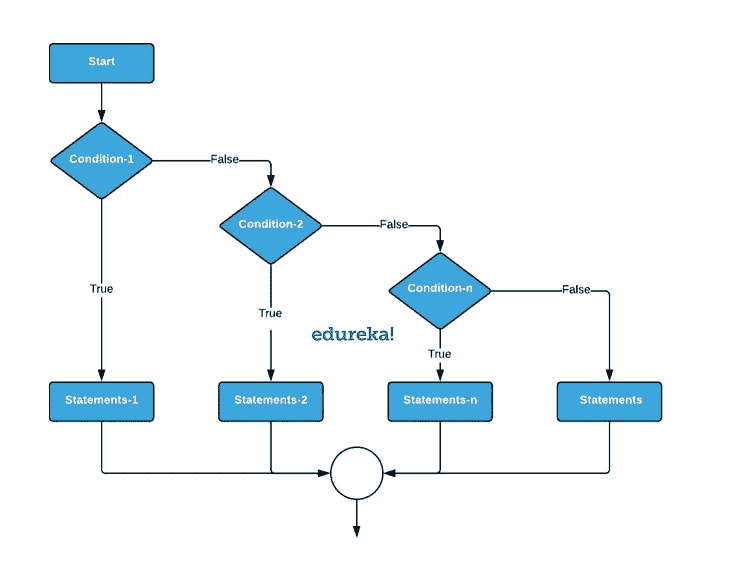

```
#include<stdio.h>
**int** main()
{
**int** number=0;
printf("enter a number:");
scanf("%d",&number);
**if**(number==10)
{
printf("your inputted number is equals to 10");
}
**else** **if**(number==50)
{
printf("your inputted number is equal to 50");
}
**else** **if**(number==100)
{
printf("your inputted number is equal to 100");
}
**else** {
printf("your inputted number is not equal to 10, 50 or 100");
}
**return** 0;
}
```

//输出

`enter a number:5`
`your inputted number is not equal to 10, 50 or 100`

**嵌套 if**

**嵌套-If**C 语言中是一个条件语句，其中一个 Else-If 语句嵌入到另一个 If 语句中。下面是**嵌套 if** 条件的流程图。


//示例

```
#include<stdio.h>
**int** main()
{
**int** v1, v2;
printf("Enter the value of First variable :");
scanf("%d",&v1);
printf("Enter the value of Second variable :");
scanf("%d",&v2);
**if** (v1 != v2)
{
printf("First variable is not equal to Second variablen");
**if** (v1<v2)
{
printf("First variable is not equal to Second variablen");
}
**else** {
printf("Second variable is greater than First variablen");
}
}
**else** {
printf("First variable is equal to Second variablen");
}
**return** 0;
}
```

//输出:

【T2
`Enter the value of Second variable :21`
`First variable is not equal to Second variable`
`Second variable is greater than First variable`

# C 程序设计中的数据结构

**数据结构**可以定义为**数据**值、它们之间的关系以及应用于**数据**的函数的集合。它们大致分类如下。

*   原始数据结构/内置数据结构
*   抽象数据结构/用户定义的数据结构


**阵列**

一个**数组**被定义为存储在连续存储位置的相似类型数据项的集合。数组是最简单的数据结构，其中每个数据元素都可以通过使用其索引号来随机访问。

有三种不同类型的阵列，即:

*   一维数组
*   二维数组
*   多维数组

**一维数组**

一维数组可以定义为具有单行和多列的数组。1D 数组中的元素是使用它们的索引号来访问的。


```
int arrayone[10];
```

**二维数组**

二维数组可以定义为数组的数组。 **2D** 数组被组织成矩阵，可以用行和列的集合来表示。数组的元素使用它们的交点坐标来访问。

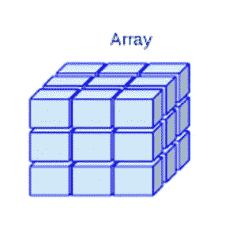

```
int arraytwo[10][5];
```

**多维数组**

多维数组可以被定义为数组的数组。3D 阵列被组织为 3D 矩阵，其可以被表示为多个行和列的集合。使用数组元素的 3D 相交坐标来访问这些元素。

```
int arraythree[10][10][10];
```

**链表**

链表是类似于数组的线性数据结构，但是，唯一的区别是，元素不是保存在顺序内存位置，而是存储在随机地址中，并使用指针连接。

*   单链表
*   双向链表
*   循环链表

**单链表**

单向链表是一维数组的替代形式。单链表中的元素以顺序格式存储，但存储在不同的内存位置，这些位置通过指针相互连接。单链表只能单向遍历


**双向链表** 双向链表是一个二维数组的替代品。双向链表中的元素以顺序格式存储，但存储在不同的内存位置，这些位置通过指针相互连接。双向链表可以双向遍历。


**循环链表**

循环链表类似于单链表。但是，唯一不同的是，循环链表尾部的指针指回了头部。


**文件**

**C 语言中的基本文件处理技术**，提供了用户可以对系统中的文件执行的基本功能。


*   **“r”**—搜索文件。如果文件成功打开， **fopen** ()将其加载到内存中，并设置一个指针**指向其中的第一个字符**。如果文件无法打开，fopen()返回空值。
*   **“w”**—搜索文件。如果文件存在，其内容将被覆盖。如果该文件不存在，则会创建一个新文件。如果无法打开文件，返回空值。
*   **“a”**—搜索文件。如果文件打开成功，open()会将它加载到内存中，并设置一个指针指向其中的最后一个字符。如果该文件不存在，则会创建一个新文件。如果无法打开文件，返回空值。
*   **“r+”**—搜索文件。open()将它加载到内存中，并设置一个指针指向其中的第一个字符。如果无法打开文件，返回空值。
*   **“w+”**—搜索文件。如果文件存在，其内容将被覆盖。如果该文件不存在，则会创建一个新文件。如果无法打开文件，返回空值。
*   **“a+”**—搜索文件。如果文件成功打开， **fopen** ()会将其加载到内存中，并设置一个指针指向其中的最后一个字符。如果该文件不存在，则会创建一个新文件。如果无法打开文件，返回空值。

**堆栈**

堆栈是一种线性数据结构，遵循操作执行的特定顺序。顺序可能是后进先出(LIFO)或后进先出(FILO)。

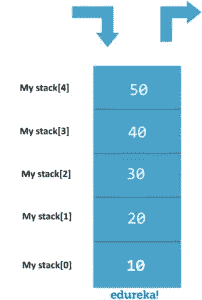

**排队**

一个**队列**是一个线性结构，遵循操作执行的特定顺序。顺序是先进先出(FIFO)。还有，C 包括**循环队列。**

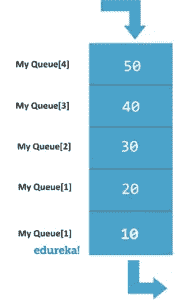

**图表**

图形被定义为使用节点和边以图形格式表示的数据结构。有三种类型的图形，即。

*   **无向图**


*   **有向图**

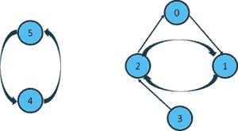

*   **有向加权图**


C 语言中的图形通常以如下两种格式表示:

例如:


*   **邻接矩阵**

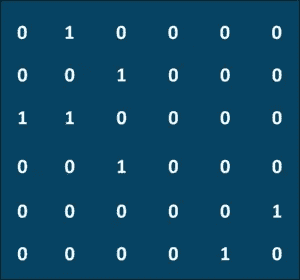

*   **邻接表**

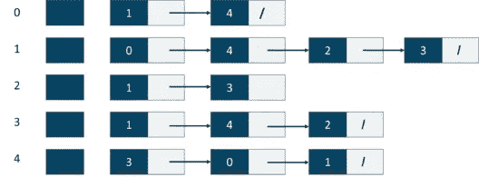

# 用线串

字符串被定义为以空字符结尾的一维字符数组。字符数组或字符串用于存储文本，如单词或句子。数组中的每个字符占用一个字节的内存，最后一个字符必须始终为 0。

两种类型的字符串是:

*   字符数组
*   字符串文字

C 语言中可用的字符串函数如下

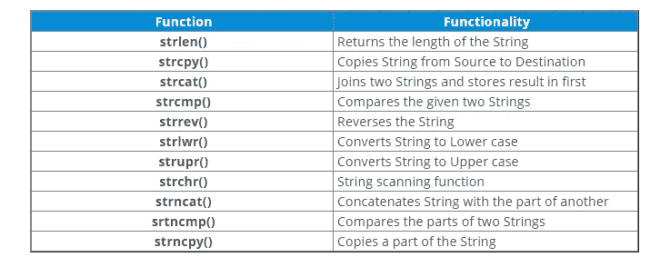

//示例

```
#include<stdio.h>
#include<string.h>
**int** main( )
{
**int** len;
**char** text[10]="Edureka" ;
length = strlen(array) ;
printf ( "string length is = %d n" , length ) ;
**return** 0;
}
```

//输出

`string length is = 7`

# 功能

**功能**可以定义为主程序的细分程序，用花括号括起来。主程序可以调用函数来实现其功能。这个过程提供了代码的可重用性和模块化。

两种类型的功能是:

*   库函数
*   用户定义的函数

**功能优势**

*   将避免在一个程序中重复编写相同的代码。
*   函数在程序中可以被调用任意次。
*   跟踪一个 C 程序很容易，当它被分成多个函数。
*   可重用性是 C 函数的主要成就。

**使用功能应遵循的规则:**

*   **功能声明**

需要将一个函数声明为**全局**，并且需要明确指定函数的**名称**，函数的**参数**，函数的**返回类型**。

*   **功能调用**

从程序中的任何地方调用函数时，应注意参数列表中的**数据类型**和参数列表中的**元素数量**是否匹配。

*   **功能定义**

在函数被**声明后，**很重要的一点是，函数包括**声明的参数，代码段，**和**返回值。**

*   **C 编程中使用函数的四个方面**
*   没有参数的函数**和没有返回值的函数**和
*   **不带参数的函数**和返回值为**的函数和**
*   ****函数**有参数**和**没有返回值******
*   ****带有参数的函数**和带有返回值**的函数****

# ******结构和联合******

********结构********

****结构是在 **C** 中可用的用户定义的数据类型，它允许将不同数据类型的数据项组合在一起。**结构**用于表示一条记录。一个 **struct** 是一个用于声明结构的关键字。****

****//示例****

```
**#include<stdio.h>
struct Distance
{
**int** feet;
**float** inch;
} dist1, dist2, sum;**int** main()
{
printf("1st distancen");
printf("Enter feet: ");
scanf("%d",&dist1.feet);
printf("Enter inch: ");
scanf("%f",&dist1.inch);
printf("2nd distancen");
printf("Enter feet: ");
scanf("%d",&dist2.feet);
printf("Enter inch: ");
scanf("%f",&dist2.inch);
sum.feet = dist1.feet + dist2.feet;
sum.inch = dist1.inch + dist2.inch;
**while** (sum.inch!= 12)
{
++sum.feet;
sum.inch = sum.inch - 12;
}
printf("Sum of distances = %d'-%.1f\"", sum.feet, sum.inch);
**return** 0;
}**
```

****//输出****

****`1st distance`
`Enter feet: 12`
`Enter inch: 7.9`
`2nd distance`
`Enter feet: 2`
`Enter inch: 9.8`
`Sum of distances = 15'-5.7"`****

******工会******

******联合**是在 **C** 中可用的特殊数据类型，它允许在同一内存位置存储不同的数据类型。 **union** 是用来声明 union 的关键字。****

****//示例****

```
**#include<stdio.h>
union Employee
{
**int** Id;
**char** Name[25];
**int** Age;
**long** Salary;
};
**void** main()
{
union Employee E;
printf("nEnter Employee Id : ");
scanf("%d",&E.Id);
printf("nEnter Employee Name : ");
scanf("%s",&E.Name);
printf("nEnter Employee Age : ");
scanf("%d",&E.Age);
printf("nEnter Employee Salary : ");
scanf("%ld",&E.Salary);
printf("nnEmployee Id : %d",E.Id);
printf("nEmployee Name : %s",E.Name);
printf("nEmployee Age : %d",E.Age);
printf("nEmployee Salary : %ld",E.Salary);
}**
```

****//输出****

****`Enter Employee Id : 102191`
`Enter Employee Name : Karan`
`Enter Employee Age : 29`
****

******结构和接头的区别******

********

****至此，我们结束了这篇“C 编程教程”文章。我希望您已经理解了数据结构、语法、功能和使用它们执行的操作的重要性。****

****这是一个 C 程序的基本结构。如果你希望查看更多关于人工智能、DevOps、道德黑客等市场最热门技术的文章，那么你可以参考 [Edureka 的官方网站。](https://www.edureka.co/blog/?utm_source=medium&utm_medium=content-link&utm_campaign=c-programming-tutorial)****

> ****1.[C 程序的基本结构](/edureka/basic-structure-of-c-program-ed3bf9c72632)****
> 
> ****2.[C 中的斐波那契数列](/edureka/fibonacci-series-in-c-3207f0f57eb6)****
> 
> ****3.[如何在命令提示符下编译 C 程序](/edureka/compile-c-program-in-command-prompt-e6cd3ce11d8e)****
> 
> ****4. [C 编程教程](/edureka/c-programming-tutorial-36bc0380175f)****

*****原载于 2019 年 8 月 29 日*[*【https://www.edureka.co】*](https://www.edureka.co/blog/c-programming-tutorial/)*。*****