# 缓存分页结果以提高性能

> 原文：<https://medium.com/globant/cache-results-for-pagination-to-improve-performance-2ad706d8f9c?source=collection_archive---------0----------------------->

在现代应用中，缓存是不可或缺的一部分。它可以提高应用程序的性能、可伸缩性和可用性。主要想法是减少延迟，使应用程序更快。当请求数量增加时，缓存对于容纳整个请求非常有用。

# **缓存**

缓存是一种提高应用程序性能的技术。缓存可以位于内存、数据库或服务器中，具体取决于实现。

缓存使数据访问更快，因为数据是在第一次请求时从数据库或数据存储中提取的。对于后续请求，将从缓存中提取数据，并且不访问数据库或数据存储。

应用程序首先在缓存中查找所需的数据，而不会直接命中数据库或实际的数据存储。如果在高速缓存中找不到数据，则它访问数据库或数据存储。

# 为什么要缓存分页？

我们知道分页是一种将多个记录的列表分割成子列表的技术。一次显示一小部分数据，以便用户可以更容易和方便地使用信息。在这方面，可以从数据存储中重复获取完整的列表，或者我们可以一次性获取并存储在缓存中，以避免数据访问的成本。

在本文中，我们将涉及如何在微服务中配置缓存和实现分页用例。

# **春季开机缓存注解**

下面是为 Spring boot 应用程序添加缓存支持所需的注释。

## **@ enable cache**

这个注释用于通知 Spring boot 我们希望在这个应用程序中启用缓存。该注释应用于 Spring boot 主类或 Spring 配置类。Spring 提供了一个并发 hashmap 作为默认缓存，但是我们也可以覆盖缓存管理器来注册外部缓存提供者。

## **@可缓存**

这个注释用于通知 Spring boot 我们想要缓存哪些对象。该注释可以应用于方法或类。

当注释应用于一个方法时，Spring 会缓存该方法的返回值。

当在类上应用注释时，缓存行为被添加到类中的所有方法，并且来自所有方法的返回值被缓存。

## **@CachePut**

这个注释用于通知 Spring boot 更新缓存的对象。缓存对象是数据库中原始对象的副本，应该始终与它们相同。当原始对象改变时，缓存的对象也应该改变。这是通过使用@CachePut 注释来完成的。此方法确保从数据库或数据存储中提取数据，并在缓存中更新结果。

## **@CacheEvict**

此注释用于指示从缓存中移除数据的操作。该注释应用于在数据库中执行删除操作的方法。

# **使用 Spring Boot 的微服务缓存**

在这个例子中，我们将看到如何在 spring boot 项目中启用默认缓存，以及如何通过重复调用相同的方法来提高应用程序的性能。此外，我们将看到分页如何与缓存一起工作。

**创建 Spring boot 项目:**

使用 spring boot web 依赖项创建一个简单的 spring boot 项目，用于托管在 web 服务器上。

要做到这一点，请前往 https://start.spring.io/的[并提供 maven 坐标和选择依赖关系。点击生成按钮。它将下载一个包含框架项目的 zip 文件。解压缩文件并导入 IDE。执行 maven 全新安装以下载初始依赖项。](https://start.spring.io/)

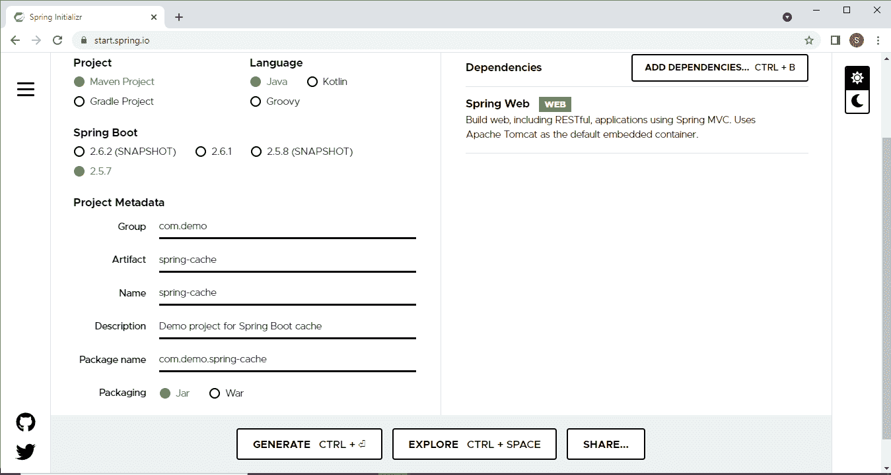

**主类:**

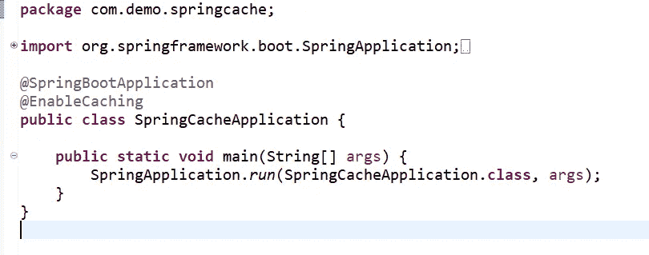

**域类:**

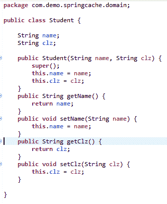

**控制器类别:**

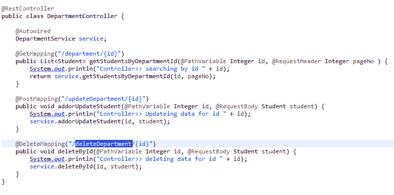

**服务接口:-**

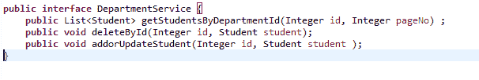

**服务实现类:**

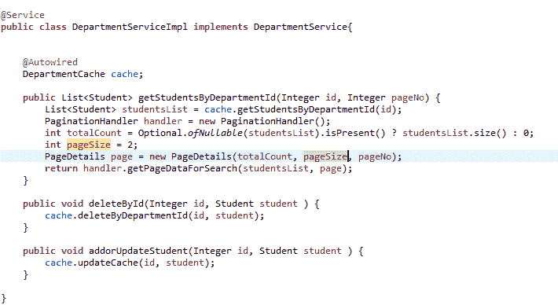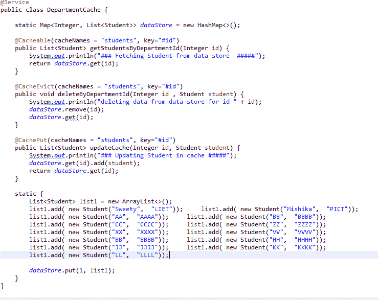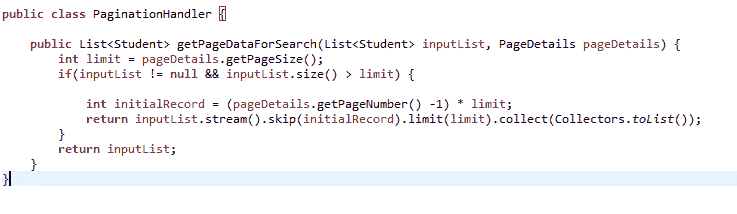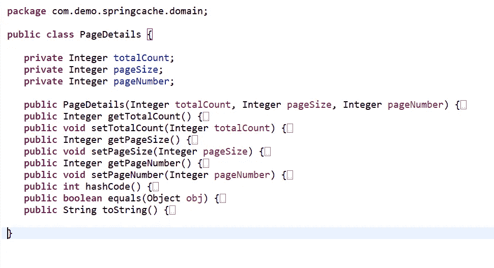

**让我们测试几个场景，看看缓存是如何工作的。**

**案例 1:带有分页的多个搜索请求**

我们将在 url 中传递部门 id，在标题中传递页码。我们在代码(DepartmentServiceImpl.java)中将页面大小定义为 2

让我们点击[http://localhost:8080/department/1](http://localhost:8080/student/1)。它应该打印:

控制器>>按 id 1 搜索

###从数据存储中提取学生#####

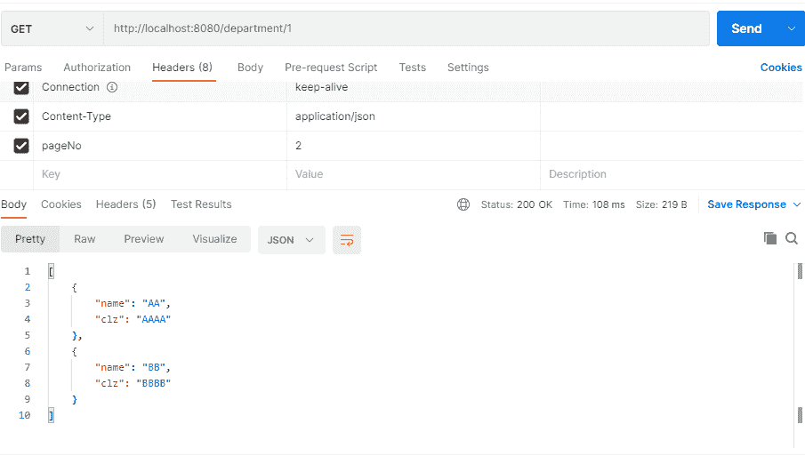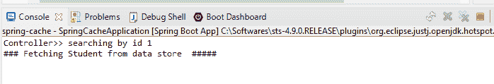

当我们一次又一次点击网址时，它应该只打印出来

控制器>>按 id 1 搜索

这意味着服务方法仅在缓存提供结果后第一次被调用。我们可以在截图中看到，第一次用了 108 毫秒来提供响应，第二次以后只用了 10 毫秒。在本例中，我们从地图中访问数据，我们可以观察到请求执行时间减少了 10 倍。当我们拥有来自数据库或其他 rest 服务的大量数据时，性能会有很大提高。

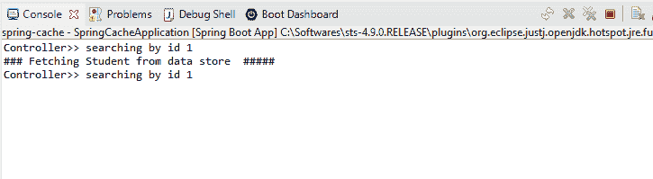

现在，如果我们更改页码，将从缓存中获取数据，我们可以看到显示数据只需要 10ms。

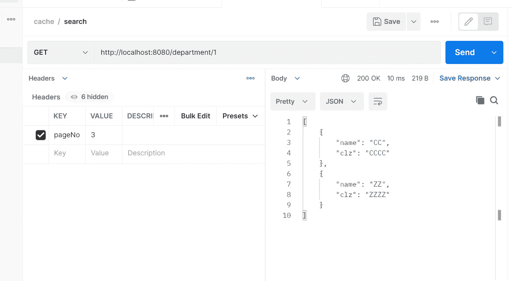

现在，如果我们更改 id，那么该方法将被第一次调用。

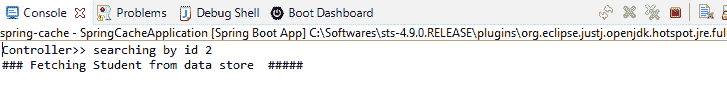

**案例 2:更新数据并搜索**

当我们更新数据时，缓存中的数据也应该更新。@CachePut 确保从数据存储或数据库中获取数据，并将更新后的结果放入缓存中。因此，当请求获取数据时，缓存会提供更新的结果。

注意:-记录将被添加到地图的最后，所以我们需要更新请求中的页面编号以查看结果。

为了测试这一点，让我们点击[http://localhost:8080/update department/1](http://localhost:8080/updateDepartment/1)

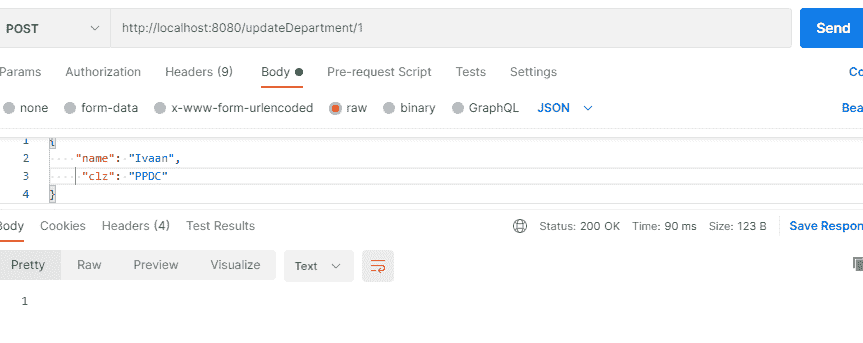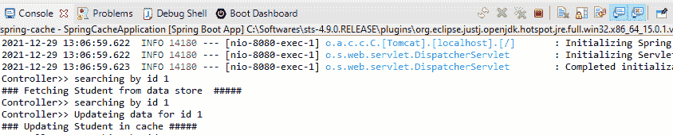

现在，让我们再次点击获取请求。

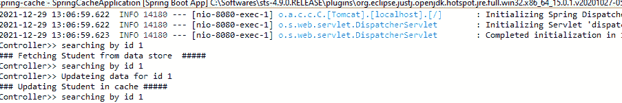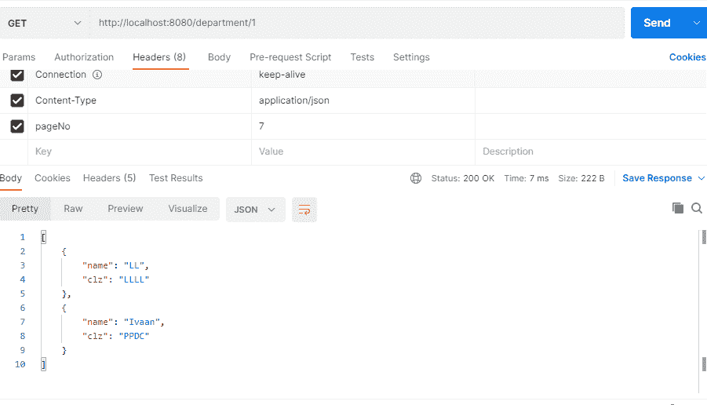

**情况 3 :-删除数据并搜索**

当我们删除数据时，它也应该从缓存中删除。@CacheEvict 从缓存中移除数据，当有获取数据的请求时，则没有结果。

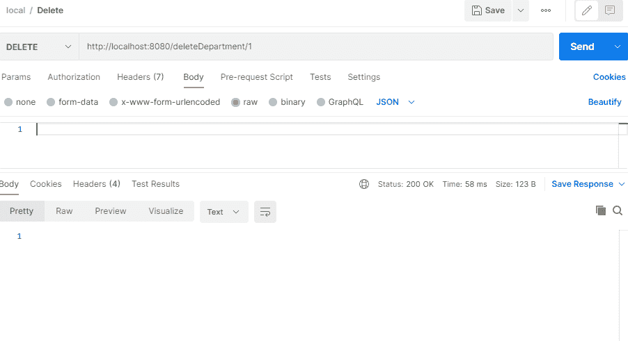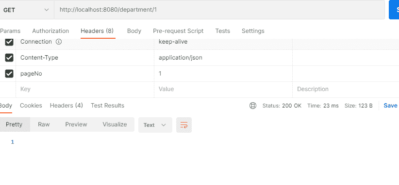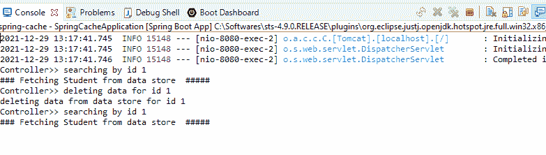

这是实现分页缓存的最佳方式之一，在类似的路径上，我们也可以实现过滤和排序。