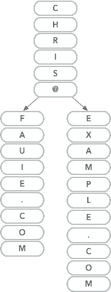
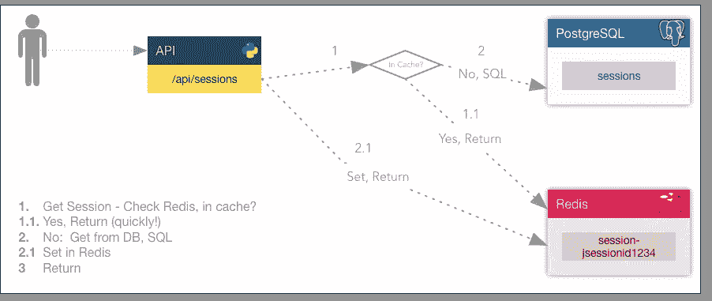
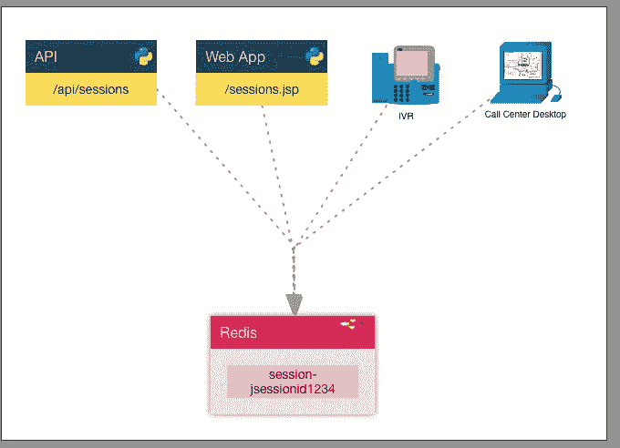
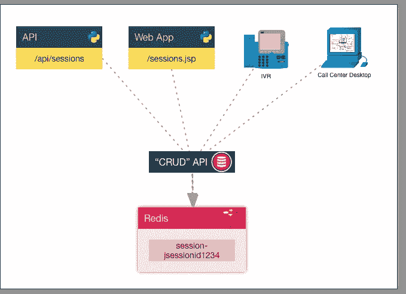
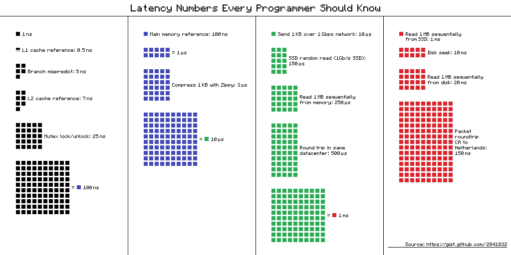

# 缓存是扩展的关键

> 原文：<https://medium.com/capital-one-tech/caches-are-key-to-scaling-da2749adc6c9?source=collection_archive---------0----------------------->

## 选择正确的高速缓存技术以获得利润


> 随着数据和应用程序不断变得更大、更快，有时我们需要让数据随时可用。根据需要，我们可以用不同的方式存储或缓存数据。

今天，我想把我的读者们召集到一起，谈谈极速数据访问的概念，使用缓存来备份高流量 API 和消息消费者/生产者…来赚钱。*(明白了吗？缓存？现金？是的，我做到了。)*

在数据库之外设置缓存的主要原因是为了减少数据库引擎内的负载。虽然在云中扩展比以往任何时候都容易，但扩展仍然需要成本。即使你使用开源数据库，你仍然要为计算和存储需求付费。缓存可以帮助减少负载，立即节省资金。*(看到我怎么把它绑在那里了吗？)*

在 Capital One，我带领一大群工程师参与一个企业项目，传递客户的数字信息。这是一种向主要手机平台发送电子邮件、短信和推送通知的奇特方式。我们每天代表各种各样的内部应用程序发送数量惊人的消息。我的全面指导是，*“缓存。缓存所有的东西。”*我们处理大量数据，我们需要尽可能快地访问这些数据。因为我们有如此多的应用程序和数据源，所以根据触发消息的过程，我们有不同的模式和不同的可用数据。

让我们看几个缓存架构的例子，以帮助构建速度极快的基于消息总线的代码或响应速度极快的 API。但是首先，扩展数据处理引擎的关键是设置队列并在应用程序之间异步传递数据。异步模式的一个很大的区别是，它允许我们以一种非常不同的方式进行扩展，而不是以同步的方式，或者从头到尾“阻塞”的方式。

当您的代码阻塞时，您将不得不进行垂直伸缩(更大的机器)和水平伸缩(更多的机器)。当我们通过一系列微小的微服务实现异步时，我们能够水平扩展，而不需要垂直扩展。对于许多现代模式来说，包括容器或无服务器功能即服务(FaaS，例如 AWS Lambda)，这种情况已经成熟。

> [如果您想了解更多关于微服务或功能即服务水平扩展的细节，请点击这里](/@chrisfauerbach)！

下面的不同实现风格是构建缓存的不同方式。我们将首先研究为单个应用程序构建本地缓存。一个应用程序使用一个本地/内存缓存服务来处理它需要处理的数据。然后，我们将通过使用一个外部应用程序(如 Redis)来存储我们的缓存数据，从而进一步扩展。这在水平缩放一段代码时非常有用。最后，我们将着眼于构建一个战略性放置的分布式缓存，为所有消费组件提供优势。

让我们开始吧。

# 本地缓存

本地缓存是加速应用程序最简单的方法。只需获取外部数据，将其存储在本地，然后使用某种主键进行查找。这适用于持续运行的应用程序，如 web 应用程序或流数据平台。这可能有多种方式。

## 黑名单

我的上一篇文章，微服务世界中的超快的数据查找，重点是建立一个黑名单。我们主要关心数据在集合中的存在。除了检查我们是否有一个特定的值之外，我们没有将数据与一个键相关联或者使用存储数据。我们只需要知道数据是否存在，并据此做出决定。

这是一个非常常见的用例，但是我们可以通过解决其他问题来增加应用程序的价值。作为开发人员，我们通常会将这种“问题”与布尔数据类型联系起来。一些例子说明我们什么时候可以使用像我们在上一篇文章中构建的 [trie](https://en.wikipedia.org/wiki/Trie) 这样的数据结构。

*   这封邮件在我的黑名单里吗？
*   这是一个已知的坏域名吗？
*   该电子邮件发件人在我的垃圾邮件列表中吗？
*   该文件是否在我的允许列表中？

由于我们使用了非常通用的数据结构，我们还可以在每个路径的末尾附加更多的数据。该数据可以用作查找。对于黑名单，您可以添加元数据，例如电子邮件地址何时被添加到列表中，或者可能是它被查看次数的计数器。

当选择正确的结构来存储所有数据时，需要考虑一些事情。

*   您的数据集有多大？
*   你的“钥匙”有多长？
*   它们能被散列到一致的长度吗？
*   您引用的是什么数据类型？
*   随着时间的推移，您是否需要添加和删除项目？

看看其他结构，如 y-fast trie 或双数组 trie。如果数据集很小，那么使用简单的内存缓存。这可能是 Python frozenset 或 Java HashSet。重要的是能够有效地找到数据。还记得大 O 符号吗？让我们回忆一下。

## 大 O

大 O 是一种表示在一个集合中找到一条数据所需的迭代或操作次数的方法。O(1)意味着无论集合中有多少项，它都需要进行固定次数的运算。那是最好的。O(n)表示可能需要 n 次迭代，其中 n 表示基于集合中的项目数的操作的线性增长。在标准数组中查找一个元素将被记为 O(n ),因为当添加更多的元素时，在数组中查找一个元素所需的时间会线性增加。O(n)不好，因为查找时间与列表中的元素数量不是线性的，而是呈指数增长。

既然这样，O(log N)也是好的。这意味着使用某种类型的树，通常是二叉树结构来限制代码为找到一条数据而必须迭代的分支。

在集合中查找数据的最佳方式是当您可以用 O(1)表示它时。*一条数据，一个元素。*这是通过使用数据索引来实现的。假设我们需要在一个巨大的整数列表中查找一个值。下面是一个简单的 C 实现:

好吧，那不行。为了获得数组中的一个元素，我们必须预分配 64，535 个内存插槽。我甚至不确定这些代码是否有效，但是希望你能明白。在我的另一篇文章中，trie 实现也存在同样的问题——对于一个小数据集来说，开销太大了。

## 智能哈希算法

现在，考虑一个智能散列算法。如果一个数据集的每个元素都可以通过哈希算法传递，然后放入该集合，就可以找到该数据。这里的假设是散列集可以被限制在更小的范围内。一旦数据被绑定，那么集合就可以被存储在内存中。

trie 结构被认为是 O(log N ),因为搜索不是简单的一次操作查找，但是应用程序需要在查找时递归(或迭代)数据结构的不同分支。这张图片是上一篇文章中演示在 trie 中查找数据的一个很好的参考。



这些很好，但是它们只在本地有售。在微服务或水平扩展环境中，这可能会导致一些问题。首先，应用程序的每个实例都需要读取数据以使其处于就绪状态。如果我们正在构建一个大型参考数据集，我们通常会从数据库中提取。一个基本的实现需要每个实例连接到一个中央数据库，查询所有数据，然后为业务做好准备。对于非常大的数据集，这可能会给数据库带来相当大的负载。

# 本地—远程缓存

集中式缓存的一个巨大优势是，您只需加载一次，许多客户端可以连接到同一个数据存储来提取缓存的值。在本文中，我们将讨论如何使用 Redis 或 Elasticsearch 进行搜索。对于单个键(字符串)值对，我们来看看 [Redis](http://redis.io/) 。

Redis 是一个键值存储，内置了一些很棒的特性。出于这里的目的，我们将重点关注标准字符串值(字符串键，字符串值)和哈希值(字符串键，字符串子项，字符串值)。例如，如果您想要存储映射到用户 web 会话的电子邮件地址，您可以使用“set”命令将键设置为会话 id，将值设置为电子邮件地址。

```
redis-cli> set session-[session_id] [email]redis-cli> set session-jsessionid23420934820394234 chris@fauie.com
```

对于您的所有应用程序，您可以让它们连接到 Redis，并通过会话 id 获取用户的电子邮件地址。

```
redis-cli> get session-[session_id]redis-cli> get session-jsessionid1234- chris@fauie.com
```

使用标准的键值(string，string)输入，您可以将一个键映射到一个 JSON 字符串、ASCII/Unicode 格式的加密数据、一个具有原子操作的整数或者只是一个字符串。



Redis 可以支持惊人的吞吐量和每秒事务数，这使它成为一个理想的分布式缓存。我要提出一个警告。我从未使用 Redis 的分布式部署来实现高可用性或故障转移，因此除非您深入研究该领域，否则不要认为单个 Redis 节点是防故障的。在像 AWS 这样的云环境中，可以把它看作是可用性区域(AZ)的缓存。

# 更加分布式，但不是分布式缓存

如果本地分布式缓存的想法可以被认为是消费应用程序的共享缓存，我想抛出另一个想法。

使用 Redis 作为缓存的后端是非常好的。您的应用程序甚至可以使用本地缓存和 Guava 之类的技术，或者简单的地图数据结构。通常，代码会检查它的本地缓存，然后检查分布式缓存，如果有遗漏，它可以转到源代码；通常是数据库。这是您必须反复编写的代码(我现在忽略库、包装器和所有这些东西)。我处理过许多企业应用程序，在这些应用程序中，您会看到许多应用程序都在访问同一个数据库来检索/更新数据。这是当今以微服务为中心的架构中的一种反模式，但它仍然是一种可能在未来几年内存在的模式。这里最糟糕的缓存场景包括你的三个 web 应用，你的呼叫中心应用，以及你的 IVR 都实现了一个缓存层。



在这种情况下，理解哪个代码进行了更改将是一个巨大的挑战。每个应用程序都需要知道命名模式。当进行 DNS 更改时，必须修改每个应用程序。这在很长一段时间内是不可维持的。

让我们稍微改变一下，放一个我喜欢称之为“CRUD”(创建、读取、更新、删除)层的 API 层。这个 CRUD 层将强制所有消费应用程序通过单点访问数据库。不要担心，您仍然可以分发这个 API 层以获得弹性。CRUD 应用程序故意成为流量瓶颈，以确保对您的数据进行一致的业务操作。

这是一个需要依赖数据缓存的应用程序。缓存可以是本地的、分布式的等等。但是现在您的终端应用程序不知道来自数据库的数据。拥有这样的数据访问层有很多好处。除了业务逻辑的单一来源之外，如果您必须更改您的数据库，您将更容易做出任何应用程序更改。我提到了添加缓存层这一点吗？



这里的延迟将从网络开销加上数据库查询时间减少到仅当缓存命中时的网络开销。对于大容量应用程序，这可以节省大量的数据库工作负载。

# **缓存警告**

在结束之前，让我再告诉您一些注意事项。缓存数据对于快速响应至关重要。每当数据库必须从磁盘读取数据时，就会遇到磁盘 IO 瓶颈。比这慢的东西少了。所有工程师都应该熟悉:



Source — [https://gist.github.com/jboner/2841832](https://gist.github.com/jboner/2841832)

当速度成为关注点时，这些数字至关重要。网络和磁盘很慢。记忆很快。数据库将缓存频繁访问的记录。了解您的数据库，并确定在其上构建缓存是否浪费了太多时间。请记住，根据定义，缓存意味着它不是真正的数据源。在现实环境中，这可以通过在时间 n 加载缓存、在时间 n+1 更新数据库以及在时间 n+2 读取缓存并成功命中缓存来体现。数据现在已经过时。

如果这在你的环境中可以接受，那就太好了！缓存是为你准备的。需要考虑两件事:

**你的数据在缓存中会存在多久？**

*   制定一个过期策略，并为每个记录设置一个生存时间(TTL)。*嘶。Redis 有一个“expire”命令来设置密钥的 TTL。*

**需要担心缓存中的数据失效吗？**

*   如果您已经像我上面解释的那样构建了一个 CRUD 层，那么当进行 POST、PUT 或 PATCH API 调用来更新您的数据时，您的代码可以主动更新缓存。选择更新缓存，或者从缓存中删除记录，以便以后可以延迟加载！

引用我的资本一同事[乔恩博德纳](/@jonbodner)

> "不仅仅是使用什么缓存，还有缓存什么."

# **总结**

缓存有什么意义？我做了一些铺垫与标题-缓存节省现金。从数据库获取数据花费的时间越多，每个应用程序就越“慢”。为了支持我们需要的吞吐量，我们需要水平扩展。当我们缓存东西的时候，我们不需要等那么久。因此，我们不需要扩大规模。所以，我们省钱。

*   询问
*   隐藏物
*   …
*   利润！

从战术上来说，这篇文章中有多少词，就有多少设计选项。希望您有一些新的想法或见解来构建您的应用程序，以达到您的客户所需要的性能。

# **链接和文章**

1.  我(【https://medium.com/@chrisfauerbach】)最近发布了关于构建黑名单的超高速数据类型。[https://medium . com/capital-one-developers/flashing-fast-data-lookup-in-a-micro services-world-DD 3 AE 548 ca 45](/capital-one-developers/blazing-fast-data-lookup-in-a-microservices-world-dd3ae548ca45)
2.  詹姆斯·希金波托姆([https://medium.com/@launchany](/@launchany))刚刚发表了一篇关于决定什么时候使用 API 而不是流数据解决方案的精彩文章。[https://medium . com/capital-one-developers/chopping-between-rest-we b-API-and-message-streaming-8e2f 4813 a 058](/capital-one-developers/choosing-between-rest-web-apis-and-message-streaming-8e2f4813a058)
3.  [https://en.wikipedia.org/wiki/Y-fast_trie](https://en.wikipedia.org/wiki/Y-fast_trie)
4.  [https://linux.thai.net/~thep/datrie/datrie.html](https://linux.thai.net/~thep/datrie/datrie.html)
5.  [https://redis.io](https://redis.io/)
6.  [https://twitter.com/chrisfauerbach](https://twitter.com/chrisfauerbach)
7.  [https://linkedin.com/in/chrisfauerbach](https://linkedin.com/in/chrisfauerbach)

*声明:这些观点是作者的观点。除非本帖中另有说明，否则 Capital One 不属于所提及的任何公司，也不被其认可。使用或展示的所有商标和其他知识产权都是其各自所有者的所有权。本文为 2018 首都一。*