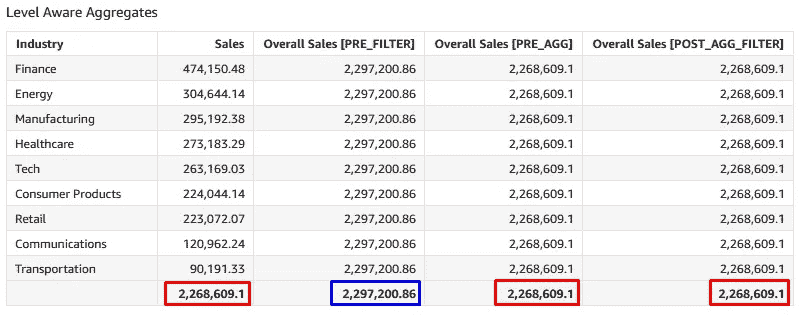
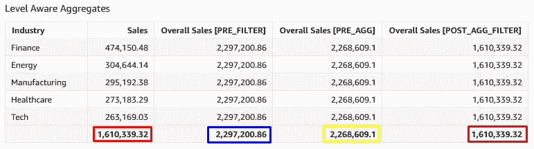

# AWS QuickSight 中的计算

> 原文：<https://medium.com/version-1/calculations-in-aws-quicksight-ba95a4fafcda?source=collection_archive---------0----------------------->


Image from Inesdi Digital Business School

在构建可视化效果时，理解计算是如何定义的、计算结果是如何显示的，以及在应用一些过滤器或与其余数据交互时，计算结果将如何反应，这一点非常重要。这将有助于我们构建更好的可视化，并以最佳方式获得数据的价值。

在 QuickSight 中，可以在分析图层或数据集图层中定义计算。
当在分析层中定义时，计算总是在分析/仪表板负载上进行评估。
如果推送到数据集层，将预先计算行级别的计算并存储结果(即，如果数据集处于 [SPICE](https://docs.aws.amazon.com/quicksight/latest/user/managing-spice-capacity.html) 模式)。
将聚合计算推送到数据集层有助于集中存储计算，使其可供所有数据集用户随时使用。但是，这不会产生任何额外的性能优势，因为聚合计算总是在使用它的可视化环境中进行评估。

理解滤波器、计算和聚合的[评估顺序](https://docs.aws.amazon.com/quicksight/latest/user/order-of-evaluation-quicksight.html)非常重要。


Evaluation order QuickSight

我们将通过一些例子进一步探讨这个顺序。我们将使用包含订单信息的销售数据集。我们将重点关注细分市场、行业、销售和利润领域，我们将构建一些指标来说明这些示例。

我们将使用可在所有维度上汇总或聚合的附加度量，以及不可在所有维度上汇总或聚合的非附加度量。

成本是销售额减去利润，它是一个附加的衡量标准。我们将为成本创建两个计算字段(行和聚合)并比较结果。

```
Row Cost: {Sales}-{Profit}
Aggregate Cost: sum({Sales})-sum({Profit})
```

我们将创建一个表(行与合计计算)来比较这些计算，添加字段细分、利润、销售、行成本和合计成本。


由于成本是相加的，行和合计级别的计算给出了相同的结果。在这种情况下，使用行级版本并将其包含在数据集层中，以便在 SPICE 数据集刷新时提前完成行级计算。

利润率是利润除以销售额，它是一个非加性指标。我们将为利润率创建两个计算字段(行和合计)，将它们添加到前面的表中，并比较结果。这将有助于清楚地理解这种计算是如何工作的。

```
Row Profit Margin (Incorrect): {Profit}/{Sales}
Aggregate Profit Margin: sum({Profit})/sum({Sales})
```


行利润率是数据行级别的计算。此后，它就像一个常规的聚合测量一样被汇总，因此在细分字段级别和总体级别最终是不正确的。我们可以看到，针对现场井计算的聚合模式是 SUM。正确的版本是获得每个细分市场的利润和销售额之和，然后进行除法运算。对于合计行，它使用总利润和总销售额。因此，我们得到了预期的结果。请注意，对于此计算，聚合模式是 CUSTOM。因此，使用汇总衡量标准构建非累加性 KPI 的计算。

我们现在将创建一些[级别感知聚合计算](https://docs.aws.amazon.com/quicksight/latest/user/level-aware-calculations.html)。

```
Overall Sales [PRE_FILTER]: sumOver(Sales,[],PRE_FILTER)
Overall Sales [PRE_AGG]: sumOver(Sales,[],PRE_AGG)
Overall Sales [POST_AGG_FILTER]: sumOver(sum(Sales),[],POST_AGG_FILTER)
```

我们将创建一个表(级别感知聚合),将它们添加到行业和销售字段中。


此时，所有三个计算字段都显示了整个数据集的总销售额(即，与此视图中的总销售额列的值相同)。

我们将为行业字段添加一个过滤器，并取消选择杂项值。



我们可以看到 PRE_FILTER 值保持不变(因为它们在分析过滤器之前得到评估)，而 PRE_AGG、POST_AGG_FILTER 和 Sales 列的表 total 下降到一个新值，不包括 Misc 类别。

我们现在将为“行业”字段添加一个顶部/底部过滤器，以仅显示销售额最高的 5 个行业。



我们可以看到 PRE_FILTER 值和 PRE_AGG 值与它们之前的值保持不变(因为它们在 Top/Bottom 筛选器之前被评估),而 POST_AGG_FILTER 和 table total for Sales 列下降到新值，只包括前 5 个行业的销售额。


Photo by [Scott Graham](https://unsplash.com/@homajob?utm_source=unsplash&utm_medium=referral&utm_content=creditCopyText) on [Unsplash](https://unsplash.com/s/photos/spreadsheet?utm_source=unsplash&utm_medium=referral&utm_content=creditCopyText)

为累加性度量构建计算时，请在数据集层中使用行级度量，而为非累加性度量构建计算时，请使用聚合度量。

理解 AWS QuickSight 中的[评估顺序也很重要，过滤器将如何与我们的数据交互，以及我们希望在每种情况下显示什么信息，这样我们就能够用高质量的信息构建可理解的仪表板。](https://docs.aws.amazon.com/quicksight/latest/user/order-of-evaluation-quicksight.html)

*来源:AWS*

# 关于作者:

大卫·赫南德兹是 Version 1 的高级数据工程师。